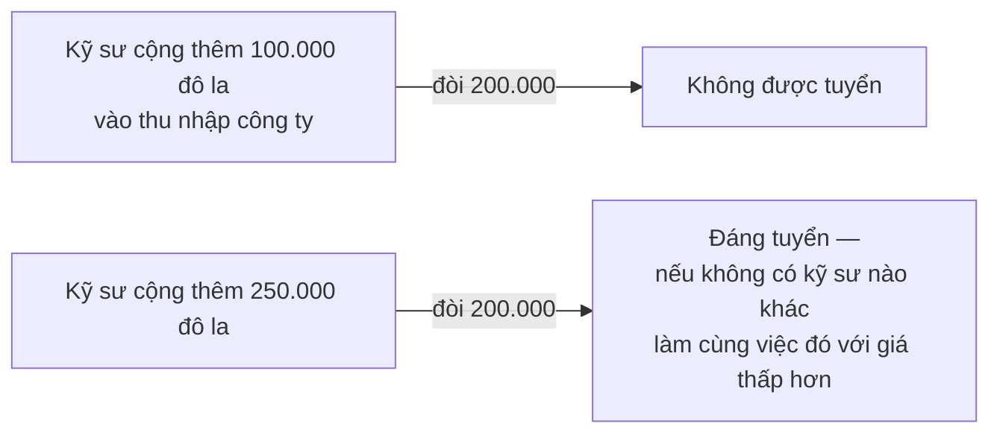
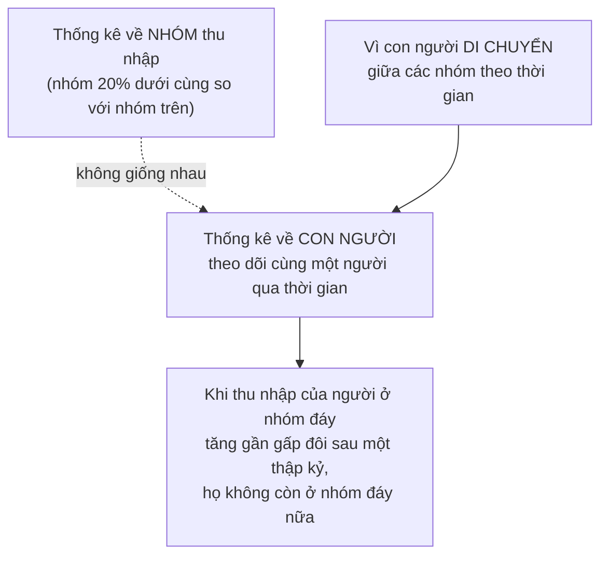

# Năng suất và tiền lương

> Lương không đo **phẩm chất** của bạn. Nó đo thứ bạn **làm tăng thêm** cho
> người thuê — và thứ đó phụ thuộc rất nhiều vào những điều kiện quanh bạn mà
> bạn không kiểm soát.

## Bắt đầu từ chuyện bạn đã biết

Nếu lương tài xế xe tải tăng gấp đôi, một số tài xế taxi sẽ chuyển sang lái xe
tải. Nếu thu nhập của kỹ sư tăng gấp đôi, một số sinh viên đang định học toán
hay vật lý sẽ chuyển sang học kỹ thuật.

Tiền lương không chỉ là thu nhập của cá nhân. Với cả nền kinh tế, nó là cách
**phân bổ thời gian và tài năng con người** giữa những công việc cạnh tranh
nhau. Lao động là nguồn lực khan hiếm vì lúc nào cũng có nhiều việc cần làm
hơn số người có thời gian làm chúng.

## Câu hỏi nên hỏi, và câu hỏi nên bỏ

Những câu chuyện về thù lao khổng lồ của vận động viên, diễn viên hay tổng
giám đốc thường dẫn tới câu hỏi: người đó **"thật sự" đáng giá** bao nhiêu?

Ta đã biết từ [chương về giá](../1-gia-ca-va-thi-truong/02-vai-tro-cua-gia-ca.md)
rằng **không có giá trị thật**. Vậy nên bỏ câu hỏi đó đi và hỏi câu thực tế
hơn: **cái gì quyết định mức lương?**

Câu trả lời ngắn: cung và cầu. Nhưng đó mới là điểm bắt đầu.

### Phía cung

Người đưa thư cũng muốn được trả như kỹ sư. Nhưng số người **có khả năng làm**
công việc đưa thư quá đông, nên không ai bị buộc phải nâng lương lên mức đó.
Đào tạo một kỹ sư mất nhiều năm và không phải ai cũng học nổi — nên kỹ sư
không dồi dào so với nhu cầu.

### Phía cầu, và cái trần

Đây là phần ít người nói tới. Sự khan hiếm **không đủ** để làm một người có
giá. Thứ làm người thuê sẵn lòng trả là **khoản mà người đó cộng thêm vào thu
nhập của doanh nghiệp** — và chính nó đặt ra cái trần.

Hai vế đó gộp lại giải thích khoảng lương: **phía cầu đặt trần, phía cung kéo
xuống dưới trần đó**.

## Năng suất không nằm trong người bạn

Đây là ý quan trọng nhất của chương, và nó đi ngược trực giác.

Người ta hay nói về năng suất như một phẩm chất **có sẵn trong người lao
động**. Sowell đưa ra ba ví dụ cho thấy nó phụ thuộc vào hoàn cảnh xung quanh
nhiều thế nào:

| Trường hợp | Điều đã xảy ra |
| --- | --- |
| **Nhà máy bông ở Trung Quốc, thập niên 1930** | Nhà máy do người Nhật sở hữu **trả lương cao hơn** nhà máy do người Trung Quốc sở hữu, nhưng lại có **chi phí lao động trên mỗi đơn vị sản phẩm thấp hơn**, vì sản lượng trên mỗi công nhân cao hơn. Và điều đó **không phải do máy móc** — họ dùng cùng loại máy. Khác biệt nằm ở cách quản lý mang từ Nhật sang |
| **Sản xuất ở Anh, đầu thế kỷ 21** | Doanh nghiệp chế tạo do người Mỹ sở hữu tại Anh có năng suất cao hơn hẳn doanh nghiệp do người Anh sở hữu. Chưa tới **40%** nhà sản xuất Anh quan tâm tới việc tiết kiệm thời gian và vật liệu — và sinh viên kỹ thuật giỏi nhất nước Anh thích làm cho công ty nước ngoài |
| **Nam Phi** | Công nhân Nam Phi có năng suất cao hơn công nhân ở Brazil, Ba Lan, Malaysia hay Trung Quốc — không phải vì họ làm việc chăm hơn hay khéo hơn, mà vì doanh nghiệp Nam Phi **dựa vào vốn nhiều hơn dựa vào lao động**: họ có nhiều máy móc tốt hơn để làm việc cùng |

### Ví dụ bóng chày

Sowell dùng một ví dụ thể thao để cho thấy ngay cả thành tích **cá nhân** nhất
cũng phụ thuộc vào người xung quanh.

Một tay đánh bóng mạnh sẽ có nhiều cơ hội ghi điểm hơn nếu **người đánh ngay
sau anh ta cũng nguy hiểm**. Nếu người kế tiếp không đáng sợ, đội bạn sẽ chọn
cách cho anh ta đi bộ — ném cẩn thận hoặc cố tình — nên anh ta mất bớt cơ hội.

- **Ted Williams** có một trong những tỉ lệ ghi điểm trên số lần ra sân cao
  nhất lịch sử. Nhưng ông chỉ có **một mùa** đạt tới 40 cú home run, vì có mùa
  ông bị cho đi bộ tới **162 lần** — trung bình hơn một lần mỗi trận.
- **Hank Aaron** có tỉ lệ thấp hơn Williams một chút, nhưng có tới **tám mùa**
  đạt 40 cú trở lên, và trong **23 mùa** thi đấu chưa bao giờ bị cho đi bộ tới
  100 lần. Lý do: người đánh sau ông phần lớn sự nghiệp là **Eddie Mathews**,
  có tỉ lệ ghi điểm gần như y hệt Aaron — nên cho Aaron đi bộ chẳng được lợi
  gì.

Aaron ghi được **755** cú home run trong sự nghiệp. Một phần năng suất đó
thuộc về người đứng chờ sau lưng ông.

### Cả những thứ ngoài nơi làm việc

Ngay cả khi sản lượng mỗi giờ như nhau, giá trị của lao động vẫn khác nhau nếu
những chi phí khác khác nhau. Doanh nghiệp ở nước nghèo không có đường cao tốc
hiện đại hay đường sắt và hàng không hiệu quả phải gánh **chi phí vận chuyển
cao hơn**, và trong một thị trường cạnh tranh họ không chuyển hết khoản đó sang
người mua được. Ở nơi tham nhũng nặng, các khoản hối lộ để được phép hoạt động
cũng bị trừ vào doanh thu y như vậy.

Doanh thu ròng thấp hơn nghĩa là **giá trị của lao động tạo ra sản phẩm đó
cũng thấp hơn** — kể cả khi người công nhân làm ra đúng ngần ấy sản phẩm mỗi
giờ.

### Và câu phân biệt quan trọng nhất

> Nói rằng cầu về lao động dựa trên giá trị năng suất **không phải** là nói
> rằng lương dựa trên **công trạng**. Công trạng và năng suất là hai thứ khác
> nhau, cũng như đạo đức và nhân quả là hai thứ khác nhau.

Đây là một câu trung thực và đáng nhớ. Nó cũng cắt cả hai chiều: nó bác bỏ ý
"người lương cao xứng đáng hơn về mặt đạo đức", đồng thời bác bỏ ý "lương thấp
chứng tỏ bị đối xử bất công". Thị trường đo đóng góp, không đo giá trị con
người.

## Nhóm thu nhập và con người là hai thứ khác nhau

Đây là lập luận thống kê trung tâm của Sowell, và là chỗ đáng hiểu kỹ vì nó
xuất hiện lại ở nhiều chương sau.

Trước hết là một lý do rất đời thường khiến thu nhập khác nhau: **tuổi tác**.
Người nhiều tuổi hơn đã có thêm năm tháng để tích lũy kinh nghiệm, kỹ năng,
học vấn và đào tạo tại chỗ. Không có gì lạ khi phần lớn những người thuộc nhóm
**5% thu nhập cao nhất** ở độ tuổi **45 trở lên**.

Lập luận cốt lõi:

Số liệu ông dẫn:

- **Canada, 1990–2009**: những người ban đầu thuộc nhóm **20% thu nhập thấp
  nhất** lại có **mức tăng thu nhập cao nhất**, cả về tuyệt đối lẫn phần trăm.
  Chỉ **13%** trong số họ còn ở nhóm đáy vào năm 2009, trong khi **21%** đã leo
  hẳn lên nhóm **20% cao nhất**.
- **Mỹ**: hơn **một nửa** số người thuộc nhóm **1% thu nhập cao nhất** năm
  **1996** đã không còn ở đó vào năm **2005**. Trong nhóm **0,01%** cao nhất,
  **ba phần tư** đã rời khỏi vị trí đó.

Vì sao nhóm đỉnh biến động mạnh vậy? Vì nhiều người lọt vào đó nhờ một
**khoản đột biến trong đúng năm ấy**: bán một căn nhà, nhận thừa kế, hoặc bán
số quyền chọn cổ phiếu tích lũy nhiều năm. Ngưỡng để vào nhóm 1% năm **2010**
là khoảng **369.500 đô la** trở lên.

Chiều ngược lại cũng đúng: người thật sự khá giả có thể có một năm lỗ hoặc một
năm tệ, khiến thu nhập năm đó rất thấp hoặc âm. Điều này giúp giải thích một
nghịch lý thống kê: hàng trăm nghìn người có thu nhập dưới **20.000 đô la** một
năm đang sống trong những căn nhà trị giá từ **300.000 đô la** trở lên.

Và thu nhập càng cao thì càng **bất ổn**. Giữa **2007 và 2009**, thu nhập của
nhóm kiếm từ 50.000 đô la trở xuống giảm **2%**, trong khi thu nhập của nhóm
kiếm từ một triệu đô la trở lên giảm gần **50%**. Khi kinh tế tăng trưởng,
chiều ngược lại cũng mạnh tương ứng.

**Hãy đánh nhãn phần này cẩn thận.** Sự dịch chuyển giữa các nhóm thu nhập là
một hiện tượng có thật và được đo đạc nghiêm túc — đây là một đóng góp đúng
của Sowell vào cách đọc số liệu. Nhưng nó **không bác bỏ** các lập luận về bất
bình đẳng theo cách ông ngụ ý. Hai bên đang đo hai thứ khác nhau: Sowell đo
**sự di chuyển của cá nhân**; những người như Thomas Piketty đo **khoảng cách
giữa các nhóm và sự tập trung của cải qua nhiều thế hệ**. Cả hai đều có dữ
liệu, và một trong hai đúng không làm bên kia sai.

## Vì sao khoảng cách theo tuổi ngày càng rộng

Khi sức mạnh cơ bắp còn là yêu cầu chính, năng suất và thu nhập đạt đỉnh ở
tuổi trẻ khỏe, còn người lao động trung niên bị trả thấp hơn hoặc ít việc hơn.

Khi máy móc thay thế sức người và kỹ năng trở thành thứ quyết định, đỉnh thu
nhập **dịch dần về phía tuổi cao hơn**:

| Năm | Nhóm tuổi có thu nhập đỉnh | So với người ở đầu tuổi 20 |
| --- | --- | --- |
| **1951** | 35–44 | cao hơn **60%** |
| **1973** | 35–44 | cao hơn **gấp đôi** |
| Khoảng hai thập kỷ sau đó | **45–54** | cao hơn **gấp ba** |

## Khi thị trường tự xóa một khoản chênh

Lập luận đáng chú ý nhất trong phần cuối chương, và nó có cấu trúc rất Sowell.

Khi sức mạnh cơ bắp mất dần tầm quan trọng, khoản chênh trả thêm cho lao động
nam trở nên vô căn cứ ở ngày càng nhiều nghề. Sowell lập luận rằng việc xóa bỏ
khoản chênh đó **không đòi hỏi người thuê phải giác ngộ**:

Ông dẫn một con số để củng cố: ngay từ năm **1971**, phụ nữ Mỹ độc thân làm
việc liên tục từ khi tốt nghiệp trung học tới ngoài ba mươi tuổi đã có thu
nhập **nhỉnh hơn một chút** so với nam giới độc thân cùng hoàn cảnh — dù xét
theo nhóm, phụ nữ vẫn kiếm ít hơn nam giới đáng kể. Lý do ông đưa ra cho
khoảng cách theo nhóm là sự gián đoạn sự nghiệp khi sinh con, làm mất kinh
nghiệm và thâm niên.

**Đây là khẳng định thực nghiệm gây tranh cãi, và cần nói rõ.** Yếu tố gián
đoạn sự nghiệp là có thật và được đo đạc rộng rãi — kinh tế học lao động hiện
đại gọi nó là "hình phạt làm mẹ" (motherhood penalty), và Claudia Goldin được
trao giải Nobel kinh tế năm **2023** phần lớn nhờ nhóm công trình về chủ đề
này. Nhưng chính Goldin kết luận rằng nó **không giải thích hết** khoảng cách, và cơ chế thị trường mà Sowell mô tả — cạnh tranh tự
động xóa phân biệt đối xử — hoạt động chậm hơn và yếu hơn nhiều so với cách
ông trình bày. Lập luận "đối thủ sẽ trừng phạt kẻ phân biệt đối xử" giả định
chi phí thông tin thấp và thị trường lao động linh hoạt; cả hai giả định đó
thường không đúng.

## Phân biệt đối xử: định nghĩa trước đã

Sowell tách hai thứ hay bị gộp làm một:

1. **Phân biệt đối xử** theo nghĩa hẹp: dùng **tiêu chuẩn khác nhau** cho
   người thuộc nhóm khác nhau khi tuyển, trả lương hay thăng chức. Dạng nặng
   nhất là từ chối tuyển hẳn. Ông dẫn những ví dụ lịch sử rõ ràng: cụm từ
   "Người Ireland khỏi nộp đơn" từng là câu thường gặp trong quảng cáo tuyển
   dụng ở Mỹ thế kỷ 19 và đầu thế kỷ 20; trước Thế chiến thứ hai, nhiều bệnh
   viện Mỹ không nhận bác sĩ da đen hoặc bác sĩ Do Thái, và một số hãng luật
   danh giá chỉ nhận đàn ông da trắng theo đạo Tin Lành thuộc tầng lớp trên.
2. **Khác biệt thật về kỹ năng, kinh nghiệm và thói quen làm việc** giữa các
   nhóm, do hoàn cảnh lịch sử và văn hóa.

Ông nhấn mạnh rằng phân biệt hai thứ này trên thực tế **rất khó**, vì số liệu
thống kê hiếm khi đủ chi tiết về kỹ năng, kinh nghiệm, kết quả công việc hay
mức chuyên cần để so sánh những cá nhân thật sự tương đương.

**Đây là chỗ cần đọc tỉnh táo nhất trong cả chương.** Quan sát về mặt phương
pháp là đúng: số liệu thô về chênh lệch thu nhập giữa các nhóm không tự nó
chứng minh phân biệt đối xử. Nhưng Sowell dùng điều đó gần như chỉ theo một
chiều — để làm yếu đi các bằng chứng về phân biệt đối xử. Chiều còn lại cũng
đúng và ông không dùng: chính vì số liệu không bao giờ đủ chi tiết, nên việc
**không chứng minh được** phân biệt đối xử cũng không chứng minh được rằng nó
không tồn tại. Các nghiên cứu thực nghiệm dùng thiết kế khác — ví dụ gửi những
hồ sơ xin việc giống hệt nhau chỉ khác tên gọi — liên tục tìm thấy chênh lệch
tỉ lệ được gọi phỏng vấn, và loại bằng chứng đó không bị ảnh hưởng bởi vấn đề
thiếu biến kiểm soát mà ông nêu.

## Điều cần nhớ

- Lương được quyết bởi **cung và cầu**: phía cầu đặt trần bằng khoản bạn cộng
  thêm, phía cung kéo giá xuống dưới trần đó.
- **Năng suất không nằm trong người bạn.** Nó phụ thuộc vào máy móc, cách quản
  lý, đồng nghiệp, hạ tầng và cả mức tham nhũng của nơi bạn làm việc.
- **Công trạng và năng suất là hai thứ khác nhau.** Thị trường đo đóng góp,
  không đo giá trị con người.
- **Nhóm thu nhập và con người là hai thứ khác nhau**, vì con người di chuyển
  giữa các nhóm. Nhưng điều đó không trả lời câu hỏi về bất bình đẳng — nó chỉ
  nói rằng phải hỏi cho rõ mình đang đo cái gì.
- Chênh lệch thô giữa các nhóm **không tự nó** chứng minh phân biệt đối xử —
  và cũng không bác bỏ được nó.

## Tự kiểm tra

1. Một kỹ sư cộng thêm 250.000 đô la cho công ty. Điều gì quyết định anh ta
   thật sự được trả bao nhiêu?
2. Nhà máy Nhật ở Trung Quốc trả lương cao hơn mà chi phí lao động lại thấp
   hơn. Bằng cách nào?
3. Vì sao Hank Aaron có nhiều mùa 40 home run hơn Ted Williams, dù tỉ lệ của
   ông thấp hơn?
4. "Nhóm 20% thu nhập thấp nhất" và "những người nghèo" khác nhau ở chỗ nào?

---

Trước: [Phần III](./README.md) ·
Tiếp: [Luật lương tối thiểu](./02-luat-luong-toi-thieu.md)
