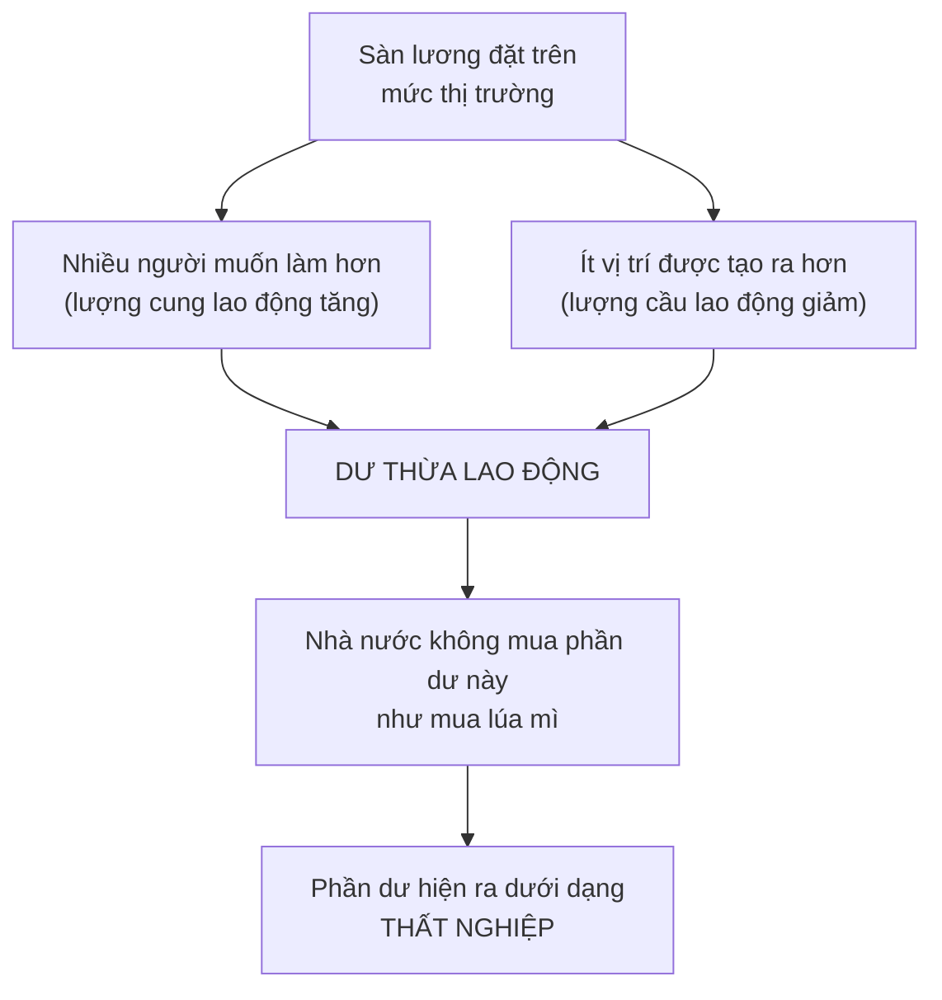

# Luật lương tối thiểu

> Đây là chương mà Sowell chắc chắn nhất và giới kinh tế học chia rẽ nhất. Lập
> luận của ông mạch lạc và đáng hiểu đầy đủ — nhưng ông trình bày một câu hỏi
> **đang mở** như thể nó đã khép lại.

## Bắt đầu từ chuyện bạn đã biết

Ở [chương kiểm soát giá](../1-gia-ca-va-thi-truong/03-kiem-soat-gia.md) bạn đã
thấy: sàn giá nông sản tạo ra kho lúa mì mục. Luật lương tối thiểu là **sàn
giá đặt lên sức lao động**.

Khác biệt là ở chỗ nhà nước mua hết nông sản dư thừa, nhưng **không mua lao
động dư thừa**. Nên phần dư ấy hiện ra dưới một cái tên khác: **thất nghiệp**.

## Lập luận của Sowell

Lõi của nó gói trong một câu, và là câu đáng nhớ nhất chương:

> Việc ra luật cấm trả dưới một mức nào đó **không làm cho năng suất của người
> lao động đáng giá tới mức đó**. Và nếu nó không đáng, người đó nhiều khả năng
> sẽ không được thuê.

Từ đó là câu chốt:

> **Mức lương tối thiểu thật sự luôn là con số không.** Đó chính là mức mà
> nhiều người nhận được sau khi một mức sàn được lập ra hoặc nâng lên — vì họ
> mất việc, hoặc không tìm được việc khi bước vào thị trường lao động.

Sowell nhấn mạnh rằng người thất nghiệp ở đây **không hề vô dụng**. Họ hoàn
toàn có thể làm ra hàng hóa và dịch vụ, chỉ là không bằng người lành nghề hơn.
Họ bị đẩy vào cảnh ngồi không vì mức lương bị ấn định **cao hơn năng suất của
chính họ**.

### Cái giá kép với người trẻ

Đây là phần lập luận có sức nặng nhất, và ngay cả những người phản bác Sowell
cũng thường thừa nhận nó đáng lo:

Người bị gạt khỏi thị trường lúc còn trẻ không chỉ mất khoản lương thấp mà lẽ
ra họ đã kiếm được. Họ còn mất **kinh nghiệm và kỹ năng** mà công việc khởi
điểm đó mang lại — và do đó mất luôn khoản lương cao hơn mà họ đáng lẽ đã
chuyển lên sau vài năm.

Với người mới đi làm, **giá trị của việc được đứng trên nấc thang đầu tiên
thường lớn hơn chính khoản tiền nhận được**.

### Ai thật sự đang nhận lương tối thiểu?

Sowell dùng số liệu để phản bác hình ảnh quen thuộc trong tranh luận chính trị
— người trụ cột nuôi gia đình bốn người bằng mức lương tối thiểu:

| Con số (Mỹ) | Giá trị |
| --- | --- |
| Người lao động trên 24 tuổi nhận lương tối thiểu | khoảng **3%** |
| Tổng số người nhận không quá mức tối thiểu, năm **2012** | **3,6 triệu** |
| Trong số đó, độ tuổi 16–24 | **hơn một nửa** |
| Trong số đó, làm việc bán thời gian | **64%** |
| Sống cùng cha mẹ hoặc họ hàng | **42%** |
| Thu nhập trung bình của **gia đình** một người nhận lương tối thiểu | hơn **44.000** đô la một năm |
| Thật sự đang nuôi bản thân và một người phụ thuộc | chỉ **15%** |

Lập luận: rất nhiều người nhận lương tối thiểu **không đang nuôi một gia
đình** — thường thì một gia đình đang nuôi họ.

### Những nước không có lương tối thiểu

| Nơi | Tình hình |
| --- | --- |
| **Thụy Sĩ** | Không có luật lương tối thiểu. Năm **2003**, thất nghiệp chạm đỉnh 5 năm ở mức **3,9%**. Nội các bác đề xuất luật lương tối thiểu vào tháng 1/**2013**, khi thất nghiệp ở mức **3,1%** |
| **Singapore** | Không có luật lương tối thiểu; thất nghiệp **2,1%** |
| **Hồng Kông**, năm **1991** | Khi còn là thuộc địa Anh, không có luật lương tối thiểu; thất nghiệp **dưới 2%** |
| **Mỹ** thời Coolidge | Chính quyền cuối cùng trước khi có luật lương tối thiểu liên bang; tỉ lệ thất nghiệp năm có lúc xuống tới **1,8%** |

### Chi phí ẩn ở châu Âu

Sowell chỉ ra rằng con số lương tối thiểu công bố **đánh giá thấp** chi phí lao
động thật ở châu Âu, vì nhà nước còn bắt buộc chủ sử dụng đóng góp vào quỹ hưu
trí, bảo hiểm y tế và nhiều khoản khác. Về mặt kinh tế, khoản bắt buộc đó có
tác dụng y hệt việc nâng lương tối thiểu.

Ở **Đức**, các khoản phúc lợi này chiếm **một nửa** chi phí lao động trung bình
mỗi giờ. Ở **Nhật và Mỹ**, chúng chiếm **chưa tới một phần tư**.

### Vì sao công đoàn ủng hộ

Một lập luận sắc và ít người nghĩ tới. Công đoàn là một trong những lực lượng
ủng hộ luật lương tối thiểu mạnh nhất — dù thành viên của họ thường kiếm cao
hơn mức tối thiểu rất nhiều.

Lý do: phần lớn công việc có thể làm bằng **các tỉ lệ khác nhau giữa lao động
tay nghề thấp và tay nghề cao**, tùy chi phí tương đối của hai loại. Công nhân
công đoàn có kinh nghiệm đang **cạnh tranh** với lao động trẻ, ít kinh nghiệm,
lương gần mức tối thiểu.

> Sàn lương càng cao, lao động chưa có kỹ năng càng dễ bị thay bằng lao động
> lành nghề hơn trong công đoàn. Công đoàn dùng luật lương tối thiểu **như một
> hàng rào thuế quan** đánh lên loại lao động cạnh tranh với thành viên của
> mình.

### Hiệu ứng "nâng chuẩn"

Một hệ quả tinh tế, song song với việc chất lượng giảm khi áp trần giá:

Khi giá bị đặt **trên** mức thị trường, phần dư cho phép người mua **chọn lọc**.
Trên thị trường lao động, điều đó có nghĩa là **yêu cầu tuyển dụng bị nâng
lên** — và một số người lẽ ra được thuê trong thị trường tự do trở thành
"không thể tuyển dụng được".

> **"Không tuyển dụng được", cũng như thiếu hụt và dư thừa, không độc lập với
> giá.** Trong thị trường tự do, người năng suất thấp cũng dễ được thuê ở mức
> lương thấp y như người năng suất cao được thuê ở mức lương cao.

### Lập luận lịch sử về lao động da đen ở Mỹ

Đây là phần Sowell viết mạnh nhất, và cũng là phần được trích dẫn nhiều nhất.

Từ cuối thế kỷ 19 tới giữa thế kỷ 20 — thời kỳ người Mỹ da đen nhận được ít
giáo dục hơn và chất lượng kém hơn — **tỉ lệ tham gia lực lượng lao động của
người da đen vẫn nhỉnh hơn người da trắng**. Năm **1930**, tỉ lệ thất nghiệp
của người da đen còn **thấp hơn một chút** so với người da trắng.

Nói cách khác: ở mức lương mà họ nhận, họ **được tuyển dụng dễ như** người da
trắng ở mức lương rất khác.

Rồi tới loạt đạo luật: **Davis-Bacon 1931**, **National Industrial Recovery Act
1933**, **Fair Labor Standards Act 1938** — tất cả đều áp mức lương tối thiểu
do nhà nước ấn định, cho một ngành hoặc trên diện rộng. Đạo luật Quan hệ Lao
động Quốc gia **1935** thúc đẩy công đoàn hóa cũng góp phần, cộng với các quy
tắc công đoàn không cho người da đen gia nhập.

Riêng NIRA nâng lương trong ngành dệt ở miền Nam **70% chỉ trong năm tháng**,
và tác động trên toàn quốc của nó được ước tính đã khiến người da đen mất
**nửa triệu** việc làm.

Và chi tiết nặng nhất: luật lương tối thiểu từng được **cổ vũ công khai chính
vì** khả năng nó loại bỏ sự cạnh tranh của các nhóm thiểu số — người Nhật ở
Canada thập niên 1920, người da đen ở Mỹ và Nam Phi cùng thời kỳ. Khi đó, việc
nói thẳng ra động cơ phân biệt chủng tộc như vậy là hợp pháp và được xã hội
chấp nhận ở cả ba nước.

### Người trẻ chịu nặng nhất

Sowell lập luận rằng người thất nghiệp không phải mẫu ngẫu nhiên của lực lượng
lao động — người trẻ, ít kinh nghiệm, ít kỹ năng bị ảnh hưởng nặng nhất:

| Nơi và thời điểm | Thất nghiệp dưới 25 tuổi | Thất nghiệp chung |
| --- | --- | --- |
| **Úc**, 1978–2002 | chưa bao giờ xuống dưới **10%** | chỉ vừa chạm 10% đúng một lần |
| **Pháp**, đầu thế kỷ 21 | hơn **20%** | **10%** |
| **Bỉ** | **22%** | |
| **Ý** | **27%** | |
| **Anh** | **17,3%** | **7,6%** |
| **EU**, năm 2009 | **21%** (Ý và Ireland hơn 25%, **Tây Ban Nha hơn 40%**) | |

Mức lương tối thiểu của Úc bằng gần **60%** mức lương trung vị của nước này,
trong khi ở Mỹ con số đó là **dưới 40%** — Sowell coi đây là lời giải thích.

Ông cũng chỉ ra một sự thừa nhận ngầm: một số nước châu Âu đặt mức tối thiểu
**thấp hơn cho thiếu niên**, và New Zealand **miễn trừ hẳn** thiếu niên khỏi
luật lương tối thiểu cho tới năm **1994**.

### Nam Phi

Ví dụ ông dùng để cho thấy hậu quả ở một nước đang phát triển. Lãnh đạo Nam
Phi, với cam kết không để nước mình thành công xưởng giá rẻ của phương Tây, đã
đáp ứng yêu cầu của các công đoàn mạnh về bảo hộ và phúc lợi — bao gồm mức
lương tối thiểu cao hơn năng suất của nhiều người lao động Nam Phi.

- Chi phí lao động ở Nam Phi cao hơn **ba lần rưỡi** so với những vùng năng
  suất nhất của Trung Quốc, và cao hơn **75%** so với Malaysia hay Ba Lan.
- Năng suất của công nhân Nam Phi gấp **đôi** công nhân Indonesia, nhưng họ
  được trả gấp **năm lần** — khi tìm được việc.
- Một hãng sản xuất vành xe nhôm đã làm hàng ở Nam Phi suốt hai thập kỷ; khi
  mở rộng sản xuất, họ tuyển thêm người ở **Ba Lan**, nơi họ có lãi, thay vì ở
  Nam Phi, nơi họ chỉ hòa vốn hoặc lỗ.

### Máy móc thay người ở châu Âu

Một nghiên cứu của Cục Nghiên cứu Kinh tế Quốc gia Mỹ so sánh việc làm cho lao
động tay nghề thấp ở châu Âu và Mỹ từ thập niên 1970 thấy rằng nhóm này bị
**máy móc thay thế nhiều hơn hẳn ở châu Âu** — nơi lương tối thiểu và phúc lợi
bắt buộc cao hơn.

Quan sát đời thường mà nghiên cứu đó đưa ra rất dễ hình dung: ở Paris,
Frankfurt hay Milan gần như không tìm được người trông xe, trong khi ở New
York họ rất phổ biến. Tới một khách sạn hạng trung ở Mỹ, bạn được cả một tốp
người xách hành lý và mở cửa đón; ở khách sạn tương đương tại châu Âu, bạn
thường tự xách lấy.

Nghịch lý là tiến bộ công nghệ lại diễn ra **nhanh hơn ở Mỹ**. Việc thay người
bằng máy ở các công việc tay nghề thấp vẫn xảy ra nhiều hơn ở châu Âu — vì giá
của lao động, chứ không phải vì công nghệ.

## Sowell thừa nhận điều gì

Cần ghi nhận cho công bằng: ông **có** thừa nhận rằng đây là địa hạt khó.

Ông viết rằng việc tách tác động của lương tối thiểu khỏi vô số biến số khác
luôn thay đổi là phức tạp về mặt thống kê, nên **những khác biệt quan điểm
trung thực là hoàn toàn có thể** khi xem xét dữ liệu thực nghiệm. Ông cũng
nhận xét rằng các bên đều có đầu tư lớn về tài chính, chính trị, cảm xúc và
hệ tư tưởng vào vấn đề này, nên phân tích điềm tĩnh không phải chuyện thường
thấy.

Rồi ông kết luận rằng dù vậy, **phần lớn** nghiên cứu thực nghiệm cho thấy
lương tối thiểu làm giảm việc làm, đặc biệt với lao động trẻ, ít kỹ năng và
thuộc nhóm thiểu số. Ông dẫn khảo sát ý kiến các nhà kinh tế học chuyên
nghiệp: đa số ở Anh, Đức, Canada, Thụy Sĩ và Mỹ đồng ý rằng luật lương tối
thiểu làm tăng thất nghiệp ở lao động tay nghề thấp — với **85%** ở Canada và
**90%** ở Mỹ. Ở Pháp và Áo thì không. Và ông dẫn một tổng quan năm **2006**
của hai nhà kinh tế học tại NBER, rà soát hàng chục nghiên cứu ở Mỹ và hàng
chục nghiên cứu khác ở châu Âu, Mỹ Latin, Caribbean, Indonesia, Canada, Úc và
New Zealand, kết luận rằng tổng thể tài liệu này củng cố quan điểm truyền
thống.

Với những nghiên cứu cho kết quả ngược lại, ông nêu một phê phán về phương
pháp: khảo sát chủ doanh nghiệp trước và sau khi tăng lương tối thiểu chỉ khảo
sát được **những doanh nghiệp còn sống sót ở cả hai thời điểm**. Ông so sánh
việc đó với chuyện khảo sát những người từng chơi trò cò quay Nga và kết luận
rằng trò đó vô hại — vì những người mà nó không vô hại thì không còn ở đó để
mà khảo sát.

## Và đây là chỗ cần đọc kỹ nhất

Phê phán về **thiên lệch sống sót** ở trên là một điểm phương pháp có thật và
đáng biết. Nhưng nó không áp dụng được cho nghiên cứu nổi tiếng nhất chống lại
kết luận của Sowell — và ông không nhắc tới nghiên cứu đó ở bất kỳ đâu trong
chương.

### Nghiên cứu New Jersey

Năm **1994**, hai nhà kinh tế học **David Card** và **Alan Krueger** công bố
một nghiên cứu về ngành ăn nhanh. New Jersey nâng lương tối thiểu; bang
Pennsylvania ngay bên cạnh thì không. Hai bang giống nhau về nhiều mặt, nên
các cửa hàng ăn nhanh ở hai bên ranh giới tạo thành một **thí nghiệm tự nhiên**
gần như lý tưởng.

Kết quả: họ **không tìm thấy** tác động tiêu cực lên việc làm. Nếu có, việc làm
ở New Jersey còn nhỉnh hơn.

Thiết kế này quan trọng vì nó **so sánh hai nhóm cùng lúc** thay vì so sánh
một nhóm trước và sau — nên nó không vướng đúng vấn đề mà Sowell nêu. Nghiên
cứu bị phản biện mạnh: hai nhà kinh tế học Neumark và Wascher — chính là các
tác giả của tổng quan NBER mà Sowell dẫn — dùng số liệu bảng lương thay vì số
liệu phỏng vấn qua điện thoại và ra kết quả khác; Card và Krueger đáp lại bằng
số liệu chính thức của cơ quan thống kê lao động. Cuộc tranh luận đó **chưa
bao giờ khép lại hoàn toàn**.

Năm **2021**, David Card được trao giải Nobel kinh tế, một phần vì chính phương
pháp thí nghiệm tự nhiên này.

### Tình trạng hiện nay của câu hỏi

Cuốn sách của Sowell ra năm 2014. Từ đó tới nay, tài liệu nghiên cứu đã dày
thêm rất nhiều, và bức tranh hợp lý nhất hiện nay trông như thế này:

| Điều phần lớn các bên đồng ý | Điều còn tranh cãi |
| --- | --- |
| Mức tăng **vừa phải** so với lương trung vị địa phương có tác động việc làm **nhỏ**, đôi khi không đo được | Ngưỡng nào thì "vừa phải" dừng lại |
| Mức tăng **rất lớn** so với lương trung vị địa phương có rủi ro thật sự | Mức độ và tốc độ của tác động đó |
| Người trẻ và lao động ít kỹ năng chịu tác động nặng nhất nếu có tác động | Liệu lợi ích cho người vẫn có việc có bù lại không |

Lý do lý thuyết khiến chuyện này không đơn giản như một sàn giá thông thường:
mô hình cung cầu cạnh tranh hoàn hảo giả định người lao động có **nhiều lựa
chọn thay thế**. Ở nhiều thị trường lao động địa phương thì không — chỉ có vài
người thuê lớn, và việc đổi việc tốn kém. Trong trường hợp đó, kinh tế học gọi
là **độc quyền mua** (monopsony), người thuê có sức mạnh đẩy lương xuống dưới
mức năng suất, và một mức sàn vừa phải có thể nâng lương **mà không** làm giảm
việc làm.

Sowell không nhắc tới mô hình này, dù nó là lý do lý thuyết chính khiến các
nhà kinh tế học nghiêm túc bất đồng với ông. Chú ý rằng chính chương này của
ông đã nói tới hoàn cảnh "người lao động không có lựa chọn nào khác" — nhưng
ông dùng nó để lập luận rằng chủ trả lương thấp đang cung cấp lựa chọn tốt
nhất mà người đó có, chứ không đi tiếp tới câu hỏi điều đó nói gì về **sức
mạnh thương lượng**.

### Cách đọc chương này cho đúng

Dùng chính công cụ từ [chương mở đầu](../00-luan-diem.md):

- **Cơ chế** Sowell mô tả — sàn giá trên mức thị trường tạo ra phần dư — là
  **đúng về mặt logic**. Nếu mức sàn đủ cao, nó chắc chắn gây mất việc làm.
- **Khẳng định thực nghiệm** — rằng các mức lương tối thiểu **thực tế đang áp
  dụng** gây mất việc đáng kể — là **đang tranh cãi**, và ông trình bày nó như
  đã ngã ngũ.
- **Lập luận lịch sử** về lao động da đen ở Mỹ là đóng góp thật và đáng suy
  nghĩ, kể cả với người không đồng ý kết luận chính sách của ông.
- **Khuyến nghị chính sách** — bỏ luật lương tối thiểu — là **quan điểm**, và
  nó không tự động suy ra từ ba phần trên.

## Điều cần nhớ

- Lương tối thiểu là **sàn giá đặt lên sức lao động**. Nhà nước không mua phần
  dư, nên phần dư hiện ra là thất nghiệp.
- Câu của Sowell đáng nhớ: **mức lương tối thiểu thật sự luôn là con số không.**
- Cái giá nặng nhất rơi vào **người trẻ chưa có kỹ năng**, và nó kép: mất cả
  lương hiện tại lẫn kinh nghiệm dẫn tới lương tương lai.
- Công đoàn ủng hộ luật này vì nó hoạt động như **hàng rào thuế quan** chống
  lại lao động rẻ hơn cạnh tranh với thành viên của họ.
- **Nhưng**: nghiên cứu Card–Krueger năm 1994 và cả một dòng nghiên cứu sau đó
  không tìm thấy tác động tiêu cực từ các mức tăng vừa phải, và lý do lý thuyết
  là **độc quyền mua**. Đây là câu hỏi đang mở, không phải đã khép.

## Tự kiểm tra

1. Vì sao dư thừa nông sản trông khác dư thừa lao động, dù cùng là hệ quả của
   sàn giá?
2. Vì sao công đoàn ủng hộ luật lương tối thiểu dù thành viên của họ kiếm cao
   hơn nhiều?
3. "Không tuyển dụng được" phụ thuộc vào giá như thế nào?
4. Thiết kế của nghiên cứu New Jersey tránh được phê phán "thiên lệch sống
   sót" bằng cách nào?
5. Độc quyền mua là gì, và vì sao nó làm cho câu chuyện phức tạp hơn một sàn
   giá thông thường?

---

Trước: [Năng suất và tiền lương](./01-nang-suat-va-tien-luong.md) ·
Tiếp: [Những vấn đề riêng của thị trường lao động](./03-van-de-rieng-cua-thi-truong-lao-dong.md)
