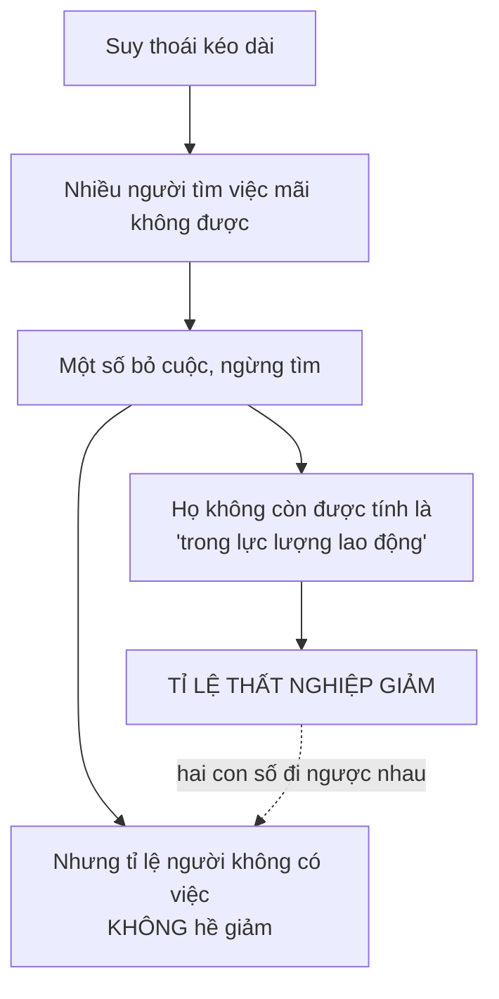
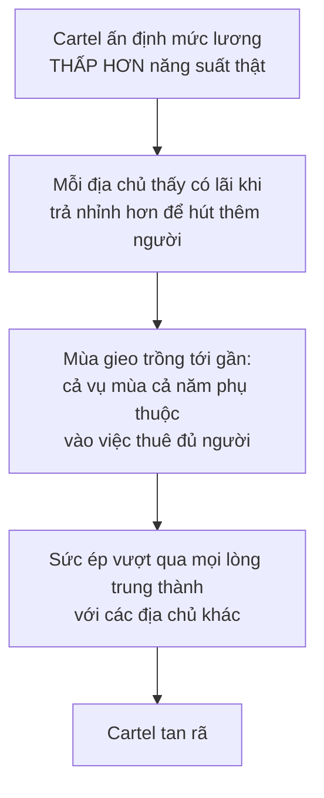

# Những vấn đề riêng của thị trường lao động

> Tỉ lệ thất nghiệp có thể **giảm** trong khi số người không có việc làm đang
> **tăng**. Hiểu vì sao là bài học quan trọng nhất chương này — và là kỹ năng
> đọc tin tức mà bạn dùng được ngay tuần sau.

## Vì sao lao động cần một chương riêng

Nguyên lý phân bổ lao động về căn bản không khác nguyên lý phân bổ quặng sắt.
Nhưng có những chuyện chỉ nảy sinh với con người: **điều kiện làm việc**,
**an toàn việc làm**, **thương lượng tập thể**, **giấy phép hành nghề**, và
câu hỏi liệu lao động có bị "bóc lột" hay không.

Cả cách **đo đạc** cũng có những cái bẫy riêng.

## Cái bẫy của tỉ lệ thất nghiệp

### Định nghĩa quyết định con số

Người được tính là **thất nghiệp** phải thỏa mãn hai điều: **đang trong lực
lượng lao động**, và **đang tìm việc mà không tìm được**.

Không nằm trong lực lượng lao động gồm: sinh viên, người nghỉ hưu, người nội
trợ, bệnh nhân nằm viện, quân nhân, phạm nhân, và trẻ em dưới tuổi lao động
hợp pháp.

Vì con người **có ý chí và có lựa chọn**, ai nằm trong lực lượng lao động
không phải là dữ kiện khách quan — nó thay đổi theo hoàn cảnh và theo từng
nước.

### Hệ quả gây sốc

Đây chính xác là điều đã xảy ra ở Mỹ sau đợt suy thoái đầu thế kỷ 21: tỉ lệ
thất nghiệp lên **hơn 10%** rồi bắt đầu giảm — trong khi **tỉ lệ tham gia lực
lượng lao động rơi xuống mức chưa từng thấy trong nhiều thập kỷ**. Một phần
lớn mức giảm ấy là người đã bỏ cuộc.

Một chỉ dấu Sowell đưa ra: từ giữa năm **2009** tới đầu năm **2013**, hơn
**3,7 triệu** người chuyển sang nhận trợ cấp tàn tật của hệ thống An sinh Xã
hội — tốc độ ghi danh nhanh nhất từng có.

### Thước đo thay thế

Cách tránh bẫy: đo xem **bao nhiêu phần trăm người trưởng thành ngoài các cơ
sở tập trung** (trường học, quân đội, bệnh viện, nhà tù) **đang có việc làm**.

Chỉ số này không bị ảnh hưởng bởi việc ai đó bỏ cuộc. Trong nửa đầu năm
**2010**, tỉ lệ thất nghiệp Mỹ giữ ổn định ở **9,5%** — trong khi tỉ lệ người
trưởng thành có việc làm tiếp tục một đợt sụt giảm lớn nhất trong hơn **nửa
thế kỷ**.

Hai con số kể hai câu chuyện khác nhau về cùng một nền kinh tế.

### So sánh giữa các nước còn khó hơn

| So sánh | Con số |
| --- | --- |
| Nam giới 15–64 tuổi có việc làm | **Iceland** hơn **80%**, **Pháp** dưới **70%** |
| Người **55–64 tuổi** còn đi làm | **Thụy Sĩ** hơn **70%**, **Pháp** chỉ **37%** |

Sowell giải thích: nhà nước phúc lợi Pháp khiến người lớn tuổi **rời hẳn lực
lượng lao động** dễ dàng hơn — và vì tỉ lệ thất nghiệp được tính trên quy mô
lực lượng lao động, thống kê Pháp **đánh giá thấp** số người trưởng thành
không đi làm.

### Trợ cấp thất nghiệp định hình hành vi tìm việc

| Nước | Mức trợ cấp |
| --- | --- |
| **Na Uy** | Ngay cả **năm năm** sau khi mất việc, người lao động vẫn có thể nhận gần **ba phần tư** thu nhập thực lĩnh lúc còn đi làm |
| **Tây Ban Nha, Pháp, Thụy Điển, Đức** | Hơn **60%** thu nhập cũ trong năm đầu tiên |
| **Bỉ** | Là nước duy nhất duy trì mức hào phóng đó suốt **năm năm** |
| **Mỹ** | Trợ cấp thường hết sau **một năm**; mức thấp hơn, thời gian ngắn hơn, và áp dụng cho tỉ lệ người thất nghiệp nhỏ hơn so với các nước công nghiệp khác |

Và hệ quả hành vi đo được: người thất nghiệp ở Mỹ dành thời gian tìm việc mỗi
ngày **gấp hơn bốn lần** so với người thất nghiệp ở Đức, Anh hay Thụy Điển.

### Thất nghiệp không phải chỉ có một loại

**Thất nghiệp ma sát** (frictional): sinh viên mới ra trường không có việc chờ
sẵn; chỗ trống vẫn còn trong khi người tìm việc vẫn đang tìm, chỉ vì **cần
thời gian để đúng người gặp đúng chỗ**. Đó là lý do tỉ lệ thất nghiệp không
bao giờ bằng không, kể cả những năm bùng nổ khi doanh nghiệp chật vật tuyển
người.

**Thất nghiệp dài hạn** là chuyện hoàn toàn khác. Tỉ lệ người thất nghiệp từ
một năm trở lên, trên tổng số người thất nghiệp:

| Nước | Tỉ lệ |
| --- | --- |
| **Mỹ** | 9% |
| **Anh** | 23% |
| **Đức** | 48% |
| **Ý** | 59% |

Sowell rút ra một nhận xét nghịch lý: chính ở những nước có **luật bảo vệ việc
làm mạnh**, như Đức, lại **khó tìm được việc mới hơn**. Bảo vệ người đang có
việc và mở đường cho người chưa có việc là hai mục tiêu kéo ngược nhau.

### Thất nghiệp do công nghệ

Gần như mọi bước tiến về hiệu quả công nghệ đều làm ai đó mất việc. Chuyện này
không mới:

Khoảng năm **1830**, một thợ may người Pháp tên **Barthélemy Thimonnier** đã
hoàn thiện và được cấp bằng sáng chế cho một chiếc máy khâu hoạt động hiệu
quả. Khi tám mươi chiếc máy của ông đang may quân phục cho quân đội Pháp, các
thợ may ở Paris hoảng sợ trước mối đe dọa với công việc của họ, đã **đập nát
máy móc và đuổi ông khỏi thành phố**.

Phản ứng đó không riêng gì nước Pháp — ở Anh đầu thế kỷ 19, những người
**Luddite** cũng đập phá máy móc khi nhận ra cách mạng công nghiệp đe dọa việc
làm của họ.

Sowell chỉ ra lỗi lập luận: người ta nhìn tác động **ngắn hạn lên những người
lao động cụ thể**, và bỏ qua tác động lên người tiêu dùng cùng người lao động
ở các ngành khác. Sự lên ngôi của ô tô chắc chắn đã xóa sổ rất nhiều việc làm
liên quan tới ngựa — nuôi ngựa, làm yên, đóng móng, làm roi, đóng xe ngựa.
Nhưng đó **không phải mất việc ròng**: ngành ô tô cần vô số nhân công, cũng
như các ngành làm xăng dầu, ắc quy, sửa chữa, và cả nhà nghỉ ven đường, quán
ăn nhanh, trung tâm mua sắm ngoại ô.

## Điều kiện làm việc cũng là một phần của lương

Một điểm mà người mới học ít khi nghĩ tới:

> Điều kiện làm việc tốt hơn, cũng như lương cao hơn, làm công việc **hấp dẫn
> hơn với người lao động** và **tốn kém hơn với người thuê**. Nói cách khác,
> trong chừng mực nào đó **người lao động đang mua điều kiện làm việc tốt hơn
> bằng chính tiền lương của mình**.

Người thuê không nhất thiết cắt lương mỗi khi cải thiện điều kiện. Nhưng khi
năng suất tăng và cạnh tranh đẩy thang lương lên, thang lương đó sẽ **không
tăng nhiều bằng** mức lẽ ra, nếu chi phí cải thiện điều kiện không phải tính
vào.

Ở **Đức**, các chi phí lao động ngoài lương cao khoảng **gấp đôi** so với Mỹ —
khiến lao động Đức đắt hơn lao động Mỹ ngay cả khi cùng mức lương danh nghĩa.

### Hai con đường tới điều kiện tốt hơn

Sowell thừa nhận rằng thị trường **có** cải thiện điều kiện làm việc, và dẫn
lời một lãnh đạo Hewlett-Packard về chuyện xảy ra ở châu Á: khi công ty lớn
nhất nâng lương và giảm giờ làm, mọi nhà máy khác buộc phải làm theo dù muốn
hay không, vì giờ họ phải cạnh tranh.

Ông cũng nhấn mạnh rằng thị trường tự do **không phải trò chơi có tổng bằng
không**: khi người lao động tích lũy thêm vốn con người, tổng sản lượng lớn
lên, và người lao động, người thuê lẫn người tiêu dùng đều có thể cùng được
lợi.

Về thảm kịch sập nhà máy ở **Bangladesh năm 2013** làm hơn **một nghìn** công
nhân thiệt mạng, ông ghi nhận sức ép quốc tế buộc các tập đoàn đa quốc gia
hoặc trả tiền cho điều kiện an toàn hơn, hoặc rời khỏi những nước không thực
thi tiêu chuẩn an toàn. Nhưng ông cảnh báo rằng cùng loại sức ép đó thường
được dùng để đòi nâng lương tối thiểu và mở rộng công đoàn, mà không tính tới
hậu quả việc làm — và rằng **người quan sát bên thứ ba không phải đối mặt với
bất kỳ ràng buộc hay đánh đổi nào** mà người thuê và người làm buộc phải đối
mặt.

**Cần nói rõ:** phân biệt giữa an toàn tính mạng và các yêu cầu phúc lợi khác
là chỗ Sowell lướt qua quá nhanh. Một tòa nhà không sập là loại yêu cầu khác
hẳn về chất so với một khoản đóng góp hưu trí, và việc gộp chúng vào cùng một
lập luận "chi phí là chi phí" làm yếu chính lập luận đó.

## Thương lượng tập thể: đối xứng hơn bạn tưởng

Đây là phần được xây dựng khéo nhất chương, vì Sowell áp **cùng một phân tích**
cho cả hai phía.

### Phía chủ tổ chức trước

Trong các thế kỷ trước, chính **người thuê** mới là bên có tổ chức. Trong các
phường hội thời trung cổ, thợ cả cùng nhau đặt ra luật về điều kiện thuê thợ
học việc và thợ bạn, cũng như mức giá tính cho khách. Ngày nay, các ông chủ
đội bóng chày nhà nghề cùng nhau đặt ra trần tổng quỹ lương mà một đội được
trả cho cầu thủ mà không bị phạt.

Và Sowell nêu một quan sát sắc: sẽ **chẳng bõ công tổ chức** nếu việc đó không
giúp họ giữ lương thấp hơn mức thị trường.

### Cùng một phép tính, hai chiều

Ví dụ bằng số của ông, với mức thị trường tự do giả định là **15 đô la/giờ**:

| Trường hợp | Chuyện xảy ra | Tổn thất cho xã hội |
| --- | --- | --- |
| **Hiệp hội chủ ép xuống 10 đô la** | Ít người xin việc ngành đó hơn; một số sang ngành khác trả **12 đô la** | Người có khả năng tạo ra **15 đô la** sản lượng đang chỉ tạo ra **12** |
| **Công đoàn đẩy lên 20 đô la** | Chỉ những ai năng suất đạt tối thiểu **20 đô la** mới đáng thuê; số còn lại bị đẩy sang ngành trả **12 đô la** | Y hệt: **15** tụt xuống **12** |

Cùng một tổn thất, từ hai hướng ngược nhau. Và Sowell nói thẳng điều mà người
đọc dễ bỏ qua: ai được ai mất giữa chủ và thợ là **vấn đề xã hội và đạo đức**;
vấn đề **kinh tế** là tổng của cải mà xã hội có được.

Ông cũng chỉ ra một điều tinh tế: khi công đoàn đẩy lương lên, doanh nghiệp sẽ
đầu tư thêm máy móc để nâng năng suất lao động vượt mức đó. Năng suất lao động
cao hơn **trông có vẻ** là hiệu quả hơn — nhưng làm ra **ít sản phẩm hơn với
chi phí cao hơn trên mỗi sản phẩm** thì không có lợi cho nền kinh tế, dù dùng
ít lao động hơn.

### Vì sao cartel của giới chủ hay sụp

Phần lịch sử đáng chú ý nhất, và nó cắt ngược lại kỳ vọng thông thường.

Ít nhóm nào dễ bị tổn thương hơn những người da đen vừa được giải phóng ở Mỹ
sau Nội chiến: rất nghèo, phần lớn không được học hành, không có tổ chức, và
không quen với cách vận hành của kinh tế thị trường. Giới chủ và địa chủ da
trắng ở miền Nam **có tổ chức** để ghìm lương họ xuống.

Những thỏa thuận đó **tan rã dần trong thị trường**, giữa những lời trách móc
cay đắng lẫn nhau. Cơ chế:

Kết quả đo được: trong các thập kỷ sau Nội chiến, **tỉ lệ tăng lương theo phần
trăm của lao động da đen cao hơn** của lao động da trắng — dù mức tuyệt đối
của người da trắng vẫn cao hơn.

Chuyện tương tự xảy ra ở California cuối thế kỷ 19 và đầu thế kỷ 20, khi các
địa chủ da trắng tổ chức lại để ghìm thu nhập của nông dân và lao động nông
nghiệp nhập cư người Nhật. Những cartel đó cũng sụp đổ giữa những lời tố cáo
lẫn nhau.

Điều kiện để cartel giới chủ thành công, đúng như
[chương về cartel](../2-doanh-nghiep-va-thuong-mai/03-kinh-te-cua-doanh-nghiep-lon.md)
đã nói: phải **kỷ luật được thành viên của mình** và **chặn được người thuê
mới** xuất hiện bên ngoài. Phường hội trung cổ làm được vì họ có **sức mạnh
của luật pháp** hậu thuẫn. Bóng chày nhà nghề làm được vì nó là một thế độc
quyền **được miễn trừ hợp pháp** khỏi luật chống độc quyền — không đội nào có
thể rút ra mà vẫn giữ được lượng khán giả và sự chú ý của truyền thông.

### Công đoàn: câu chuyện John L. Lewis

Ví dụ cân bằng nhất trong chương, và Sowell kể nó một cách công bằng đáng ghi
nhận.

**John L. Lewis** lãnh đạo Công đoàn Thợ mỏ Thống nhất từ **1920 đến 1960** và
cực kỳ thành công trong việc giành lương cao cho đoàn viên. Một nhà kinh tế
học gọi ông là **"người bán dầu giỏi nhất thế giới"** — vì giá than cao hơn,
cộng với gián đoạn sản xuất do hàng loạt cuộc đình công, đã khiến nhiều người
dùng than **chuyển sang dùng dầu**. Việc làm trong ngành than giảm theo.

Tới thập niên **1960**, nhiều cộng đồng mỏ kiệt quệ, một số thành thị trấn ma.
Báo chí kể về cảnh khốn khó của họ hiếm khi nối nó với thời hoàng kim của
Lewis.

Và đây là chỗ Sowell công bằng: ông viết rõ rằng **để công bằng với Lewis**,
người này đã có một lựa chọn có ý thức — thà ít thợ mỏ làm công việc nguy hiểm
dưới lòng đất và nhiều máy móc hạng nặng ở đó hơn, **vì máy móc không thể bị
giết bởi sập hầm hay nổ khí**.

Đó là một **đánh đổi thật**, được cân nhắc thật. Điều Sowell phê phán không
phải lựa chọn của Lewis, mà là việc công chúng **cổ vũ vế thứ nhất và thương
cảm vế thứ hai mà không nối hai vế lại với nhau**.

Câu chuyện tương tự ở ngành ô tô, nơi công đoàn giành được lương cao hơn, an
toàn việc làm hơn và các quy tắc làm việc có lợi hơn cho đoàn viên. Về dài
hạn, toàn bộ chi phí tăng thêm đó đẩy giá xe lên và làm xe Mỹ kém cạnh tranh
hơn so với xe Nhật — không chỉ ở Mỹ mà trên khắp các thị trường. Năm **1950**,
nước Mỹ sản xuất **ba phần tư** toàn bộ ô tô của thế giới.

## Chỗ cần thận trọng

Phần về **thống kê thất nghiệp** là phần hữu ích nhất và ít gây tranh cãi nhất
của chương — hãy giữ lấy nó.

Phần về **công đoàn** thì chỉ kể một nửa. Phân tích của Sowell đúng ở chỗ
lương cao hơn mức năng suất sẽ làm giảm việc làm trong ngành đó. Nhưng nó bỏ
qua lập luận đối xứng mà chính ông vừa dùng cho phía giới chủ: nếu người thuê
có sức mạnh thương lượng vượt trội — điều mà chính ví dụ cartel của ông thừa
nhận là có thật — thì công đoàn có thể đang **kéo lương về gần mức năng suất**
chứ không phải đẩy vượt lên trên. Trường hợp nào đang xảy ra là câu hỏi thực
nghiệm, và chương này giả định sẵn câu trả lời.

Giấy phép hành nghề, chủ đề mà bản gốc bàn thêm trong chương này, vận hành
đúng theo logic rào cản gia nhập đã nói ở
[chương chống độc quyền](../2-doanh-nghiep-va-thuong-mai/04-quan-ly-va-luat-chong-doc-quyen.md):
nó nâng thu nhập cho người đã có giấy phép và chặn người muốn vào nghề.

## Điều cần nhớ

- **Tỉ lệ thất nghiệp có thể giảm vì người ta bỏ cuộc.** Luôn nhìn kèm **tỉ lệ
  người trưởng thành đang có việc làm**.
- Thất nghiệp **ma sát** và thất nghiệp **dài hạn** là hai hiện tượng khác
  nhau. Tỉ lệ người thất nghiệp trên một năm là chỉ số đáng nhìn.
- **Điều kiện làm việc là một phần của gói thù lao**, dù không ai gọi tên nó
  như vậy.
- Thương lượng tập thể gây cùng một loại tổn thất **dù lương bị ghìm xuống hay
  bị đẩy lên** — vì cả hai đều đẩy người lao động khỏi nơi họ tạo ra nhiều giá
  trị nhất.
- Cartel của giới chủ sụp vì **cùng lý do** cartel doanh nghiệp sụp: từng thành
  viên có lợi khi phá rào.
- Chuyện John L. Lewis: một chính sách có thể **đồng thời** nâng lương cho
  người còn việc **và** xóa sổ cả một cộng đồng. Hai điều đó là một câu chuyện,
  không phải hai.

## Tự kiểm tra

1. Bằng cách nào tỉ lệ thất nghiệp giảm trong khi tỉ lệ người có việc làm cũng
   giảm?
2. Vì sao thống kê thất nghiệp của Pháp đánh giá thấp số người không đi làm?
3. Thợ may Paris đập máy khâu năm 1830 — họ đã bỏ qua điều gì?
4. Hiệp hội chủ ghìm lương xuống và công đoàn đẩy lương lên gây ra cùng một
   loại tổn thất. Loại tổn thất đó là gì?
5. Vì sao cartel của các địa chủ da trắng ở miền Nam nước Mỹ sau Nội chiến lại
   tan rã?

---

Trước: [Luật lương tối thiểu](./02-luat-luong-toi-thieu.md) ·
Tiếp: [Phần IV — Thời gian và rủi ro](../4-thoi-gian-va-rui-ro/)
