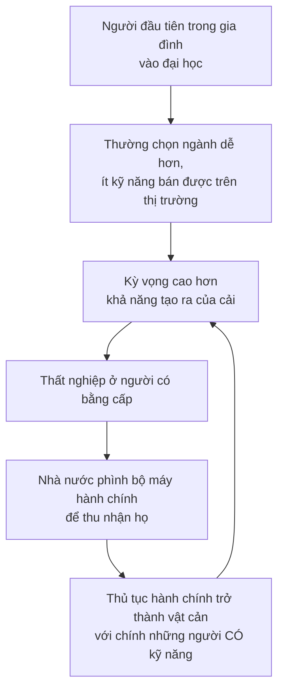
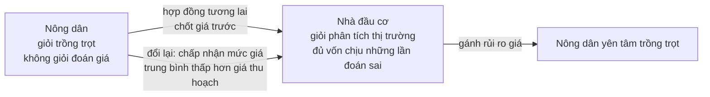

# Đầu tư

> Đầu tư là **hy sinh thứ có thật hôm nay để có nhiều thứ có thật hơn trong
> tương lai**. Tiền chỉ là cách ghi sổ. Và vì không ai biết tương lai, mọi
> khoản đầu tư đều kèm rủi ro — thứ phải được trả công, nếu muốn còn ai đầu tư.

## Bắt đầu từ chuyện bạn đã biết

Một du khách ở New York thuê họa sĩ vỉa hè ký họa chân dung. Bức vẽ rất đẹp,
và giá là 100 đô la.

Du khách nói: đắt đấy, nhưng tôi sẽ trả, vì nó đẹp. Chỉ có điều, ông vẽ nó mất
có năm phút.

Họa sĩ đáp: **hai mươi năm và năm phút**.

Đó là toàn bộ chương này trong một câu chuyện. Thứ được trả tiền không phải
năm phút, mà là hai mươi năm tích lũy trước đó.

## Định nghĩa, và vì sao nó không phải chuyện tiền

Với cả xã hội, đầu tư có dạng: **từ bỏ việc sản xuất một số hàng tiêu dùng hôm
nay**, để lao động và vốn lẽ ra làm ra chúng được dùng vào việc chế tạo máy
móc và nhà xưởng — thứ sẽ làm sản lượng tương lai lớn hơn.

Các giao dịch tài chính là thứ nhà đầu tư cá nhân chú ý. Nhưng với cả xã hội,
tiền chỉ là **công cụ nhân tạo** để những thứ có thật được luân chuyển.

### Vì sao rủi ro phải được trả công

Chi phí nuôi sống một người trong lúc tài năng hội họa của họ chín dần, trong
lúc các mũi khoan thăm dò dầu chưa trúng, trong lúc tín chỉ của họ chưa đủ để
lấy bằng — tất cả đều là khoản đầu tư **phải được hoàn lại**, nếu muốn những
khoản đầu tư như thế còn tiếp tục được thực hiện.

Và Sowell nói rõ đây không phải chuyện đạo đức:

> Việc hoàn vốn đầu tư không phải là vấn đề đạo đức mà là vấn đề kinh tế. Nếu
> mức sinh lợi không đủ để bõ công, **ít người sẽ làm khoản đầu tư đó trong
> tương lai**, và người tiêu dùng về sau sẽ mất đi thứ lẽ ra đã được làm ra.

Kèm theo là một hệ quả không dễ nghe nhưng nhất quán: ở những lĩnh vực mà
người tiêu dùng **không coi trọng** thứ được tạo ra, khoản đầu tư **không nên**
sinh lời. Mức lương thấp và ít cơ hội việc làm trong lĩnh vực đó chính là tín
hiệu — cho người đang ở đó và cho những người đi sau — rằng đừng đầu tư thêm
theo hướng ấy nữa.

## Vốn con người: nhiều hơn là bằng cấp

Đây là phần dễ gây tranh cãi nhất chương, và cũng là phần hữu ích nhất cho một
người trẻ đang chọn ngành học.

Sowell chỉ ra rằng người ta hay **đánh đồng vốn con người với giáo dục chính
quy**, và điều đó bỏ sót rất nhiều:

- Cách mạng công nghiệp **không** do những người học vấn cao tạo ra, mà do
  những người có kinh nghiệm thực hành trong sản xuất.
- Máy bay do hai anh thợ sửa xe đạp chưa từng học đại học phát minh ra.
- Điện và hàng loạt phát minh chạy bằng điện trở thành trung tâm của thế giới
  hiện đại nhờ một người chỉ đi học chính quy vỏn vẹn **ba tháng**: Thomas
  Edison.

Tất cả những người đó đều có kiến thức và trực giác cực kỳ giá trị — vốn con
người — tích lũy **từ trải nghiệm** chứ không từ lớp học.

Ông không bác bỏ giáo dục; ông phân loại nó:

> Xét về mặt kinh tế, có loại giáo dục **giá trị rất lớn**, có loại **không có
> giá trị**, và có loại **giá trị âm**.

### Cái bẫy của thế hệ đi học đầu tiên

Lập luận của Sowell về các nước đang phát triển:

Vòng lặp đó khép lại: bộ máy được lập ra để giải quyết hậu quả lại tạo ra
thêm chính hậu quả đó.

Ông cũng nêu một hệ quả xã hội đáng chú ý: thái độ thù địch với các nhóm thiểu
số có truyền thống kinh doanh — người Hoa ở Đông Nam Á, người Liban ở Tây Phi
— thường gay gắt nhất **ở chính tầng lớp bản địa mới có bằng cấp**, những
người thấy tấm bằng của mình mang lại ít lợi ích kinh tế hơn thu nhập của
những chủ doanh nghiệp thiểu số có khi còn ít học hơn họ.

### Ví dụ Ấn Độ

Con số cho thấy thủ tục hành chính bóp nghẹt đầu tư tới mức nào:

- Gia tộc **Tata** đưa ra **119 đề xuất** từ năm **1960 đến 1989** để lập doanh
  nghiệp mới hoặc mở rộng doanh nghiệp cũ. **Tất cả** đều kết thúc trong sọt
  rác của giới công chức.
- **Aditya Birla**, người thừa kế trẻ tuổi được đào tạo tại MIT, thất vọng tới
  mức quyết định mở rộng kinh doanh **ra ngoài Ấn Độ** — và lập nên các công
  ty ở Thái Lan, Malaysia, Indonesia và Philippines.
- Theo lời một lãnh đạo doanh nghiệp Ấn Độ, hệ thống quy định dày đặc bảo đảm
  rằng **mỗi doanh nhân đều vi phạm luật nào đó mỗi tháng**.
- Các doanh nghiệp lớn lập **bộ máy hành chính riêng ở Delhi**, song song với
  bộ máy nhà nước, chỉ để theo dõi tiến trình xin phép và chi các khoản hối lộ
  cần thiết.

Sau cải cách năm **1991**, đầu tư nước ngoài vào Ấn Độ tăng từ **150 triệu**
lên **3 tỉ** đô la — **gấp hai mươi lần**.

## Đầu tư tài chính: ai thật sự sở hữu các tập đoàn

Các định chế tài chính trên thế giới nắm tổng cộng **60 nghìn tỉ đô la** tài
sản đầu tư vào năm **2009**, trong đó các định chế Mỹ nắm **45%**.

Nhưng con số khổng lồ đó phần lớn là **tổng của vô số khoản nhỏ**: cổ đông
trong các tập đoàn, người gửi tiết kiệm, người lao động đóng đều đặn những
khoản khiêm tốn vào quỹ hưu trí. Tới cuối thế kỷ 20, **hơn một nửa** dân số Mỹ
sở hữu cổ phiếu — trực tiếp, hoặc gián tiếp qua quỹ hưu trí, tài khoản ngân
hàng và các trung gian tài chính khác.

### Trung gian tài chính làm gì

Hai việc, và việc thứ hai ít được nói tới:

1. **Gom vốn** từ vô số người không hề quen biết nhau, để tài trợ những dự án
   quá lớn với bất kỳ ai.
2. **Cho phép mỗi cá nhân phân bổ lại mức tiêu dùng của chính mình theo thời
   gian.** Người đi vay thực chất đang **rút trước thu nhập tương lai** để chi
   tiêu hôm nay, và trả lãi cho sự tiện lợi đó. Người tiết kiệm thì hoãn việc
   mua sắm lại, và **nhận lãi cho sự chậm trễ**.

Phần lớn người ta là **cả con nợ lẫn chủ nợ** ở những giai đoạn khác nhau của
đời mình. Ở Mỹ, Canada, Anh, Ý và Nhật, tỉ lệ tiết kiệm cao nhất nằm ở nhóm
**55–59 tuổi** và thấp nhất ở nhóm **dưới 30 tuổi** — nhóm dưới 30 có tiết
kiệm ròng **bằng không** ở Canada và **âm** ở Mỹ.

Người gửi tiết kiệm thường không nghĩ mình là chủ nợ. Nhưng tiền họ gửi ngân
hàng chính là tiền ngân hàng đem cho vay.

## Đầu cơ: ngược lại với cờ bạc

Đây là phần quan trọng nhất chương, và nó sửa một hiểu lầm rất phổ biến.

| | **Cờ bạc** | **Đầu cơ kinh tế** |
| --- | --- | --- |
| Rủi ro từ đâu ra | **Tạo ra** một rủi ro vốn không tồn tại | **Đối phó** với một rủi ro vốn đã có sẵn |
| Mục đích | Kiếm lời, hoặc phô diễn kỹ năng và sự gan dạ | Giảm thiểu rủi ro và **chuyển nó cho người chịu được nó tốt nhất** |

> Đầu cơ không phải là cờ bạc. Nó là **ngược lại** với cờ bạc.

### Cơ chế, qua người nông dân trồng lúa mì

Người nông dân gieo hạt hôm nay và không biết giá lúc thu hoạch. Nếu mùa màng
ở Nga và Argentina thất bát, giá thế giới sẽ vọt lên và anh ta trúng lớn. Nếu
cả hai nơi đó được mùa, giá có thể rơi thẳng đứng và anh ta may lắm mới không
lỗ.

**Dù không muốn, anh ta vẫn đang đầu cơ** — chỉ là không tự gọi mình như vậy.

Nhà đầu cơ kiếm lời bằng cách trả cho nông dân mức giá **trung bình thấp hơn**
mức giá thật sự xuất hiện lúc thu hoạch. **Người nông dân biết điều đó.** Thực
chất anh ta đang **trả tiền cho nhà đầu cơ để gánh rủi ro**, y như trả phí bảo
hiểm.

Và Sowell nhấn mạnh: đây là một cách phân bổ **tri thức**. Cả hai đều không
biết giá tương lai. Nhưng nhà đầu cơ có nhiều hiểu biết hơn về thị trường và
phân tích thống kê, còn nông dân có nhiều hiểu biết hơn về cách trồng cây.

Chi tiết ông kể về một người bạn làm nghề đầu cơ hàng hóa gói trọn ý này:
người đó thừa nhận **chưa bao giờ nhìn thấy một hạt đậu nành** và không biết
nó trông thế nào, dù đã mua bán hàng triệu đô la đậu nành qua nhiều năm. Anh
ta chỉ chuyển quyền sở hữu trên giấy tờ cho người mua vào lúc thu hoạch.

> Anh ta không làm nghề đậu nành. Anh ta làm **nghề quản trị rủi ro**.

### Chi phí thật của rủi ro gồm cả sự lo lắng

Một điểm tinh tế: chi phí của rủi ro không chỉ là số tiền, mà còn là **nỗi lo
treo lơ lửng** trong lúc chờ đợi.

Một nông dân kỳ vọng 1.000 đô la một tấn, nhưng biết nó có thể là 500 hoặc
1.500. Nếu nhà đầu cơ đề nghị bao mua ở mức **900**, mức giá đó có thể rất
đáng — nếu nó giúp anh ta tránh được nhiều tháng mất ngủ tự hỏi lấy gì nuôi
gia đình nếu giá thu hoạch không đủ bù chi phí.

Nhà đầu cơ không chỉ **đủ vốn hơn** để chịu sai, mà thường còn **hợp về tâm
lý** hơn — vì những người hay lo lắng thường không chọn nghề này.

### Đây là nghề rủi ro cao cho cá nhân

| Ví dụ | Điều đã xảy ra |
| --- | --- |
| **Bạc, 1979–1980** | Giá từ **6 đô la**/ounce đầu năm 1979 vọt lên đỉnh **50,05 đô la** đầu năm 1980, rồi giảm về **21,62** vào ngày 26/3 — và **chỉ trong một ngày** rơi hơn một nửa xuống **10,80**. Anh em nhà Hunt, đang đầu cơ bạc rất nặng, **mất hơn một tỉ đô la trong vài tuần** |
| **Heinz, thập niên 1870** | Một công ty chế biến thực phẩm do Henry Heinz đứng đầu ký hợp đồng mua dưa chuột của nông dân theo giá chốt trước. Rồi dưa chuột được mùa lớn, vượt xa mức ông dự tính hoặc đủ sức mua — và việc đó đẩy ông tới **phá sản**. Ông mất nhiều năm mới gây dựng lại, và về sau lập ra công ty H.J. Heinz vẫn tồn tại tới nay |
| **Dự báo giá dầu** | Tháng 3/**1999**, một tạp chí kinh tế uy tín dự báo giá dầu đang trên đà **giảm**. Thực tế nó **tăng** — và tới tháng 12, dầu bán với giá **gấp năm lần** mức mà dự báo đó gợi ý |

Sowell dùng điểm cuối để nhắc rằng ngay cả người rất am hiểu cũng có thể sai
rất xa — và ông nêu thêm rằng các dự báo lạm phát của Cục Dự trữ Liên bang Mỹ
đã nhiều lần sai, còn Văn phòng Ngân sách Quốc hội thì có lần dự báo một luật
thuế mới sẽ làm tăng thu ngân sách trong khi thực tế thu giảm, và có lần dự
báo ngược lại cũng sai nốt.

### Không chỉ dành cho người giàu

Ví dụ đẹp nhất về việc thị trường hàng hóa đã mở tới đâu: ở một ngôi làng Ấn
Độ 2.500 dân, ít nhất mỗi ngày một lần, một người nông dân bật máy tính trong
phòng khách và truy cập trang web của Sở Giao dịch Hàng hóa Chicago để xem giá
tương lai của đậu nành — với đất ruộng còn dính dưới móng tay, gõ phím rất
chậm, nhưng biết rõ mình cần tìm gì.

Tới năm **2003**, có khoảng **3.000** tổ chức ở Ấn Độ kết nối tới **1,8 triệu**
nông dân Ấn Độ với các thị trường hàng hóa thế giới. Người nông dân trên làm
đại lý cho nông dân các làng quanh đó: năm trước ông kiếm được **300 đô la**
từ việc này, và nay kiếm được ngần ấy **trong một tháng** — một khoản rất đáng
kể ở một nước nghèo.

## Tồn kho là vật thay thế cho tri thức

Một định nghĩa gọn và đáng nhớ:

> **Tồn kho là thứ thay thế cho hiểu biết.** Sẽ chẳng có đồ ăn nào bị bỏ đi
> sau bữa cơm, nếu người nấu biết trước chính xác mỗi người sẽ ăn bao nhiêu.

Vì tồn kho tốn tiền, doanh nghiệp phải giữ nó thấp — nhưng không thấp tới mức
hết hàng và mất doanh số. Cả hai phía đều là lỗ:

- **Tồn kho quá lớn** → chi phí cao hơn đối thủ → đối thủ bán rẻ hơn và lấy
  mất khách.
- **Tồn kho quá nhỏ** → hết thứ khách cần → mất doanh số ngay, và mất cả uy
  tín về sau.

Và đây là chỗ cơ chế thị trường làm việc của nó: những doanh nghiệp đoán đúng
thường xuyên hơn thì sống sót và tiếp tục ra quyết định, còn những doanh
nghiệp liên tục trữ quá nhiều hoặc quá ít thì biến mất qua phá sản.

### Mặt trái của tối ưu

Các hãng xe Nhật nổi tiếng giữ tồn kho ít tới mức linh kiện được giao tới nhà
máy **vài lần mỗi ngày**, lắp thẳng lên xe đang chạy trên dây chuyền. Điều đó
hạ chi phí và hạ giá thành.

Nhưng năm **2007**, một trận động đất ở Nhật làm tê liệt một nhà cung cấp vòng
xéc-măng. Hậu quả: vì thiếu một chi tiết giá **1,5 đô la**, gần **70%** sản
lượng ô tô của cả nước Nhật bị đình trệ tạm thời trong tuần đó.

Sowell mở rộng nguyên lý này ra ngoài thị trường bằng ví dụ người lính ra trận:
anh ta không mang đúng số viên đạn sẽ bắn hay đúng lượng thuốc men sẽ cần, vì
không ai có khả năng biết trước như vậy. Anh ta mang theo một **lượng dự trữ**
cho các tình huống. Nhưng anh ta cũng không thể mang theo mọi thứ có thể cần
trong mọi hoàn cảnh — vì điều đó làm anh ta chậm lại và thành mục tiêu dễ bắn
hơn.

> Quá một điểm nào đó, **nỗ lực tăng an toàn lại làm tình thế nguy hiểm hơn**.

Và một ứng dụng vào chu kỳ kinh tế: trong quý ba năm **2003**, khi kinh tế Mỹ
đang phục hồi, doanh số, xuất khẩu và lợi nhuận đều tăng — nhưng nhà sản xuất,
bán buôn và bán lẻ đều **bán hàng từ kho sẵn có** thay vì sản xuất bù, và tỉ
lệ tồn kho trên doanh số chạm mức **thấp kỷ lục**. Kết quả là rất ít việc làm
mới được tạo ra, sinh ra cụm từ **"phục hồi không việc làm"**. Đó cũng là một
cách đối phó với rủi ro: doanh nghiệp chưa tin rằng đà phục hồi sẽ kéo dài.

## Giá trị hiện tại: cách thị trường chia sẻ với tương lai

Khái niệm cuối chương, và là câu trả lời của Sowell cho nỗi lo cạn kiệt tài
nguyên.

**Giá trị hiện tại** (present value) là giá trị hôm nay của một thứ sẽ sinh lợi
về sau. Nếu một tài nguyên thật sự sắp cạn trong một khoảng thời gian có ý
nghĩa thực tiễn, thì giá trị hiện tại của nó sẽ **tăng lên ngay từ bây giờ** —
và việc đó **tự động buộc người ta tiết kiệm nó**, không cần hoảng loạn dư
luận hay kêu gọi chính trị.

> Giá cả khiến chúng ta chia sẻ nguồn lực với nhau **tại một thời điểm**. Giá
> trị hiện tại khiến chúng ta chia sẻ nguồn lực **qua thời gian** với các thế
> hệ tương lai — mà không hề ý thức rằng mình đang chia sẻ.

### Vì sao "trữ lượng đã biết" luôn trông nhỏ

Lượng tài nguyên khai thác được ở **mức chi phí hiện tại khả thi** thường sắp
cạn trong vài năm — trong khi có thể còn lượng khổng lồ ở mức chi phí **cao
hơn một chút**, và lượng đó sẽ không được đụng tới chừng nào phần rẻ hơn chưa
hết.

Ví dụ vùng **Athabasca** ở Alberta, Canada: về lý thuyết, 54.000 dặm vuông cát
dầu ở đó có thể cho ra khoảng **1,7 đến 2,5 nghìn tỉ thùng** dầu, đưa Canada
lên vị trí thứ hai thế giới về trữ lượng. Nó gần như chưa được khai thác vì
tách dầu khỏi cát rất tốn kém và phức tạp — cần khoảng **hai tấn cát** cho
**một thùng dầu**. Nhưng nếu giá dầu giữ trên **30 đô la** một thùng, việc khai
thác trở nên có lãi.

Và công nghệ có thể làm mọi thứ rẻ đi chứ không chỉ đắt lên: chi phí trung
bình để **tìm ra** một thùng dầu giảm từ **15 đô la** năm **1977** xuống **5
đô la** vào năm **1998**. Không có gì lạ khi trữ lượng "đã biết" tăng lên sau
khi chi phí của việc **biết** giảm xuống.

Điều này cũng lật ngược một loại phát biểu lạc quan sai: nói rằng một nước
nghèo có "hàng tỉ đô la tài nguyên" dưới dạng quặng sắt hay bauxite là **gần
như vô nghĩa** nếu không tính chi phí khai thác và chế biến — thứ chênh lệch
rất lớn giữa các nơi.

### Và một cảnh báo về dự báo của nhà nước

Trong thập niên **1970**, các nhà khoa học của chính phủ Mỹ được yêu cầu ước
tính trữ lượng khí tự nhiên của nước này sẽ dùng được bao lâu với mức tiêu thụ
khi đó. Ước tính của họ: **hơn một nghìn năm**.

Với một số người, đó là tin tốt. Nhưng về mặt chính trị, đó là tin xấu vào
đúng lúc tổng thống đang muốn khơi dậy sự ủng hộ cho các chương trình nhà nước
nhằm đối phó với "khủng hoảng" năng lượng. Ước tính đó bị bác bỏ và một nghiên
cứu mới được khởi động — nghiên cứu này cho ra **những kết quả dễ chấp nhận
hơn về mặt chính trị**.

## Chỗ cần thận trọng

Phần **đầu cơ** và phần **tồn kho** là kinh tế học chuẩn mực, gần như không
gây tranh cãi. Định nghĩa "đầu cơ là ngược lại với cờ bạc" là cách diễn đạt
sáng rõ và đúng.

Điều cuốn sách lướt qua là **ranh giới giữa hai thứ đó mờ đi ở đâu**. Đầu cơ
chuyển rủi ro sang người chịu được nó — nhưng một số hoạt động tài chính hiện
đại **tạo ra** phơi nhiễm mới thay vì chuyển dịch phơi nhiễm sẵn có, và khi đó
chúng nằm gần phía cờ bạc hơn theo đúng định nghĩa của chính Sowell. Cuốn sách
xuất bản năm 2014, sau khủng hoảng tài chính 2008, nhưng chương này không dùng
khuôn khổ sắc sảo của chính nó để soi vào sự kiện đó.

Phần về **giáo dục** cần đọc cẩn thận. Quan sát rằng số năm đi học không tự
động bằng vốn con người là đúng và hữu ích. Nhưng bước từ đó sang việc đánh
giá các ngành học cụ thể là "dễ hơn và mơ hồ hơn" thì đã là **quan điểm**, và
nó đo giá trị bằng đúng một thước duy nhất là thu nhập trên thị trường lao
động — thước mà chính Sowell ở chương khác đã cảnh báo là không đo được giá
trị con người.

## Điều cần nhớ

- Đầu tư = **hy sinh thứ có thật hôm nay cho nhiều thứ có thật hơn về sau**.
  Tiền chỉ là cách ghi sổ.
- **Vốn con người không đồng nghĩa với bằng cấp.** Edison học chính quy ba
  tháng.
- **Đầu cơ là ngược lại với cờ bạc**: cờ bạc tạo ra rủi ro mới, đầu cơ chuyển
  rủi ro sẵn có sang người chịu được nó tốt nhất.
- Người nông dân không ký hợp đồng tương lai **vẫn đang đầu cơ** — chỉ là tự
  gánh lấy.
- **Tồn kho là vật thay thế cho tri thức.** Càng ít biết chắc, càng phải trữ
  nhiều — và trữ nhiều thì tốn.
- **Giá trị hiện tại** là cách thị trường chia sẻ tài nguyên với thế hệ tương
  lai mà không ai phải ra lệnh.
- "Trữ lượng đã biết" là một con số **kinh tế**, không phải con số địa chất.

## Tự kiểm tra

1. Câu trả lời "hai mươi năm và năm phút" nói gì về bản chất của đầu tư?
2. Vì sao đầu cơ là ngược lại với cờ bạc?
3. Người nông dân bán lúa qua hợp đồng tương lai với giá thấp hơn giá thu
   hoạch trung bình. Vì sao anh ta vẫn làm vậy?
4. Vì sao thiếu một chi tiết giá 1,5 đô la lại làm tê liệt 70% sản lượng ô tô
   của cả một nước?
5. Trữ lượng dầu của Canada tăng vọt mà không ai tìm thêm mỏ nào. Giá trị hiện
   tại giải thích điều đó thế nào?

---

Trước: [Phần IV](./README.md) ·
Tiếp: [Cổ phiếu, trái phiếu và bảo hiểm](./02-co-phieu-trai-phieu-va-bao-hiem.md)
