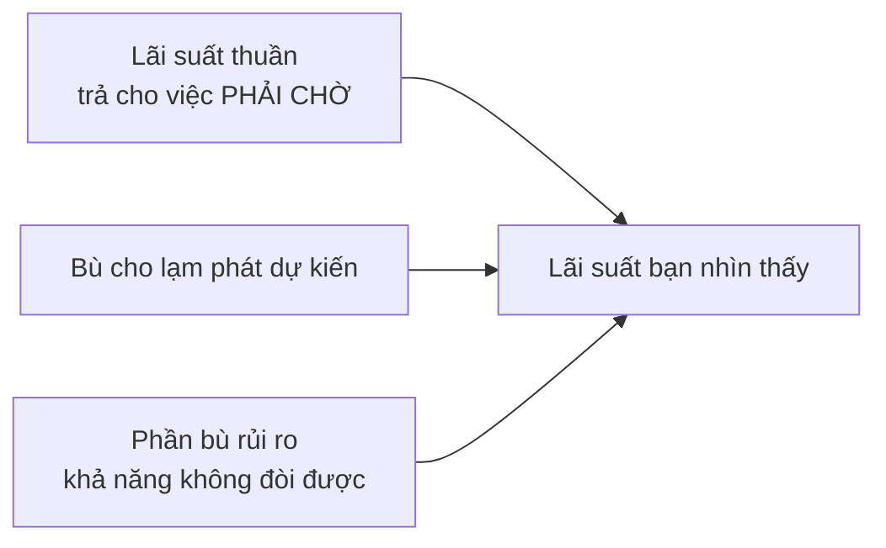
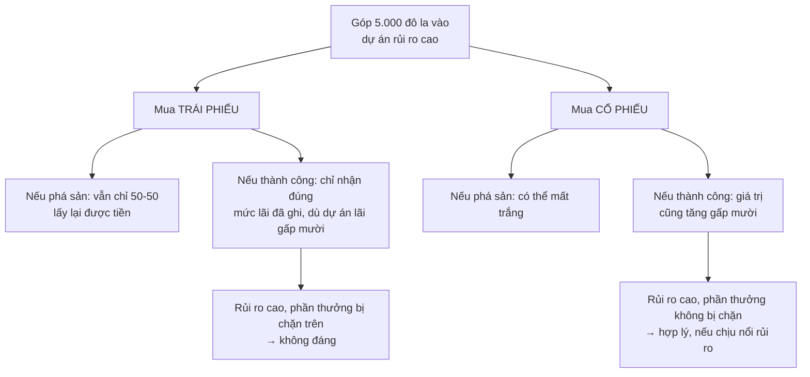
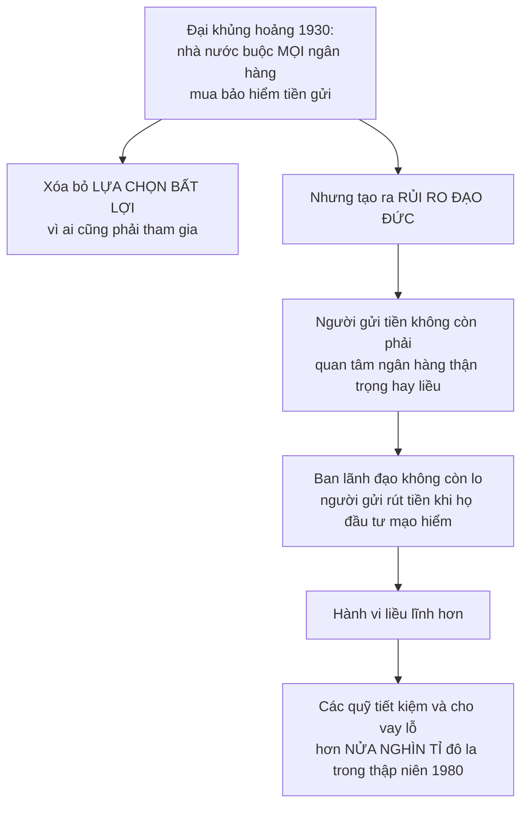

# Cổ phiếu, trái phiếu và bảo hiểm

> Ba công cụ, cùng một bài toán: **ai gánh rủi ro, và với giá nào**. Bảo hiểm
> là ví dụ đẹp nhất, vì nó không chỉ **chuyển** rủi ro — nó còn **làm rủi ro
> nhỏ đi**.

## Bắt đầu từ chuyện bạn đã biết

Nếu ai đó nợ bạn một triệu đồng, bạn thích nhận **hôm nay** hay **năm sau**?

Câu trả lời hiển nhiên chứa toàn bộ khái niệm lãi suất: **tiền hôm nay đáng
giá hơn cùng số tiền đó trong tương lai**. Việc người ta phải trả lãi chính là
bằng chứng của điều đó.

## Lãi suất gồm những gì

Lãi suất mà bạn nhìn thấy trên thực tế là **nhiều thứ cộng lại**:

Phần bù rủi ro có thể **lớn hơn cả phần lãi suất thuần**. Số liệu Sowell đưa
ra cho thấy khoảng cách đó rộng tới mức nào — lãi suất ngắn hạn tháng **4/2003**:

| Nơi | Lãi suất |
| --- | --- |
| **Hồng Kông** | dưới **2%** |
| **Nga** | **18%** |
| **Thổ Nhĩ Kỳ** | **39%** |

Và rủi ro chính trị hiện ra rất nhanh trong con số. Đầu thế kỷ 21, trái phiếu
chính phủ **Mexico** trả lãi cao hơn trái phiếu **Mỹ** **2,5 điểm phần trăm**;
trái phiếu **Brazil** cao hơn Mexico **5 điểm phần trăm** — rồi lãi suất của
Brazil **vọt thêm mười điểm phần trăm nữa** sau khi một ứng viên tổng thống
cánh tả nổi lên.

### Vì sao chuyện này cần sự ổn định của đồng tiền

Thời đỉnh cao công nghiệp hóa của nước Anh thế kỷ 19, các công ty đường sắt
huy động được những khoản tiền khổng lồ để đặt hàng dặm đường ray và mua đầu
máy, bằng cách bán trái phiếu trả khoảng **5%** một năm.

Điều đó chỉ khả thi vì công chúng tin cả vào ngành đường sắt lẫn vào **sự ổn
định của đồng tiền**. Nếu lạm phát khi đó là **6%** một năm, người mua trái
phiếu đã **mất** giá trị thực thay vì được lợi.

Hãy giữ ý này lại — nó là cầu nối sang
[chương về tiền tệ](../5-kinh-te-quoc-gia/02-tien-te-va-he-thong-ngan-hang.md).

## Giá trị hiện tại, bằng số cụ thể

Đây là phép tính đáng tự làm một lần, vì nó giải thích một tin tức bạn gặp
hoài: *"giá trái phiếu giảm khi lãi suất tăng"*.

Câu hỏi: một tờ trái phiếu đáo hạn sau một năm với mệnh giá **10.000 đô la**
đáng giá bao nhiêu **hôm nay**?

Chắc chắn không phải 10.000 — vì nếu có 10.000 ngay bây giờ, bạn đã có thể gửi
ngân hàng và ăn lãi một năm.

| Lãi suất chung của nền kinh tế | Mức cao nhất bạn nên trả hôm nay |
| --- | --- |
| **5%** | **9.523,81** đô la |
| **12%** | **8.928,57** đô la |

Lý do: với 9.523,81 đô la đem đầu tư ở mức 5% nơi khác, một năm sau bạn cũng
có đúng 10.000. Nên không có lý do gì trả hơn thế.

> Vì vậy **giá trái phiếu giảm khi lãi suất tăng**, và ngược lại. Hai con số
> đó là hai cách nói về cùng một thứ.

### Một câu hỏi hóc búa về thuế

Sowell dùng chính phép tính trên để nêu một vấn đề thật:

Nếu bạn mua trái phiếu ở giá **9.523,81** và bán lại một năm sau ở **10.000**,
nhà nước sẽ muốn đánh thuế phần chênh **476,19** đô la như một khoản **lãi vốn**
(capital gain).

Nhưng ở mức lãi suất 5%, hai số tiền đó **tương đương nhau** — một số là giá
trị hôm nay của số kia. Vậy đó có thật là một khoản tăng giá trị không?

Và nếu có lạm phát **1%**? Hoặc **5%** — khi đó số tiền nhận lại **không đáng
giá hơn chút nào** so với số đã bỏ ra, và người đầu tư **không được trả công
gì cho việc đã chờ**. Rõ ràng anh ta còn tệ hơn là đã không mua.

Đây là lý do việc đánh thuế lãi vốn phức tạp hơn đánh thuế tiền lương, và là
một tranh cãi chính trị chưa dứt ở Mỹ; một số nước thì không đánh thuế lãi vốn
chút nào.

## Cổ phiếu và trái phiếu: khác nhau ở thứ tự xếp hàng

| | **Trái phiếu** | **Cổ phiếu** |
| --- | --- | --- |
| Bản chất | **Cam kết pháp lý** trả một khoản cố định vào ngày cố định | **Phần sở hữu** doanh nghiệp |
| Được trả khi nào | Dù doanh nghiệp lãi hay lỗ | Chỉ từ phần **còn lại** sau khi đã trả hết |
| Giống ai | Giống **người lao động** — có quyền pháp lý với khoản đã hứa | Giống **chủ** — không có quyền với gì cả, ngoài phần dư |

Và phần dư đó, như
[chương lợi nhuận](../2-doanh-nghiep-va-thuong-mai/02-loi-nhuan-va-thua-lo.md)
đã nói, **có thể âm cũng dễ như dương** — nhất là khi phần lớn doanh nghiệp
mới phá sản trong vài năm đầu.

### Vì sao doanh nghiệp rủi ro cao phải bán cổ phiếu

Bài toán Sowell dựng lên rất gọn. Giả sử một người đang gọi vốn cho một dự án
mà: khả năng phá sản là **50–50**, và nếu sống sót thì giá trị khoản đầu tư
ban đầu tăng **gấp mười lần**. Có thể là khoan dầu, hoặc đầu cơ ngoại tệ.

Anh ta muốn bạn góp **5.000 đô la**. Nên mua cổ phiếu hay trái phiếu?

Đây chính là loại đầu tư gọi là **vốn mạo hiểm** (venture capital). Một quy tắc
ngón tay cái: nhà đầu tư mạo hiểm cần mức sinh lợi ít nhất **50%** trên những
khoản **thành công**, để bù cho rất nhiều khoản thất bại mà vẫn còn lãi.

Mức dao động thực tế rất dữ:

- Trong 12 tháng kết thúc ngày **30/9/2001**, các quỹ đầu tư mạo hiểm **lỗ
  32,4%** — không chỉ không lãi, mà mất gần một phần ba số tiền đã đầu tư.
- Chỉ vài năm trước đó, mức sinh lợi trung bình của họ là **163%**.

Và điểm quan trọng với cả nền kinh tế: từng nhà đầu tư mạo hiểm có thể phá
sản, nhưng **cả ngành nói chung thường không lỗ** — nghĩa là nó không lãng phí
nguồn lực xã hội. Sowell nhận xét rằng điều đáng chú ý là một hoạt động trông
rủi ro tới vậy lại thường có hiệu quả **xét trên toàn nền kinh tế**, kể cả khi
không hiệu quả với từng người.

## Bảo hiểm: chuyển rủi ro **và** làm nó nhỏ đi

Đây là phần hay nhất chương.

> Bảo hiểm là giao dịch **đôi bên cùng lợi** vì hợp đồng đó đáng giá với người
> mua **nhiều hơn** chi phí của người bán — lý do là **rủi ro của người bán
> nhỏ hơn** rủi ro mà người mua phải đối mặt nếu không có bảo hiểm.

Vì sao rủi ro nhỏ đi? Vì **tỉ lệ tử vong trung bình trong hàng triệu người
được bảo hiểm dễ dự đoán hơn rất nhiều** so với thời điểm qua đời của một cá
nhân cụ thể. Cùng một sự kiện, nhìn ở quy mô lớn thì bớt bất định.

### Vì sao bảo hiểm nhân thọ tồn tại được

Một thí nghiệm tư duy làm rõ bản chất: **nếu ai cũng biết chắc mình chết năm
80 tuổi**, bảo hiểm nhân thọ sẽ vô nghĩa — vì không còn rủi ro nào cả. Mỗi
người chỉ cần sắp xếp tài chính theo mốc đã biết trước đó.

Khi ấy công ty bảo hiểm nhân thọ sẽ chỉ còn là một nơi phát hành trái phiếu
đáo hạn vào ngày cố định: mua bảo hiểm ở tuổi 20 sẽ y hệt mua một trái phiếu
kỳ hạn **60 năm**; mua ở tuổi 30 là trái phiếu **50 năm**.

Thứ làm bảo hiểm khác trái phiếu chính là **không ai biết trước** — cả người
mua lẫn công ty.

### Phân loại rủi ro là một dịch vụ, không phải sự phân biệt đối xử

Công ty bảo hiểm không chỉ nhận rủi ro; họ **tìm cách giảm nó**: tính phí thấp
hơn cho người lái xe an toàn, từ chối bảo hiểm một ngôi nhà cho tới khi bụi
rậm và vật liệu dễ cháy quanh nhà được dọn đi, tính phí cao hơn với người làm
nghề nguy hiểm.

Việc phân nhóm đó vừa giảm rủi ro tổng của chính họ, vừa **gửi một tín hiệu**
tới người đang làm nghề nguy hiểm hoặc sống ở khu nguy hiểm, cho họ biết chi
phí mà lựa chọn của họ tạo ra. Đây lại đúng là chức năng truyền tin của giá.

### Khi nào **không nên** mua bảo hiểm

Một điểm rất thực dụng. Hãng cho thuê xe Hertz sở hữu nhiều xe tới mức rủi ro
của họ **đã tự phân tán đủ**. Họ có thể dùng chính các phương pháp thống kê mà
công ty bảo hiểm dùng, tính ra chi phí rủi ro, và gộp nó vào giá thuê xe.

> **Không có lý do gì chuyển một rủi ro mà quá trình chuyển không làm nó nhỏ
> đi** — vì bên nhận buộc phải thu đúng bằng chi phí của rủi ro đó, cộng thêm
> chi phí vận hành, cộng thêm lợi nhuận.

Tự bảo hiểm là lựa chọn hợp lý cho ai có đủ lớn mẫu rủi ro.

### Công ty bảo hiểm thật sự kiếm tiền từ đâu

Đây là chỗ nhiều người hiểu sai. Công ty bảo hiểm **không** cất phí bảo hiểm
vào két rồi chờ ngày chi trả. Họ **đầu tư** phần còn lại.

| Con số | Giá trị |
| --- | --- |
| Phí bảo hiểm nhà ở năm **2012** được chi trả ngay trong năm | **60%** ở State Farm, **53%** ở Allstate |
| Thu nhập của công ty bảo hiểm nhân thọ từ phí bảo hiểm | khoảng **hai phần ba** |
| Thu nhập từ **lợi nhuận đầu tư** | khoảng **một phần tư** |

Số tiền đó tất nhiên phải được đầu tư vào những chỗ tương đối an toàn — chứng
khoán chính phủ, các khoản vay bất động sản thận trọng — chứ không phải đầu cơ
hàng hóa.

Hệ quả: giả sử trong mười năm bạn đóng tổng cộng **9.000** đô la phí, rồi chịu
thiệt hại tài sản **10.000** đô la mà công ty phải bồi thường. Trông như họ
lỗ. Nhưng nếu 9.000 đô la đó đã được đầu tư và tăng lên **12.000** vào lúc bạn
cần bồi thường, thì họ **lãi 2.000**.

Điều này phổ biến tới mức có nhận định rằng **riêng phí bảo hiểm hiếm khi đủ**
để trang trải bồi thường và chi phí — và ở Mỹ điều đó đúng với các công ty bảo
hiểm tài sản và thiệt hại suốt **25 năm**. Năm **2004** là lần đầu tiên kể từ
**1978** mà các công ty bảo hiểm ô tô và tài sản ở Mỹ có lãi từ **chính hoạt
động bảo hiểm**.

Vậy sao họ không giữ luôn lợi nhuận đầu tư? Vì **cạnh tranh**. Ngành này không
có ai thống trị: năm **2010**, bốn công ty bảo hiểm tài sản và thiệt hại lớn
nhất nước Mỹ gộp lại chỉ thu **28%** tổng phí, trong khi **46** công ty lớn
tiếp theo thu **52%**.

Và minh họa đẹp nhất về sức mạnh của thông tin: giá bảo hiểm nhân thọ có kỳ
hạn **giảm xuống** sau khi một trang web bắt đầu liệt kê **tất cả** các công
ty cung cấp dịch vụ này cùng mức giá của họ.

### Bảo hiểm làm hàng hóa **rẻ đi**

Một lập luận song song với lập luận về quảng cáo ở
[chương 6](../2-doanh-nghiep-va-thuong-mai/02-loi-nhuan-va-thua-lo.md):

Nếu **không có** bảo hiểm, rủi ro vẫn tồn tại và vẫn phải được tính vào giá
bán. Vì mục đích của việc mua bảo hiểm là **giảm rủi ro**, chi phí bảo hiểm
buộc phải **thấp hơn** chi phí của rủi ro không được bảo hiểm. Nên sản phẩm có
bảo hiểm rốt cuộc **rẻ hơn** sản phẩm không có.

## Hai cái bẫy mang tên riêng

Đây là hai thuật ngữ bạn sẽ gặp lại suốt đời, đáng thuộc:

### Rủi ro đạo đức (moral hazard)

**Chính việc được bảo hiểm làm người ta hành xử liều hơn.** Người có bảo hiểm
xe có thể đỗ xe ở khu mà nếu không có bảo hiểm họ đã không dám. Nữ trang được
bảo hiểm có thể không được cất kỹ bằng nữ trang không bảo hiểm.

Vì sao đây là vấn đề với chính công ty bảo hiểm: giả sử cứ **10.000** xe thì
có **1** xe bị phá hoại gây thiệt hại **1.000** đô la mỗi năm. Trông như chỉ
cần thu thêm **10 xu** mỗi xe là đủ. Nhưng nếu sau khi được bảo hiểm, người ta
bất cẩn tới mức tỉ lệ thành **1 trên 5.000**, thì mức phí cần **gấp đôi**.

> Thống kê về cách người ta hành xử **trước khi** có bảo hiểm sẽ đánh giá thấp
> thiệt hại xảy ra **sau khi** họ có bảo hiểm.

### Lựa chọn bất lợi (adverse selection)

**Người có rủi ro cao là người có nhiều khả năng đi mua bảo hiểm nhất** — và
họ thường biết điều đó về bản thân.

Ví dụ của Sowell: giả sử cứ 100.000 người thì có 1 người mắc bệnh X, và chi
phí điều trị trung bình là 10.000 đô la. Trông như thêm điều khoản này chỉ tốn
thêm 10 xu mỗi hợp đồng.

Nhưng nếu bệnh X hay gặp hơn ở người làm việc gần nước? Khi đó ngư dân, nhân
viên cứu hộ và thủy thủ sẽ mua điều khoản này nhiều hơn hẳn thư ký, quản lý và
lập trình viên; người sống ở Hawaii sẽ mua nhiều hơn người sống ở Arizona. Tỉ
lệ mắc bệnh **trong dân số chung** khi đó đánh giá thấp nghiêm trọng tỉ lệ mắc
**trong nhóm người đi mua bảo hiểm**.

Vì hai hiện tượng này, việc tính phí bảo hiểm **không bao giờ trở thành khoa
học thuần túy**, dù nó dùng rất nhiều thống kê.

## Khi nhà nước can thiệp: cả hai chiều

Quản lý nhà nước có thể **giảm** hai cái bẫy trên:

- Cấm các hành vi nguy hiểm — như trữ chất lỏng dễ cháy trong trường học, hay
  chạy xe với lốp mòn — làm **giảm rủi ro đạo đức**.
- **Bắt buộc** mọi người mua một loại bảo hiểm nào đó, như bảo hiểm xe cho mọi
  tài xế, **xóa bỏ lựa chọn bất lợi** — vì khi ai cũng phải mua thì không còn
  chuyện chỉ người rủi ro cao mới mua.

Nhưng nó cũng có thể **tạo ra** chúng. Ví dụ trung tâm của Sowell:

Sowell còn nêu một chi tiết lịch sử đáng chú ý: dù hàng nghìn ngân hàng phá
sản trong Đại khủng hoảng, **phần lớn trong số đó là ngân hàng nhỏ không có
chi nhánh** — tức là người vay và người gửi đều tập trung ở một vùng địa lý,
nên rủi ro **dồn cục** thay vì được phân tán. **Không một ngân hàng nào trong
nhóm lớn nhất và đa dạng nhất bị phá sản.**

Và ông lưu ý rằng không có gì ngăn các ngân hàng tự nguyện mua bảo hiểm đó từ
trước — chỉ là những ngân hàng thận trọng và đủ đa dạng thấy **không đáng trả
tiền cho nó**.

### Khi nguyên tắc bảo hiểm va vào nguyên tắc chính trị

Phần cuối chương, và là chỗ đáng suy nghĩ nhất.

Người ta thường lập luận — và làm luật theo đó — rằng thật "bất công" khi một
người trẻ lái xe an toàn phải trả phí cao vì **những người trẻ khác** hay gây
tai nạn; hoặc khi nam thanh niên phải trả cao hơn nữ cùng tuổi; hoặc khi hai
người có cùng lịch sử lái xe phải trả khác nhau **chỉ vì nơi họ sống**. Sowell
dẫn một quan chức tư pháp ở Oakland, California mở họp báo hỏi vì sao một
thanh niên ở khu Fruitvale phải trả phí bảo hiểm cao hơn 30% so với người sống
ở cộng đồng khác, và như thế thì công bằng ở chỗ nào.

Phản biện của Sowell gọn:

> Ẩn dưới những lập luận đó là ý niệm rằng không nên phạt ai vì điều không
> phải lỗi của họ. Nhưng **bảo hiểm nói về rủi ro, không nói về lỗi**. Rủi ro
> thật sự cao hơn ở nơi xe của bạn dễ bị trộm, bị phá, hoặc dễ va chạm hơn.

**Đây là một phân biệt thật và quan trọng** — và cũng là chỗ nên dừng lại để
nhận ra nó chưa khép lại câu chuyện. Lập luận của Sowell đúng ở chỗ: ép công
ty bảo hiểm định giá sai rủi ro thì hoặc họ rút khỏi thị trường đó, hoặc họ
chuyển chi phí sang người khác. Nhưng câu hỏi chính trị thật sự không phải
*"rủi ro có thật không"* — nó là *"xã hội có muốn để một người gánh trọn hậu
quả tài chính của một rủi ro mà họ không tạo ra không"*, và nếu không thì chia
sẻ bằng cách nào mà không phá hỏng tín hiệu giá. Đó là một **đánh đổi**, và
Sowell trình bày nó như thể chỉ có một phía có lý.

## Điều cần nhớ

- Lãi suất = **phần trả cho việc chờ** + **bù lạm phát** + **phần bù rủi ro**.
  Phần thứ ba có thể lớn nhất.
- **Giá trái phiếu giảm khi lãi suất tăng.** Đó chỉ là một phép tính giá trị
  hiện tại.
- **Trái phiếu là chủ nợ, cổ phiếu là chủ sở hữu.** Chủ nợ được trả trước và
  bị chặn trên; chủ sở hữu nhận phần dư, có thể âm hoặc gấp mười.
- Bảo hiểm **vừa chuyển vừa làm nhỏ** rủi ro — và chính vế thứ hai làm nó đôi
  bên cùng lợi. Không có vế thứ hai thì đừng mua.
- **Rủi ro đạo đức**: có bảo hiểm làm người ta liều hơn. **Lựa chọn bất lợi**:
  người rủi ro cao mua nhiều nhất.
- Can thiệp của nhà nước có thể chữa cái bẫy này và **làm nặng cái bẫy kia** —
  bảo hiểm tiền gửi là ví dụ kinh điển.

## Tự kiểm tra

1. Vì sao trái phiếu 10.000 đô la đáo hạn sau một năm không đáng giá 10.000 đô
   la hôm nay?
2. Vì sao một dự án 50–50 với phần thưởng gấp mười nên gọi vốn bằng cổ phiếu
   chứ không phải trái phiếu?
3. Vì sao Hertz không mua bảo hiểm xe?
4. Phân biệt rủi ro đạo đức với lựa chọn bất lợi bằng một ví dụ mỗi loại.
5. Bảo hiểm tiền gửi bắt buộc đã chữa cái bẫy nào và làm nặng cái bẫy nào?

---

Trước: [Đầu tư](./01-dau-tu.md) ·
Tiếp: [Những vấn đề riêng của thời gian và rủi ro](./03-van-de-rieng-cua-thoi-gian-va-rui-ro.md)
