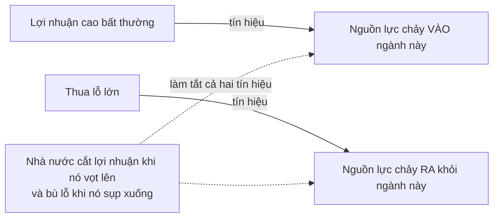
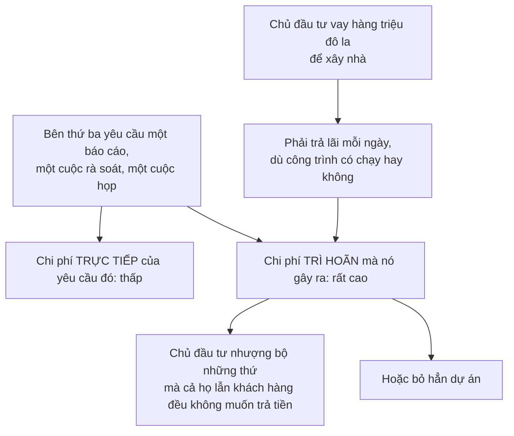

# Những vấn đề riêng của thời gian và rủi ro

> Rủi ro **không thể bị loại bỏ**, chỉ có thể bị chuyển đi. Một cá nhân hay
> một nhóm có thể được che chắn — nhưng chỉ bằng cách để người khác gánh. Với
> cả xã hội thì **không có "người khác" nào cả**.

## Bắt đầu từ chuyện bạn đã biết

Thời hầu hết mọi người làm nông, rủi ro hiện ra rõ mồn một: hạn hán, lũ lụt,
sâu bệnh — và trên hết là nỗi bất định về giá nông sản lúc thu hoạch.

Ngày nay phần lớn chúng ta là người làm công ăn lương, có mức lương thỏa thuận
trước, đôi khi có cả sự bảo đảm về chỗ làm. Rủi ro **không hề ít đi**. Chỉ là
nó đã được dồn sang người đã đưa ra những bảo đảm đó.

Sowell rút ra một hệ quả văn hóa thú vị từ điều này: trong một xã hội của
người làm công, thu nhập đến từ những biến động rủi ro thường bị nhìn là kỳ
quặc, thậm chí đáng ngờ. **"Đầu cơ" không phải một từ trìu mến**, và "lợi
nhuận trời cho" bị nhìn với ánh mắt nghi ngại — trong khi khoản thu nhập đều
đặn của một người làm công thì không.

## Vì sao "tỉ suất lợi nhuận bình thường" là một ý niệm nguy hiểm

Nhiều người cho rằng nhà nước nên can thiệp khi lợi nhuận doanh nghiệp lệch
khỏi mức "bình thường".

Sowell chỉ ra vấn đề: mức sinh lợi trên vốn đầu tư **về bản chất là một con số
biến thiên**, vì sự kiện là thứ không đoán trước được. Lợi nhuận của một doanh
nghiệp có thể vọt lên rồi lỗ chồng chất chỉ trong vài năm — đôi khi trong cùng
một năm.

Cả lợi nhuận **và** thua lỗ đều đang làm cùng một việc: chuyển nguồn lực từ
nơi ít được cần tới nơi được cần nhiều hơn. Xóa hai cực đó đi là xóa luôn
chính cơ chế.

## Khoảng cách giữa làm và được trả

Mọi hệ thống dựa vào phần thưởng cá nhân đều phải đối mặt với một thực tế:
**thời gian trôi qua giữa lúc làm việc và lúc nhận thưởng**, và khoảng thời
gian đó dài ngắn rất khác nhau.

| Công việc | Khoảng cách tới phần thưởng |
| --- | --- |
| Đánh giày | Được trả **ngay** sau khi đánh xong |
| Thăm dò dầu khí | **Một thập kỷ hoặc hơn** từ lúc bắt đầu tìm tới lúc xăng chảy ra ở cây xăng và bắt đầu hoàn lại chi phí đã bỏ ra nhiều năm trước |

Và con người cũng khác nhau về mức sẵn lòng chờ. Sowell kể về một nhà thầu
lao động đã xây được một việc kinh doanh có lãi chỉ nhờ nhận ra điều này: ông
ta thuê những người vốn chỉ làm việc thất thường để kiếm tiền tiêu ngay, những
người **không chịu làm từ sáng thứ Hai cho một khoản lương mãi chiều thứ Sáu
mới nhận**. Ông trả họ vào cuối **mỗi ngày**, rồi tự mình chờ tới thứ Sáu để
được chủ công trình thanh toán lại.

Ông đang bán đúng một thứ: **sự sẵn lòng chờ**.

Ở đầu kia, có người mua trái phiếu kỳ hạn **ba mươi năm** và chờ tới lúc nghỉ
hưu. Hầu hết chúng ta ở đâu đó giữa hai thái cực.

### Và điều kiện để tất cả chuyện này vận hành

Để vô số khoảng thời gian khác nhau ấy khớp được với vô số mức kiên nhẫn khác
nhau, phải có **một bảo đảm tổng quát rằng phần thưởng sẽ còn ở đó khi tới
hạn**.

Đó chính là **quyền tài sản**: quy định rõ ai có quyền tiếp cận độc quyền với
thứ gì, và với mọi lợi ích tài chính chảy ra từ thứ đó. Sowell nhấn mạnh rằng
việc bảo vệ quyền tài sản của cá nhân là **điều kiện tiên quyết** để cả xã hội
gặt được lợi ích kinh tế — chứ không phải một đặc quyền dành cho người có tài
sản.

## Rủi ro và bất định là hai thứ khác nhau

Một phân biệt kỹ thuật nhưng cực kỳ hữu dụng:

| | **Rủi ro** (risk) | **Bất định** (uncertainty) |
| --- | --- | --- |
| Đặc điểm | **Tính được** | **Không tính được** |
| Ví dụ | Chơi cò quay Nga: xác suất thua là **1 trên 6** | Làm một người bạn giận: không biết họ sẽ làm gì — có thể mất tình bạn, có thể bị trả đũa |
| Thị trường xử lý thế nào | Mua bảo hiểm, hoặc trích sẵn một khoản dự phòng tính được | **Không có công cụ nào** — người ta chỉ ngồi im |

Đây là lý do phân biệt này quan trọng về mặt kinh tế:

> Khi thị trường **bất định** về việc chính sách của nhà nước sẽ thay đổi ra
> sao trong suốt vòng đời của một khoản đầu tư phải mất nhiều năm mới hoàn
> vốn, nhiều nhà đầu tư sẽ **chọn không đầu tư** cho tới khi tình hình rõ ràng
> hơn.

Và khi nhà đầu tư, người tiêu dùng và những người khác cùng ngồi lên túi tiền
của mình, sự thiếu vắng nhu cầu đó **tác động xấu tới cả nền kinh tế**.

### Con số cho cái giá của bất định

Một bài báo năm **2013** đặt câu hỏi vì sao nhiều doanh nghiệp đang khỏe mạnh
và có tiền lại không bơm thêm vốn vào nền kinh tế để tạo việc làm, trong khi
đà phục hồi vẫn chậm. Câu trả lời của họ là: **bất định**.

Một nhóm tư vấn tài chính ước tính cái giá của sự bất định với kinh tế Mỹ là
**261 tỉ đô la** trong hai năm, và rằng lẽ ra đã có thêm khoảng **45.000 việc
làm mỗi tháng** — hơn **một triệu** việc làm trong hai năm — nếu không có tình
trạng bất định khi đó.

### Một ví dụ lịch sử tinh tế

Sowell dẫn tuyên bố nổi tiếng của Tổng thống Franklin D. Roosevelt trong Đại
khủng hoảng, đại ý rằng đất nước cần và đòi hỏi sự thử nghiệm táo bạo và bền
bỉ: hãy lấy một phương pháp ra thử; nếu thất bại thì thừa nhận thẳng thắn rồi
thử cách khác — nhưng trên hết, **hãy thử làm gì đó**.

Lập luận của Sowell: bất kể ưu điểm hay nhược điểm của từng chính sách cụ thể
được thử, **chính cách tiếp cận đó sinh ra sự bất định**. Khi không thể hình
thành kỳ vọng đáng tin về việc nhà nước sẽ đổi luật chơi lúc nào và theo hướng
nào, nhà đầu tư và người tiêu dùng trở nên dè dặt trong việc chi tiền. Ông chỉ
ra rằng **tốc độ lưu thông của tiền đã giảm** trong thời kỳ bất định của Đại
khủng hoảng, và một số người coi đó là một lý do khiến nền kinh tế mất một
khoảng thời gian kỷ lục mới hồi phục.

**Cần đánh nhãn cẩn thận ở đây.** Nguyên lý "bất định làm đầu tư chững lại" là
kinh tế học vững, được nhiều trường phái chấp nhận. Nhưng việc áp nó lên Đại
khủng hoảng để ngụ ý rằng **chính sách ứng phó** đã kéo dài khủng hoảng là một
**khẳng định thực nghiệm đang tranh cãi dữ dội** — có lẽ là cuộc tranh cãi lịch
sử lớn nhất trong kinh tế học vĩ mô. Nhiều nhà kinh tế học cho rằng vấn đề
ngược lại: can thiệp quá ít và quá muộn. Sowell trình bày một phía.

## "Thời gian là tiền bạc" — và ai nắm quyền trì hoãn

Đây là phần thực dụng nhất chương, và nó giải thích rất nhiều chuyện bạn thấy
ngoài đời.

> Ai có **khả năng trì hoãn** thì có khả năng **áp chi phí lên người khác** —
> đôi khi là những chi phí tàn khốc.

### Cơ chế

Và Sowell phát biểu quy tắc tổng quát:

> Ở bất cứ đâu mà **A trả một chi phí thấp để áp một chi phí cao lên B** thông
> qua sự trì hoãn, thì A có thể hoặc tống tiền B, hoặc chặn đứng những việc
> của B mà A không thích — hoặc cả hai.

### Ba ứng dụng

**Bộ máy hành chính chậm chạp.** Công chức thường nhận cùng mức lương dù làm
nhanh hay chậm. Ở những nước tham nhũng, công chức có thể tăng đáng kể thu
nhập bằng cách nhận hối lộ để **đẩy nhanh** mọi việc. Phạm vi quyền lực nhà
nước càng rộng và thủ tục càng nhiều, chi phí của trì hoãn càng lớn — và khoản
hối lộ đòi được càng béo bở.

**Báo cáo đánh giá tác động môi trường.** Chi phí trực tiếp của việc yêu cầu
một báo cáo có thể khá thấp so với chi phí trì hoãn mà nó gây ra dưới dạng lãi
vay chồng chất trên hàng triệu đô la đang nằm im. Và điểm sắc nhất: **ngay cả
khi báo cáo kết luận không có nguy cơ môi trường nào**, bản thân quá trình làm
báo cáo đã có thể gây thiệt hại kinh tế đủ lớn để buộc chủ đầu tư bỏ kế hoạch
xây ở cộng đồng đó — và khiến các chủ đầu tư khác tránh xa địa phương ấy về
sau.

**Quy định y tế với hàng nhập khẩu dễ hỏng.** Trái cây, rau, hoa. Một số quy
định y tế có chức năng chính đáng, cũng như một số quy định môi trường. Nhưng
cả hai đều có thể được dùng để chặn thứ mà bên thứ ba phản đối, bằng cách đơn
giản là **áp chi phí cao thông qua trì hoãn**.

Cần ghi nhận điều Sowell **có** nói rõ: ông không cho rằng các quy định này
vốn dĩ vô giá trị. Lập luận của ông là công cụ trì hoãn có thể bị dùng cho mục
đích khác hẳn mục đích công bố, và **chi phí của nó không xuất hiện trong bất
kỳ bảng ngân sách nào**.

### Ví dụ đắt nhất

Một tranh cãi năm **2004** về cách xây nhịp mới cho cầu Bay Bridge ở San
Francisco — cây cầu bị hư hại trong trận động đất năm **1989** — đã gây ra
những trì hoãn khiến bang California tốn thêm **81 triệu đô la** trước khi
việc thi công được nối lại vào năm **2005**.

Nhịp cầu mới hoàn thành và thông xe vào tháng **9/2013**: **24 năm** sau trận
động đất.

## Đổi tuổi hưu: một khoản vỡ nợ được gọi bằng tên khác

Ví dụ cuối, và là ví dụ Sowell dùng để cho thấy hiểu "thời gian là tiền bạc"
giúp bạn phòng vệ trước lời lẽ chính trị.

Chỉ bằng cách **thay đổi tuổi nghỉ hưu**, chính phủ có thể đẩy lùi ngày mà các
khoản hưu trí đã hứa vượt quá số tiền có để trả. Nâng tuổi hưu lên vài năm có
thể tiết kiệm **hàng trăm tỉ đô la**.

Sowell gọi đúng tên hành động đó: **một sự vi phạm hợp đồng**, một khoản vỡ nợ
của nhà nước với nghĩa vụ tài chính mà hàng triệu người đang trông cậy. Nhưng
với những ai không dừng lại để nghĩ rằng thời gian là tiền bạc, nó có thể được
giải thích bằng những ngôn từ hoàn toàn khác.

Và ông phân tích một cách diễn đạt cụ thể. Khi nhà nước thay đổi cả các thỏa
thuận lao động **tư nhân**, vấn đề thường được đóng khung chính trị thành việc
**chấm dứt "nghỉ hưu bắt buộc"** với lao động lớn tuổi.

Theo Sowell, trên thực tế hiếm khi có **bất kỳ yêu cầu bắt buộc nghỉ hưu**
nào. Thứ thật sự tồn tại chỉ là **một mốc tuổi mà quá đó doanh nghiệp không
còn cam kết tiếp tục thuê người đó** — và người đó vẫn hoàn toàn tự do đi làm
ở bất cứ đâu có người muốn thuê, thường là trong khi vẫn nhận lương hưu. Một
giáo sư rời Harvard có thể sang dạy ở một cơ sở của Đại học California; sĩ
quan quân đội có thể sang làm cho công ty sản xuất khí tài; kỹ sư hay nhà kinh
tế có thể làm cho công ty tư vấn.

Kết luận của ông: những người thạo hùng biện chính trị đã mô tả được một khoản
**vỡ nợ một phần của chính nhà nước** với nghĩa vụ trả lương hưu như thể đó là
một hành động giải cứu cao thượng dành cho người lao động lớn tuổi — thay vì
là một sự chuyển hàng tỉ đô la nghĩa vụ tài chính từ nhà nước sang các chủ sử
dụng lao động tư nhân.

## Vì sao chính trị gia thích chi phí trả sau

Ý khép lại phần này, và nó nối sang
[Phần V](../5-kinh-te-quoc-gia/):

Vì hậu quả kinh tế cần **thời gian** mới lộ ra, nhiều quan chức ở nhiều nước
đã có sự nghiệp chính trị thành công nhờ **tạo ra lợi ích hôm nay với chi phí
trả trong tương lai**. Các chương trình hưu trí do nhà nước tài trợ là ví dụ
kinh điển: rất nhiều cử tri hài lòng khi được bao phủ, trong khi chỉ một số ít
nhà kinh tế học và chuyên gia tính toán bảo hiểm chỉ ra vấn đề — và họ không
có phiếu bầu đáng kể.

## Điều cần nhớ

- **Rủi ro không bị loại bỏ, chỉ bị chuyển.** Với cả xã hội thì không có ai
  khác để chuyển sang.
- **Rủi ro tính được; bất định thì không.** Thị trường có công cụ cho cái thứ
  nhất và gần như không có gì cho cái thứ hai — nên bất định làm đầu tư đóng
  băng.
- **Quyền tài sản là điều kiện tiên quyết** để mọi khoảng cách giữa làm và
  hưởng có thể tồn tại.
- **Ai nắm quyền trì hoãn thì nắm quyền áp chi phí.** Chi phí trực tiếp thấp,
  chi phí trì hoãn cao — và chi phí trì hoãn không nằm trong ngân sách nào.
- Đổi điều khoản hợp đồng bằng luật là **vỡ nợ**, dù được gọi bằng tên gì.
- Hậu quả kinh tế lộ ra chậm, nên **chính trị luôn nghiêng về lợi ích trước,
  chi phí sau**.

## Tự kiểm tra

1. Vì sao câu "một nhóm được che chắn khỏi rủi ro" luôn kéo theo một câu hỏi
   tiếp theo?
2. Nhà thầu trả lương theo ngày rồi chờ tới thứ Sáu — ông ta đang bán thứ gì?
3. Phân biệt rủi ro với bất định, và nói vì sao thị trường xử lý hai thứ đó
   khác nhau.
4. Một báo cáo môi trường kết luận "không có nguy cơ nào". Vì sao nó vẫn có
   thể đã gây thiệt hại lớn?
5. Vì sao Sowell gọi việc nâng tuổi hưu là một khoản vỡ nợ?

---

Trước: [Cổ phiếu, trái phiếu và bảo hiểm](./02-co-phieu-trai-phieu-va-bao-hiem.md) ·
Tiếp: [Phần V — Kinh tế quốc gia](../5-kinh-te-quoc-gia/)
