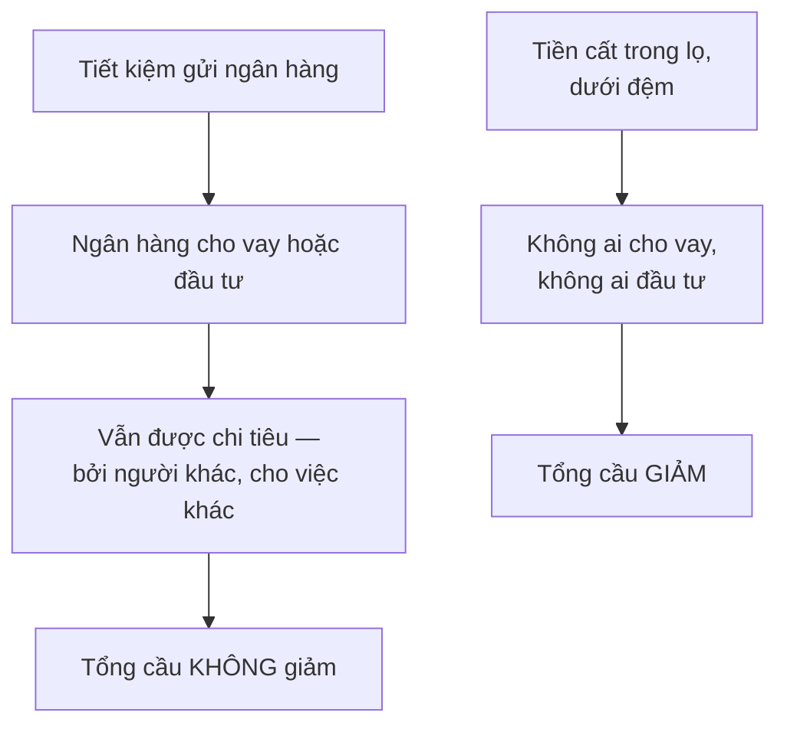
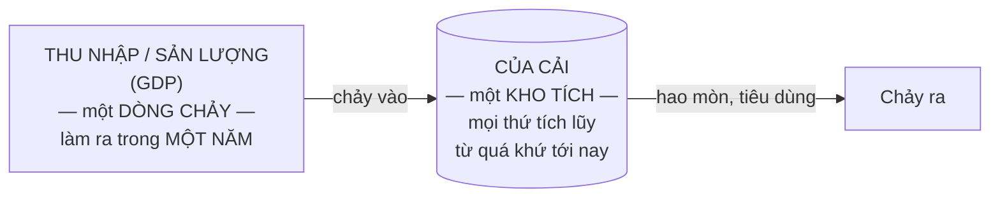

# Sản lượng quốc gia

> Cái bẫy lớn nhất khi chuyển từ một thị trường sang cả nền kinh tế có tên
> riêng: **ngụy biện hợp thành** — tưởng rằng điều đúng với một phần thì tự
> động đúng với toàn thể.

## Bắt đầu từ chuyện bạn đã biết

Trong một sân vận động, bất kỳ ai **đứng lên** cũng nhìn rõ hơn. Nhưng nếu
**tất cả** cùng đứng lên, không ai nhìn rõ hơn cả.

Trong một tòa nhà đang cháy, bất kỳ ai **chạy** cũng ra nhanh hơn đi bộ. Nhưng
nếu tất cả cùng chạy, đám đông chen lấn tạo ra nút thắt ở cửa, và một số người
mất mạng một cách không đáng.

Đó là lý do người ta tổ chức **diễn tập thoát hiểm**: để mọi người quen rời
khỏi tòa nhà một cách có trật tự, và nhờ vậy cứu được nhiều mạng hơn.

> Cốt lõi của ngụy biện hợp thành là nó **bỏ qua tương tác giữa các cá nhân** —
> thứ có thể khiến điều đúng với một người không còn đúng khi tất cả cùng làm.

## Ba ví dụ kinh tế của cùng một lỗi

**1. Tin sa thải và tỉ lệ thất nghiệp.** Suốt thập niên **1990**, tin tức ở Mỹ
tràn ngập chuyện cắt giảm nhân sự quy mô lớn — hàng chục nghìn người bị sa
thải ở vài công ty lớn, hàng trăm nghìn ở vài ngành. Nhưng cùng thập kỷ đó, tỉ
lệ thất nghiệp của **cả nền kinh tế** ở mức thấp nhất trong nhiều năm, và tổng
số việc làm toàn quốc lên mức **cao kỷ lục**.

Điều đúng với những mảng lên báo là **ngược lại** với điều đúng với toàn thể.

**2. Cộng dồn đầu tư cá nhân.** Khi một người mua trái phiếu chính phủ, đó là
một khoản đầu tư **với người đó**. Nhưng với cả nước, **không có thêm nhà máy,
cao ốc hay đập thủy điện nào** so với khi trái phiếu đó không được mua.

Thứ người đó mua là **quyền thu một khoản tiền từ người đóng thuế trong tương
lai**. Tài sản tăng thêm của người này chính là nghĩa vụ tăng thêm của người
đóng thuế — và với cả nước, hai vế **triệt tiêu nhau**.

**3. "Cứu việc làm".** Bất kỳ doanh nghiệp hay ngành nào cũng có thể được cứu
bằng một khoản can thiệp đủ lớn của nhà nước — trợ cấp, hoặc để cơ quan nhà
nước mua sản phẩm của ngành đó.

Tương tác bị bỏ qua: **mọi đồng nhà nước chi ra đều được lấy từ ai đó khác.**

Sowell nói rõ lỗi nằm ở đâu: **không** sai khi tin rằng có thể cứu việc làm
trong một ngành cụ thể. Cái sai là tin rằng đó là **khoản cứu ròng** cho cả
nền kinh tế.

## Nỗi sợ "sản xuất thừa" — và vì sao nó vô căn cứ

Một nỗi lo lặp đi lặp lại hơn hai thế kỷ: sản lượng ngày càng dồi dào sẽ tới
lúc **vượt quá khả năng hấp thụ** của nền kinh tế, hàng ế chất đống, sản xuất
co lại vĩnh viễn, thất nghiệp hàng loạt.

Sowell dẫn ra những người đã nói điều đó: một nhà kinh tế học Harvard giữa thế
kỷ 20 cho rằng nền kinh tế tư nhân đối mặt với bài toán khó là **bán được thứ
mà nó có thể sản xuất**; một tác giả ăn khách thập niên 1950–1960 lo về **mối
đe dọa dư thừa** hàng hóa; Tổng thống Roosevelt quy Đại khủng hoảng cho việc
sản phẩm do tay người làm ra đã vượt quá sức mua trong túi họ; và một cuốn
sách giáo khoa lịch sử phổ biến giải thích Đại khủng hoảng bằng **sản xuất
thừa**, gọi đó là thời của sự dư dật chứ không phải thiếu thốn.

Phản bác của Sowell là một đẳng thức, không phải một ý kiến:

> **Tổng thu nhập thực của mọi người trong nền kinh tế và tổng sản lượng quốc
> gia là cùng một thứ.** Chúng không tình cờ bằng nhau ở một thời điểm nào đó
> — chúng **luôn luôn bằng nhau**, vì đó là cùng một thứ nhìn từ hai phía: từ
> phía thu nhập và từ phía sản lượng.

Thu nhập thực được đo bằng thứ mà tiền mua được, tức hàng hóa và dịch vụ thật.
Sản lượng quốc gia cũng gồm hàng hóa và dịch vụ thật. Nên nỗi sợ rằng sản
lượng sẽ vượt quá thu nhập thực là **vô căn cứ về mặt logic** — hôm nay cũng
như ở những thế kỷ trước, khi sản lượng chỉ bằng một phần nhỏ hiện nay.

### Vậy thứ gì đã thật sự xảy ra?

Điều làm ý tưởng kia **nghe có vẻ hợp lý** là cả sản lượng lẫn thu nhập đều
dao động — đôi khi thảm khốc.

Điều người ta có thể thiếu **không phải thu nhập** để mua, mà là **ý muốn chi
tiêu hoặc đầu tư** số thu nhập đó.

Vì **thu nhập của mỗi người phụ thuộc vào chi tiêu của ai đó khác**, khi hàng
triệu người cùng do dự một lúc, chính sự do dự đó làm mọi thứ xấu đi thật —
tổng cầu rơi xuống dưới tổng thu nhập và tổng sản lượng, nên sản xuất và việc
làm bị cắt giảm.

Trong Đại khủng hoảng, sau khi hàng nghìn ngân hàng sụp đổ, nhiều người mất
lòng tin và **cất tiền ở nhà**. Khoản tiết kiệm đó **không được đầu tư**, nên
nó thật sự làm giảm tổng cầu.

Sowell cũng thành thật ghi nhận giới hạn của mình ở đây: **vì sao** những tình
huống đó xảy ra, **bao lâu** thì ổn lại, và **chính sách nào** là tốt nhất để
đối phó — đó là những điều mà **các trường phái kinh tế học khác nhau bất đồng
với nhau**. Điều họ đồng ý là tình huống này khác hẳn nỗi sợ về một nền kinh
tế bị chính sự dư thừa của mình làm nghẹt.

## Đại khủng hoảng, bằng con số

Chương này dùng Đại khủng hoảng làm ví dụ xuyên suốt, và các con số đáng nhớ:

| Chỉ số | Giá trị |
| --- | --- |
| **Cung tiền** ở Mỹ, trong 4 năm sau sụp đổ chứng khoán 1929 | giảm **một phần ba** |
| **Sản lượng thực** năm 1933 so với 1929 | thấp hơn **một phần tư** |
| **Sản lượng danh nghĩa** | từ **104 tỉ** đô la (1929) xuống **56 tỉ** (1933) |
| **Thất nghiệp** Mỹ | **3%** (1929) → **25%** (1933) |
| **Thất nghiệp Đức** | **34%** vào năm **1931** |
| Năm sản lượng thực trở lại mức 1929 | **1936** — bảy năm |

Và Sowell nêu hệ quả chính trị của con số Đức: mức thất nghiệp 34% năm 1931 đã
dọn đường cho thắng lợi bầu cử của đảng Quốc xã năm **1932**, đưa Hitler lên
nắm quyền năm **1933**.

### Cơ chế mà ông mô tả

Khi cung tiền giảm một phần ba, việc bán ngần ấy hàng hóa và thuê ngần ấy
người **ở mức giá cũ** — bao gồm cả mức lương cũ — trở thành bất khả.

Về lý thuyết, nếu giá và lương cũng **giảm ngay lập tức một phần ba**, lượng
tiền ít hơn vẫn mua được đúng ngần ấy, và sản lượng thực lẫn việc làm có thể
giữ nguyên: vẫn ngần ấy thứ được làm ra, chỉ với những con số nhỏ hơn trên
nhãn giá và trên phiếu lương.

Thực tế, **một nền kinh tế phức tạp không bao giờ điều chỉnh nhanh và hoàn hảo
tới vậy**. Nên thứ xảy ra là doanh số sụt mạnh, kéo theo sản xuất và việc làm.

**Đây là một cách giải thích Đại khủng hoảng, không phải cách giải thích duy
nhất.** Nó là cách nhìn của trường phái tiền tệ, gắn với Milton Friedman, và
nó có sức nặng thật. Nhưng các trường phái khác nhấn mạnh những yếu tố khác —
sự sụp đổ của đầu tư, bẫy thanh khoản, chế độ bản vị vàng, hay chính sách
thương mại. Sowell trình bày một phía như thể đó là toàn bộ câu chuyện.

## Đo sản lượng: GDP và cái bẫy của nó

**GDP** (Tổng sản phẩm quốc nội) là tổng mọi thứ được sản xuất **trong biên
giới** một nước.

**GNP** (Tổng sản phẩm quốc dân) là tổng hàng hóa và dịch vụ do **người của
nước đó** làm ra, bất kể họ hay nguồn lực của họ ở đâu.

Hai con số này đủ gần nhau tới mức người không phải nhà kinh tế học không cần
bận tâm: với nước Mỹ, chênh lệch giữa chúng **dưới 1%**.

### Phân biệt thật sự quan trọng: dòng chảy và tồn kho

Đây là chỗ người mới học hay nhầm nhất trong toàn bộ kinh tế học vĩ mô, và
đáng vẽ ra:

**GDP là một dòng chảy** (đo trong một năm). **Của cải là một kho tích** (đo
tại một thời điểm). Lẫn hai thứ này là nguồn gốc của vô số hiểu lầm — và bạn
sẽ gặp lại đúng cặp khái niệm này ở
[chương về thâm hụt và nợ công](./04-tai-chinh-cua-chinh-phu.md), nơi **thâm
hụt là dòng chảy còn nợ là kho tích**.

Nếu bạn chỉ nhớ một hình trong cả cuốn sách này, hãy nhớ hình trên.

### Vì sao điều đó quan trọng: nước Mỹ thời chiến

Ví dụ của Sowell làm rõ sự khác biệt. Một nước **có thể sống vượt mức sản xuất
hiện tại** bằng cách tiêu dần vào kho của cải tích lũy từ quá khứ.

Trong Thế chiến thứ hai, Mỹ **ngừng sản xuất ô tô dân dụng**, để các nhà máy
vốn làm xe chuyển sang làm xe tăng, máy bay và khí tài. Nghĩa là những chiếc
xe đang có cứ cũ dần mà không được thay thế. Tủ lạnh, chung cư và nhiều phần
khác của kho của cải quốc gia cũng vậy. Áp phích tuyên truyền thời đó khuyên
người dân dùng hết, dùng mòn, xoay xở với thứ đang có, hoặc chấp nhận không có.

Nhìn vào GDP thời chiến, sản lượng **rất cao**. Nhìn vào kho của cải, nó **đang
bị bào mòn**.

Sau chiến tranh, điều ngược lại xảy ra: giá trị thực của đồ dùng lâu bền trong
các hộ gia đình giảm trong khoảng **1944–1945**, rồi **tăng hơn gấp đôi trong
năm năm tiếp theo**, khi kho tài sản bền đã cạn kiệt thời chiến được bù lại —
một tốc độ tăng trưởng chưa từng có.

Đó là lý do một con số GDP đơn lẻ **không đủ** để nói một nước đang khá lên
hay đang ăn vào vốn.

## Chỗ cần thận trọng

**Ngụy biện hợp thành** là công cụ tư duy tốt nhất trong chương, và nó không
gây tranh cãi. Hãy mang nó theo.

Đẳng thức **tổng thu nhập = tổng sản lượng** cũng đúng, nhưng cần đọc chính
xác: nó đúng **theo định nghĩa kế toán**, và vì thế nó bác bỏ được nỗi sợ "sản
xuất thừa vĩnh viễn" — nhưng nó **không** bác bỏ được khả năng nền kinh tế mắc
kẹt ở mức sản lượng thấp trong thời gian dài. Chính Sowell thừa nhận điều đó
khi nói về việc người ta không muốn chi tiêu. Hai vế ấy cần được giữ tách
bạch, và trong văn bản gốc chúng hơi bị nhập nhằng.

Về nguyên nhân Đại khủng hoảng, hãy nhớ rằng bạn đang đọc **một trường phái**.

## Điều cần nhớ

- **Ngụy biện hợp thành**: điều đúng với một phần không tự động đúng với toàn
  thể, vì các phần **tương tác** với nhau.
- Cứu việc làm trong một ngành là có thật; cứu việc làm **ròng** cho cả nền
  kinh tế thì không — tiền phải lấy từ đâu đó.
- **Tổng thu nhập thực và tổng sản lượng là cùng một thứ** nhìn từ hai phía.
  Nên không có chuyện "sản xuất thừa vĩnh viễn".
- Tiết kiệm **gửi ngân hàng** không làm giảm tổng cầu; tiền **cất trong lọ**
  thì có.
- **GDP là dòng chảy, của cải là kho tích.** Đây là cặp khái niệm quan trọng
  nhất cần phân biệt trong toàn bộ phần này.

## Tự kiểm tra

1. Vì sao người ta diễn tập thoát hiểm, và điều đó liên quan gì tới kinh tế
   học?
2. Một người mua trái phiếu chính phủ. Vì sao với cả nước đó không phải là
   đầu tư thêm?
3. Vì sao "tổng sản lượng vượt tổng thu nhập" là điều không thể xảy ra?
4. Tiết kiệm có làm giảm tổng cầu không? Trả lời "tùy" và nói tùy vào cái gì.
5. Vì sao GDP cao thời chiến không có nghĩa là nước Mỹ đang giàu lên?

---

Trước: [Phần V](./README.md) ·
Tiếp: [Tiền tệ và hệ thống ngân hàng](./02-tien-te-va-he-thong-ngan-hang.md)
