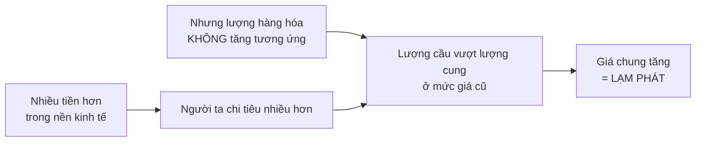
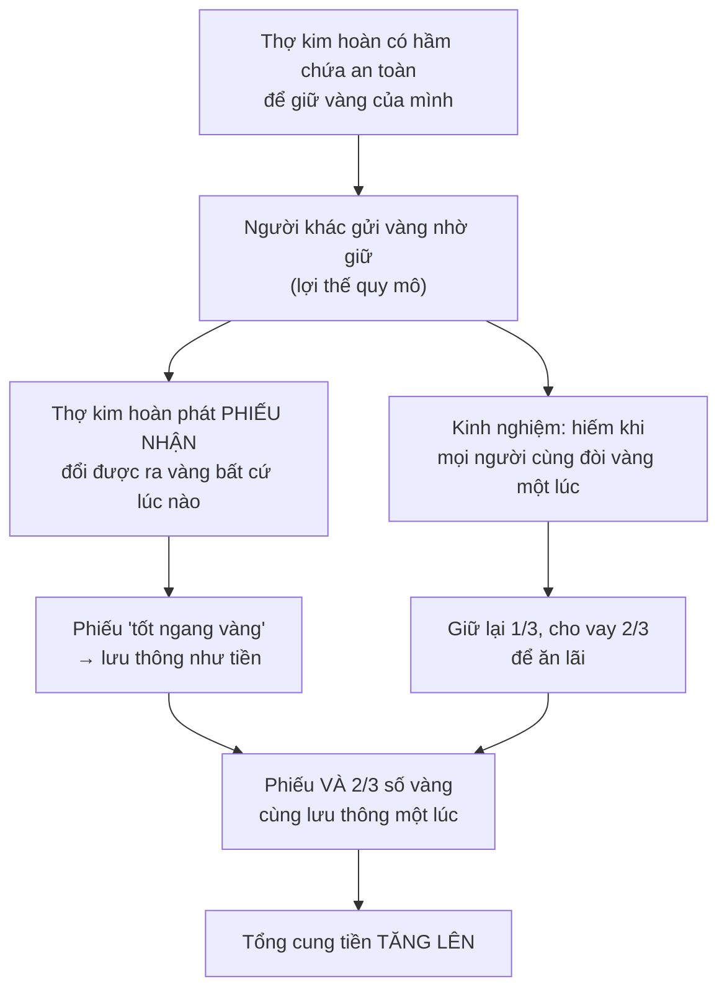
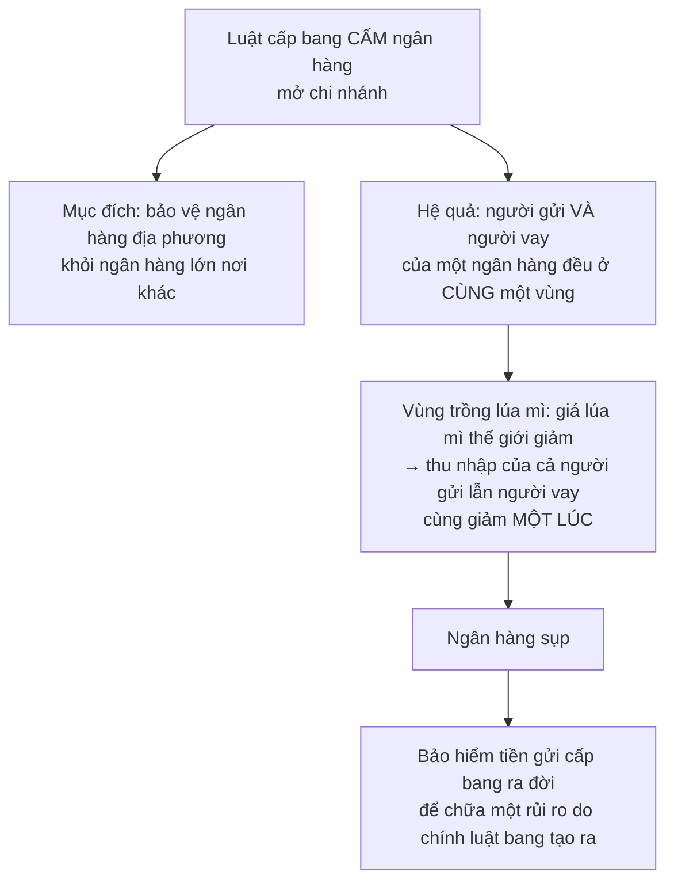

# Tiền tệ và hệ thống ngân hàng

> Tiền **không phải của cải** — nếu phải, chính phủ đã có thể làm mọi người
> giàu gấp đôi bằng cách in gấp đôi. Nhưng một hệ thống tiền tệ hỏng thì **phá
> hủy của cải thật**, và đó là lý do chương này quan trọng.

## Bắt đầu từ chuyện bạn đã biết

Bạn làm ghế và muốn ăn táo. Bạn khó mà đổi một chiếc ghế lấy một quả táo, và
bạn cũng không muốn ăn đủ số táo tương đương giá trị một chiếc ghế.

Nhưng nếu cả ghế lẫn táo đều đổi được sang một **thứ thứ ba** có thể chia nhỏ
ra, thì cả hai bên cùng làm ăn được. Tất cả những gì người ta cần là **thống
nhất với nhau** thứ đó là gì — và khi đã thống nhất, thứ đó **trở thành tiền**.

## Tiền đã từng là những thứ gì

Danh sách của Sowell cho thấy tiền là một **thỏa thuận**, không phải một chất
liệu:

| Nơi và thời | Thứ được dùng làm tiền |
| --- | --- |
| Nhiều xã hội | Vỏ sò, vàng, bạc |
| **Mỹ thời thuộc địa** | Phiếu gửi kho thuốc lá, khi tiền cứng khan hiếm |
| **Tây Phi thuộc Anh** thời đầu thuộc địa | Chai và thùng rượu gin — có khi chuyền tay nhiều năm mà không ai uống |
| **Trại tù binh** Thế chiến thứ hai | Thuốc lá trong các gói hàng cứu trợ — và ở đó xuất hiện đủ cả lãi suất lẫn hiện tượng tiền xấu đuổi tiền tốt |
| **Liên Xô** thời đầu hỗn loạn | Bột mì, ngũ cốc, muối. Muối hoặc bánh mì nướng có thể mua được gần như mọi thứ |
| **Đảo Yap**, Micronesia | Những khối đá hình vành khuyên — khối lớn nhất **đường kính gần 4 mét**, rõ ràng không thể mang đi. Thứ lưu thông là **quyền sở hữu** chúng |

Chi tiết về đảo Yap đáng dừng lại: hệ thống tiền tệ sơ khai ấy vận hành **đúng
như hệ thống hiện đại nhất hôm nay**, nơi quyền sở hữu tiền đổi chủ tức thì
qua chuyển khoản điện tử mà không đồng tiền vật chất nào di chuyển.

> Thứ khiến tất cả những vật đó trở thành tiền là: **người ta chịu nhận chúng**
> để đổi lấy hàng hóa và dịch vụ — thứ mới thật sự là của cải.

## Tiền không phải của cải, nhưng mất nó thì mất của cải thật

Với một **cá nhân**, tiền tương đương của cải — nhưng chỉ vì những người khác
sẽ đưa hàng hóa thật để đổi lấy nó. Với **cả nền kinh tế**, tiền chỉ là một
vật nhân tạo dùng để chuyển giao của cải và tạo động lực làm ra của cải.

Vậy nếu tiền chỉ là dầu bôi trơn, mất nó có sao không? **Có** — bánh xe chạy
tốt hơn nhiều khi được bôi trơn.

Ví dụ của Sowell: năm **2002**, hệ thống tiền tệ Argentina sụp đổ. Hoạt động
kinh tế suy giảm, và người ta quay lại **hàng đổi hàng** qua các câu lạc bộ
gọi là *trueque* — nơi một câu lạc bộ gom nguồn lực để "mua" khoảng 100 kg
bánh mì từ một lò bánh địa phương, đổi lấy nửa tấn củi mà họ đã đổi được trước
đó, và người thợ làm bánh dùng củi ấy để đốt lò. Ở khu phố giàu có hơn thì đồ
sứ cổ được đem đổi lấy thịt bò hảo hạng.

Điều tương tự từng xảy ra ở Mỹ: trong Đại khủng hoảng, khi cung tiền co lại
mạnh, ước tính có khoảng **150 hệ thống hàng đổi hàng hoặc phiếu thay tiền**
hoạt động ở **ba mươi bang**.

Và ở chiều cực đoan: nước Pháp thập niên **1790** từng ra luật quy định **án
tử hình** cho ai từ chối bán hàng để lấy tiền. Việc chính phủ in ra tiền
**không** bảo đảm rằng người ta sẽ nhận nó.

## Lạm phát

**Lạm phát là mức giá chung tăng lên** — và nó tăng vì đúng cái lý do khiến
giá một món hàng cụ thể tăng: **lượng cầu vượt lượng cung ở mức giá hiện tại**.

Quan hệ này đã được quan sát suốt nhiều thế kỷ, và Sowell dẫn hai ví dụ cổ:

- Khi **Alexander Đại đế** bắt đầu tiêu số của cải cướp được từ Ba Tư, **giá
  cả ở Hy Lạp tăng lên**.
- Khi người **Tây Ban Nha** chở lượng vàng khổng lồ từ các thuộc địa Tây bán
  cầu về, mức giá tăng không chỉ ở Tây Ban Nha mà **khắp châu Âu** — vì họ
  dùng phần lớn số của cải đó để mua hàng nhập khẩu từ các nước châu Âu khác,
  và vàng chảy sang những nước ấy làm tăng cung tiền toàn lục địa.

### Vàng "bảo chứng" cho tiền giấy: một cách nói gây hiểu lầm

Đây là chỗ Sowell sửa một hiểu lầm phổ biến, và ông sửa rất gọn.

Vấn đề lớn nhất của tiền do nhà nước tạo ra là **những người điều hành nhà
nước luôn đứng trước cám dỗ tạo thêm tiền và tiêu nó**. Từ các vị vua thời cổ
tới chính trị gia hiện đại, chuyện này lặp lại suốt nhiều thế kỷ.

Vì thế nhiều nước thích dùng vàng, bạc hoặc thứ gì đó **vốn dĩ hạn chế về
nguồn cung** làm tiền: đó là cách **tước bớt quyền của nhà nước** trong việc
mở rộng cung tiền tới mức gây lạm phát.

> Nói tiền giấy được vàng "bảo chứng" chỉ gây hiểu lầm nếu ta tưởng tượng rằng
> **giá trị của vàng được chuyển sang tờ giấy**. Điều thật sự xảy ra là vàng
> **giới hạn lượng tiền giấy có thể phát hành**.

Đồng đô la Mỹ từng đổi được ra vàng theo yêu cầu, và việc đó **chấm dứt năm
1933**. Từ đó, nước Mỹ chỉ có tiền giấy, mà nguồn cung chỉ bị giới hạn bởi
điều mà giới chức nghĩ là họ có thể làm được về mặt chính trị.

Sowell dẫn chính **John Maynard Keynes** — không phải một đồng minh tự nhiên
của ông — để chỉ ra mức nguy hiểm của quyền lực đó: Keynes viết rằng bằng một
quá trình lạm phát liên tục, chính phủ có thể **tịch thu một phần quan trọng
của cải của công dân mình một cách bí mật và không ai thấy**.

### Con số cho thấy nó âm thầm tới mức nào

Một bài báo năm **2013** chỉ ra rằng vào năm **1960**, một đồng đô la mua được
**gấp sáu lần** lượng hàng hóa so với ngày đó.

Nghĩa là: người nào tiết kiệm bằng tiền mặt từ năm 1960 đã bị lấy mất **hơn
bốn phần năm** giá trị khoản tiết kiệm của mình — một cách lặng lẽ.

Và với nước Mỹ thì đó còn là mức nhẹ. Lạm phát **hai chữ số** trong một năm đã
đủ gây báo động chính trị ở Mỹ, trong khi nhiều nước ở Mỹ Latin và Đông Âu đã
trải qua những giai đoạn lạm phát năm ở mức **bốn chữ số**.

### Tiền không chỉ là tiền nhà nước in

Vì tiền là bất cứ thứ gì người ta chấp nhận, nên **thẻ tín dụng, thẻ ghi nợ,
séc** đều vận hành tương tự. Ngay cả **lời hứa** cũng có thể làm việc đó, khi
người hứa được tin cậy cao — giấy nhận nợ của những thương nhân uy tín từng
được chuyền tay như tiền.

Năm **2003**, số giao dịch mua sắm bằng thẻ tín dụng hoặc thẻ ghi nợ đã **nhiều
hơn** bằng tiền mặt.

Điều này dẫn tới một hệ quả quan trọng mà người mới học hay bỏ qua:

> Tổng cầu được tạo ra **không chỉ** bởi tiền nhà nước phát hành, mà còn bởi
> tín dụng từ nhiều nguồn khác. Cho nên **việc thanh lý tín dụng, vì bất cứ lý
> do gì, cũng làm giảm tổng cầu** y như khi cung tiền chính thức co lại.

### Khi người ta chọn tiền của nước khác

Một cách kiểm chứng lòng tin rất thực tế:

- Thập niên **1780**, tiền do Ngân hàng Bắc Mỹ phát hành được chấp nhận rộng
  rãi hơn tiền chính thức của chính phủ khi đó.
- Từ cuối thế kỷ **10**, tiền Trung Quốc được ưa chuộng hơn tiền Nhật **ngay
  tại Nhật**.
- **Bolivia, 1985**: giữa thời siêu lạm phát đồng peso, phần lớn tài khoản tiết
  kiệm được giữ bằng **đô la**.
- **Zimbabwe, 2007**: đồng rand Nam Phi thay thế đồng đô la Zimbabwe gần như
  vô giá trị.
- **Nội chiến Mỹ** giai đoạn sau: người miền Nam có xu hướng dùng tiền do
  Washington phát hành thay vì tiền của chính quyền Liên minh miền Nam của họ.

Và vàng vẫn được ưa chuộng hơn nhiều đồng tiền quốc gia, dù vàng **không sinh
lãi** còn tiền gửi ngân hàng thì có. Khoảng **80%** nhu cầu vàng đến từ việc
làm trang sức, nhưng biến động giá của nó phản ánh **mức độ lo sợ lạm phát**.
Đó là lý do một cuộc khủng hoảng chính trị hay quân sự lớn có thể đẩy giá vàng
vọt lên.

## Giảm phát: vấn đề ngược lại, và cũng tệ

Người mới học thường nghĩ giá giảm là tin tốt. Chương này giải thích vì sao
không hẳn.

**Giảm phát** là sức mua của đồng tiền **tăng lên**. Nghe hay — cho tới khi
bạn nhớ rằng các nghĩa vụ pháp lý được ghi bằng **số tiền cố định**: khoản vay
thế chấp, hợp đồng thuê, hợp đồng kinh tế.

> Khi giá chung giảm, **con nợ trên thực tế đang nợ nhiều hơn** — tính bằng
> sức mua thật — so với thứ họ đã đồng ý trả lúc vay.

### Câu chuyện nông dân Mỹ cuối thế kỷ 19

Thời hoàng kim của bản vị vàng, mỗi khi sản lượng hàng hóa tăng nhanh hơn
nguồn cung vàng thì giá có xu hướng **giảm**. Mức giá trung bình ở Mỹ **cuối
thế kỷ 19 thấp hơn đầu thế kỷ**.

Và giảm phát, cũng như lạm phát, **không tác động đều lên mọi thứ**. Giá thứ
nông dân **bán** giảm nhanh hơn giá thứ họ **mua**:

| Thời điểm | Giá lúa mì mỗi giạ |
| --- | --- |
| Suốt nhiều thập kỷ trước đó | quanh **1 đô la** |
| Cuối **1892** | dưới **90 xu** |
| **1893** | khoảng **75 xu** |
| **1894** | chỉ còn **60 xu** |
| Giữa mùa đông **1895–1896** | **dưới 50 xu** |

Trong khi đó, khoản trả nợ thế chấp của họ **giữ nguyên bằng tiền** — nên tăng
lên về giá trị thực, và phải trả từ nguồn thu nhập nông nghiệp chỉ còn **một
nửa hoặc ít hơn** so với lúc vay.

Đó là bối cảnh của chiến dịch tranh cử tổng thống năm **1896** của William
Jennings Bryan với yêu cầu chấm dứt bản vị vàng, đỉnh điểm là bài diễn văn nổi
tiếng của ông về việc không được đóng đinh loài người lên một cây thánh giá
bằng vàng. Vào thời điểm dân số nông thôn còn đông hơn thành thị, ông **thua
sít sao** trước William McKinley.

Và thứ thật sự làm dịu sức ép chính trị không phải chính trị, mà là **địa
chất**: những mỏ vàng mới được phát hiện ở **Nam Phi, Úc và Alaska**, làm giá
cả tăng lần đầu tiên sau hai mươi năm — giá nông sản tăng đặc biệt nhanh.

Kết luận cân bằng của Sowell về bản vị vàng đáng ghi nhận: nó **không ngăn
được** lạm phát hay giảm phát, nhưng nó **hạn chế khả năng chính trị gia thao
túng cung tiền**, và nhờ vậy giữ cả hai trong biên độ hẹp hơn. Chính những
khám phá vàng lớn ở California, Nam Phi và Yukon thế kỷ 19 đã đẩy giá lên mức
lạm phát.

## Vì sao có ngân hàng

Lý do đầu tiên rất đời thường: **lợi thế quy mô trong việc canh giữ tiền**.

Nếu mọi nhà hàng và cửa hàng đều giữ toàn bộ tiền thu được trong phòng sau,
tội phạm đã cướp nhiều hơn rất nhiều. Ngân hàng có thể đầu tư vào hầm chứa,
bảo vệ và xe chở tiền bọc thép — rẻ hơn tính trên mỗi đồng được canh giữ.

Sowell đưa ra một chi tiết thú vị về mức độ hiệu quả của lớp cuối cùng: ngân
hàng tư nhân vẫn bị cướp đôi khi, nhưng **chưa có Ngân hàng Dự trữ Liên bang
nào từng bị cướp**. Có thời điểm, gần **một nửa** toàn bộ số vàng thuộc sở hữu
của chính phủ Đức được cất tại Ngân hàng Dự trữ Liên bang New York.

### Việc thứ hai: giữ dòng tiền của doanh nghiệp không đứt

Thu nhập của doanh nghiệp **không đoán trước được** và có thể lật qua lật lại
giữa lãi và lỗ. Nhưng nghĩa vụ của họ — trả lương đúng kỳ, trả tiền điện, trả
nhà cung cấp — thì phải đều đặn, bất kể tháng này lãi hay lỗ.

Ngân hàng là nguồn tiền lấp vào khoảng chênh đó, thường dưới dạng một **hạn
mức tín dụng** mà doanh nghiệp rút ra khi cần và hoàn lại khi có lãi.

Về lý thuyết, mỗi doanh nghiệp có thể tự để dành từ lúc thuận lợi để bù lúc
khó khăn. Nhưng ở đây lại là **lợi thế quy mô và gộp chung rủi ro**: một quỹ
trung tâm lớn phục vụ nhiều doanh nghiệp thì chi phí thấp hơn, nên **cả ngân
hàng lẫn khách hàng đều có lợi** khi rủi ro được chuyển tới nơi gánh nó rẻ
hơn.

### Việc thứ ba: cho người lạ dùng tiền của người lạ

> Hệ thống ngân hàng là một phần của mạng lưới trung gian tài chính cho phép
> **hàng triệu người tiêu số tiền thuộc về hàng triệu người xa lạ**.

Quy mô của mạng lưới đó, qua một ví dụ: công ty thẻ tín dụng dẫn đầu tạo thành
một mạng gồm **14.800** ngân hàng và định chế tài chính cung cấp tiền cho các
giao dịch của hơn **100 triệu** người dùng thẻ, mua hàng từ **20 triệu** cửa
hàng khắp thế giới.

Và cách kiểm chứng tầm quan trọng của nó là nhìn nơi nó **thiếu**: những nước
không có đủ trung gian tài chính đủ hiểu biết, đủ kinh nghiệm và đủ đáng tin
để người lạ dám giao tiền cho người lạ thường **nghèo, kể cả khi giàu tài
nguyên**.

## Ngân hàng dự trữ một phần: tiền được tạo ra như thế nào

Đây là phần kỹ thuật nhất chương, và Sowell giải thích nó bằng lịch sử — cách
dễ hiểu nhất.

Từ đó ra đời hai đặc trưng của ngân hàng hiện đại: **chỉ giữ một phần dự trữ**
so với tiền gửi, và **cộng thêm vào tổng cung tiền**.

Vì một phần tín dụng ngân hàng lại được gửi vào **ngân hàng khác**, quá trình
mở rộng lặp lại thêm nhiều vòng — nên tổng tín dụng ngân hàng trong nền kinh
tế thường **vượt toàn bộ tiền mặt** mà nhà nước phát hành.

### Vì sao hệ thống này chạy được

Vì cả hệ thống **chưa bao giờ** bị yêu cầu chi tiền mặt để chi trả cho toàn bộ
séc cùng lúc. Các ngân hàng **bù trừ** cho nhau:

Giả sử ngân hàng A nhận được số séc trị giá **1 triệu** đô la do khách của
ngân hàng B viết. A không đòi B một triệu. A đối chiếu với số séc mà khách của
chính A đã viết và rơi vào tay B — giả sử là **1,2 triệu**. Hai bên chỉ thanh
toán **phần chênh 200.000 đô la**.

Hơn hai triệu đô la giao dịch được giải quyết bằng 200.000 đô la thật.

Đó cũng là lý do vì sao **niềm tin** là thành phần cốt yếu — và vì sao khi nó
mất, mọi thứ sụp rất nhanh.

## Nhà nước, rủi ro ngân hàng, và một bài học lịch sử sắc

Phần này là lập luận trung tâm của Sowell về ngành ngân hàng, và nó đáng hiểu
kỹ vì nó rất cụ thể.

### Chi nhánh bị cấm → rủi ro bị dồn cục

Bằng chứng lịch sử Sowell đưa ra rất mạnh:

- Trong thập niên **1920** và đặc biệt trong Đại khủng hoảng, hàng nghìn ngân
  hàng Mỹ phá sản — và chúng **tập trung áp đảo** ở các cộng đồng nhỏ thuộc
  những bang **có luật cấm mở chi nhánh**.
- Ngân hàng Mỹ lớn có nhiều chi nhánh thì **hiếm khi sụp**, kể cả trong Đại
  khủng hoảng.
- Và ví dụ đối chứng thuyết phục nhất: ở **Canada**, **không một ngân hàng nào
  phá sản** trong giai đoạn hàng nghìn ngân hàng Mỹ sụp đổ — dù chính phủ
  Canada khi đó **không hề có bảo hiểm tiền gửi**. Canada có **10 ngân hàng với
  3.000 chi nhánh** trải từ bờ này sang bờ kia, nên rủi ro được phân tán qua
  nhiều vùng có điều kiện kinh tế khác nhau.

Bảo hiểm tiền gửi liên bang, lập năm **1935**, đã chấm dứt những cuộc rút tiền
hàng loạt tai hại — nhưng theo Sowell, nó **đang giải quyết một vấn đề chủ yếu
do các can thiệp khác của nhà nước tạo ra**.

Đây là một lập luận lịch sử tốt và được nhiều nhà kinh tế học chấp nhận rộng
rãi. Hãy giữ nó.

### Và nó kéo theo rủi ro đạo đức

Đúng như [chương bảo hiểm](../4-thoi-gian-va-rui-ro/02-co-phieu-trai-phieu-va-bao-hiem.md)
đã nói: người được bảo hiểm hành xử liều hơn. Với định chế tài chính, động lực
đó còn **mạnh hơn**, vì đầu tư rủi ro hơn thường trả lãi cao hơn. Nhà nước hạn
chế bớt bằng quy định — nhưng **kìm nén rủi ro không làm động lực gây rủi ro
biến mất**.

### Khi nhà nước chỉ đạo dòng vốn

Sowell nêu ba ví dụ cùng một dạng:

- **Ấn Độ**: tỉ lệ tiết kiệm trên sản lượng cao hơn Mỹ nhiều, nhưng dân chúng
  không tin ngân hàng tới mức lượng **vàng do cá nhân nắm giữ cao nhất thế
  giới** — phần của cải đó không được dùng để tài trợ đầu tư. Trong phần tiết
  kiệm có vào hệ thống ngân hàng do nhà nước chi phối, **70%** được cho chính
  phủ hoặc doanh nghiệp nhà nước vay.
- **Trung Quốc**: tỉ lệ tiết kiệm còn cao hơn Ấn Độ; **90%** số đó chảy vào
  ngân hàng quốc doanh, rồi được cho vay với lãi suất thấp, trên thực tế **trợ
  cấp cho doanh nghiệp nhà nước** vốn có tỉ suất sinh lợi thấp hoặc đang lỗ.
- **Hậu cộng sản Đông Âu**: tới năm **2006**, người nước ngoài sở hữu hơn một
  nửa tài sản ngân hàng ở Cộng hòa Séc, Slovakia, Romania, Estonia, Litva,
  Hungary, Bulgaria, Ba Lan và Latvia — từ **60%** ở Latvia tới **gần như toàn
  bộ** ở Estonia.

Lập luận của ông: nếu ngân hàng tư nhân được hoạt động tự do, họ sẽ cho vay ở
nơi sinh lợi cao nhất một cách an toàn, rồi trả lãi cao hơn cho người gửi, hút
tiết kiệm khỏi ngân hàng quốc doanh. Kết quả sẽ là **tiết kiệm nhiều hơn và
phân bổ hiệu quả hơn**. Nhưng điều đó cũng tạo ra **nhiều đau đầu hơn cho quan
chức** đang cố giữ cho ngân hàng và doanh nghiệp nhà nước khỏi phá sản — và
người làm nghề công chức khó mà tự nguyện chịu thiệt cho sự nghiệp của mình
vì lợi ích của người khác.

## Chỗ cần thận trọng nhất trong chương

Sowell khép chương bằng lời giải thích của ông cho khủng hoảng tài chính
**2008**: ông cho rằng **Đạo luật Tái đầu tư Cộng đồng năm 1977**, được đẩy
mạnh trong thập niên **1990** nhằm giúp người thu nhập thấp mua nhà, đã tạo
sức ép và đe dọa buộc ngân hàng **hạ chuẩn xét duyệt khoản vay** để đạt chỉ
tiêu của nhà nước — dẫn tới cho vay rủi ro hơn, tỉ lệ vỡ nợ cao hơn, và cuối
cùng là sự sụp đổ của các ngân hàng cùng các công ty Phố Wall nắm tài sản dựa
trên thế chấp.

**Đây là khẳng định thực nghiệm gây tranh cãi mạnh nhất trong cả cuốn sách, và
nó không phải quan điểm đa số.** Phần lớn nghiên cứu về nguyên nhân khủng
hoảng 2008 không ủng hộ cách giải thích này, vì hai lý do có thể kiểm chứng:
phần lớn các khoản vay dưới chuẩn được phát hành bởi những tổ chức **không
thuộc phạm vi điều chỉnh** của đạo luật đó, và các khoản vay thuộc phạm vi
điều chỉnh của nó nhìn chung có tỉ lệ vỡ nợ **thấp hơn**. Những cách giải
thích được ủng hộ rộng rãi hơn tập trung vào chứng khoán hóa, các tổ chức xếp
hạng tín nhiệm, đòn bẩy quá mức ở các ngân hàng đầu tư, và chính **rủi ro đạo
đức** mà Sowell mô tả rất hay ở phần trước.

Điều đáng chú ý: công cụ phân tích của chính ông — rủi ro đạo đức, phân tán
rủi ro, động lực của người được bảo lãnh — **giải thích cuộc khủng hoảng đó
rất tốt**. Ông chỉ không quay chúng về hướng đó.

## Điều cần nhớ

- **Tiền là một thỏa thuận**, không phải một chất liệu. Vỏ sò, thuốc lá, đá
  vành khuyên — thứ gì người ta chịu nhận thì thứ đó là tiền.
- Tiền **không phải của cải** với cả nước, nhưng **hệ thống tiền tệ hỏng thì
  phá hủy của cải thật**.
- **Lạm phát**: nhiều tiền hơn mà không nhiều hàng hơn. **Giảm phát**: con nợ
  đột nhiên nợ nhiều hơn thứ họ đã đồng ý trả.
- Vàng không "truyền giá trị" sang tiền giấy — nó chỉ **giới hạn lượng tiền
  giấy được in**.
- **Ngân hàng dự trữ một phần tạo ra tiền**, và hệ thống chạy được nhờ bù trừ
  lẫn nhau — tức là nhờ **niềm tin**.
- Cấm mở chi nhánh làm rủi ro **dồn cục**. Canada không mất ngân hàng nào mà
  chẳng cần bảo hiểm tiền gửi.

## Tự kiểm tra

1. Đá trên đảo Yap giống chuyển khoản điện tử hiện đại ở điểm nào?
2. Vì sao nói vàng "bảo chứng" cho tiền giấy là cách nói gây hiểu lầm?
3. Vì sao giảm phát lại là tin xấu với người đang vay nợ?
4. Ngân hàng tạo thêm tiền bằng cách nào, dù không được in tiền?
5. Vì sao Canada không mất ngân hàng nào trong khi hàng nghìn ngân hàng Mỹ phá
   sản — dù Canada không có bảo hiểm tiền gửi?

---

Trước: [Sản lượng quốc gia](./01-san-luong-quoc-gia.md) ·
Tiếp: [Chức năng của chính phủ](./03-chuc-nang-cua-chinh-phu.md)
