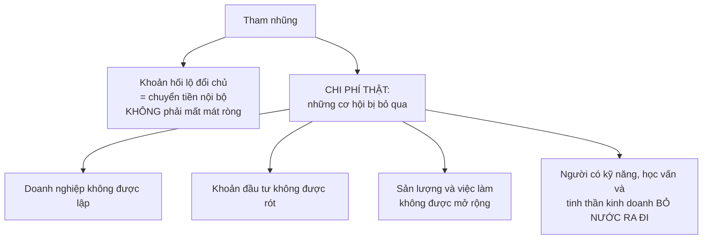
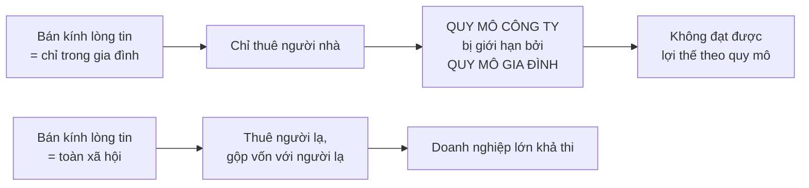
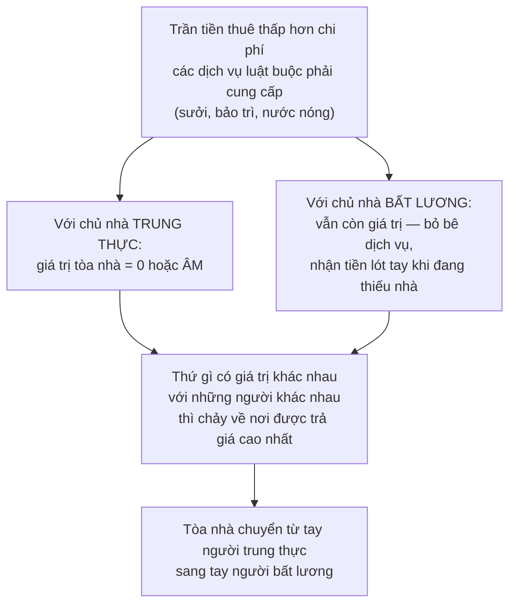
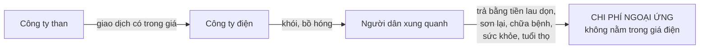

# Chức năng của chính phủ

> Thị trường **không tồn tại trong chân không**. Nó cần một khung luật lệ và
> người đủ thẩm quyền thi hành. Chương này nói về những việc mà gần như ai
> cũng đồng ý là **chỉ nhà nước mới làm được** — và vì sao chúng đáng giá tới
> vậy.

## Bắt đầu từ chuyện bạn đã biết

Khi bạn mua một món hàng online, bạn tin rằng nếu người bán lừa mình thì có
nơi để kiện. Khi bạn ký hợp đồng lao động, bạn tin rằng nó có hiệu lực. Khi
bạn mua một cân gạo, bạn tin rằng "một cân" nghĩa là một cân.

Không có niềm tin nào trong số đó là tự nhiên mà có.

## "Không làm gì" là một thành tựu mất hàng thế kỷ

Khi nhà nước giới hạn vai trò kinh tế của mình ở việc thi hành luật và hợp
đồng, có người nói rằng như vậy là **"không làm gì"** cho nền kinh tế.

Sowell phản bác rất gọn: thứ bị gọi là "không làm gì" ấy thường **mất hàng thế
kỷ mới xây dựng được** — một khung pháp luật đáng tin cậy, mà thiếu nó thì
ngay cả một kho tài nguyên khổng lồ cũng không biến thành sản lượng và thịnh
vượng tương ứng.

Cách tốt nhất để hiểu giá trị của nó, như thường lệ trong cuốn sách này, là
nhìn nơi nó **vắng mặt**.

## Tham nhũng: cái giá thật không phải là khoản hối lộ

### Những gì nó trông như thế nào

| Nơi | Điều được ghi nhận |
| --- | --- |
| **Congo** | Giàu khoáng sản nhưng nghèo về mọi mặt khác. Ở sân bay thủ đô Kinshasa, đường băng xấu tới mức máy bay lăn bánh như chạy trên tà vẹt; người quản lý **thu thêm tiền để bật đèn đường băng ban đêm**; hành khách sắp bay có thể phải qua **nhiều lớp hối lộ** trước khi lên máy bay. Phi hành đoàn không dám nghỉ đêm tại đó |
| **Bolivia** | Cảnh sát bị phanh phui dính líu buôn ma túy và xe trộm cắp, nạn con ông cháu cha trong lực lượng, và thu phí trái phép. Những sĩ quan hưởng đồng lương ít ỏi bị phát hiện sống trong biệt thự |
| **Ai Cập** | Khi một doanh nhân giàu có và có quan hệ chính trị bị tuyên án tử vì thuê người giết một người tình cũ, dân chúng **sửng sốt và hài lòng** — vì đó là loại người mà người Ai Cập từ lâu vẫn mặc định là nằm ngoài tầm với của pháp luật |
| **Cameroon** | Lệ phí chính thức để lập một doanh nghiệp nhỏ — chưa tính hối lộ — **lớn hơn nhiều lần thu nhập cả năm** của một người trung bình. Mua bán bất động sản tốn gần **một phần năm** giá trị tài sản. Để tòa cưỡng chế một hóa đơn chưa thanh toán mất gần **hai năm**, tốn hơn **một phần ba** giá trị hóa đơn, và cần **58 thủ tục** riêng biệt |

Và một con số so sánh gọn ghẽ: khảo sát của Ngân hàng Thế giới cho thấy số
ngày cần để khởi sự một doanh nghiệp mới dao động từ **dưới 10 ngày** ở
Singapore thịnh vượng tới **155 ngày** ở Congo nghèo khó.

### Cái giá thật nằm ở đâu

Đây là phân tích sắc nhất của phần này:

> Chi phí của tham nhũng **không giới hạn ở các khoản hối lộ được thu** — vì
> bản thân chúng chỉ là **chuyển tiền nội bộ**, không phải sự sụt giảm ròng
> của cải quốc gia.

Đây lại chính là định nghĩa từ
[chương 4](../1-gia-ca-va-thi-truong/04-nhin-lai-toan-canh-ve-gia.md): **chi
phí là những cơ hội bị bỏ qua**.

Một nghiên cứu của Ngân hàng Thế giới kết luận rằng **xuyên các quốc gia, có
bằng chứng mạnh cho thấy mức tham nhũng cao hơn đi kèm với tăng trưởng thấp
hơn và thu nhập bình quân đầu người thấp hơn**. Ba nước bị xếp tham nhũng nhất
khi đó — Haiti, Bangladesh và Nigeria — đều nghèo ở mức không xã hội công
nghiệp hiện đại nào có.

### Nước Nga như một trường hợp kéo dài

Sowell theo dõi cùng một vấn đề qua ba chế độ khác nhau, và đó là phần thuyết
phục:

- Thời **Nga hoàng** công nghiệp hóa cuối thế kỷ 19 đầu thế kỷ 20, một trong
  những trở ngại lớn nhất là tham nhũng lan rộng — tới mức các công ty nước
  ngoài thuê công nhân Nga, thậm chí thuê cả giám đốc người Nga, nhưng **nhất
  quyết không thuê kế toán người Nga**.
- Chính **John Stuart Mill** đã viết về chuyện này từ thế kỷ 19, lập luận rằng
  nạn mua chuộc phổ biến trong giới công chức Nga hẳn là một lực cản khổng lồ
  với khả năng cải thiện kinh tế của đế chế ấy — bởi thu nhập của quan chức
  phụ thuộc vào việc họ **nhân lên được bao nhiêu phiền nhiễu** để rồi được
  mua chuộc cho qua.
- Thời **hậu cộng sản**, một nghiên cứu chỉ ra rằng cổ phiếu của một công ty
  dầu Nga bán với giá khoảng **1%** so với cổ phiếu của một công ty dầu tương
  đương ở Mỹ — vì thị trường **dự đoán rằng các công ty dầu Nga sẽ bị giới nội
  bộ rút ruột một cách có hệ thống**.
- Trong các trường đại học Nga: tốn từ **10.000 đến 15.000 đô la** tiền hối lộ
  chỉ để được nhận vào những trường có tiếng ở Moskva; ba giáo sư ở một đại học
  kỹ thuật bị bắt vì bị cáo buộc gợi ý sinh viên đưa tiền để bảo đảm điểm thi
  tốt; tổng cộng sinh viên Nga và gia đình chi ít nhất **2 tỉ** — có thể tới
  **5 tỉ** — đô la mỗi năm cho các khoản "ngoài luồng" trong giáo dục.
- Và một dạng tham nhũng kín đáo hơn: bổ nhiệm chính trị gia hoặc người thân
  của họ vào hội đồng quản trị công ty để đổi lấy sự đối xử thuận lợi. Ở Nga,
  các doanh nghiệp chiếm **80%** vốn hóa thị trường của cả nước có liên hệ với
  quan chức; con số tương đương ở Mỹ là **dưới 10%**, một phần nhờ luật hạn
  chế thực hành này.

Và hệ quả tổng: dù rất nhiều nước tăng trưởng vọt lên khi chuyển từ kinh tế
nhà nước chỉ huy sang kinh tế thị trường, **nước Nga lại chứng kiến sản lượng
và mức sống sụt mạnh** sau khi Liên Xô tan rã và tài sản nhà nước được chuyển
thành tài sản của các cựu lãnh đạo cộng sản nay thành nhà tư bản.

> Tham nhũng tràn lan có thể **vô hiệu hóa lợi ích của thị trường**, y như nó
> vô hiệu hóa lợi ích của một kho tài nguyên dồi dào hay một dân số có học.

## Bán kính của lòng tin

Khái niệm này Sowell mượn của nhà kinh tế học William Easterly, và nó là ý
đáng nhớ nhất chương.

**Bán kính của lòng tin** là khoảng cách xã hội mà trong đó bạn dám giao dịch
với người khác. Với một số nhóm, nó **không vượt quá gia đình**.

Ví dụ cụ thể: những người buôn ngũ cốc ở Madagascar tự mình kiểm tra **từng
lô** hàng vì không tin nhân viên. **Một phần ba** trong số họ nói rằng họ
không thuê thêm người **vì sợ bị trộm cắp** — điều này giới hạn quy mô doanh
nghiệp và chặn đứng khả năng thành công của chính họ.

Và mặt kia của cùng hiện tượng: cộng đồng người Hoa ở các nước Đông Nam Á có
thể thực hiện những thỏa thuận **bằng miệng** với nhau, không cần tới hệ thống
pháp lý địa phương. Trong bối cảnh một số hệ thống pháp lý hậu thuộc địa thiếu
tin cậy và tham nhũng, khả năng dựa vào các dàn xếp riêng của mình mang lại
cho họ **chi phí giao dịch thấp hơn** — tức là một lợi thế cạnh tranh thật so
với các đối thủ bản địa không có cách nào giao dịch hay gộp vốn an toàn và rẻ
tương đương.

Điều này còn đúng **bên trong cùng một nước**: doanh nghiệp ở một số cộng đồng
Mỹ phải chịu thêm chi phí lắp lưới sắt chống trộm khi đóng cửa và thuê bảo vệ
khi mở cửa, trong khi doanh nghiệp ở cộng đồng khác không tốn khoản nào và nhờ
vậy **bán rẻ hơn mà vẫn có lãi**. Công ty cho thuê xe có thể đỗ xe ở bãi không
rào không bảo vệ ở nơi này, trong khi làm vậy ở nơi khác là tự sát về tài
chính.

Những cộng đồng ít mất mát ấy **thịnh vượng hơn** — vì họ thu hút doanh nghiệp
và đầu tư, tạo ra việc làm và nộp thuế địa phương.

> **Trung thực không chỉ là một nguyên tắc đạo đức. Nó còn là một yếu tố kinh
> tế lớn.**

## Khi chính luật pháp tạo ra sự bất lương

Đây là lập luận tinh tế nhất chương, và nó đáng theo dõi từng bước.

Nhà nước khó tạo ra sự trung thực một cách trực tiếp. Nhưng nó có thể **gián
tiếp nâng đỡ hoặc phá hoại** những truyền thống làm nền cho hành vi trung
thực — qua nội dung dạy trong trường, qua tấm gương của quan chức, và qua luật
pháp mà nó ban hành.

> Ở đâu luật pháp tạo ra tình thế mà **cách duy nhất để tránh thua lỗ tan nát
> là vi phạm luật**, ở đó nhà nước trên thực tế đang làm xói mòn sự tôn trọng
> pháp luật nói chung.

### Ví dụ: kiểm soát tiền thuê nhà, lần nữa

Người ủng hộ kiểm soát tiền thuê thường dẫn các hành vi bất lương của chủ nhà
làm bằng chứng cho **nhu cầu phải kiểm soát**. Sowell lật ngược mũi tên nhân
quả:

Và ở tận cùng của thang giá trị đó là **đốt nhà**: với một chủ nhà sẵn sàng
phóng hỏa, tòa nhà có giá trị cao nhất nếu ông ta có thể bán khu đất cho mục
đích thương mại sau khi thiêu rụi nó — qua đó loại bỏ được cả người thuê lẫn
luật kiểm soát tiền thuê.

Sowell dẫn một chi tiết cho thấy chuỗi động lực đó còn đi xa tới đâu: ở thành
phố New York, việc chủ nhà đốt nhà phổ biến tới mức chính quyền phải lập các
khoản trợ cấp đặc biệt, và trong một thời gian, **người thuê bị cháy nhà được
đưa lên đầu danh sách chờ nhà ở công** — vốn rất khó xin. Điều đó lại tạo cho
**chính người thuê** động lực đốt tòa nhà của mình. Và họ làm vậy thật, thường
là sau khi đã khuân tivi và đồ đạc ra vỉa hè.

Một dạng khác, kém kịch tính nhưng phổ biến hơn, là "vắt sữa" tòa nhà: bỏ bê
bảo trì và sửa chữa, ngừng trả nợ thế chấp, chây ì tiền thuế, rồi cuối cùng để
thành phố tịch thu tòa nhà — sau đó lặp lại quy trình đó với tòa nhà khác.

Kết luận của Sowell rất thẳng: những người tạo ra động lực dẫn tới sự bất
lương lan rộng, bằng cách cổ vũ những đạo luật khiến hành vi trung thực trở
nên **bất khả thi về tài chính**, thường lại là những người **phẫn nộ nhất**
trước sự bất lương đó — và **ít có khả năng nhất** để tự thấy mình có phần
trách nhiệm.

### Khi nó trở thành văn hóa

Ở nhiều nước đang phát triển, phần lớn hoạt động kinh tế diễn ra **ngoài sổ
sách** — tức là bất hợp pháp — vì mức độ quan liêu và thủ tục khiến việc hoạt
động hợp pháp trở nên quá tốn kém với hầu hết mọi người. Mỗi thủ tục là một cơ
hội đòi hối lộ.

Và cái giá cuối cùng là văn hóa. Sowell dẫn lời một người mẹ Nga nói rằng con
bà giờ bảo bà đã dạy chúng sai — rằng thời nay chẳng ai cần tới sự trung thực
và công bằng nữa, và nếu bạn trung thực thì bạn là kẻ khờ.

### Nhưng thị trường cũng trừng phạt sự bất lương

Sowell cân bằng phần này bằng quan sát của một nhà báo điều tra Mỹ, người khởi
nghiệp bằng việc phanh phui các vụ doanh nghiệp lừa người tiêu dùng. Sau hàng
trăm phóng sự, người này nhận ra rằng trong khu vực tư nhân, **kẻ gian lận
hiếm khi giàu lên được** — và không phải vì bị cơ quan điều tra bắt, vì phần
lớn các vụ gian lận chẳng bao giờ lọt vào tầm ngắm của nhà nước. Họ bị **chính
thị trường trừng phạt**: kiếm được một thời gian, rồi người ta khôn ra và
ngừng mua.

Và một tin tốt để khép phần này: khi đưa tin về tiến bộ kinh tế ở châu Phi năm
**2013**, một tạp chí kinh tế cho biết phóng viên của họ đã đi qua **23 nước**
và **không một lần nào bị đòi hối lộ** — điều không thể tưởng tượng nổi chỉ
mười năm trước đó.

Làm hỏng một bộ máy trung thực có lẽ dễ hơn là biến một nếp sống tham nhũng
thành trung thực. Nhưng điều thứ hai đôi khi vẫn làm được.

## Ngoại ứng: chỗ thị trường thật sự thất bại

Đây là phần mà một người mới học cần đọc kỹ, vì nó là chỗ **Sowell công nhận
thị trường không làm nổi việc** — và ông công nhận thẳng thắn.

### Chi phí ngoại ứng

Khi bạn mua một cái bàn, câu hỏi "nó có đáng tiền không" được trả lời bằng
chính hành động mua của bạn.

Nhưng khi một công ty điện mua than để đốt phát điện, **một phần đáng kể chi
phí của quá trình đó được trả bởi những người hít phải khói** và những người
có nhà cửa, xe cộ bị bồ hóng làm bẩn. Tiền lau dọn, sơn lại và chữa bệnh của
họ **không xuất hiện trong giao dịch** — vì họ không phải một bên trong giao
dịch giữa công ty than và công ty điện.

Đó gọi là **chi phí ngoại ứng** (external costs): chi phí rơi **ra ngoài** các
bên tham gia giao dịch tạo ra nó. Và Sowell kết luận rõ ràng:

> Dù có nhiều quyết định thị trường làm hiệu quả hơn nhà nước, **đây là loại
> quyết định mà nhà nước làm hiệu quả hơn thị trường**.

Ông củng cố bằng việc dẫn chính **Milton Friedman** — nhà vô địch của thị
trường tự do — thừa nhận rằng có những **tác động lên bên thứ ba mà việc thu
tiền hay bồi thường cho họ là bất khả thi**.

Luật không khí sạch, luật nước sạch, luật cấm đổ chất thải độc hại là những
cách buộc các quyết định phải tính tới những chi phí mà thị trường sẽ bỏ qua.

### Lợi ích ngoại ứng

Chiều ngược lại, và ví dụ của Sowell rất hay vì nó làm lộ ra vấn đề ngay lập
tức:

**Tấm chắn bùn** sau bánh xe. Ai từng lái xe trong mưa phía sau một chiếc xe
tải không có chắn bùn đều thấy lợi ích của nó.

Nhưng kể cả khi **mọi người đều đồng ý** rằng lợi ích vượt xa chi phí, vẫn
**không có cách nào mua lợi ích đó trên thị trường tự do** — vì bạn chẳng
hưởng lợi gì từ tấm chắn bùn bạn lắp lên xe **của chính mình**. Bạn chỉ hưởng
lợi từ tấm chắn bùn mà **người khác** lắp.

Thứ không mua được riêng lẻ thì **có thể có được tập thể**, bằng một đạo luật
buộc mọi xe phải lắp chắn bùn.

### Lợi ích không chia nhỏ được

Dạng thứ ba, và là lý do căn bản nhất khiến nhà nước tồn tại: một số lợi ích
**hoặc tất cả cùng có, hoặc không ai có**.

**Quốc phòng** là ví dụ. Nếu phải mua riêng lẻ trên thị trường, người thấy có
mối đe dọa sẽ trả tiền cho súng, quân lính và khí tài, còn người không thấy
nguy hiểm sẽ từ chối. Nhưng **mức an ninh sẽ như nhau cho cả hai**, vì người
đóng góp và người không đóng góp sống lẫn vào nhau trong cùng một xã hội và
chịu chung một mối nguy.

Chính vì vậy, ngay cả một công dân **hoàn toàn nhận thức được mối nguy** và
cho rằng chi phí là hoàn toàn xứng đáng cũng có thể **không thấy cần tự
nguyện bỏ tiền ra** — vì phần đóng góp của riêng anh ta gần như không thay
đổi kết quả, trong khi anh ta vẫn được bảo vệ nhờ đóng góp của người khác.

## Chỗ cần thận trọng

Chương này là chương **cân bằng nhất** trong cả cuốn sách, và đáng ghi nhận
điều đó. Sowell nêu rõ ràng những việc thị trường không làm được, dẫn chính
các nhà kinh tế học thị trường tự do để củng cố, và không né tránh.

Chỗ cần tỉnh táo là **ranh giới** — bởi vì lập luận ngoại ứng có thể mở rộng
rất xa. Ô nhiễm, tiếng ồn, nghiên cứu cơ bản, tiêm chủng, giáo dục phổ thông,
ổn định tài chính đều có thể được trình bày như ngoại ứng, và nhiều nhà kinh
tế học trình bày chúng đúng như vậy. Sowell công nhận nguyên lý nhưng giữ danh
sách ví dụ rất hẹp, rồi ở
[chương sau](./05-van-de-rieng-cua-kinh-te-quoc-gia.md) ông chuyển sang lập
luận rằng **thất bại của nhà nước** cũng có thật. Cả hai vế đều đúng; điều
cuốn sách không cung cấp là một cách để cân chúng với nhau trong một trường
hợp cụ thể.

## Điều cần nhớ

- Một **khung pháp luật đáng tin cậy** là thành tựu mất hàng thế kỷ, không
  phải trạng thái mặc định.
- Cái giá thật của tham nhũng **không phải khoản hối lộ** mà là những doanh
  nghiệp không được lập, khoản đầu tư không được rót, và những người giỏi bỏ
  đi.
- **Bán kính của lòng tin** quyết định quy mô doanh nghiệp khả thi. Nơi chỉ
  tin được người nhà, công ty không lớn hơn gia đình.
- Luật có thể **tạo ra sự bất lương** bằng cách làm cho hành vi trung thực trở
  nên bất khả thi về tài chính.
- **Ngoại ứng là chỗ thị trường thất bại thật.** Chi phí ngoại ứng, lợi ích
  ngoại ứng, và lợi ích không chia nhỏ được — cả ba đều cần hành động tập thể.

## Tự kiểm tra

1. Vì sao nói cái giá của tham nhũng không nằm ở khoản hối lộ?
2. "Bán kính của lòng tin" hẹp ảnh hưởng thế nào tới quy mô doanh nghiệp?
3. Vì sao kiểm soát tiền thuê nhà lại chuyển các tòa nhà từ tay chủ trung thực
   sang tay chủ bất lương?
4. Vì sao bạn không thể mua lợi ích của tấm chắn bùn trên thị trường?
5. Nêu ba dạng tình huống mà thị trường không xử lý được, theo chương này.

---

Trước: [Tiền tệ và hệ thống ngân hàng](./02-tien-te-va-he-thong-ngan-hang.md) ·
Tiếp: [Tài chính của chính phủ](./04-tai-chinh-cua-chinh-phu.md)
