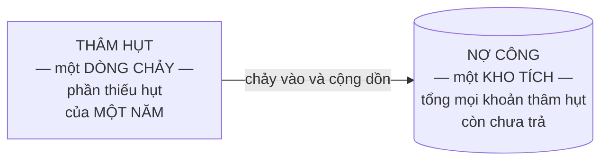
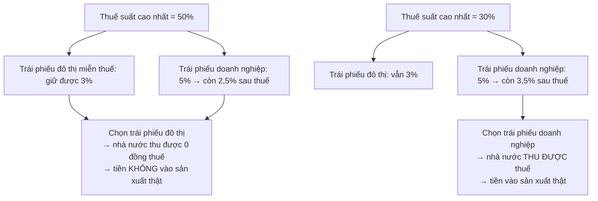
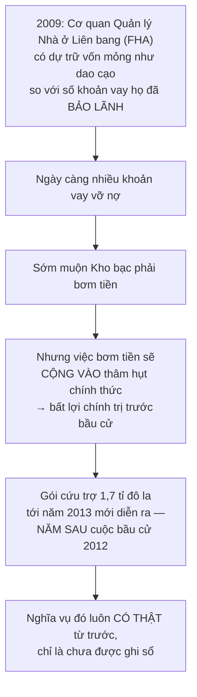

# Tài chính của chính phủ

> Hai phân biệt quyết định cả chương: **thâm hụt khác nợ**, và **thuế suất
> khác số thu thuế**. Lẫn lộn cặp thứ nhất là hiểu sai tin tức; lẫn lộn cặp
> thứ hai là hiểu sai chính sách.

## Bắt đầu từ chuyện bạn đã biết

Nếu năm nay bạn tiêu nhiều hơn kiếm được 20 triệu, đó là **khoản thiếu hụt của
năm nay**. Nếu bạn làm vậy suốt mười năm, **tổng nợ** của bạn là con số tích
lại — không phải 20 triệu.

Hai con số đó khác nhau về bản chất, và nhầm chúng là lỗi phổ biến nhất khi
đọc tin về ngân sách.

## Bốn từ cần định nghĩa chính xác

| Từ | Nghĩa |
| --- | --- |
| **Ngân sách cân bằng** | Toàn bộ chi tiêu hiện tại được trả bằng tiền thu từ thuế |
| **Thặng dư ngân sách** | Thu thuế **vượt** chi tiêu |
| **Thâm hụt** | Thu thuế **không đủ**; phần còn lại được bù bằng tiền bán trái phiếu — tức là **đi vay** |
| **Nợ công** | **Tích lũy** của các khoản thâm hụt qua thời gian |

Sowell nêu một điểm về thuật ngữ: nếu hiểu theo đúng chữ, "nợ quốc gia" phải
bao gồm **mọi khoản nợ trong nước**, kể cả nợ của người tiêu dùng và doanh
nghiệp. Trên thực tế, nó chỉ có nghĩa là **khoản nợ của chính phủ trung ương**.

### Và đây là hình cần nhớ

Đây chính là cặp **dòng chảy / kho tích** từ
[chương 16](./01-san-luong-quoc-gia.md), áp vào ngân sách:

Hệ quả cần nhớ: **thâm hụt giảm không có nghĩa là nợ giảm.** Thâm hụt giảm chỉ
có nghĩa là kho nợ **đang phình chậm hơn**. Nợ chỉ giảm khi có **thặng dư**.

## Tiền của chính phủ đến từ đâu

Năm **2013**, chính phủ Mỹ chi gần **3,5 nghìn tỉ** đô la.

Nguồn thu gồm thuế, bán trái phiếu, **phí thu từ hàng hóa và dịch vụ** do nhà
nước cung cấp, và bán tài sản nhà nước sở hữu. Ở Mỹ, các khoản phí trải từ vé
xe buýt đô thị và phí chơi golf ở sân công cộng, tới vé vào vườn quốc gia và
phí khai thác gỗ trên đất liên bang.

Trong lịch sử, chính phủ Mỹ từng bán cho dân chúng những vùng đất rộng lớn mà
họ đã có được từ dân bản địa hoặc từ chính phủ nước ngoài. Ở châu Âu các thế
kỷ trước, nhà nước thường bán **quyền độc quyền** kinh doanh các mặt hàng như
muối hay nhập khẩu vàng.

### Và một nguồn nữa: in tiền

Cách đơn giản nhất để nhà nước có tiền tiêu là **in ra**. Nhưng hậu quả lạm
phát tai hại đã khiến việc này quá rủi ro về mặt chính trị để dùng thường
xuyên.

Sowell nêu một quan sát sắc về ngôn ngữ: khi Cục Dự trữ Liên bang Mỹ đầu thế
kỷ 21 dùng tới việc tạo thêm tiền để đối phó với nền kinh tế trì trệ, họ đặt
ra một thuật ngữ mới — **"nới lỏng định lượng"** (quantitative easing) — thứ
mà nhiều người sẽ không hiểu ngay như khi nghe một cụm từ thẳng thắn hơn là
**"in tiền"**.

Đây là một quan sát đáng giữ về cách ngôn ngữ kỹ thuật che đi bản chất. Cũng
nên biết rằng nhiều nhà kinh tế học phản đối việc đánh đồng hai thứ: nới lỏng
định lượng là mua tài sản tài chính và **có thể đảo ngược**, khác với việc in
tiền để tài trợ chi tiêu. Nhưng điểm của Sowell về **cái tên** thì vẫn đứng
vững.

## Thuế suất không phải số thu thuế

Đây là lập luận trung tâm của chương, và là thứ hữu dụng nhất bạn mang đi.

> Chính phủ chỉ có thể ban hành **thay đổi về thuế suất**. Còn **số thu thuế**
> thực tế thì phụ thuộc vào việc người ta **phản ứng thế nào** — và điều đó
> chỉ biết được về sau.

Vì sao chúng không đi cùng chiều: vì con người **thay đổi hành vi**. Họ có thể
chuyển đi nơi khác, mua ít món bị đánh thuế nặng đi, hoặc chuyển tiền sang tài
sản khác.

### Bằng chứng theo cả hai hướng

| Trường hợp | Điều đã xảy ra |
| --- | --- |
| **Maryland**, thuế cao hơn với người kiếm từ 1 triệu đô la/năm, hiệu lực **2008** | Số người như vậy sống ở Maryland giảm từ gần **8.000** xuống dưới **6.000**. Dự kiến thu **thêm 106 triệu** đô la; thực tế số thu **giảm 257 triệu** |
| **Mỹ**, hạ thuế lãi vốn từ **28%** xuống **20%** năm **1997** | Năm 1996 mức thuế cũ thu được **54 tỉ**; dự báo bốn năm tới thu **209 tỉ**. Thực tế thu **372 tỉ** — gần **gấp đôi** dự báo |
| **Iceland**, hạ thuế doanh nghiệp từ **45%** xuống **18%** giai đoạn **1991–2001** | Số thu thuế **tăng gấp ba** |
| **Anh**, năm **2009**, kế hoạch nâng thuế thu nhập cá nhân cao nhất lên **51%** | Các quỹ đầu cơ quản lý gần **15 tỉ** đô la chuyển sang Thụy Sĩ trong vòng một năm |

> **Một lưu ý về độ chính xác:** bản gốc còn dẫn trường hợp bang Oregon nâng
> thuế thu nhập năm 2009 và nói số thu "giảm 50 tỉ đô la". Con số đó **không
> thể đúng** — nó lớn hơn toàn bộ ngân sách của bang Oregon. Nhiều khả năng đó
> là lỗi in (triệu thành tỉ). Bản rút gọn này bỏ nó ra thay vì chép lại, và
> nhắc tới đây để bạn biết rằng **ngay cả sách hay cũng có con số sai** — hãy
> kiểm tra những con số nghe quá khớp với lập luận.

### Cơ chế, bằng một ví dụ số

Vì sao hạ thuế lại có thể làm **tăng** số thu? Ví dụ giả định của Sowell rất
rõ:

Giả sử trái phiếu đô thị **miễn thuế** trả **3%**, còn trái phiếu doanh nghiệp
**chịu thuế** trả **5%**.

Sowell đưa ra một phép loại suy gọn: **thuế là cái giá mà nhà nước tính**. Đã
có nhiều doanh nghiệp lãi hơn nhờ **bán rẻ hơn** — tăng doanh số và kiếm nhiều
tổng lợi nhuận hơn ở tỉ suất thấp hơn trên mỗi đơn vị. Đôi khi nhà nước cũng
thu được nhiều hơn ở thuế suất thấp hơn.

Và ông nói rõ **điều kiện**: tất cả phụ thuộc vào **thuế suất ban đầu cao tới
đâu** và người ta phản ứng ra sao. **Có những lúc khác, thuế suất cao hơn dẫn
tới số thu cao hơn tương ứng, và thuế suất thấp hơn dẫn tới số thu thấp hơn.**

Câu đó quan trọng, vì nó là chỗ lập luận này hay bị dùng sai. Sowell **không**
nói hạ thuế luôn làm tăng thu. Ông nói **không thể giả định** rằng hai thứ đi
cùng chiều. Phiên bản mạnh hơn — rằng hạ thuế nói chung sẽ tự trả cho mình —
là một khẳng định mà **phần lớn nhà kinh tế học bác bỏ** với các mức thuế suất
hiện hành ở hầu hết các nước phát triển, dù nó có thể đúng với những mức thuế
suất rất cao.

### Hệ quả về cách đọc tin

Vì vậy, những cụm như **"gói giảm thuế 500 tỉ đô la"** hay **"đợt tăng thuế
700 tỉ đô la"** là **hoàn toàn gây hiểu lầm** — vì thứ duy nhất được ban hành
là **thay đổi thuế suất**, còn tác động thật lên số thu chỉ xác định được sau
khi nó có hiệu lực và người đóng thuế đã phản ứng.

## Ai thật sự chịu thuế

Một phân biệt nữa: **biết ai có nghĩa vụ pháp lý nộp thuế không cho biết ai
thật sự gánh** gánh nặng đó.

Khả năng **né tránh** khác nhau rất xa giữa các nhóm:

- Một nhà đầu tư có thể chuyển sang trái phiếu miễn thuế với lợi suất thấp
  hơn, hoặc chuyển tiền ra nước có thuế thấp hơn.
- Một công nhân nhà máy chỉ có nguồn thu duy nhất là phiếu lương **không có
  lựa chọn nào**: khoản thuế đã bị trừ xong trước khi anh ta nhận lương.

Đây là một quan sát trung thực, và nó cắt theo hướng mà người ta không phải
lúc nào cũng để ý: **thuế đánh vào người linh hoạt thường trôi sang người
không linh hoạt.**

## Nợ công: đọc con số cho đúng

### Tương đối, không phải tuyệt đối

Điều quan trọng không phải quy mô tuyệt đối của nợ mà là **quy mô của nó so
với thu nhập của cả nước**. Giới tài chính chuyên nghiệp biết điều này, nên họ
không hoảng ngay cả khi nợ lập kỷ lục — miễn là nó không lớn so với quy mô nền
kinh tế.

Sowell dẫn một nhà kinh tế học nhận xét vào năm **2004** rằng Phố Wall chỉ
**ngáp dài** khi các dự báo thâm hụt tăng vọt. Và điều đó được chứng minh là
có cơ sở: thâm hụt năm **2005** giảm xuống dưới mức 2004, khi số thu thuế chạy
cao hơn năm trước gần **15%**, riêng thuế doanh nghiệp tăng khoảng **40%** —
**mà không hề có đợt tăng thuế suất nào**.

### Nhưng con số chính thức cũng có thể **che giấu** rủi ro

Chiều ngược lại, và đây là phần đắt giá:

Nếu nhà nước có những **nghĩa vụ tài chính lớn đang lơ lửng** nhưng chưa nằm
trong ngân sách chính thức, thì con số nợ công chính thức có thể **thấp hơn
nhiều** so với thứ nhà nước thật sự nợ.

Ví dụ của Sowell rất cụ thể:

Điểm mấu chốt: **không chính quyền nào có thể để FHA vỡ nợ** với các khoản bảo
lãnh của mình về mặt chính trị. Nên nghĩa vụ ấy thật ngang mọi khoản đã nằm
trong nợ công chính thức — kể cả trước khi việc bơm tiền thật sự xảy ra.

Tới năm **2013**, nợ công của Mỹ lên gần **17 nghìn tỉ** đô la — **vừa vượt
100% GDP**. Và Sowell nêu một phân biệt quan trọng về bối cảnh: có mức nợ bằng
hoặc lớn hơn GDP **vào cuối một cuộc chiến lớn** là một chuyện, vì hòa bình
trở lại đồng nghĩa với cắt giảm mạnh chi tiêu quân sự — tức là có sẵn một cơ
hội để bắt đầu trả bớt nợ. Có mức nợ tương đương **trong thời bình** thì các
lựa chọn ảm đạm hơn nhiều, vì không có dấu hiệu nào về một đợt cắt giảm chi
tiêu tương tự.

## Khi nhà nước bán hàng: giá tách khỏi chi phí

Phần này áp lại toàn bộ phân tích về giá vào khu vực công, và nó rất thuyết
phục.

### Vì sao giá dịch vụ công thường **dưới** chi phí

Người đặt giá cho hàng hóa và dịch vụ công đối mặt với động lực khác hẳn người
bán hàng trên thị trường:

- Giá thấp hơn → **lượng cầu cao hơn** → bảo đảm nhu cầu tiếp diễn → bảo đảm
  công việc tiếp diễn cho chính họ.
- Giá thấp hơn **ít gây phản đối chính trị** hơn giá cao. Công việc của họ do
  đó **nhẹ nhàng hơn, an toàn hơn và ít căng thẳng hơn**.

Và động lực còn yếu hơn nữa khi tiền thu được **chảy vào ngân khố chung** thay
vì vào quỹ của chính cơ quan cung cấp dịch vụ. Ví dụ: phí vào các vườn quốc
gia Mỹ đi vào ngân khố, còn chi phí duy trì vườn được trả từ ngân khố. Nên
**không có động lực nào** để quan chức vận hành vườn quốc gia đặt mức phí đủ
bù chi phí — kể cả khi vườn bị coi là quá tải và cơ sở vật chất đang xuống cấp.

Một chi tiết cho thấy động lực chính trị hiện ra thế nào: người cao tuổi ở Mỹ
trả **một lần 10 đô la** cho tấm thẻ vào **mọi vườn quốc gia miễn phí trọn
đời**, trong khi người khác có thể phải trả **25 đô la mỗi lần** vào. Việc
người cao tuổi thường có **tài sản ròng cao hơn** mức trung bình dân số có thể
ít trọng lượng chính trị hơn việc họ **đi bỏ phiếu nhiều hơn**.

### Câu chuyện tàu điện ngầm New York

Ví dụ lịch sử gọn gàng nhất về cơ chế này:

Giao thông công cộng đô thị từng do doanh nghiệp tư nhân cung cấp, với mức vé
bù được cả chi phí hiện tại lẫn chi phí thay mới phương tiện khi hỏng, và trả
được lợi tức cho nhà đầu tư.

Ở New York, mức vé tàu điện ngầm **năm xu** được coi là **bất khả xâm phạm về
chính trị** trong nhiều năm — kể cả trong những giai đoạn lạm phát cao, khi
mọi giá khác đều tăng, gồm cả giá thiết bị, vật tư và nhân công để vận hành
chính tuyến tàu đó.

Hệ thống tư nhân không thể tồn tại trong điều kiện lỗ như vậy, nên quyền sở
hữu chuyển sang chính quyền thành phố. Khoản lỗ **không biến mất** — nó chỉ
được bù bằng **tiền thuế**. Và động lực để chặn khoản lỗ, vốn là mệnh lệnh
sống còn với doanh nghiệp tư nhân, nay yếu đi nhiều hoặc không còn.

### Và vì sao đôi khi giá lại **trên** chi phí

Chiều ngược lại cũng có động lực riêng. Cầu thường được xây với ý tưởng rằng
phí qua cầu thu trong nhiều năm sẽ bù chi phí xây dựng. Nhưng việc tiếp tục
thu phí **rất lâu sau khi chi phí gốc đã được bù lại nhiều lần** là chuyện
không hiếm — trong khi khoản cần cho bảo trì và sửa chữa chỉ bằng một phần nhỏ
số tiền vẫn đang thu.

Nếu cơ quan quản lý cầu được **giữ lại** số phí đó, họ có đủ động lực để dùng
tiền ấy mở rộng đế chế hành chính của mình — chẳng hạn trợ giá cho một tuyến
phà chạy song song với chính cây cầu đó, để đáp ứng một "nhu cầu chưa được đáp
ứng" của người đi làm. Và ở một mức vé đủ thấp, **sẽ luôn có người đi phà** —
qua đó "chứng minh" về mặt chính trị rằng nhu cầu đó có thật.

Con số ở California:

| Tuyến phà | Chi phí thật | Người đi trả |
| --- | --- | --- |
| San Francisco đi Sausalito và Larkspur, **2 triệu lượt/năm** | trợ giá khoảng **15 đô la/lượt**, tổng khoảng **30 triệu đô la** | phần còn lại |
| Nam San Francisco đi Oakland và Alameda, từ **2012** | tổng **108 đô la** mỗi lượt khứ hồi | **14 đô la** — trợ giá **94 đô la** từ người đóng thuế và người trả phí cầu |

Và Sowell đặt câu hỏi kinh tế đúng chỗ: chắc chắn tuyến phà đó mang lại lợi
ích cho người đi. Nhưng câu hỏi là lợi ích ấy **có bù được 108 đô la không** —
và **cách duy nhất để biết là thu đúng 108 đô la**.

### Lập luận "để giúp người nghèo"

Trợ giá thường được biện minh rằng nếu không thì "người nghèo" sẽ không tiếp
cận được dịch vụ. Phản biện của Sowell gọn và đáng suy nghĩ:

> Trợ giá cho **tất cả** những ai dùng dịch vụ, chỉ để giúp một **phần nhỏ**
> dân số, kém hiệu quả hơn việc **giúp thẳng người nghèo bằng tiền hoặc phiếu**
> rồi để những người khác tự trả phần của mình.

Và ông chỉ ra điểm yếu của lý lẽ đó bằng một quan sát khó bác: trợ giá từ tiền
thuế rất thường được dùng cho những thứ mà **người nghèo hiếm khi dùng** — như
sân golf công cộng hay dàn nhạc giao hưởng.

## Vì sao chi tiêu khó cắt

Ý khép chương, và nó giải thích một chuyện gây bối rối trong tin tức.

Nhà nước chi tiêu **cả tự nguyện lẫn không tự nguyện**. Quan chức có thể tự
quyết lập một chương trình mới. Nhưng nhà nước cũng **bị luật có sẵn buộc**
phải chi: trả bảo hiểm thất nghiệp khi kinh tế đi xuống, hoặc mua nông sản dư
thừa khi được mùa, vì luật trợ giá nông nghiệp bắt buộc như vậy.

Đó là các chương trình **"quyền được hưởng"** (entitlement), mà mức chi **nằm
ngoài tầm kiểm soát của bất kỳ chính quyền nào** một khi đã thành luật. Chỉ
việc **bãi bỏ luật** mới chặn được khoản chi — và điều đó có nghĩa là làm mất
lòng toàn bộ những người đang hưởng, vốn có thể **đông hơn** nhóm đã ủng hộ
việc ban hành luật đó ban đầu.

Nên khi người ta quy trách nhiệm thâm hụt cho chính quyền đương nhiệm, phần
lớn khoản chi ấy thật ra **không do họ quyết**. Trong ngân sách Mỹ năm tài
khóa **2008**, ngay cả ngân sách quân sự của một nước **đang có chiến tranh**
cũng **nhỏ hơn** phần chi không thuộc quyền quyết định.

## Chỗ cần thận trọng

Phân biệt **thuế suất / số thu thuế** là đúng và quan trọng, và cách Sowell
trình bày nó ở đây khá cẩn thận — ông có nêu rõ rằng chiều ngược lại cũng xảy
ra. Hãy giữ nguyên mức cẩn thận đó khi bạn gặp lập luận này ở nơi khác, nơi nó
thường được nói mạnh hơn nhiều so với bằng chứng.

Các ví dụ được chọn theo một hướng. Maryland, Iceland và thuế lãi vốn 1997 đều
là trường hợp ủng hộ luận điểm; các trường hợp mà tăng thuế suất **có** làm
tăng thu — vốn phổ biến hơn — không được dẫn ra. Và với thuế lãi vốn nói
riêng, thời điểm thực hiện khiến việc quy nhân quả rất khó: giai đoạn sau năm
1997 trùng với bong bóng công nghệ, khi lãi vốn tăng vọt vì **giá tài sản**
chứ không nhất thiết vì thuế suất.

Phần về **giá dịch vụ công** và phần về **nghĩa vụ ẩn** là hai phần mạnh nhất
chương, và ít gây tranh cãi.

## Điều cần nhớ

- **Thâm hụt là dòng chảy của một năm; nợ là kho tích.** Thâm hụt giảm chỉ có
  nghĩa là nợ phình chậm hơn.
- **Nhà nước chỉ ban hành được thuế suất, không ban hành được số thu.** Người
  ta phản ứng.
- Không giả định hai thứ đó đi cùng chiều — **theo cả hai hướng**.
- **Ai nộp thuế theo luật không phải ai gánh thuế thật.** Người linh hoạt đẩy
  được gánh nặng sang người không linh hoạt.
- Quy mô nợ có ý nghĩa **tương đối với GDP**, và con số chính thức có thể
  **giấu bớt** các nghĩa vụ chưa ghi sổ.
- Giá dịch vụ công tách khỏi chi phí, vì người đặt giá đối mặt với **động lực
  chính trị** chứ không phải động lực thị trường.

## Tự kiểm tra

1. Thâm hụt năm nay giảm. Nợ công đã giảm chưa? Vì sao?
2. Vì sao cụm "gói giảm thuế 500 tỉ đô la" là cách nói gây hiểu lầm?
3. Hạ thuế suất có thể làm tăng số thu bằng cơ chế nào — và điều đó có luôn
   đúng không?
4. Vì sao khoản bảo lãnh của FHA vẫn là nợ thật kể cả khi chưa nằm trong sổ?
5. Vì sao quan chức đặt giá vé vườn quốc gia không có động lực thu đủ bù chi
   phí?

---

Trước: [Chức năng của chính phủ](./03-chuc-nang-cua-chinh-phu.md) ·
Tiếp: [Những vấn đề riêng của kinh tế quốc gia](./05-van-de-rieng-cua-kinh-te-quoc-gia.md)
