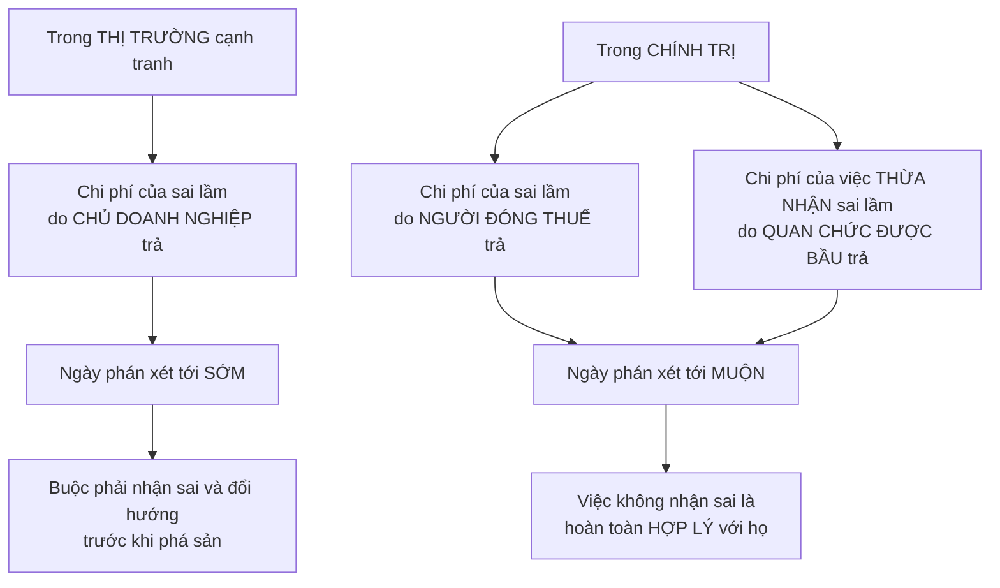

# Những vấn đề riêng của kinh tế quốc gia

> [Chương 18](./03-chuc-nang-cua-chinh-phu.md) nói về những việc **thị trường
> làm không nổi**. Chương này nói về những việc **nhà nước làm không nổi** —
> và lập luận rằng phải so sánh **hai quá trình có thật**, chứ không phải so
> một quá trình có thật với một lý tưởng.

## Bắt đầu từ chuyện bạn đã biết

Bạn chọn sữa của hãng này và phô mai của hãng kia, rồi tuần sau đổi ý. Nhưng
khi đi bầu, bạn phải nhận hoặc từ chối **cả gói** quan điểm của một ứng viên —
kinh tế, quốc phòng, môi trường — dù bạn chỉ đồng ý với một nửa.

Đó không phải lời chê bầu cử. Đó là một **đặc điểm cấu trúc** có hệ quả kinh
tế.

## Hai cách để công chúng bày tỏ mong muốn

| | **Qua lá phiếu** | **Qua thị trường** |
| --- | --- | --- |
| Tần suất | Vài năm một lần, và ràng buộc tới kỳ bầu cử sau | **Mỗi ngày**, đổi ý lúc nào cũng được |
| Hình thức | **Cả gói** — nhận hết hoặc bỏ hết | **Tách lẻ** — chọn từng món từ từng nơi |
| Thứ được chọn | Những **lời hứa** cạnh tranh nhau | Những **sản phẩm đã hoàn thành**, đang ở trước mắt |
| Trọng số | Mỗi người **một phiếu** | Mỗi người một **số tiền khác nhau** |

Sowell nêu một quan sát khó chối: gần như **không ai** dành nhiều thời gian và
sự chú ý cho việc chọn bầu ai bằng cho việc chọn nhận công việc nào, hay thuê
căn hộ nào.

Và một câu gọn đáng nhớ:

> **Đầu cơ chỉ là một khía cạnh của kinh tế thị trường, nhưng nó là bản chất
> của bầu cử.**

Vì khi mua dâu tây hay mua xe, món hàng nằm ngay trước mắt bạn lúc quyết định.
Còn chính sách mà một ứng viên hứa thì phải **tin vào lời hứa** — và hậu quả
cuối cùng của chính sách đó thì còn phải tin nhiều hơn nữa.

### Nhưng Sowell cũng lật lại lập luận của chính mình

Đây là chỗ ông công bằng, và đáng ghi nhận.

Nhiều người muốn chuyển quyết định sang địa hạt chính trị vì cho rằng ở đó
**sân chơi bằng phẳng hơn** — một người một phiếu, thay vì người nhiều tiền
nói to hơn.

Phản biện của ông: trong số những thứ mà của cải **mua được** có **học vấn tốt
hơn** và **thời gian rảnh** để tham gia hoạt động chính trị và nắm bắt các kỹ
thuật pháp lý. Tất cả những thứ đó chuyển thành **ảnh hưởng không cân xứng của
người giàu trong chính quá trình chính trị**.

Trong khi đó, việc những người không giàu **gộp lại có nhiều tiền hơn** những
người giàu có thể khiến người bình thường có trọng lượng **lớn hơn trên thị
trường** so với trong địa hạt chính trị hoặc pháp lý — tùy vấn đề và hoàn cảnh.

Đây là một lập luận đáng suy nghĩ cho cả hai phía, chứ không chỉ một.

## Nhà nước không phải một khối thống nhất

Một điểm mà người mới học hay bỏ qua:

> Quá thường xuyên, người ta có xu hướng coi nhà nước như **một chủ thể ra
> quyết định duy nhất**, hoặc như **lợi ích công được nhân cách hóa**.

Thực tế, các bộ phận khác nhau trong bộ máy phản ứng với những nhóm cử tri
khác nhau bên ngoài, nên thường **đối lập nhau** — cộng thêm ma sát về thẩm
quyền giữa chính họ với nhau.

Và từ đó là một câu đáng nhớ: nhiều việc mà quan chức làm để đáp ứng động lực
và ràng buộc của hoàn cảnh cụ thể của họ bị người quan sát gọi là **"phi lý
trí"** — nhưng chúng thường **hợp lý hơn** so với giả định rằng những quan
chức ấy là hiện thân của lợi ích công.

### "Ngân hàng phiếu bầu"

Sowell dẫn một tác giả Ấn Độ mô tả cơ chế này rất gọn: chính trị gia không dám
tư nhân hóa khu vực công thua lỗ khổng lồ vì sợ mất phiếu của công đoàn; không
dám dỡ bỏ trợ giá điện, phân bón và nước vì sợ mất phiếu nông dân; không dám
đụng vào trợ giá lương thực vì khối phiếu của người nghèo; và không dám cắt
hàng nghìn thanh tra liên tục sách nhiễu doanh nghiệp tư nhân vì không muốn
mất lòng khối phiếu công chức.

Và điều này **không riêng gì Ấn Độ**:

- Năm **2002**, Quốc hội Mỹ thông qua một dự luật trợ giá nông nghiệp — với sự
  ủng hộ của **cả hai đảng** — mà ước tính khiến một gia đình Mỹ trung bình
  tốn hơn **4.000 đô la** vì giá thực phẩm bị đội lên trong thập kỷ sau đó.
- Ở **Brazil**, chế độ hưu trí hào phóng dành cho công chức tới mức họ có thể
  **nghỉ hưu trong điều kiện kinh tế tốt hơn lúc còn đi làm** đã tạo ra những
  vấn đề tài chính khổng lồ.

## Sức ép phải "làm gì đó"

Đây là lập luận trung tâm và gây tranh cãi nhất của chương.

Một trong những sức ép lên mọi chính phủ, đặc biệt là chính phủ được bầu, là
phải **"làm gì đó"** — kể cả khi không có gì họ làm mà có khả năng cải thiện
tình hình, và có nhiều thứ họ làm mà có nguy cơ khiến nó tệ đi.

Quá trình kinh tế cần **thời gian**. Nhưng chính trị gia thường không sẵn lòng
để chúng chạy hết chu trình, nhất là khi đối thủ đang chào bán các giải pháp
nhanh.

> Rất hiếm khi có ai so sánh **điều thật sự xảy ra khi nhà nước làm gì đó** với
> **điều đã xảy ra khi nhà nước không làm gì**.

### Ba trường hợp mà Sowell đặt cạnh nhau

Chi tiết về Smoot-Hawley đáng nhớ: đó là mức thuế quan **cao nhất trong hơn
một thế kỷ**, được thiết kế để giảm nhập khẩu nhằm bán được nhiều hàng Mỹ hơn
và tạo thêm việc làm cho người Mỹ. Sowell thừa nhận đó là **một niềm tin nghe
hợp lý** — như rất nhiều việc chính trị gia làm nghe đều hợp lý. Nhưng một
tuyên bố công khai có chữ ký của **một nghìn nhà kinh tế học** tại các đại học
hàng đầu đã cảnh báo rằng đạo luật này không những không giảm được thất nghiệp
mà còn phản tác dụng.

Quốc hội vẫn thông qua, và Tổng thống Hoover vẫn ký.

Và trường hợp thứ tư, hiện đại hơn: khi thị trường chứng khoán sụp năm
**1987**, phá kỷ lục về mức giảm trong một ngày lập từ 1929, Tổng thống Reagan
**để nền kinh tế tự phục hồi** bất chấp phản ứng giận dữ của truyền thông. Kết
quả là nền kinh tế phục hồi, theo sau là khoảng **20 năm** mà một tạp chí kinh
tế sau này gọi là sự kết hợp đáng thèm muốn giữa tăng trưởng ổn định và lạm
phát thấp.

### Sowell tự đặt giới hạn cho lập luận của mình

Cần ghi nhận rõ ràng, vì nó hiếm: ông viết thẳng rằng **đây không phải các thí
nghiệm có đối chứng**, nên mọi kết luận chỉ có tính **gợi ý chứ không dứt
khoát**. Điều ông cho rằng lịch sử làm được là **đặt câu hỏi** — về việc liệu
một cú sụp chứng khoán có nhất thiết dẫn tới suy thoái dài và sâu không, và
liệu chính sách "làm gì đó" có nhất thiết cho kết quả tốt hơn "không làm gì"
không.

### Và đây là chỗ cần đọc tỉnh táo nhất

**Đây là khẳng định thực nghiệm gây tranh cãi nhất trong toàn bộ cuốn sách, và
nó là quan điểm thiểu số trong giới kinh tế học.** Cách đọc trung thực:

| Điều được đồng thuận rộng | Điều Sowell nói thêm mà **không** được đồng thuận |
| --- | --- |
| **Smoot-Hawley là chính sách tồi** và làm tổn hại thương mại thế giới | Rằng nó là **nguyên nhân chính** biến suy thoái thành Đại khủng hoảng |
| Chính phủ Hoover can thiệp **nhiều hơn** các chính quyền trước đó | Rằng Hoover là người **"làm quá nhiều"** — dòng chính coi ông là làm **quá ít và quá muộn** |
| Suy thoái 1921 hồi phục nhanh | Rằng nó là một phép so sánh hợp lệ — nó bỏ qua khác biệt **rất lớn** về chính sách tiền tệ, quy mô hệ thống ngân hàng và bối cảnh quốc tế |

Cách giải thích được ủng hộ rộng rãi nhất về Đại khủng hoảng — bao gồm cả cách
giải thích của Milton Friedman, một đồng minh tự nhiên của Sowell — nhấn mạnh
**sự sụp đổ của cung tiền** và **việc Cục Dự trữ Liên bang không hành động**,
tức là lỗi của việc **không làm đủ**, chứ không phải làm quá nhiều. Sowell có
dẫn cơ chế cung tiền ở
[chương 16](./01-san-luong-quoc-gia.md), nhưng ở đây ông xếp lập luận theo một
hướng khác.

## Chính sách tiền tệ: khó hơn vẻ ngoài rất nhiều

Phần cân bằng và hữu ích, cho thấy ngay cả khi chính sách **đúng** thì nó vẫn
đau.

**Vấn đề thứ nhất: dự báo sai theo cả hai chiều.** Dự báo lạm phát của Cục Dự
trữ Liên bang trong thập niên 1960 và 1970 **đánh giá thấp** mức lạm phát đang
hình thành. Dưới các đời chủ tịch sau đó, cơ quan này lại **đánh giá cao** mức
lạm phát sẽ xảy ra. Cùng một tổ chức, cùng loại công cụ, sai theo cả hai
hướng.

**Vấn đề thứ hai: ngay cả thành công cũng rất tốn kém.** Lạm phát ở Mỹ được
kéo từ mức nguy hiểm **13%** một năm vào **1979** xuống mức không đáng kể
**2%** vào **2003**. Nhưng việc đó được làm qua một loạt hành động **thử và
sai**, có cái hiệu quả có cái không — và tất cả đều dội lại đau đớn lên sự
sống còn của doanh nghiệp và lên việc làm.

Khi Cục Dự trữ Liên bang siết tiền và tín dụng đầu thập niên 1980 để chặn lạm
phát, thất nghiệp tăng còn số vụ phá sản lên mức nhiều thập kỷ chưa từng thấy.
Trong quá trình đó, chủ tịch Paul Volcker **bị truyền thông bôi nhọ**, và uy
tín của Tổng thống Reagan **rơi thẳng đứng** trong các cuộc thăm dò vì đã ủng
hộ ông.

**Vấn đề thứ ba: cơ quan "độc lập" không thật sự độc lập.** Một cựu chủ tịch
Cục Dự trữ Liên bang nhìn lại nhiệm kỳ của mình và mô tả rằng khi cơ quan này
liên tục thử và dò giới hạn quyền tự do của mình, nó **lặp đi lặp lại hứng
chịu những chỉ trích dữ dội** từ cả nhánh hành pháp lẫn Quốc hội, và vì thế
phải dành **phần lớn sức lực** để ngăn chặn những đạo luật có thể hủy hoại mọi
hy vọng chấm dứt lạm phát.

## Vì sao nhà nước khó sửa sai

Đây là phần lập luận sắc nhất chương, và nó có cấu trúc rõ ràng.

Sowell nhấn mạnh: sự miễn cưỡng nhận sai của quan chức **không phải là phi lý
trí** — nó hoàn toàn hợp lý xét từ vị trí của họ, đúng theo động lực và ràng
buộc mà họ đối mặt.

### Concorde: hai phản ứng trước cùng một dữ kiện

Ví dụ minh họa hoàn hảo, vì nó có **nhóm đối chứng**.

Khi ý tưởng máy bay chở khách siêu thanh mới được đặt ra, cả nhà sản xuất tư
nhân lẫn chính phủ Anh và Pháp đều nhận ra khá sớm rằng chi phí nhiên liệu của
loại máy bay ngốn xăng này cao tới mức **khó có hy vọng bù lại** từ giá vé mà
hành khách chịu trả.

- **Boeing bỏ hẳn ý tưởng**, chấp nhận khoản lỗ của những nỗ lực ban đầu như
  một cái giá nhỏ hơn so với việc đi tiếp và lỗ lớn hơn nhiều.
- **Chính phủ Anh và Pháp**, một khi đã công khai cam kết, **tiếp tục** thay vì
  thừa nhận đó là ý tưởng tồi.

Kết quả: người đóng thuế Anh và Pháp trong nhiều năm trợ giá cho một dịch vụ
thương mại mà **phần lớn người dùng là hành khách rất giàu có** — vì giá vé
Concorde cao hơn hẳn các chuyến bay khác cùng tuyến, mà vẫn không bù đủ chi
phí.

Và chi tiết cuối cùng cho thấy vì sao vòng lặp này khó phá: những người **chấm
dứt** Concorde không phải những người đã **khởi xướng** nó.

> **Nhận sai của người khác bao giờ cũng dễ hơn** — và còn được ghi công vì đã
> sửa nó.

### Đường hầm eo biển Manche: hai bên đặt cược ngược nhau

Ví dụ thứ hai còn rõ hơn, vì ở đây ta thấy **hai nhóm người đánh giá cùng một
dự án bằng tiền của hai loại chủ khác nhau**:

- **Chính phủ Anh và Pháp** dự phóng chi phí và doanh thu khiến dự án trông
  như một khoản đầu tư tốt — đủ tốt để thuyết phục công chúng và làm nó khả
  thi về chính trị.
- **Các công ty vận hành phà** qua eo biển rõ ràng nghĩ khác: họ **đầu tư thêm
  phà, to hơn**. Đó sẽ là tự sát tài chính nếu đường hầm thành công như dự
  phóng của giới chức.

Phía nào đúng? Tới năm **2004**, tổng giám đốc công ty vận hành đường hầm nói
rằng chắc chắn đường hầm đã **không được xây** nếu họ biết trước những vấn đề
này. Số người sử dụng tuyến ngầm mười năm tuổi ấy quá ít để trả nổi **ngay cả
phần lãi** của chi phí xây dựng đã phình to, khiến công ty ôm khoản nợ khoảng
**11,5 tỉ** đô la. Và cũng như với Concorde, người đóng thuế lại được yêu cầu
ra tay giải cứu.

Sowell chỉ ra sự khác biệt về **chất lượng thẩm định**: một đề xuất trong
chính trị chỉ cần thuyết phục **đủ số người** trong khung thời gian có ý nghĩa
với quan chức — thường là tới kỳ bầu cử sau. Một đề xuất trên thị trường phải
thuyết phục **những người đang đặt tiền của chính mình vào đó**, và vì vậy có
đủ động lực để huy động chuyên môn tốt nhất hiện có nhằm đánh giá tương lai.

### Và tiền có mục đích riêng thì không ở yên

Một dạng khác của cùng vấn đề. Ở Mỹ, cả các bang lẫn chính phủ liên bang đều
đánh thuế xăng dầu **dành riêng** cho việc xây và bảo trì đường sá — rồi sau
đó **chuyển khoản thu ấy sang việc khác**.

Năm **2008**, Quốc hội thông qua một đạo luật chi hàng trăm tỉ đô la nhằm ngăn
các định chế tài chính sụp đổ. Chưa hết năm đó, chính các quan chức Bộ Tài
chính phụ trách giải ngân đã **công khai thừa nhận** rằng phần lớn số tiền đã
được chuyển sang cứu các công ty ở những ngành khác.

Và chuyện này chẳng mới: từ năm **1776**, Adam Smith đã cảnh báo rằng một quỹ
mà chính phủ Anh lập ra để trả nợ quốc gia là một **cách dễ dàng và hiển nhiên
để bị dùng sai mục đích**.

## Một lưu ý về bối cảnh lịch sử

Sowell khép lại bằng một nhắc nhở đáng giữ: nền dân chủ tự do dựa trên thị
trường tự do là một ý tưởng **rất mới** trong lịch sử loài người.

| Năm | Số nền dân chủ tự do |
| --- | --- |
| **1776** | **1** (Hoa Kỳ) |
| **1790** | **3** (thêm cả Pháp) |
| **1848** | **5** |
| **1975** | **31** |
| Thời điểm viết sách | **120** trong khoảng 200 quốc gia **tự nhận** là dân chủ, với hơn 50% dân số thế giới — dù một tổ chức nghiên cứu chỉ xếp **86** nước là thật sự tự do |

## Chỗ cần thận trọng

Chương này là nơi lập trường chính trị của Sowell hiện rõ nhất. Cần tách ba
tầng:

1. **Phân tích về động lực** — vì sao quan chức khó nhận sai, vì sao lợi ích
   tập trung thắng chi phí phân tán, vì sao cơ quan "độc lập" chịu sức ép — là
   **kinh tế học chính trị nghiêm túc**, được nhiều trường phái chấp nhận.
   Đây là phần đáng giữ nhất.
2. **Các ví dụ** — Concorde, đường hầm Manche, trợ giá nông nghiệp — là thật
   và đã được kiểm chứng. Nhưng chúng là những **ca thất bại được chọn lọc**,
   và không có ví dụ đối trọng nào về các dự án công thành công.
3. **Diễn giải về Đại khủng hoảng** là **thiểu số**, và cần được đọc như một
   luận điểm đang tranh cãi chứ không phải một sự thật đã xác lập.

Và một điều mà chương này làm đúng, đáng học: nó **không** so sánh thị trường
thật với nhà nước lý tưởng. Nó so sánh hai quá trình có thật. Hãy áp cùng
nguyên tắc đó ngược lại vào chính cuốn sách — đừng so sánh nhà nước thật với
thị trường lý tưởng.

## Điều cần nhớ

- Lá phiếu là lựa chọn **cả gói, ít lần**; thị trường là lựa chọn **tách lẻ,
  hằng ngày**.
- Của cải mua được ảnh hưởng **trong cả hai địa hạt** — không chỉ trên thị
  trường.
- Nhà nước **không phải một khối**; hành vi "phi lý trí" của quan chức thường
  rất hợp lý với động lực của chính họ.
- **Chi phí của sai lầm do người đóng thuế trả; chi phí của việc thừa nhận sai
  lầm do quan chức trả.** Đó là lý do sai lầm công kéo dài hơn sai lầm tư.
- Sức ép phải **"làm gì đó"** là một lực có thật, và nó không tự động dẫn tới
  kết quả tốt hơn.
- Tiền dành riêng cho một mục đích **không ở yên** tại mục đích đó.

## Tự kiểm tra

1. Nêu hai khác biệt cấu trúc giữa việc chọn bằng lá phiếu và chọn bằng tiền.
2. Vì sao Sowell nói rằng hành vi "phi lý trí" của quan chức thường là hợp lý?
3. Boeing và chính phủ Anh–Pháp nhìn thấy cùng một dữ kiện về máy bay siêu
   thanh. Vì sao họ hành động khác nhau?
4. Các công ty phà đã "bỏ phiếu" thế nào về triển vọng của đường hầm Manche?
5. Lập luận của Sowell về Đại khủng hoảng thuộc loại phát biểu nào trong bốn
   loại, và nên tin nó ở mức nào?

---

Trước: [Tài chính của chính phủ](./04-tai-chinh-cua-chinh-phu.md) ·
Tiếp: [Phần VI — Kinh tế quốc tế](../6-kinh-te-quoc-te/)
