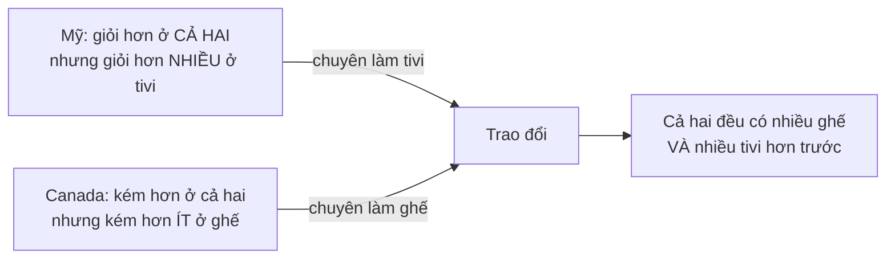
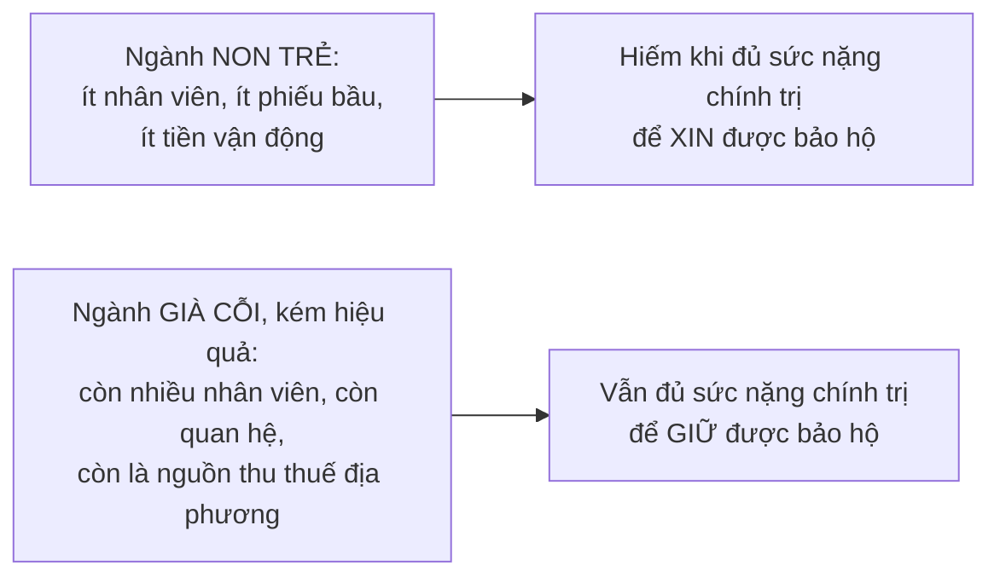

# Thương mại quốc tế

> Thương mại **không phải trò chơi có tổng bằng không**. Cả hai bên đều phải
> được lợi, nếu không thì việc tiếp tục giao dịch chẳng có nghĩa lý gì. Nghe
> hiển nhiên — nhưng gần như mọi tranh cãi về thương mại đều bắt đầu bằng việc
> quên mất điều đó.

## Bắt đầu từ chuyện bạn đã biết

Khi bạn mua một ổ bánh mì, bạn không "thua" người bán bánh. Bạn muốn ổ bánh
hơn số tiền; họ muốn số tiền hơn ổ bánh. Cả hai cùng được.

Không có lý do gì để điều đó **ngừng đúng** khi người bán ở bên kia biên giới.

## Cái bẫy "ai thắng ai thua"

Sowell mở đầu bằng cách trích một bài báo bàn về hiệp định thương mại tự do
Bắc Mỹ (**NAFTA**, 1993), trong đó nói rằng việc làm đang dịch chuyển qua biên
giới quá nhanh để có thể tuyên bố nước Mỹ **thắng hay thua** về việc làm từ
hiệp định này.

Chính cách đặt vấn đề ấy đã phạm sai lầm trung tâm: **giả định rằng một nước
phải thua nếu nước kia thắng**.

Và ông chỉ ra rằng **không cần chuyên gia hay quan chức** nào xác định xem cả
hai bên có cùng được lợi hay không. Phần lớn thương mại quốc tế, cũng như
thương mại trong nước, được thực hiện bởi **hàng triệu cá nhân**, mỗi người tự
xác định được món hàng mình mua có đáng giá đó hay không.

### Dự báo và thực tế

Trước khi NAFTA có hiệu lực, có những dự báo u ám rằng việc làm sẽ bị hút khỏi
nước Mỹ sang Mexico vì lương ở Mexico thấp hơn nhiều.

| Chỉ số trong bảy năm sau NAFTA | Diễn biến |
| --- | --- |
| Thất nghiệp **Mỹ** | giảm từ hơn **7%** xuống **4%** — mức thấp nhất trong nhiều thập kỷ |
| Thất nghiệp **Canada** | giảm từ **11%** xuống **7%** |
| Việc làm ở **Mexico** | tăng thêm **hàng triệu** |
| Việc làm ở **Mỹ** | cũng tăng thêm **hàng triệu**, cùng lúc |

### Vì sao chuyện đó xảy ra

Lập luận của Sowell rất gọn, và nó dựa trên đúng nguyên lý ở
[chương 16](../5-kinh-te-quoc-gia/01-san-luong-quoc-gia.md):

> **Không có một số lượng việc làm cố định** để các nước phải tranh giành. Khi
> các nước trở nên thịnh vượng hơn, tất cả đều có xu hướng tạo thêm việc làm.
> Câu hỏi duy nhất là liệu thương mại quốc tế có làm các nước thịnh vượng hơn
> không.

## Những từ ngữ đánh lừa

Đây là phần hữu ích cho việc đọc tin tức, và nó xoay quanh hai chữ.

Cán cân thương mại **xuất siêu** từ lâu được gọi là cán cân **"thuận lợi"**,
còn **nhập siêu** là **"bất lợi"**. Cách gọi này có từ nhiều thế kỷ trước, khi
người ta tin rằng nhập nhiều hơn xuất làm một nước nghèo đi, vì phần chênh
phải trả bằng **vàng**, và mất vàng là mất của cải quốc gia.

Nhưng ngay từ năm **1776**, Adam Smith đã lập luận trong *Của cải của các dân
tộc* rằng của cải thật của một quốc gia nằm ở **hàng hóa và dịch vụ**, không
phải ở kho vàng.

> Nếu lượng hàng hóa và dịch vụ mà người dân có được **nhiều hơn** nhờ thương
> mại quốc tế, thì họ **giàu hơn**, bất kể cán cân thương mại đang "thâm hụt"
> hay "thặng dư".

### Ba dữ kiện làm bật gốc hai từ đó

- Trong **Đại khủng hoảng thập niên 1930**, nước Mỹ có **xuất siêu** — tức cán
  cân "thuận lợi" — **mỗi năm** của thập kỷ thảm họa đó. Nhưng điều đáng chú ý
  hơn là **cả xuất lẫn nhập đều thấp hơn hẳn** so với thập niên 1920 thịnh
  vượng, do các hàng rào thuế quan dựng lên khắp thế giới.
- **Mùa xuân 2001**, thâm hụt thương mại Mỹ thu hẹp ở mức kỷ lục, và báo chí
  giật tít rằng đó là tin tốt. Nhưng nó xảy ra **cùng lúc** với chứng khoán
  giảm, thất nghiệp tăng, lợi nhuận doanh nghiệp giảm và tổng sản lượng đi
  xuống. "Tin tốt" đó đơn giản là do **nhập khẩu giảm** trong thời kỳ khó
  khăn.
- Nước Mỹ trở thành **"quốc gia con nợ"** ở mức kỷ lục trong giai đoạn thịnh
  vượng bùng nổ của thập niên **1990**.

Kết luận: những từ ngữ ấy **không thể hiểu theo nghĩa đen** như chỉ dấu về sức
khỏe kinh tế.

## Vì sao cả hai bên cùng lợi: ba lý do

### 1. Lợi thế tuyệt đối

Dễ hiểu nhất: một nước làm được thứ gì đó **rẻ hơn hoặc tốt hơn** nước khác.

Chuối trồng ở vùng nhiệt đới rẻ hơn nhiều so với nơi cần nhà kính để giữ ấm.
Ở xứ nóng, **thiên nhiên cho không** cái mà nơi khác phải trả tiền để tạo ra.

Cà phê còn cực đoan hơn: nó cần một tổ hợp điều kiện rất đặc thù — ấm nhưng
không quá nóng, không bị nắng chiếu thẳng cả ngày, không quá ẩm cũng không quá
khô, và chỉ hợp với một số loại đất. Kết quả là đầu thế kỷ 21, **hơn một nửa
lượng cà phê của cả thế giới** được trồng ở chỉ **ba nước**: Brazil, Việt Nam
và Colombia.

Điều đó **không có nghĩa** các nước khác không trồng nổi cà phê. Chỉ là lượng
và chất họ trồng được **không bõ so với nguồn lực bỏ ra**, khi có thể mua rẻ
hơn từ ba nước kia.

Và lợi thế tuyệt đối đôi khi chỉ là **ở đúng chỗ hoặc nói đúng thứ tiếng**: Ấn
Độ lệch múi giờ khoảng 12 tiếng so với Mỹ, nên một công ty Mỹ muốn có dịch vụ
máy tính suốt ngày đêm có thể thuê kỹ thuật viên Ấn Độ làm việc khi bên Mỹ là
đêm. Cộng thêm việc nhiều người có học ở Ấn Độ nói tiếng Anh, và Ấn Độ có
khoảng **30%** tổng số kỹ sư phần mềm của thế giới.

### 2. Lợi thế so sánh — ý tưởng quan trọng nhất chương

Câu hỏi thử thách: **giả sử một nước sản xuất MỌI thứ đều rẻ hơn nước láng
giềng. Họ có lợi gì khi giao thương không?**

Câu trả lời là **có**. Và lý do đáng hiểu kỹ:

> Có thể sản xuất **bất cứ thứ gì** rẻ hơn **không giống** với có thể sản xuất
> **mọi thứ** rẻ hơn.

Vì nguồn lực khan hiếm có nhiều công dụng, làm thêm món này nghĩa là làm bớt
món kia. Câu hỏi đúng không phải "sản xuất ghế tốn bao nhiêu tiền ở mỗi nước",
mà là **sản xuất một chiếc tivi tốn mất bao nhiêu chiếc ghế**.

#### Ví dụ bằng số

Giả định năng suất mỗi công nhân một tháng, và mỗi nước có **500 công nhân**:

| | Nếu làm ghế | Nếu làm tivi |
| --- | --- | --- |
| Công nhân **Mỹ** | **500** ghế | **200** tivi |
| Công nhân **Canada** | **450** ghế | **100** tivi |

Mỹ giỏi hơn ở **cả hai** — đó là lợi thế tuyệt đối. Nhưng hãy tính **chi phí
cơ hội**:

| | Làm thêm 1 tivi thì mất bao nhiêu ghế? |
| --- | --- |
| **Mỹ** | 500 ÷ 200 = **2,5 ghế** |
| **Canada** | 450 ÷ 100 = **4,5 ghế** |

Mỹ hy sinh **ít ghế hơn** để có một tivi. Vậy **Mỹ có lợi thế so sánh ở tivi**,
và **Canada có lợi thế so sánh ở ghế** — dù Canada thua tuyệt đối ở cả hai.

Kết quả khi mỗi nước chuyên môn hóa theo lợi thế so sánh:

| | Mỗi nước làm cả hai thứ | Mỗi nước chuyên một thứ |
| --- | --- | --- |
| Ghế | **190.000** | **225.000** |
| Tivi | **90.000** | **100.000** |

**Cùng ngần ấy công nhân. Cùng ngần ấy năng suất.** Không ai làm việc chăm hơn
hay giỏi hơn. Chỉ là nguồn lực được đặt đúng chỗ — và tổng sản lượng tăng lên
ở **cả hai** mặt hàng.

Sowell nêu điều kiện duy nhất khiến trao đổi vô ích: **chỉ khi một nước sản
xuất mọi thứ hiệu quả hơn nước kia đúng cùng một tỉ lệ phần trăm** thì mới
không có lợi thế so sánh. Tình huống đó gần như không tồn tại trong thực tế.

#### Và nó áp dụng cho chính bạn

Phép loại suy của ông rất đời thường: giả sử bạn là bác sĩ phẫu thuật mắt, và
hồi sinh viên bạn từng rửa xe thuê để kiếm tiền học. Giờ bạn có xe riêng. Bạn
nên **tự rửa** hay **thuê người rửa** — kể cả khi kinh nghiệm cũ khiến bạn rửa
nhanh hơn họ?

Thuê. Vì giờ bạn rửa xe **mất đi** những gì lẽ ra bạn có thể làm trong thời
gian ấy.

### 3. Lợi thế theo quy mô

Lý do thứ ba: một số thứ chỉ rẻ khi làm với số lượng rất lớn — lớn hơn mức một
thị trường nội địa nhỏ có thể hấp thụ.

## Hạn chế thương mại: ai được, ai mất

Đây là phần Sowell dùng để áp lại **ngụy biện hợp thành**: một ngành **có thể**
được lợi từ hạn chế thương mại. Cái sai là tin rằng **cả nền kinh tế** được
lợi.

### Thép và đường: hai phép cộng trừ

| Ngành | Bên được | Bên mất |
| --- | --- | --- |
| **Thép** (Mỹ, sau khi việc làm ngành thép giảm từ **340.000** xuống **125.000** trong thập niên 1980) | Thuế quan thép mang lại thêm **240 triệu** đô la lợi nhuận cho các công ty thép và cứu được **5.000** việc làm | Các ngành **dùng thép** làm nguyên liệu mất ước tính **600 triệu** đô la lợi nhuận và **26.000** việc làm, vì thép trong nước nay đắt hơn |
| **Đường** (Mỹ) | Cứu được việc làm trong ngành mía đường | Mất **gấp ba lần** số việc làm đó trong ngành bánh kẹo, vì giá đường cao. Một hãng kẹo đã chuyển **80%** sản lượng kẹo bạc hà sang nhà máy ở Guatemala mở năm **2010** |

Và con số giải thích vì sao: giai đoạn **2000–2012**, giá đường trung bình ở
Mỹ **hơn gấp đôi** giá trên thị trường thế giới.

Kết luận: xét trên tổng thể, **cả doanh nghiệp Mỹ lẫn người lao động Mỹ đều
tệ hơn** vì các hạn chế nhập khẩu thép.

Lý do chính trị khiến chuyện này lặp lại: lợi ích **tập trung và dễ thấy** ở
một ngành có tổ chức, còn chi phí **phân tán và vô hình** ra khắp nền kinh tế.

### Smoot-Hawley, lần nữa

Nhắc lại từ [chương 20](../5-kinh-te-quoc-gia/05-van-de-rieng-cua-kinh-te-quoc-gia.md),
nhưng ở đây có thêm chi tiết về bản kiến nghị:

**Hơn một nghìn nhà kinh tế học** — trong đó có nhiều giáo sư hàng đầu ở
Harvard, Columbia và Đại học Chicago — ký một lời kêu gọi công khai phản đối
việc tăng thuế quan. Lập luận của họ: nước Mỹ đang đối mặt với thất nghiệp, và
những người ủng hộ thuế quan cao hơn cho rằng tăng thuế sẽ tạo việc làm cho
người đang rảnh — điều đó **không đúng**, vì **không thể tăng việc làm bằng
cách hạn chế thương mại**.

Họ dự báo chính xác hai điều: các nước khác sẽ **trả đũa**, và **đại đa số
nông dân Mỹ** — vốn nằm trong nhóm ủng hộ thuế quan mạnh nhất — sẽ **thiệt
trên tổng thể**, khi các nước khác hạn chế nhập nông sản Mỹ. Cả hai dự báo đều
thành sự thật.

Diễn biến thất nghiệp Mỹ: **9%** (đỉnh tháng 12/1929) → **6%** (tháng 6/1930,
khi Smoot-Hawley được thông qua) → **15%** một năm sau → **26%** một năm sau
nữa.

Và một lần nữa, Sowell tự đặt giới hạn: ông viết rõ rằng **không nhất thiết
phải quy toàn bộ chuyện này cho thuế quan**. Nhưng ông nhấn mạnh rằng **toàn
bộ mục đích** của những thuế quan ấy là để **giảm** thất nghiệp.

## Ba lập luận bênh vực hạn chế thương mại

Sowell xét từng cái, và ông **công nhận hai trong ba là có cơ sở**:

### "Ngành công nghiệp non trẻ" — hợp lý trên lý thuyết

Lập luận: bảo hộ tạm thời một ngành mới cho tới khi nó tích lũy đủ kỹ năng và
kinh nghiệm để cạnh tranh, rồi **gỡ bỏ** bảo hộ.

Sowell công nhận các nhà kinh tế học từ lâu đã coi đây là lập luận **có giá
trị, ít nhất về lý thuyết**. Vấn đề nằm ở thực tế:

Bảo hộ vì thế có xu hướng chảy **ngược** với lý thuyết: không tới ngành đang
lớn lên, mà tới ngành đang tàn.

### Quốc phòng — hợp lý, nhưng bị lạm dụng

Sowell viết rằng **ngay cả những người ủng hộ thương mại tự do mạnh mẽ nhất**
cũng khó mà muốn phụ thuộc vào việc nhập khí tài từ những nước có thể trở
thành kẻ thù.

Ông dẫn một ví dụ lịch sử hiếm hoi về việc một dân tộc phụ thuộc vào kẻ thù
tiềm tàng để có vũ khí: người bản địa châu Mỹ thời thuộc địa lấy súng và đạn
từ người định cư châu Âu. Khi chiến tranh nổ ra, họ có thể **thắng phần lớn
các trận đánh mà vẫn thua cuộc chiến**, vì họ dần hết đạn — thứ chỉ có từ
chính đối phương.

Nhưng ông cũng nêu rõ vế sau: cụm từ **"thiết yếu cho quốc phòng"** có thể bị
kéo giãn — và đã bị kéo giãn — để bao gồm những sản phẩm chỉ liên quan tới
quốc phòng một cách xa xôi, hời hợt hoặc hoàn toàn hư cấu.

Và ông thêm một sắc thái: các nước khác nhau mang **xác suất trở thành kẻ thù
khác nhau**. Năm **2004**, nước nhận nhiều hợp đồng của Lầu Năm Góc nhất trong
số các nước ngoài là **Canada** với **601 triệu** đô la, tiếp theo là Anh và
Israel — không nước nào có khả năng chiến tranh với Mỹ.

### "Bán phá giá" — chủ yếu là bảo hộ trá hình

Lập luận: đối thủ nước ngoài bán dưới **giá thành sản xuất** để đẩy nhà sản
xuất trong nước khỏi thị trường, rồi sau đó nâng giá lên mức độc quyền.

Mọi thứ phụ thuộc vào việc **có đúng là họ bán dưới giá thành không**. Và như
[chương 6](../2-doanh-nghiep-va-thuong-mai/02-loi-nhuan-va-thua-lo.md) đã chỉ
ra, xác định giá thành **không hề dễ** — ngay cả với một doanh nghiệp nằm
trong cùng nước với cơ quan đang điều tra. Việc quan chức ở châu Âu xác định
giá thành của một công ty ở Đông Nam Á còn khó hơn nhiều.

> Thứ **dễ** duy nhất là việc nhà sản xuất trong nước **đưa ra cáo buộc** khi
> hàng nhập đang lấy mất khách của họ. Và khi giá thành khó xác định, con
> đường ít trở ngại nhất cho quan chức là **chấp nhận cáo buộc**.

Ví dụ Sowell dùng rất rõ: giới chức châu Âu tuyên bố một nhà sản xuất xe đạp
địa hình ở Thái Lan bán phá giá vào châu Âu, **vì giá ở châu Âu thấp hơn giá
loại xe đó bán tại Thái Lan**.

Nhưng đó chính là **lợi thế theo quy mô**: bán hàng loạt lớn cho thị trường
châu Âu có chi phí trên mỗi chiếc **thấp hơn** bán số lượng nhỏ ở Thái Lan,
nơi cầu với một món xa xỉ như vậy ít hơn nhiều trong một dân số nhỏ hơn và
nghèo hơn. Bán rẻ hơn giá tại Thái Lan **không đồng nghĩa** với bán dưới giá
thành.

Và danh sách cho thấy quy mô của thực hành này: Liên minh châu Âu đã áp luật
chống bán phá giá với khăn trải giường từ Ai Cập, kháng sinh từ Ấn Độ, giày
dép từ Trung Quốc, lò vi sóng từ Malaysia, bột ngọt từ Brazil. Mỹ áp với thép
từ Nhật, nhôm từ Nga, xe điện sân golf từ Ba Lan.

Chi tiết đắt nhất: khi không có cơ sở nghiêm túc để xác định chi phí, các cơ
quan Mỹ dựa vào **"thông tin tốt nhất hiện có"** — thứ thường do **chính các
doanh nghiệp Mỹ đang muốn chặn hàng nhập** cung cấp.

## Chỗ cần thận trọng

Lợi thế so sánh là một trong những kết quả **vững chắc nhất** của kinh tế học,
được chấp nhận qua mọi trường phái. Nếu bạn chỉ giữ một ý từ chương này, hãy
giữ nó.

Điều mà mô hình **không** nói, và Sowell lướt qua nhanh: lợi thế so sánh chứng
minh rằng **tổng sản lượng tăng**, chứ không chứng minh rằng **mọi người trong
mỗi nước đều được lợi**. Người thợ thép Mỹ mất việc là một khoản lỗ có thật,
không được bù lại bằng việc người tiêu dùng mua được thép rẻ hơn — trừ khi xã
hội **chủ động** thực hiện việc bù đắp đó. Chính Sowell đã dùng đúng cấu trúc
lập luận này ở
[chương 9](../2-doanh-nghiep-va-thuong-mai/05-kinh-te-thi-truong-va-phi-thi-truong.md),
và ở đây cũng như ở đó, ông trình bày phần "tổng tăng lên" kỹ hơn nhiều so với
phần "ai trả giá cho quá trình chuyển đổi".

Đây là chỗ tranh luận thương mại hiện đại thật sự diễn ra — không phải ở chỗ
thương mại có làm tổng của cải tăng hay không, mà ở chỗ **phân phối lợi ích và
chi phí ra sao**.

## Điều cần nhớ

- Thương mại **không phải tổng bằng không**. Không có số lượng việc làm cố
  định để tranh giành.
- "Cán cân thuận lợi" và "bất lợi" là **di sản ngôn ngữ** từ thời người ta
  tưởng vàng là của cải. Mỹ xuất siêu suốt Đại khủng hoảng.
- **Lợi thế tuyệt đối**: làm rẻ hơn. **Lợi thế so sánh**: hy sinh ít hơn. Vế
  thứ hai mới là lý do một nước giỏi mọi thứ vẫn nên giao thương.
- Chi phí cơ hội là thước đo đúng: hỏi **"một cái tivi tốn mấy cái ghế"**,
  không hỏi "cái nào rẻ hơn".
- Hạn chế thương mại có **người được cụ thể** và **người mất phân tán** — và
  người mất thường đông hơn.
- Lập luận **ngành non trẻ** và **quốc phòng** là hợp lý; trên thực tế cả hai
  thường bị dùng cho mục đích khác.

## Tự kiểm tra

1. Vì sao một nước sản xuất mọi thứ đều rẻ hơn vẫn có lợi khi giao thương?
2. Tính chi phí cơ hội của một chiếc tivi ở Mỹ và ở Canada trong ví dụ trên.
3. Vì sao thuế quan thép lại làm hại người lao động Mỹ **trên tổng thể**?
4. Vì sao bảo hộ hiếm khi tới được ngành công nghiệp non trẻ?
5. Vì sao bán rẻ hơn ở nước ngoài so với ở trong nước không chứng minh được là
   bán phá giá?

---

Trước: [Phần VI](./README.md) ·
Tiếp: [Dịch chuyển của cải giữa các nước](./02-dich-chuyen-cua-cai-giua-cac-nuoc.md)
