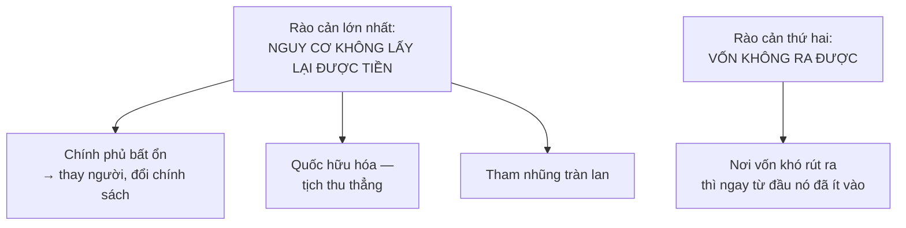
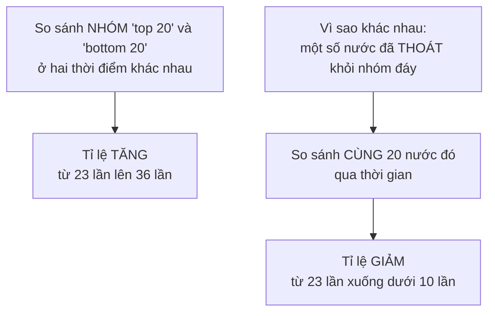
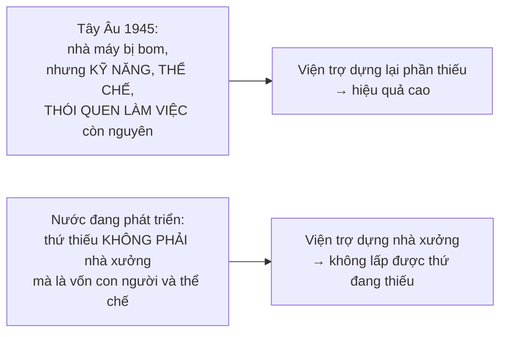

# Dịch chuyển của cải giữa các nước

> Vốn **không** chảy từ nơi dư sang nơi thiếu như nước tìm mực. Nó chảy về nơi
> nó **an toàn** — và đó là lý do nước giàu chủ yếu đầu tư vào nước giàu.

## Bắt đầu từ chuyện bạn đã biết

Nếu có tiền tiết kiệm, bạn gửi nó ở đâu? Không phải ở nơi hứa lãi suất cao
nhất, mà ở nơi bạn **tin là sẽ lấy lại được**.

Cả dòng vốn quốc tế vận hành theo đúng logic đó, chỉ ở quy mô hàng nghìn tỉ.

## Của cải chảy qua biên giới theo những đường nào

| Dạng | Quy mô (theo số liệu trong sách) |
| --- | --- |
| **Đầu tư trực tiếp** | Năm **2012**, người Mỹ đầu tư **329 tỉ** đô la ra nước ngoài; người nước ngoài đầu tư **168 tỉ** vào Mỹ |
| **Mua trái phiếu chính phủ nước khác** | **46%** trái phiếu chính phủ Mỹ do công chúng nắm giữ đang nằm trong tay người nước ngoài |
| **Kiều hối** | Năm **2012**, **250 triệu** người di cư trên thế giới gửi về **410 tỉ** đô la |
| **Viện trợ nước ngoài** | Chuyển giao từ chính phủ và tổ chức quốc tế sang **chính phủ** nước nghèo |
| **Cướp đoạt** (trong lịch sử) | Alexander Đại đế lấy kho báu Ba Tư; Tây Ban Nha chở vàng bạc hàng tấn từ Tây bán cầu |

## Kiều hối: dòng chảy bị đánh giá thấp nhất

Đây là phần mà một người đọc Việt Nam sẽ thấy quen, và các con số cho thấy nó
quan trọng tới mức nào với nước nghèo:

- **Mexico**, năm **2011**: một khảo sát cho thấy **một phần năm** trong số 112
  triệu dân nhận tiền từ người thân ở Mỹ — tổng cộng gần **23 tỉ** đô la.
- **Ấn Độ**: người di cư gửi về **64 tỉ** đô la trong năm 2011. **Trung Quốc**:
  **62 tỉ**.

Và tỉ trọng so với cả nền kinh tế:

| Nước | Kiều hối so với GDP |
| --- | --- |
| **Liban** | **22%** |
| **Moldova** | **23%** |
| **Tajikistan** | **35%** |

Tác động lên người nghèo còn rõ hơn: tiền gửi về chiếm khoảng **60%** thu nhập
của những hộ nghèo nhất ở **Guatemala**, và theo các nghiên cứu của Ngân hàng
Thế giới, nó đã giúp giảm tỉ lệ người sống trong nghèo đói **11 điểm phần
trăm** ở **Uganda** và **6 điểm phần trăm** ở **Bangladesh**.

Đây cũng không phải hiện tượng mới. Từ thập niên **1840**, tiền của người
Ireland nhập cư ở Mỹ gửi về đã giúp người thân của họ không chỉ **sống sót**
qua nạn đói ở Ireland mà còn có tiền để **di cư** sang Mỹ.

## Vì sao vốn không chảy về nước nghèo

Theo lý thuyết, vốn nên chảy từ nơi dư thừa sang nơi khan hiếm — vì ở nơi khan
hiếm, nó sinh lợi cao hơn. Thực tế thì ngược lại:

| Năm 2012 | Tổng toàn cầu | Phần tới nước nghèo |
| --- | --- | --- |
| Cho vay ngân hàng quốc tế | khoảng **21 nghìn tỉ** đô la | khoảng **2,5 nghìn tỉ** — **dưới 12%** |
| Chứng khoán đầu tư quốc tế | gần **6 nghìn tỉ** | dưới **400 tỉ** — **dưới 7%** |

> **Nước giàu chủ yếu đầu tư vào nước giàu.**

### Ba rào cản

Sowell nhấn mạnh rằng **không phải sự nghèo tự nó** ngăn dòng vốn. Bằng chứng
là hai trường hợp ngược lại:

- **Hồng Kông** khởi đầu rất nghèo khi còn là thuộc địa Anh, nhưng vốn đổ vào ồ
  ạt nhờ sự an toàn của luật pháp Anh, thuế suất thấp và dòng vốn cùng thương
  mại tự do vào bậc nhất thế giới. Có thời điểm lãnh thổ nhỏ bé này có kim
  ngạch thương mại quốc tế **lớn hơn cả Ấn Độ**.
- **Ấn Độ** tới nay vẫn là nước nghèo, nhưng sau khi nới các kiểm soát của nhà
  nước, đầu tư đổ vào — đặc biệt là vùng **Bangalore**, nơi mật độ kỹ sư phần
  mềm dày đặc đã thu hút nhà đầu tư từ Thung lũng Silicon.

## Cán cân thương mại: một quy ước kế toán bị đọc như một lời phán xét

Đây là phần hữu ích nhất chương cho việc đọc tin tức.

### Vấn đề thứ nhất: nó chỉ đếm **hàng hóa**

Tổng sản lượng của một nước gồm **cả hàng hóa lẫn dịch vụ** — nhà cửa và cắt
tóc, xúc xích và phẫu thuật. Nhưng cán cân thương mại chỉ đếm **hàng hóa vật
chất di chuyển qua biên giới**.

Kinh tế Mỹ sản xuất **nhiều dịch vụ hơn hàng hóa**. Nên chẳng có gì lạ khi Mỹ
nhập nhiều hàng hóa hơn xuất — và **xuất nhiều dịch vụ hơn nhập**.

Riêng năm **2012**, Mỹ thu **124 tỉ** đô la chỉ từ tiền bản quyền và phí cấp
phép, và hơn **628 tỉ** đô la từ toàn bộ dịch vụ cung cấp cho các nước khác —
con số **hơn gấp đôi GDP** của Ai Cập hay Malaysia. Không khoản nào trong số
đó nằm trong "cán cân thương mại".

### Vấn đề thứ hai: tiền không biến mất, nó **đổi dạng**

Ví dụ cụ thể của Sowell: các hãng xe Nhật thu hàng tỉ đô la từ thị trường Mỹ.
Họ làm gì với số tiền đó? Một trong những việc là **xây nhà máy ngay tại Mỹ**,
thuê hàng nghìn công nhân Mỹ để sản xuất xe gần khách hàng hơn và khỏi tốn chi
phí vận chuyển qua Thái Bình Dương. Ngày **29/7/2002**, chiếc Toyota thứ **mười
triệu** được sản xuất tại Mỹ.

### Vấn đề thứ ba: con số tuyệt đối vô nghĩa

Mỹ có thâm hụt thương mại lớn nhất thế giới — và cũng có **nền kinh tế lớn
nhất thế giới**. Tính theo tỉ lệ, thâm hụt thương mại Mỹ năm **2011** là **dưới
5%** GDP: **chưa bằng một nửa** của Thổ Nhĩ Kỳ và **chưa bằng một phần tư** của
Macedonia.

### Vấn đề thứ tư: các con số này không nói gì về sức khỏe kinh tế

Ba dữ kiện làm sụp mối liên hệ mà người ta hay giả định:

- Một trong số hiếm hoi những năm Mỹ **thặng dư** cán cân thanh toán vào cuối
  thế kỷ 20 lại **được nối tiếp bằng suy thoái năm 1992**.
- **Đức** đều đặn xuất siêu, nhưng đồng thời có **tăng trưởng chậm hơn và thất
  nghiệp cao hơn** Mỹ.
- **Nigeria** thường xuyên có những năm thặng dư thương mại, và là một trong
  những nước **nghèo nhất thế giới**.

### Và chữ "con nợ"

Theo quy ước kế toán, khi người nước ngoài đầu tư vào Mỹ, điều đó biến Mỹ
thành **"con nợ"** của họ — vì số tiền ấy không phải quà tặng.

Nhưng hãy nhìn **sự vật** thay vì **ngôn từ**: người ta gửi tiền vào Mỹ chính
vì họ thấy **an toàn hơn** so với ngân hàng và doanh nghiệp ở nước mình.

- Người nước ngoài đầu tư **12 tỉ** đô la vào doanh nghiệp Mỹ năm **1980**,
  tăng dần lên hơn **200 tỉ** mỗi năm vào **1998**.
- Năm **2012**, người nước ngoài mua tài sản ở Mỹ nhiều hơn **400 tỉ** đô la so
  với lượng tài sản người Mỹ mua ở nước ngoài. **60%** số vốn đó đến từ châu
  Âu và **9%** từ Canada — cộng lại hơn hai phần ba.

Nghịch lý ngôn ngữ: **càng thịnh vượng và an toàn, nước Mỹ càng có "thâm hụt"
và "nợ" quốc tế lớn**. Nên không có gì lạ khi giai đoạn thịnh vượng kéo dài của
thập niên 1990 đi kèm với mức thâm hụt và nợ quốc tế kỷ lục.

### Phép thử cuối cùng

Năm **2012**, người nước ngoài rút **543 tỉ** đô la ra khỏi nền kinh tế Mỹ —
nhiều hơn GDP của Argentina hay Na Uy.

Nếu việc trả tiền cho nhà đầu tư nước ngoài làm một nước nghèo đi, thì Mỹ hẳn
đã là một trong những nước nghèo nhất thế giới. Thực tế: phần lớn số tiền đó
là **thu nhập từ tài sản** mà người nước ngoài sở hữu tại Mỹ — nghĩa là người
Mỹ **đã hưởng trước** phần của cải tăng thêm mà những tài sản ấy góp phần tạo
ra, và chỉ đang chia lại một phần cho những người đã góp phần tạo ra nó.

## Vốn con người cũng chảy

Một dạng dịch chuyển của cải mà số liệu thương mại không bao giờ ghi.

### Chảy ra

Tỉ lệ người tốt nghiệp cao đẳng hoặc đại học đã sang sống ở các nước OECD:

| Nước | Tỉ lệ |
| --- | --- |
| Fiji, Trinidad, Haiti, Jamaica | **hơn 60%** |
| **Guyana** | **83%** |

Vốn con người khó lượng hóa, nhưng việc mất người có học ở quy mô như vậy là
một tổn thất thật sự về của cải quốc gia.

Hai ví dụ lịch sử Sowell dùng:

- Sau khi người **Morisco** bị trục xuất khỏi Tây Ban Nha đầu thế kỷ 17, một
  giáo sĩ Tây Ban Nha đặt câu hỏi: **giờ ai sẽ đóng giày cho chúng ta?** Sowell
  nhận xét khô khan rằng đó là câu đáng lẽ nên hỏi **trước** khi trục xuất —
  nhất là vì chính vị giáo sĩ này đã ủng hộ việc trục xuất.
- Chính sách bài Do Thái của **Đức Quốc xã** khiến nhiều nhà khoa học Do Thái
  chạy sang Mỹ, nơi họ đóng vai trò lớn trong việc đưa nước Mỹ thành quốc gia
  đầu tiên có bom nguyên tử. Sowell chỉ ra vế trớ trêu: **Nhật Bản, đồng minh
  của Đức, còn phải trả cái giá lớn hơn** cho chính sách đó.

### Nhưng không nên chỉ nhìn một chiều

Đây là chỗ Sowell đáng ghi nhận vì ông tự cân bằng. Ông viết rõ rằng sẽ là
**sai lệch** nếu đánh giá tác động kinh tế của nhập cư **chỉ qua những đóng
góp tích cực** của nó — người nhập cư cũng đã mang theo bệnh tật, tội phạm,
xung đột nội bộ và khủng bố.

Và ông nhấn mạnh một điểm phương pháp: **không thể gộp mọi người nhập cư làm
một**. Ông dẫn số liệu cho thấy khoảng **2%** người nhập cư từ Nhật vào Mỹ
nhận trợ cấp xã hội, trong khi con số đó ở người nhập cư từ Lào là **46%** —
và có những chênh lệch tương tự về tỉ lệ tội phạm.

> Mọi thứ phụ thuộc vào việc bạn đang nói tới **nhóm người nhập cư nào**, **từ
> nước nào**, và **trong giai đoạn lịch sử nào**.

Đây là loại phát biểu cần đọc cẩn thận. Quan sát rằng các nhóm nhập cư khác
nhau có kết quả khác nhau là đúng về mặt dữ liệu. Nhưng những con số thô kiểu
này **không tự nó giải thích nguyên nhân** — hoàn cảnh nhập cảnh rất khác nhau
(người tị nạn chiến tranh so với người di cư theo diện tay nghề), và chính
Sowell ở [chương 10](../3-lao-dong-va-tien-luong/01-nang-suat-va-tien-luong.md)
đã cảnh báo rằng số liệu thô về nhóm hiếm khi đủ chi tiết để kết luận nguyên
nhân. Nguyên tắc đó cần được áp **cả ở đây**.

## Chủ nghĩa đế quốc có sinh lời không?

Một lập luận gây bất ngờ, và Sowell trình bày nó bằng dữ liệu.

Khi các đế chế châu Âu ở đỉnh cao đầu thế kỷ 20, **Tây Âu chiếm chưa tới 2%
diện tích đất của thế giới nhưng kiểm soát thêm 40%** dưới dạng thuộc địa hải
ngoại.

Ấn tượng về quy mô lãnh thổ. Còn ý nghĩa kinh tế thì sao?

- Ngay ở đỉnh cao của Đế quốc Anh đầu thế kỷ 20, **người Anh đầu tư vào nước
  Mỹ nhiều hơn vào toàn bộ châu Á và châu Phi cộng lại**.
- Vì lý do tương tự, suốt phần lớn thế kỷ 20, **Mỹ đầu tư vào Canada nhiều hơn
  vào toàn bộ châu Á và châu Phi cộng lại**.
- Phần lớn các nước công nghiệp chỉ gửi những tỉ lệ **không đáng kể** trong
  xuất khẩu và đầu tư của mình sang các thuộc địa.

Lý do rất gọn: **có nhiều của cải để kiếm từ nước giàu hơn là từ nước nghèo.**

Và bằng chứng mạnh nhất chống lại ý nghĩa kinh tế của thuộc địa: **Đức và Nhật
mất toàn bộ thuộc địa và vùng chiếm đóng** sau thất bại trong Thế chiến thứ
hai — rồi **cả hai bật lên tới mức thịnh vượng chưa từng có**. Nhu cầu phải có
thuộc địa từng là luận điểm chính trị rất hiệu quả ở Nhật trước chiến tranh,
một nước rất ít tài nguyên. Sau chiến tranh, Nhật đơn giản là **mua** tài
nguyên họ cần từ những nước có chúng — và thịnh vượng nhờ vậy.

Sowell chốt lại một cách cẩn thận: chủ nghĩa đế quốc đã gây **rất nhiều đau
khổ** cho các dân tộc bị chinh phục. Nhưng ít nhất trong thế giới công nghiệp
hiện đại, nó **hiếm khi là nguồn dịch chuyển của cải quốc tế lớn**.

## "Bóc lột" và nghịch lý của nó

Quan niệm coi đầu tư của nước công nghiệp vào nước chưa công nghiệp là tương
đương với việc cướp bóc của các đế quốc trước đó đã ảnh hưởng tới chính sách
của rất nhiều nước.

Sowell chỉ ra một dữ kiện đi ngược lại: **chính ở những nước kém phát triển
nơi có ít hoặc không có đầu tư nước ngoài, nghèo đói lại tồi tệ nhất.**

Và trong thập niên **1990**, các nước nghèo có tỉ trọng thương mại quốc tế
**thấp** trong nền kinh tế đã có nền kinh tế **suy giảm**, trong khi các nước
"toàn cầu hóa" hơn thì tăng trưởng.

Nghịch lý kép: người giàu ở các nước nghèo thường đem tiền đầu tư sang **nước
giàu**, nơi an toàn hơn trước biến động chính trị và tịch thu — nên nước nghèo
trên thực tế đang **giúp nước giàu giàu thêm**.

Tới cuối thế kỷ 20, hậu quả đã rõ tới mức một số chính phủ — ở Mỹ Latin và Ấn
Độ chẳng hạn — bắt đầu đổi hướng. Và khi thị trường mở ra, cả hàng hóa lẫn vốn
đều đổ vào: năm **1991**, các công ty nước ngoài sở hữu **27%** doanh nghiệp ở
Mỹ Latin; một thập kỷ sau, con số đó là **39%**.

### Một bài học về cách đọc thống kê

Đây là ví dụ hay nhất trong chương về việc số liệu có thể đánh lừa thế nào.

Có lập luận rằng thương mại tự do làm **tăng bất bình đẳng** giữa nước giàu và
nước nghèo, dẫn số liệu Ngân hàng Thế giới: tỉ lệ thu nhập giữa **20 nước cao
nhất** và **20 nước thấp nhất** tăng từ **23 lần** năm **1960** lên **36 lần**
năm **2000**.

Vấn đề: **20 nước trong mỗi nhóm không phải là cùng những nước đó** ở hai thời
điểm.

Đây chính là ngụy biện "nhóm khác con người" từ
[chương 10](../3-lao-dong-va-tien-luong/01-nang-suat-va-tien-luong.md), áp ở
cấp quốc gia. Và Sowell lập luận rằng **mở rộng thương mại quốc tế là một
trong những cách** các nước nghèo đã dùng để thoát khỏi nhóm hai mươi nước
dưới đáy.

## "Hãy để chúng ta chết đói, nhưng phải xuất khẩu"

Cách thứ ba để có công nghệ và máy móc nước ngoài: **trả bằng tiền xuất khẩu**.
Nước càng nghèo thì điều đó càng có nghĩa là **gian khổ trong nước** là cái giá
của phát triển.

Sowell dẫn câu nói của một bộ trưởng thời Nga hoàng — người, như ông nhận xét,
rất khó có khả năng phải chịu đói bản thân — rằng hãy để chúng ta chết đói,
nhưng phải xuất khẩu.

Và ông chỉ ra rằng cùng triết lý đó được áp dụng sau này ở Liên Xô, dù không
tuyên bố. Theo hai nhà kinh tế học Liên Xô viết lại nhiều năm sau:

- Trong **Kế hoạch 5 năm lần thứ nhất**, **40%** thu nhập xuất khẩu đến từ
  việc bán ngũ cốc.
- Năm **1931**, Liên Xô mua **một phần ba** toàn bộ máy móc và thiết bị được
  nhập khẩu **trên toàn thế giới**.
- **80–85%** thiết bị được đưa vào vận hành trong các nhà máy Liên Xô thời kỳ
  này là **mua từ phương Tây**.

Vào thời điểm đó, sự lớn mạnh của tổ hợp công nghiệp quốc doanh được tuyên bố
là thắng lợi của chủ nghĩa cộng sản — trong khi trên thực tế nó là việc **nhập
khẩu công nghệ tư bản chủ nghĩa**, được trả bằng cách **cắt bớt khẩu phần ăn**
trong nước.

## Viện trợ nước ngoài

Sowell nêu một vấn đề ngay ở cái tên: từ **"viện trợ"** đã **giả định sẵn** rằng
khoản chuyển giao đó sẽ giúp nền kinh tế nước nghèo phát triển. Đôi khi đúng,
đôi khi không.

Điểm mấu chốt về cấu trúc:

> Vì đây là chuyển giao của cải **tới các chính phủ** — khác với đầu tư vào
> doanh nghiệp tư nhân — viện trợ nước ngoài đã khuyến khích nhiều nước lập ra
> các doanh nghiệp nhà nước thất bại, hoặc xây cung điện, quảng trường và
> những công trình nhằm **gây ấn tượng với người nhìn** thay vì làm ra những
> thứ nâng mức sống.

Trong trường hợp xấu, nó đơn giản là giúp giới chính trị đang cầm quyền làm
giàu qua tham nhũng và ban phát ân huệ cho những người giúp họ giữ quyền.

### Vì sao Kế hoạch Marshall khác

Chương trình viện trợ nổi tiếng nhất — chuyển của cải từ Mỹ sang Tây Âu sau
Thế chiến thứ hai — **thành công hơn hẳn** nhiều nỗ lực bắt chước nó sau này ở
các nước đang phát triển.

Lý do Sowell đưa ra rất gọn: khó khăn kinh tế của Tây Âu là do **bom đạn tàn
phá vật chất**. Một khi người dân được cho ăn và hạ tầng được dựng lại, Tây Âu
đơn giản là **quay lại lối sống công nghiệp** mà họ đã có sẵn.

## Chỗ cần thận trọng

Phần về **quy ước kế toán** và **cách đọc thống kê nhóm** là phần mạnh nhất
chương, và nó không gây tranh cãi. Hãy giữ lấy.

Phần về **viện trợ nước ngoài** phản ánh một quan điểm có thật và có cơ sở
trong giới kinh tế học phát triển — nhưng đó là **một phía của một cuộc tranh
luận đang tiếp diễn**. Cuộc tranh luận ấy được tiếp tục sôi nổi sau khi cuốn
sách ra đời, và một dòng nghiên cứu lớn đã chuyển sang đánh giá **từng chương
trình cụ thể bằng thử nghiệm đối chứng** thay vì hỏi "viện trợ nói chung có
hiệu quả không" — cách đặt câu hỏi mà nhiều nhà kinh tế học hiện coi là quá
thô để trả lời được.

Phần về **chủ nghĩa đế quốc** cần đọc chính xác. Sowell lập luận rằng thuộc
địa **không sinh lời nhiều cho chính quốc** — một luận điểm có cơ sở dữ liệu.
Nhưng điều đó **không đồng nghĩa** với việc chủ nghĩa thực dân không gây thiệt
hại cho thuộc địa; đó là hai câu hỏi khác nhau, và ông chỉ trả lời câu thứ
nhất. Chính ông có nói rằng nó "gây nhiều đau khổ", nhưng câu đó bị đặt lướt
qua giữa các con số.

## Điều cần nhớ

- Vốn chảy về nơi **an toàn**, không phải nơi khan hiếm. Nước giàu đầu tư vào
  nước giàu.
- **Kiều hối** là dòng chảy lớn và ít được nói tới — với một số nước, nó bằng
  một phần ba GDP.
- **Cán cân thương mại chỉ đếm hàng hóa**, không đếm dịch vụ, và không đếm tài
  sản không di chuyển. Nó là quy ước kế toán, không phải bản đánh giá sức khỏe.
- Thặng dư không có nghĩa là khỏe: Nigeria thường xuyên xuất siêu.
- Khi so sánh nhóm nước qua thời gian, hỏi ngay: **có phải cùng những nước đó
  không?**
- Viện trợ đi tới **chính phủ**; đầu tư đi tới **doanh nghiệp**. Cấu trúc đó
  giải thích phần lớn khác biệt về kết quả.

## Tự kiểm tra

1. Vì sao vốn quốc tế không chảy về nơi nó khan hiếm nhất?
2. Người Nhật làm gì với số đô la họ thu được từ việc bán xe cho người Mỹ?
3. Vì sao nước Mỹ càng thịnh vượng thì "nợ quốc tế" của nó càng lớn?
4. Tỉ lệ thu nhập giữa 20 nước giàu nhất và 20 nước nghèo nhất tăng lên, nhưng
   khoảng cách giữa **cùng những nước đó** lại giảm. Giải thích.
5. Vì sao Kế hoạch Marshall hiệu quả hơn các chương trình viện trợ về sau?

---

Trước: [Thương mại quốc tế](./01-thuong-mai-quoc-te.md) ·
Tiếp: [Chênh lệch giàu nghèo giữa các nước](./03-chenh-lech-giau-ngheo-giua-cac-nuoc.md)
