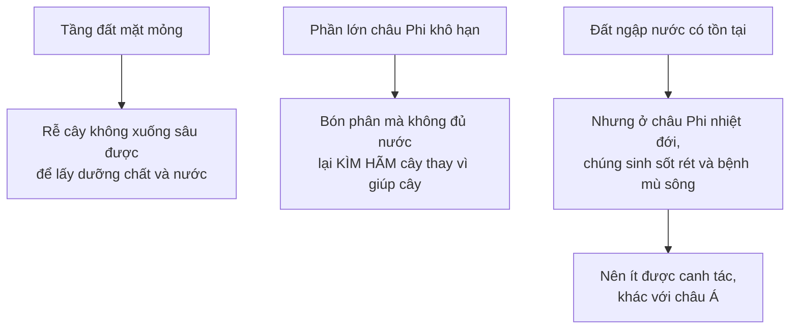
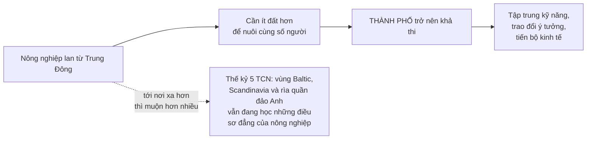

# Chênh lệch giàu nghèo giữa các nước

> Chương dài nhất của cuốn sách, và là chương Sowell viết thêm cho ấn bản này.
> Câu hỏi ông đặt lại không phải *"vì sao có chênh lệch?"* mà là: **đã từng có
> khả năng thực tế nào để các nước phát triển ngang nhau không?**

## Quy mô của vấn đề

| So sánh | Tỉ lệ |
| --- | --- |
| Bốn nước Balkan đầu thế kỷ 19 so với Tây Âu công nghiệp | thu nhập đầu người chỉ bằng **một phần tư** |
| Albania, Moldova, Ukraine, Kosovo so với Hà Lan, Thụy Sĩ, Đan Mạch (hai thế kỷ sau) | vẫn **dưới một phần tư** — và **dưới một phần năm** so với Na Uy |
| Trung Quốc so với Nhật Bản | **dưới một phần tư** |
| Ấn Độ so với Nhật Bản | chỉ nhỉnh hơn **10%** |
| Châu Phi hạ Sahara so với khu vực đồng euro | **dưới 10%** |

Điều đáng chú ý ở bảng trên: khoảng cách Balkan–Tây Âu **gần như không đổi qua
hai thế kỷ**.

## Cách đặt câu hỏi của Sowell

Đây là bước đi trí tuệ của cả chương, và đáng hiểu rõ:

> Vô số yếu tố đi vào quá trình phát triển kinh tế. Để **tất cả** các tổ hợp
> và hoán vị của những yếu tố ấy kết hợp lại theo cách tạo ra kết quả **xấp xỉ
> bằng nhau** cho mọi nước trên thế giới sẽ là một sự **trùng hợp kinh ngạc**.

Nói cách khác: ông đảo ngược gánh nặng chứng minh. Thay vì hỏi "điều gì đã gây
ra bất bình đẳng", ông hỏi "có lý do gì để trông đợi bình đẳng ngay từ đầu
không?"

Đây là một nước đi tu từ mạnh, và bạn nên nhận ra nó là một nước đi. Nó đúng ở
chỗ: kết quả **hoàn toàn** bằng nhau quả thật là điều không ai nên trông đợi.
Nhưng nó cũng lặng lẽ chuyển câu hỏi từ *"những chênh lệch cụ thể này do đâu
mà có"* — vốn vẫn là câu hỏi đáng hỏi — sang một câu hỏi dễ trả lời hơn nhiều.

## Địa lý: phần vững chắc nhất

Đây là phần hay nhất chương, giàu dữ kiện và ít gây tranh cãi.

### Đất không giống nhau

Loại đất màu mỡ bậc nhất mà các nhà khoa học gọi là **Mollisol** phân bố rất
không đều: tập trung lớn ở vùng trung tây và đồng bằng phía bắc nước Mỹ kéo
sang Canada; một dải rộng chạy suốt lục địa Á–Âu từ nam Đông Âu tới đông bắc
Trung Quốc; một vùng nhỏ hơn ở nam Argentina, nam Brazil và Uruguay.

**Chúng hiếm khi xuất hiện ở vùng nhiệt đới.**

Đất ở châu Phi hạ Sahara có nhiều khiếm khuyết nghiêm trọng, dẫn tới năng suất
cây trồng chỉ bằng một phần nhỏ so với Trung Quốc hay Mỹ:

Và độ màu mỡ còn thay đổi **theo thời gian**, chứ không cố định:

- Những vùng đất nặng ở châu Âu chỉ trở nên màu mỡ **sau khi** người ta phát
  triển được cách thắng ngựa và bò vào cày. Trước đó, với phương pháp thô sơ
  chỉ hiệu quả trên đất nhẹ, chúng kém màu mỡ hơn nhiều.
- Tương tự ở châu Á: đất canh tác của Nhật Bản ban đầu **kém hơn nhiều** so
  với bắc Ấn Độ — và ngày nay thì **tốt hơn hẳn**.

### Mưa và nắng cũng không giống nhau

- Đất hoàng thổ ở bắc Trung Quốc giữ được nhiều nước mưa hơn hẳn đất đá vôi ở
  vùng Balkan, nơi nước thoát nhanh và để lại ít độ ẩm cho cây.
- Số giờ nắng trung bình hằng năm ở **Athens gần gấp đôi London**; ở
  **Alexandria hơn gấp đôi**.
- Ngay trong cùng một nước — Tây Ban Nha — lượng mưa hằng năm dao động từ
  **dưới 300mm** tới **hơn 1.500mm**.

Và Sowell nêu một điểm tinh tế: **nắng vừa có lợi vừa có hại**. Nó thúc đẩy
quang hợp, đồng thời **làm bốc hơi chính lượng nước mà cây cần**. Ở nhiều vùng
quanh Địa Trung Hải, nắng hè làm bốc hơi nhiều nước hơn lượng mưa hè ít ỏi —
nên nơi đó có thể cần tưới tiêu dù nếu chỉ nhìn tổng lượng mưa cả năm thì
không bị coi là khô hạn.

> Điểm lớn hơn: tác động của các yếu tố địa lý **không thể xét riêng lẻ**, vì
> **tương tác** giữa chúng và **thời điểm** của chúng mới là thứ quyết định.
> Số tổ hợp khả dĩ lớn hơn số yếu tố theo cấp số nhân.

### Đường thủy: yếu tố bị đánh giá thấp nhất

Phần thuyết phục nhất chương, vì nó giải thích một chuyện tưởng như ngẫu nhiên:
vì sao gần như mọi thành phố lớn đều nằm bên sông, hồ hoặc cảng.

Lý do là **chi phí vận tải**:

> Năm **1830**, một lô hàng tốn hơn **30 đô la** để chở **300 dặm đường bộ** có
> thể được chở **3.000 dặm** vượt Đại Tây Dương với giá chỉ **10 đô la**.

Gấp mười lần quãng đường, một phần ba chi phí. Với lượng lương thực và nhiên
liệu khổng lồ phải chở vào một thành phố, và lượng hàng khổng lồ phải chở ra,
vị trí bên đường thủy gần như là điều kiện sống còn.

Và lợi thế đó phân bố cực kỳ không đều:

| | **Tây Âu** | **Châu Phi hạ Sahara** |
| --- | --- | --- |
| Địa hình | Sông chảy êm qua **đồng bằng ven biển rộng và bằng phẳng** ra biển khơi | Trừ dải ven biển hẹp, phần lớn cao **trên 1.000 foot**, nhiều nơi **trên 2.000 foot** |
| Sông đi vào nội địa | Tàu biển vào sâu được | Vách dốc đứng chặn tàu từ biển vào, và chặn thuyền từ trong ra |
| Bờ biển | Bờ biển **quanh co**, tạo ra rất nhiều cảng kín gió | Bờ trơn — **châu Phi lớn hơn gấp đôi châu Âu nhưng có đường bờ biển NGẮN HƠN** |
| Độ sâu cảng | Tàu viễn dương cập sát bờ được (Stockholm, Monaco) | Nước nông, tàu lớn phải neo ngoài khơi và **sang mạn** xuống thuyền nhỏ — tốn kém hơn nhiều, thường tới mức không kham nổi |

Ví dụ cụ thể về sông:

- **Sông Zaire** bắt đầu ở độ cao **4.700 foot**, nên phải đổ xuống gần một dặm
  theo chiều thẳng đứng qua ghềnh thác trước khi ra Đại Tây Dương. Nó **đổ ra
  biển nhiều nước hơn** cả sông Mississippi, Dương Tử hay Rhine — nhưng **không
  thể chở lượng hàng tương đương**.
- **Sông Niger** thoát nước cho một vùng lớn hơn bang Texas. Mùa khô, có đoạn
  nó **sâu chưa tới một mét**. Mùa mưa cao điểm, nó được mô tả như **một cái hồ
  di động rộng 20 dặm**.

> **Chiều dài của một con sông, thậm chí cả lưu lượng nước của nó, không nói
> lên điều gì về giá trị kinh tế của nó như một tuyến vận tải.**

Hệ quả kinh tế cụ thể: ở nơi phải dỡ hàng khiêng vòng qua thác rồi chất lại,
chỉ những lô hàng **giá trị rất cao trên một thể tích nhỏ** mới đáng chở. Ở
nơi sông chảy liên tục hàng trăm dặm qua đồng bằng, những thứ **cồng kềnh và
rẻ** — gỗ, lúa mì, than — mới chở được.

Nga là ví dụ về một biến số khác: ở phía nam, đường thủy thông suốt **chín
tháng** mỗi năm; ở phía bắc, chỉ **sáu tuần**. Và phần lớn nước sông Nga đổ ra
**Bắc Băng Dương**. Sông Volga không phải sông nhiều nước nhất của Nga — có
hai con sông khác lưu lượng **hơn gấp đôi** — nhưng Volga chảy gần các trung
tâm dân cư, công nghiệp và đất nông nghiệp, còn hai con kia thì không.

> **Vị trí có thể quan trọng hơn cả đặc tính vật lý** của một con sông.

### May mắn ở gần: sự lan truyền của tri thức

Lập luận địa lý cuối cùng, và nó tinh tế hơn hai lập luận trước.

Nông nghiệp — có lẽ là đổi mới làm thay đổi đời sống nhiều nhất trong lịch sử
loài người — đến châu Âu **từ Trung Đông**. Nên những người châu Âu tình cờ
sống ở đông Địa Trung Hải nhận được bước tiến ấy **hàng thế kỷ trước** những
người ở bắc Âu.

Cùng khuôn mẫu ấy với chữ viết: mẫu tự La Mã giúp các ngôn ngữ Tây Âu có dạng
viết **hàng thế kỷ trước** các ngôn ngữ Đông Âu. Ở châu Á, người Triều Tiên và
người Nhật thích ứng chữ Hán cho ngôn ngữ của mình và biết chữ **rất lâu
trước** các dân tộc châu Á sống xa Trung Quốc.

Và điều quan trọng: **"chỗ đúng" thay đổi theo thời đại**. Sau nhiều thế kỷ,
bắc Âu vượt nam Âu; Nhật Bản vượt Trung Quốc, nước mà trong nhiều thế kỷ đã
tiến bộ hơn Nhật rất nhiều.

## Văn hóa: phần cần đọc cẩn thận nhất

Sowell lập luận rằng một nơi được thiên nhiên ưu đãi vẫn có thể nghèo, nếu văn
hóa của người sống ở đó dựng lên nhiều trở ngại cho việc khai thác những nguồn
lực ấy.

### Những yếu tố ít gây tranh cãi

- **Pháp quyền** thay vì quyền lực tùy tiện của người cầm quyền — ngày càng
  được thừa nhận rộng rãi là yếu tố lớn thúc đẩy phát triển.
- **Trung thực**: các nghiên cứu quốc tế liên tục cho thấy những nước tham
  nhũng nhất gần như luôn nằm trong nhóm nghèo nhất, **kể cả khi giàu tài
  nguyên** — vì tham nhũng tràn lan làm những khoản đầu tư lớn trở nên quá rủi
  ro. Điều này khớp với
  [chương 18](../5-kinh-te-quoc-gia/03-chuc-nang-cua-chinh-phu.md).
- **Mức độ cởi mở với bên ngoài**: việc liên tục thấy người khác làm cách khác
  và đôi khi ra kết quả tốt hơn không chỉ mang về sản phẩm và công nghệ cụ thể,
  mà còn **chống lại quán tính** — xu hướng rất người là cứ làm theo lối cũ.
  Một xã hội bị cô lập có ít động lực hơn để nghĩ lại lối làm quen thuộc của
  mình.

### Ví dụ mà Sowell dùng

Ông lấy một ví dụ **bên trong cùng một nước** để tránh so sánh giữa các dân
tộc: **miền Nam nước Mỹ trước Nội chiến**.

- Kỹ thuật canh tác thay đổi chậm hoặc không thay đổi. Tới tận năm **1856**,
  nhiều nông dân nhỏ ở South Carolina vẫn dùng chiếc cuốc thô sơ từ thời thuộc
  địa. Máy tỉa hạt bông gần như không cải tiến gì giữa **1820** và Nội chiến.
- Chính **máy tỉa hạt bông** — thiết bị kinh tế then chốt của miền Nam — lại do
  **một người miền Bắc** phát minh.
- Năm **1851**, chỉ **8%** bằng sáng chế của Mỹ thuộc về cư dân các bang miền
  Nam, nơi có khoảng **một phần ba** dân số da trắng của cả nước. Ngay trong
  nông nghiệp — hoạt động kinh tế chính của vùng — chỉ **9 trên 62** bằng sáng
  chế về nông cụ thuộc về người miền Nam.
- Vào thời Nội chiến, miền Bắc sản xuất **gấp 14 lần** hàng dệt so với miền
  Nam, dù miền Nam gần như độc quyền trồng bông; **gấp 15 lần** sắt; **gấp 25
  lần** trọng tải tàu buôn; và **gấp 32 lần** súng.

Ông cũng dẫn một ví dụ về giới tinh hoa: con trai thứ trong các gia đình quý
tộc Anh thời Tudor **không được phép nhàn rỗi** quanh trang viên như giới quý
tộc lục địa "quá kiêu hãnh để làm việc" — họ đi buôn hoặc theo nghề luật.

### Vốn con người: khái niệm trung tâm

Đây là ý mạnh nhất trong phần này, và nó nối lại
[chương 13](../4-thoi-gian-va-rui-ro/01-dau-tu.md).

Sowell dẫn **John Stuart Mill** giải thích vì sao các quốc gia thường phục hồi
sau chiến tranh nhanh tới mức đáng ngạc nhiên: thứ kẻ thù phá hủy thì **chính
người dân cũng sẽ tiêu dùng hết trong một thời gian ngắn** theo lẽ thường, và
sẽ phải bù đắp lại.

> Thứ chiến tranh **không** phá hủy được là **vốn con người** đã tạo ra vốn
> vật chất ngay từ đầu.

Từ đó là lời giải thích cho câu hỏi ở
[chương 22](./02-dich-chuyen-cua-cai-giua-cac-nuoc.md) về Kế hoạch Marshall:
Tây Âu **đã có sẵn** vốn con người đã tạo ra xã hội công nghiệp hiện đại trước
chiến tranh. Viện trợ chỉ làm dịu giai đoạn chuyển tiếp. Nó **không thể tạo
ra** vốn con người ở nơi chưa có.

Cùng logic áp vào việc tịch thu: quốc hữu hóa tài sản nước ngoài, hay đám đông
cướp phá cửa hàng, đều **không tịch thu được vốn con người** đã tạo ra những
thứ bị lấy. Vật chất có tuổi thọ hữu hạn; không có năng lực tạo ra cái thay
thế, người cướp khó mà thịnh vượng về sau.

### Và đây là phần gây tranh cãi

Sowell mở rộng lập luận vốn con người sang **thói quen** hình thành từ môi
trường địa lý:

Lập luận của ông: ở vùng ôn đới, con người **buộc phải** cày ngay khi đất tan
băng, nếu muốn có mùa màng đủ nuôi mình qua mùa đông dài. Sự bắt buộc ấy sinh
ra **ý thức khẩn trương về thời gian** và **thói quen tiết kiệm, tích trữ** —
vì sống sót qua mùa đông đòi hỏi phải dự trữ. Ở vùng nhiệt đới, nơi đất có thể
cho thu hoạch quanh năm, những thói quen đó không bức thiết bằng; và về mặt vật
lý, trữ ngũ cốc hay khoai qua mùa đông cũng dễ hơn nhiều so với trữ chuối hay
dứa trong khí hậu nóng.

Ông đối chiếu một câu tục ngữ Thái Lan về sự sung túc của thiên nhiên — lúa
trên đồng, cá dưới nước — với hoàn cảnh miền nam Trung Quốc, nơi đói kém là
mối nguy thường trực qua nhiều thế kỷ, buộc người dân phải tằn tiện, chịu khó
và xoay xở. Và ông chỉ ra rằng khi người miền nam Trung Quốc di cư sang Thái
Lan, Malaysia hay Mỹ, chính những **thói quen** ấy đã giúp họ vươn lên, dù bắt
đầu tay trắng.

Ông đưa ra một con số đáng chú ý: tới tận năm **1994**, **57 triệu** người Hoa
ở hải ngoại tạo ra lượng của cải **ngang với một tỉ người Hoa trong nước** —
rồi ông tự bổ sung vế quan trọng: sau các cải cách kinh tế lớn ở Trung Quốc và
Ấn Độ cuối thế kỷ 20, tăng trưởng ở cả hai nước tăng vọt, **cho thấy dân số
trong nước cũng có tiềm năng đó và chỉ cần một môi trường tốt hơn** để phát
huy.

**Hãy đọc phần này như một giả thuyết, không phải một kết luận.** Lý do:

- Nó là **hậu kiểm**: khi biết trước nhóm nào thành công, luôn có thể tìm ra
  một đặc điểm văn hóa để giải thích. Cùng một đặc điểm có thể được mô tả là
  "tằn tiện, chịu khó" hay "bảo thủ, ngại rủi ro" tùy vào kết quả cần giải
  thích.
- Chính vế bổ sung của Sowell về Trung Quốc và Ấn Độ **làm yếu lập luận văn
  hóa** của ông: nếu cùng một dân số, với cùng nền văn hóa đó, đi từ trì trệ
  sang tăng trưởng nhanh chỉ vì **đổi thể chế và chính sách**, thì biến số
  giải thích mạnh hơn có vẻ là **thể chế**, chứ không phải thói quen văn hóa.
- Đây là một trong những câu hỏi mở lớn nhất của kinh tế học phát triển. Dòng
  nghiên cứu có ảnh hưởng nhất hiện nay nhấn mạnh **thể chế** — quyền tài sản,
  ràng buộc quyền lực, tính bao trùm — hơn là văn hóa. Sowell có nói tới pháp
  quyền, nhưng ông xếp nó **vào trong** văn hóa thay vì coi là một biến độc
  lập.

### Hai ngoại lệ chứng minh rằng địa lý không phải định mệnh

Phần này quan trọng, vì nó cứu chương khỏi thuyết định mệnh: **Scotland** và
**Nhật Bản** đều nghèo và lạc hậu ở những thế kỷ trước, đều **ít tài nguyên**,
và đều **không có** những điều kiện địa lý cần để tự khởi phát một cuộc cách
mạng công nghiệp.

Cả hai vươn lên hàng đầu thế giới bằng cách **tiếp thu tri thức mà người khác
đã tạo ra**. Nhật Bản nhập khẩu ồ ạt công nghệ và kỹ sư từ châu Âu và Mỹ, và
học tiếng Anh rộng rãi để tiếp cận trực tiếp khoa học kỹ thuật phương Tây —
chậm lúc đầu, rồi nhanh dần khi kinh nghiệm dày lên, tới mức làm ra những đoàn
tàu vượt xa tàu Mỹ.

Sowell thêm một nhận xét: Nhật Bản gần như thuần nhất về chủng tộc và **không
có lịch sử bị chinh phục trước năm 1945**, nên có rất ít cơ sở để đổ lỗi cho
người khác về sự tụt hậu của mình — và họ đã không làm vậy.

### Và lịch sử có thể đi lùi

Một ý đáng nhớ để cân bằng: khi các tộc người xâm lăng phá hủy Đế chế La Mã,
họ phá luôn phần lớn các thiết chế duy trì nền văn hóa ấy.

- Chất lượng chế tác của đồ vật thời trung cổ **suy giảm rõ rệt** so với thời
  La Mã.
- Hệ thống sưởi trung tâm, từng được đưa vào Anh thời La Mã, trở nên hiếm hoặc
  biến mất — **kể cả trong giới quý tộc**.
- Tới tận **đầu thế kỷ 19**, không một thành phố châu Âu nào có nguồn nước đáng
  tin cậy bằng nhiều thành phố La Mã **hơn một nghìn năm trước đó**.

> **Lịch sử không phải lúc nào cũng đi lên.** Đôi khi sự thụt lùi rất sâu và
> rất dài.

## Dân số: bác bỏ thuyết "quá đông"

Phần này rõ ràng và dựa trên dữ liệu.

Nỗi lo "quá tải dân số" có từ trước cả khi Malthus cảnh báo vào cuối thế kỷ
18. Và những nạn đói khủng khiếp — hàng triệu người ở Liên Xô thời Stalin,
hàng chục triệu ở Trung Quốc thời Mao — được một số người coi là bằng chứng.

Phản bác của Sowell gồm hai vế.

**Vế một: nạn đói thường là vấn đề phân phối, không phải sản lượng.** Mất mùa
tự nó không đủ gây ra nạn đói, **trừ khi** lương thực từ nơi khác không tới kịp
với quy mô đủ lớn. Nước nghèo thiếu mạng lưới vận tải đặc biệt dễ tổn thương.
Và ông chỉ ra chi tiết đắt nhất: nạn đói ở Liên Xô tập trung ở **Ukraine** —
vùng **trước đó và hiện nay đều là nơi sản xuất và xuất khẩu lúa mì lớn**.
Một nước hay một vùng bị cô lập **vì lý do chính trị** vẫn có thể chịu nạn
đói.

**Vế hai: bằng chứng thực nghiệm đi ngược thuyết Malthus.**

| Trường hợp | Điều đã xảy ra |
| --- | --- |
| **Malaysia**, thập niên 1890 → 1930 | Dân số tăng từ khoảng **1,5 triệu** lên khoảng **6 triệu** — và dân số đông hơn nhiều ấy có **mức sống cao hơn và sống thọ hơn** |
| **Hồng Kông và Singapore** từ thập niên 1950 | Dân số tăng nhanh ở nơi vốn đã đông đúc, **đi kèm** với thu nhập thực và tiền lương tăng mạnh |
| **Thế giới phương Tây** từ giữa thế kỷ 18 | Dân số tăng **hơn gấp bốn**; thu nhập thực đầu người ước tính tăng **gấp năm lần trở lên** |
| **Trung Quốc** sau cải cách hậu Mao | Tới đầu thế kỷ 21, ước tính **một phần tư** người trưởng thành **thừa cân** |

Và Sowell chỉ ra rằng lập luận "quá đông" mắc **cùng một lỗi logic** với lập
luận "sắp cạn tài nguyên" ở
[chương 13](../4-thoi-gian-va-rui-ro/01-dau-tu.md):

> Sự thật không thể chối cãi rằng **có giới hạn hữu hạn** không suy ra được
> rằng **chúng ta đang tiến gần tới giới hạn đó**.

Bằng chứng gọn nhất: nghèo đói và nạn đói **phổ biến hơn nhiều** ở châu Phi hạ
Sahara **thưa dân** so với Tây Âu hay Nhật Bản **đông dân** — nơi có mật độ dân
số gấp nhiều lần. Và Guyana có mật độ dân số **bằng Canada**, nước có sản lượng
đầu người gấp nhiều lần và một trong những mức sống cao nhất thế giới.

> **Không phải mật độ cao hay thấp làm một nước giàu hay nghèo.** Thứ quan
> trọng hơn là **năng suất** của những con người đó.

## Chủ nghĩa đế quốc giải thích được bao nhiêu?

Sowell không phủ nhận quy mô của sự cướp đoạt. Ông dẫn con số: hơn **200 tấn
vàng** và hơn **18.000 tấn bạc** được chở từ Tây bán cầu về Tây Ban Nha thời
đế chế này ở đỉnh cao; vua Leopold của Bỉ vơ vét khối của cải khổng lồ từ
Congo. Ông dẫn John Stuart Mill nhận xét rằng kẻ chinh phục thường đối xử với
dân bị chinh phục như **bụi đất dưới chân mình**.

Và ông nêu rõ rằng điều đó **không riêng gì người châu Âu**: nó cũng đúng với
những kẻ chinh phục bản địa đối với các dân tộc bản địa khác ở chính những
vùng ấy, và với những kẻ chinh phục từ châu Á, Trung Đông và Bắc Phi đã xâm
lăng châu Âu **trong những thế kỷ trước khi** người châu Âu xâm lăng nơi khác.

Câu hỏi ông đặt ra — và đây là chỗ cần tỉnh táo — là: **những cuộc chinh phục
trong quá khứ giải thích được bao nhiêu phần chênh lệch kinh tế hiện nay?**

Lập luận của ông, nối với
[chương 22](./02-dich-chuyen-cua-cai-giua-cac-nuoc.md): thuộc địa nhìn chung
**không sinh lời** cho chính quốc, và Đức với Nhật **mất sạch** thuộc địa rồi
vẫn vươn lên thịnh vượng chưa từng có.

**Cần tách bạch hai câu hỏi ở đây**, vì Sowell trả lời câu thứ nhất và để câu
thứ hai lướt qua:

1. *Thuộc địa có làm chính quốc giàu lên đáng kể không?* — Bằng chứng ông đưa
   ra cho câu này khá mạnh.
2. *Chủ nghĩa thực dân có làm thuộc địa nghèo đi và để lại di sản lâu dài
   không?* — Đây là **câu hỏi khác**, và nó không được trả lời bằng bằng chứng
   cho câu thứ nhất. Một cuộc chinh phục hoàn toàn có thể **phá hủy nhiều hơn
   số nó chuyển đi**: thiết chế bị xóa, biên giới bị vẽ tùy tiện, cơ cấu kinh
   tế bị đóng khung vào vai trò xuất khẩu nguyên liệu. Đây là một trong những
   dòng nghiên cứu lớn của kinh tế học phát triển đương đại, và chương này
   không bước vào.

## Điều chương này làm được, và điều nó không làm được

**Làm được:** cho thấy rằng kỳ vọng các nước phát triển ngang nhau là **phi
thực tế**, và rằng **địa lý** — đất, mưa, sông, bờ biển, vị trí so với các
trung tâm tri thức — tạo ra những khác biệt khởi điểm khổng lồ mà không ai
chọn. Phần này giàu dữ kiện và đáng tin.

**Không làm được:** phân định rạch ròi giữa các lời giải thích cạnh tranh
nhau. Sowell liệt kê địa lý, văn hóa, dân số và chủ nghĩa đế quốc, rồi kết
luận rằng ba yếu tố đầu quan trọng hơn yếu tố cuối. Nhưng ông không đưa ra một
cách để **cân đo** chúng, và biến số mà nhiều nhà kinh tế học hiện coi là mạnh
nhất — **chất lượng thể chế** — bị gộp vào trong "văn hóa" thay vì được xét
riêng.

Và một lưu ý về cách đọc: lập luận văn hóa trong chương này dễ bị dùng sai.
Sowell dùng nó để giải thích **vì sao một số nhóm vượt lên trong cùng một môi
trường** — một câu hỏi hợp lệ. Nó **không** chứng minh rằng nhóm nào kém hơn
về bản chất, và chính Sowell nhấn mạnh rằng những khuôn mẫu này **đảo chiều
qua các thế kỷ**: nam Âu từng vượt bắc Âu, Trung Quốc từng vượt Nhật Bản.

## Điều cần nhớ

- Câu hỏi đúng không phải "vì sao có chênh lệch" mà là **"có lý do gì để trông
  đợi sự ngang bằng ngay từ đầu không"**.
- **Địa lý tạo ra khác biệt khởi điểm khổng lồ**: đất, mưa, nắng, và trên hết
  là **đường thủy**. Châu Phi lớn gấp đôi châu Âu mà bờ biển ngắn hơn.
- **Vị trí quan trọng hơn kích thước**: sông Zaire nhiều nước hơn sông Rhine
  nhưng chở được ít hàng hơn nhiều.
- **May mắn ở gần một nền văn minh tiên tiến** là một lợi thế lớn — và "chỗ
  đúng" thay đổi theo thời đại.
- **Vốn con người là thứ chiến tranh và sự tịch thu không lấy đi được.** Đó là
  lý do Kế hoạch Marshall hiệu quả còn viện trợ tương tự ở nơi khác thì không.
- **Quá đông dân không phải nguyên nhân của nghèo.** Châu Phi hạ Sahara thưa
  dân hơn Tây Âu rất nhiều.
- **Lịch sử có thể đi lùi.** Châu Âu mất hơn một nghìn năm mới có lại nguồn
  nước đáng tin cậy như thời La Mã.

## Tự kiểm tra

1. Vì sao gần như mọi thành phố lớn đều nằm bên đường thủy?
2. Châu Phi lớn hơn châu Âu gấp đôi mà bờ biển lại ngắn hơn. Điều đó nói lên
   gì về cảng biển?
3. Vì sao lưu lượng nước của một con sông không cho biết giá trị kinh tế của
   nó?
4. Vì sao Kế hoạch Marshall hiệu quả mà viện trợ vật chất cho nơi khác thì
   không?
5. Nêu hai dữ kiện bác bỏ ý cho rằng dân số đông gây ra nghèo đói.
6. Lập luận "thuộc địa không làm chính quốc giàu" trả lời câu hỏi nào — và
   **không** trả lời câu hỏi nào?

---

Trước: [Dịch chuyển của cải giữa các nước](./02-dich-chuyen-cua-cai-giua-cac-nuoc.md) ·
Tiếp: [Phần VII — Các vấn đề đặc biệt](../7-cac-van-de-dac-biet/)
