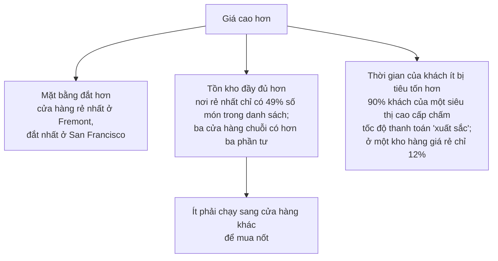
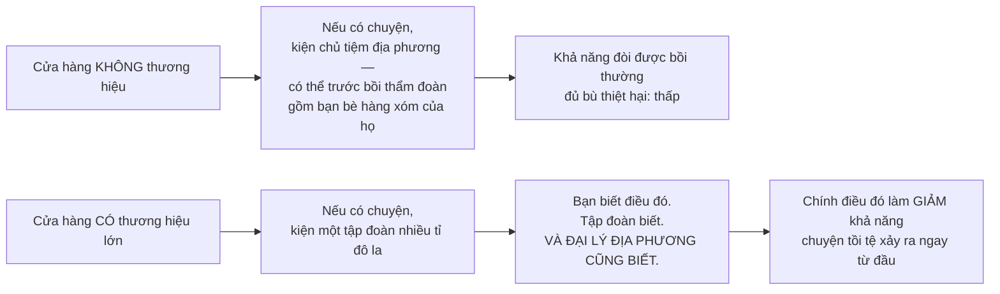

# Những lầm tưởng về thị trường

> Lầm tưởng lớn nhất nằm ngay trong cái tên. Ta quen nghĩ "thị trường" là một
> **vật**, trong khi nó là **con người** đang giao dịch với nhau theo những
> điều khoản mà họ tự thỏa thuận được.

## Vì sao cách gọi tên lại quan trọng

Khi thị trường bị hình dung như một **cơ chế vô hồn**, sẽ rất dễ mô tả việc
hạn chế quyền tự do giao dịch của người ta như là **giải cứu họ** khỏi "mệnh
lệnh" của cái cơ chế vô hồn ấy.

Nhưng nếu thị trường chỉ là con người thỏa thuận với nhau, thì việc đó không
giải cứu ai khỏi mệnh lệnh nào cả — nó chỉ **thay mệnh lệnh của chính họ bằng
mệnh lệnh của bên thứ ba**.

Sowell cũng giải thích vì sao ông thấy cần viết chương này: nhiều nhà kinh tế
học chuyên nghiệp coi những niềm tin kiểu này là **quá hời hợt, thậm chí ngớ
ngẩn** để bận tâm bác bỏ. Nhưng những niềm tin hời hợt đã có lúc lan rộng tới
mức **trở thành nền tảng cho luật pháp và chính sách** với hậu quả nghiêm
trọng, thậm chí thảm khốc.

## Lầm tưởng 1: giá là khoản "thu tô" cộng thêm

Ý tưởng cũ nhất và để lại hậu quả lớn nhất: giá cả được ví như trạm thu phí
lập ra vì lợi nhuận tư nhân, hoặc như hàng rào chặn dòng hàng hóa tới tay quần
chúng đang cần chúng.

Ẩn bên dưới là một giả định: **phần mà doanh nhân và nhà đầu tư nhận được vượt
quá giá trị mà họ đóng góp**. Niềm tin đó đủ sức thuyết phục để khiến người ta
cống hiến cả đời — đôi khi liều cả mạng sống — cho việc chấm dứt "bóc lột".

Và thành công chính trị của họ đã **biến niềm tin thành một thí nghiệm thực
tế**. Kết quả, như các chương trước đã cho thấy, là mức sống thấp hơn chứ
không cao hơn.

Sowell chốt bằng một phép loại suy gọn:

> Không ai nói rằng **tiền lương** chỉ là khoản phí tùy tiện cộng thêm vào giá
> hàng để làm lợi cho người lao động — vì rõ ràng sẽ không có sản xuất nếu
> không có họ, và họ sẽ không góp sức nếu không được trả công. Vậy mà phải mất
> rất lâu người ta mới nhận ra **điều tương tự** với người quản lý doanh nghiệp
> và người bỏ vốn.

Còn câu hỏi liệu khoản họ nhận có **lớn quá mức cần thiết** hay không thì có
một cách trả lời: **liệu có ai khác cung cấp cùng đóng góp đó với giá thấp hơn
không**. Và người đang phải trả tiền có đủ động lực để tìm ra câu trả lời bằng
dữ kiện cứng, trước khi móc hầu bao của chính mình.

## Lầm tưởng 2: "cùng một món mà nhiều giá"

Người ta hay nói cùng một thứ được bán với những mức giá rất khác nhau, như
thể điều đó bác bỏ quy luật cung cầu. Thường thì lỗi nằm ở chỗ **định nghĩa
hai thứ khác nhau là "giống nhau"**.

Ví dụ dễ nhất: **thiếp Giáng sinh** ngày 26/12 rẻ hơn hẳn ngày 24/12, dù về
mặt vật lý chúng **y hệt nhau**.

### Một khảo sát siêu thị rất có ích

Một tạp chí tiêu dùng ở bắc California so sánh tổng chi phí mua **cùng một giỏ
hàng, cùng nhãn hiệu**, ở nhiều siêu thị khác nhau:

| Kết quả | |
| --- | --- |
| Siêu thị rẻ nhất | **80** đô la |
| Siêu thị đắt nhất | **125** đô la |
| Ba cửa hàng **cùng một chuỗi** | từ **98** tới **103** đô la |

Vậy người mua ở nơi đắt hơn có bị lừa không? Hãy xem họ thật sự đang mua gì:

> Người tiêu dùng trả bằng **cả tiền lẫn thời gian**. Ai coi trọng thời gian
> của mình hơn thì sẵn lòng trả thêm tiền để đỡ mất thời gian.

Nói cách khác, khách ở các siêu thị khác nhau đang trả **giá khác nhau cho
những thứ khác nhau** — dù nếu chỉ nhìn đặc tính vật lý thì chúng có vẻ giống
nhau.

## Lầm tưởng 3: giá "hợp lý" và "vừa túi tiền"

Đây là câu đắt nhất chương, và nó thẳng tới mức gây khó chịu:

> Nói rằng giá **nên** hợp lý hay vừa túi tiền tức là nói rằng **thực tế kinh
> tế phải điều chỉnh theo ngân sách của chúng ta**, bởi vì chúng ta sẽ không
> điều chỉnh theo thực tế. Nhưng lượng nguồn lực cần để chế tạo và vận chuyển
> những thứ ta muốn **hoàn toàn độc lập** với số tiền ta sẵn lòng hoặc có khả
> năng trả.
>
> **Trông đợi một mức giá hợp lý là điều hoàn toàn không hợp lý.**

Có thể áp trần giá — và
[chương 3](../1-gia-ca-va-thi-truong/03-kiem-soat-gia.md) đã cho thấy hậu quả.
Có thể trợ giá — nhưng điều đó **không làm chi phí sản xuất giảm đi chút nào**,
nó chỉ có nghĩa là một phần chi phí được trả bằng **tiền thuế**.

Và nhắc lại phân biệt cốt lõi từ
[chương 4](../1-gia-ca-va-thi-truong/04-nhin-lai-toan-canh-ve-gia.md):

> **Giá không phải là chi phí. Giá là thứ dùng để trả cho chi phí.**

Chi phí y tế không giảm đi chút nào khi nhà nước ấn định mức trả thấp hơn cho
bác sĩ và bệnh viện. Vẫn cần ngần ấy nguồn lực để xây và trang bị một bệnh
viện, ngần ấy năm để đào tạo một sinh viên y thành bác sĩ.

> **Từ chối trả đủ chi phí không giống với việc làm giảm chi phí.** Nó thường
> dẫn tới giảm số lượng, giảm chất lượng, hoặc cả hai.

## Lầm tưởng 4: thương hiệu chỉ là quảng cáo

Thủ tướng đầu tiên của Ấn Độ từng hỏi: **tại sao chúng ta cần tới mười chín
nhãn kem đánh răng?**

Câu trả lời của Sowell: thương hiệu là cách **tiết kiệm tri thức khan hiếm**,
và là cách **buộc nhà sản xuất cạnh tranh cả về chất lượng** chứ không chỉ về
giá.

Ví dụ rất đời thường: bạn lái xe vào một thị trấn chưa từng đến và cần đổ xăng
hoặc ăn một chiếc bánh kẹp. Bạn **không có cách nào trực tiếp** để biết người
lạ ở cây xăng đang bơm gì vào bình xe bạn, hay người lạ kia đang nấu gì cho
bạn ăn.

Vế cuối là điểm tinh tế: giá trị của thương hiệu không nằm ở việc bạn kiện
được, mà ở chỗ **mọi người trong chuỗi đều biết bạn kiện được**, nên họ hành
xử khác đi.

Trong kinh tế toàn cầu, điều này còn quan trọng hơn. Người châu Âu và người Mỹ
có thể rất ngần ngại mua thiết bị viễn thông làm ở nửa vòng trái đất. Nhưng
khi một thương hiệu như **Samsung** đã tích lũy được **hồ sơ thành tích**,
người ở Berlin hay Chicago sẵn sàng mua nó ngang với mua sản phẩm làm ngay
cuối phố.

## Lầm tưởng 5: phi lợi nhuận thì hiệu quả hơn

Đây là phần Sowell dùng để kiểm chứng luận điểm trung tâm của cả cuốn sách.

**Phép thử ông đặt ra:** nếu lợi nhuận đúng là khoản phụ thu không cần thiết
cộng vào chi phí sản xuất, thì tổ chức phi lợi nhuận **lẽ ra phải** làm ra
cùng thứ đó rẻ hơn, bán rẻ hơn, và qua nhiều năm **giành dần khách** của doanh
nghiệp vì lợi nhuận.

**Điều thực sự xảy ra lại ngược lại:**

| Trường hợp | Con số |
| --- | --- |
| Nhà sách Đại học South Carolina do **trường tự vận hành** | hiếm khi lãi ròng tới **100.000** đô la một năm |
| Cùng nhà sách đó do một **chuỗi thương mại** vận hành | họ trả cho trường **500.000** đô la một năm — nghĩa là bản thân họ còn kiếm được nhiều hơn thế |
| Nhà sách Đại học Georgia, khi trường tự quản | **70%** số sách nằm trong kho |
| Sau khi một công ty tiếp quản | **70%** số sách được **bày ra** — nơi chúng dễ được mua hơn |

Các trường danh giá nhất nước Mỹ ngày càng giao việc vận hành nhà sách, căng
tin và các dịch vụ phụ trợ cho doanh nghiệp. Và lý do số một, theo ghi nhận
của một tạp chí giáo dục đại học, là **tiền**.

Một lý do cụ thể của khoản chênh: doanh nghiệp cắt được những lãng phí như
thuê nhân viên **quanh năm** cho một ngành có tính **mùa vụ cao** như nhà sách
đại học, nơi doanh số giáo trình dồn vào đầu mỗi học kỳ.

### Sức ép thiếu vắng dẫn tới đâu

Và Sowell đưa ra ví dụ lịch sử mạnh nhất về chuyện gì xảy ra khi không có sức
ép cạnh tranh — một ví dụ khiến người đọc phải dừng lại:

Trước Thế chiến thứ hai, **bệnh viện thuộc nhóm phân biệt chủng tộc nặng nhất**
trong giới chủ sử dụng lao động Mỹ, dù mục đích tuyên bố của họ hẳn sẽ được
phục vụ tốt hơn nếu tuyển bác sĩ giỏi nhất, kể cả khi người đó là người da đen
hay người Do Thái. Các quỹ phi lợi nhuận cũng vậy. Trong giới học thuật phi lợi
nhuận, **giáo sư da đen đầu tiên được biên chế chính thức tại một đại học lớn
mãi tới năm 1948**.

Trong khi đó, **hàng trăm nhà hóa học da đen đã làm việc cho các công ty hóa
chất vì lợi nhuận** nhiều năm trước khi người da đen được nhận dạy hóa ở các
trường phi lợi nhuận. Tương tự, bác sĩ da đen và bác sĩ Do Thái có phòng khám
tư phát đạt từ lâu trước khi họ được hành nghề ở nhiều bệnh viện phi lợi nhuận.

Đây là một trong những lập luận sắc nhất của Sowell, và nó không dễ bác: **áp
lực lợi nhuận buộc người ta phải bỏ qua định kiến của chính mình**, vì định
kiến tốn tiền. Nơi không có áp lực đó, định kiến được duy trì miễn phí — lập
luận đã gặp ở
[chương 10](../3-lao-dong-va-tien-luong/01-nang-suat-va-tien-luong.md).

### Và một cuộc bỏ phiếu bằng chân

Kibbutz đầu tiên ở Trung Đông được lập năm **1910** như một cộng đồng phi lợi
nhuận, nơi mọi người cung cấp hàng hóa và dịch vụ cho nhau và chia sản phẩm
theo nguyên tắc bình quân.

Chính kibbutz đầu tiên ấy **bỏ phiếu chấm dứt mô hình phi lợi nhuận và bình
quân vào năm 2007** — và tới thời điểm đó, **61%** số kibbutz ở Israel cũng đã
làm vậy. Một trong những lý do: **người trẻ bỏ đi** sang khu vực kinh tế thị
trường.

### Một cảnh báo về nguồn tin

Sowell nêu thêm một điểm ít ai nghĩ tới: truyền thông có xu hướng coi các tổ
chức phi lợi nhuận là **nguồn thông tin vô tư**. Nhưng tổ chức nào sống nhờ
**quyên góp liên tục** thì có động lực **gây hoảng sợ** để moi thêm tiền từ
người ủng hộ — và có rất ít ràng buộc buộc họ phải giữ cho những lời cảnh báo
ấy chính xác.

## Chỗ cần thận trọng

Phần về **giá khác nhau cho những thứ trông giống nhau** và phần về **thương
hiệu** là kinh tế học chuẩn mực và rất hữu dụng trong đời sống hằng ngày.

Phần về **tổ chức phi lợi nhuận** chứa một lập luận mạnh — bằng chứng lịch sử
về phân biệt chủng tộc là thật và khó bác. Nhưng nó được trình bày như một
cuộc so sánh chung giữa hai loại tổ chức, trong khi thực tế phức tạp hơn: các
tổ chức phi lợi nhuận tồn tại **chính ở những lĩnh vực** mà thị trường vận
hành kém — nghiên cứu cơ bản, chăm sóc người không có khả năng chi trả, bảo
tồn — và đo chúng bằng thước hiệu quả thương mại là đo sai thứ. Sowell chọn
đúng những ví dụ nơi hai loại tổ chức **cạnh tranh trực tiếp** trên cùng một
việc (nhà sách, căng tin), và ở đó lập luận của ông thuyết phục. Ngoài phạm vi
đó thì nó không tự động đúng.

## Điều cần nhớ

- **Thị trường không phải một vật** — nó là con người thỏa thuận. Hạn chế thị
  trường không giải phóng ai khỏi mệnh lệnh, chỉ đổi người ra mệnh lệnh.
- Cùng một món hàng ở hai nơi thường **không phải cùng một thứ**: mặt bằng,
  tồn kho và **thời gian của bạn** đều nằm trong giá.
- **Không có mức giá nào "hợp lý"** theo nghĩa độc lập với chi phí thật.
- **Thương hiệu tiết kiệm tri thức.** Giá trị của nó nằm ở chỗ người bán biết
  rằng bạn biết.
- Nếu lợi nhuận chỉ là khoản phụ thu thừa, tổ chức phi lợi nhuận đã thắng trên
  thị trường. Điều ngược lại đã xảy ra.

## Tự kiểm tra

1. Thiếp Giáng sinh ngày 24/12 và ngày 26/12 giống hệt nhau về vật lý. Vì sao
   giá khác nhau không vi phạm quy luật cung cầu?
2. Nêu ba thứ bạn đang mua khi trả giá cao hơn ở một siêu thị đắt tiền.
3. Vì sao "trông đợi giá hợp lý là điều không hợp lý"?
4. Giá trị thật của một thương hiệu với người tiêu dùng nằm ở đâu?
5. Vì sao bệnh viện phi lợi nhuận lại phân biệt đối xử nặng hơn công ty hóa
   chất tư nhân?

---

Trước: [Phần VII](./README.md) ·
Tiếp: [Những giá trị "phi kinh tế"](./02-gia-tri-phi-kinh-te.md)
