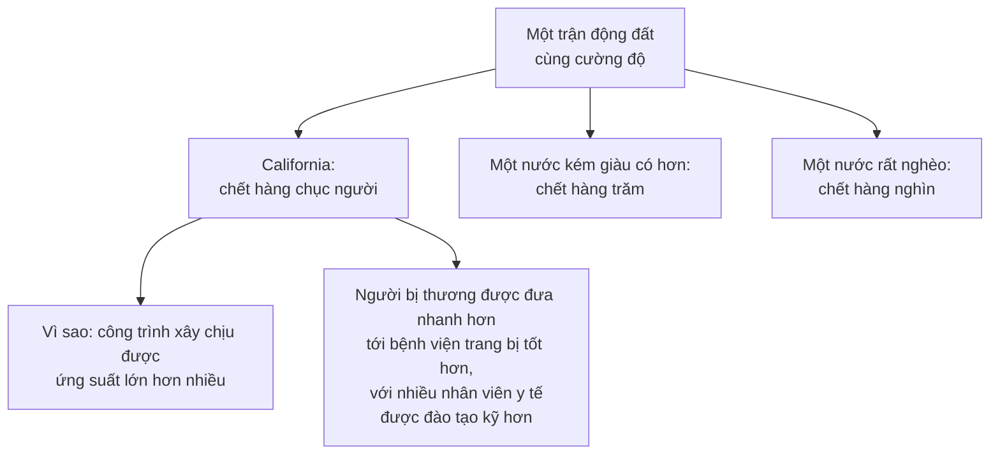

# Những giá trị "phi kinh tế"

> Khi một dự án tâm huyết bị chỉ ra là vô lý về mặt kinh tế, nơi trú ẩn cuối
> cùng thường là câu: *"kinh tế học thì đúng đấy, nhưng còn có những giá trị
> phi kinh tế nữa chứ."* Sowell đáp lại bằng một câu lật ngược toàn bộ.

## Câu trả lời

> Tất nhiên là có những giá trị phi kinh tế. Thật ra, **chỉ có những giá trị
> phi kinh tế** mà thôi.
>
> **Kinh tế học tự nó không phải là một giá trị.** Nó chỉ là một cách **cân
> giá trị này với giá trị kia**.

Điểm này đáng dừng lại, vì nó là chỗ nhiều người hiểu sai cả môn học.

Kinh tế học **không** nói rằng bạn nên kiếm càng nhiều tiền càng tốt. Sowell
nêu hai ví dụ, một nghiêm túc một hóm hỉnh: nhiều giáo sư kinh tế học có thể
kiếm được nhiều tiền hơn nếu ra làm cho doanh nghiệp tư nhân — và nhiều người
thạo súng ống có lẽ cũng kiếm được nhiều tiền hơn nếu đi làm sát thủ cho tội
phạm có tổ chức. Kinh tế học **không thúc đẩy bạn** chọn những con đường đó.

## Bằng chứng: chính các nhà kinh tế học và nhà tư bản

Sowell đưa ra một loạt ví dụ để cho thấy hiểu biết về thị trường không đồng
nghĩa với việc tôn thờ tiền bạc:

- **Adam Smith**, cha đẻ của kinh tế học tự do, đã cho đi những khoản tiền đáng
  kể của chính mình cho người kém may mắn — và làm việc đó **kín đáo tới mức
  chỉ sau khi ông mất**, khi người ta xem lại sổ sách cá nhân, điều đó mới được
  phát hiện.
- **Henry Thornton**, một trong những nhà kinh tế học tiền tệ hàng đầu thế kỷ
  19 và là một chủ ngân hàng, thường xuyên cho đi **hơn một nửa thu nhập hằng
  năm** trước khi lập gia đình, và tiếp tục quyên góp lớn sau đó — trong đó có
  cả phong trào **chống chế độ nô lệ**.
- Những thư viện công cộng đầu tiên ở thành phố New York **không phải do nhà
  nước lập** mà do doanh nhân công nghiệp **Andrew Carnegie**.
- **John D. Rockefeller** lập ra quỹ mang tên mình và **Đại học Chicago**.
- Ở Ấn Độ, gia tộc **Tata** lập Viện Tata ở Mumbai như một cơ sở học thuật, và
  gia tộc **Birla** lập nhiều cơ sở tôn giáo và xã hội khắp nước.

Và các con số ở cấp độ xã hội:

| | |
| --- | --- |
| Theo một danh sách năm **2007**, khoản quyên góp lớn nhất của một người Mỹ | **42 tỉ** đô la — bằng **42%** tổng tài sản của người đó |
| Tỉ lệ tài sản được cho đi cao nhất trong nhóm tỉ phú Mỹ | **63%** |
| Quyên góp từ thiện tư nhân **trên đầu người** ở Mỹ | **gấp nhiều lần** châu Âu |
| Tỉ lệ sản lượng quốc gia dành cho từ thiện ở Mỹ | **hơn gấp ba** Thụy Điển, Pháp hay Nhật |

> **Thị trường là cơ chế phân bổ nguồn lực khan hiếm. Việc bạn làm gì với số
> của cải thu được là chuyện hoàn toàn khác.**

## Lập luận "giá trị phi kinh tế" thật ra thường là gì

Đây là phần sắc nhất chương, và nó khó chịu theo cách hữu ích:

> Những lời lẽ cao đẹp về "giá trị phi kinh tế" thường quy về chuyện: **có
> những người không muốn giá trị riêng của họ bị đem ra cân với bất cứ thứ gì
> khác.**

Nếu ai đó muốn cứu một cái hồ hay bảo tồn một tòa nhà lịch sử, họ không muốn
điều đó bị cân với **chi phí** — tức là, xét cho cùng, bị cân với **tất cả
những việc khác có thể làm bằng cùng số nguồn lực đó**.

Với cách nghĩ ấy, không cần bận tâm rằng số tiền dùng để cứu cái hồ hay bảo
tồn tòa nhà có thể tiêm chủng cho bao nhiêu trẻ em ở các nước nghèo chống lại
những căn bệnh chết người. Câu trả lời sẽ là: hãy **làm tất cả** — tiêm chủng
cho lũ trẻ **và** cứu cái hồ **và** bảo tồn tòa nhà, cùng vô số việc tốt khác
nữa.

Sowell không nói cái hồ không đáng cứu. Ông nói rằng **từ chối cân đo không
làm cho sự đánh đổi biến mất** — nó chỉ khiến sự đánh đổi được thực hiện mà
không ai nhìn thấy.

Và ông chốt bằng một so sánh đáng nhớ:

> Chính trị đôi khi được gọi là "nghệ thuật của cái khả thi", nhưng cụm từ đó
> đúng với **kinh tế học** hơn nhiều. **Chính trị cho phép người ta bỏ phiếu
> cho những điều bất khả thi** — và có lẽ đó là một lý do khiến chính trị gia
> thường được lòng dân hơn các nhà kinh tế học, những người cứ nhắc đi nhắc lại
> rằng không có bữa trưa miễn phí và không có "giải pháp", chỉ có đánh đổi.

Câu cuối là điểm quan trọng nhất: **ngay cả khi ta từ chối lựa chọn, hoàn cảnh
vẫn sẽ lựa chọn thay ta** — khi ta hết nguồn lực cho nhiều việc quan trọng mà
lẽ ra ta đã có thể có, nếu chịu khó cân nhắc các phương án.

## Trường hợp khó nhất: mạng người

Đây là nơi lập luận "giá trị phi kinh tế" mạnh nhất, và Sowell đối diện trực
tiếp với nó.

Rất nhiều đạo luật, chính sách hay thiết bị an toàn cực kỳ tốn kém được biện
minh bằng một câu: **"nếu nó cứu được dù chỉ một mạng người"** thì nó đáng giá
bất kể chi phí.

Phản biện của ông: **một trong những công dụng thay thế của nguồn lực đó là
cứu những mạng người khác theo cách khác.**

### Của cải cứu mạng người

Đây là lập luận ít được nói tới nhưng có sức nặng:

> Ít thứ nào cứu được nhiều mạng người bằng **chính sự tăng trưởng của cải**.

Và ông đưa ra một cặp số liệu rất thuyết phục từ một công ty tái bảo hiểm về
năm **2013**:

| Loại thiệt hại do thiên tai | Các nước đứng đầu |
| --- | --- |
| **Thiệt hại tài chính** lớn nhất | Đức, Cộng hòa Séc, Pháp |
| **Thiệt hại về sinh mạng** lớn nhất | Philippines, Ấn Độ |

Cùng một năm, hai bảng xếp hạng **hoàn toàn khác nhau**. Thiên tai xảy ra ở cả
nước giàu lẫn nước nghèo — Sowell còn nhắc rằng nước Mỹ **đứng đầu thế giới về
số cơn lốc xoáy** — nhưng **hậu quả thì rất khác**.

Cũng vì chi phí y tế và các biện pháp phòng bệnh như nhà máy xử lý nước và hệ
thống thoát nước thải, các nước nghèo chịu thiệt hại lớn hơn nhiều từ bệnh
tật, kể cả những bệnh gần như đã bị xóa sổ ở các nước giàu. Kết quả ròng:
**tuổi thọ ngắn hơn**.

### Phép tính khó chịu

Từ đó Sowell rút ra một lập luận mà nhiều người thấy khó chấp nhận, nhưng khó
bác về mặt logic:

Đã có nhiều cách tính xem thu nhập quốc dân tăng bao nhiêu thì cứu được bao
nhiêu mạng người. Gọi con số đó là **X triệu đô la cho một mạng người**.

> Bất cứ thứ gì **ngăn** thu nhập quốc dân tăng thêm ngần ấy thì trên thực tế
> đã **khiến mất một mạng người**.
>
> Nếu một quy định an toàn tốn **5X triệu** đô la — trực tiếp, hoặc qua tác
> động kìm hãm tăng trưởng — thì **không còn có thể nói** rằng nó đáng giá
> "nếu cứu được dù chỉ một mạng", bởi nó làm được điều đó bằng cái giá của
> **5 mạng người khác**.

### Và một phép quy nạp tới cùng

Có người sẽ nói rằng không có giới hạn nào cho giá trị của một mạng người.
Sowell đẩy câu đó tới kết luận logic của nó:

> Dù nghe cao quý tới đâu, trong thế giới thật **sẽ không ai ủng hộ** việc chi
> **một nửa sản lượng cả năm của một quốc gia** để giữ **một người** sống thêm
> **30 giây**. Vậy mà đó chính là hệ quả logic của tuyên bố rằng một mạng
> người có giá trị vô hạn.

Nói cách khác: **hành vi thật của con người luôn thể hiện một sự cân đo**, kể
cả khi lời nói của họ phủ nhận điều đó.

## Chỗ cần thận trọng

Lập luận cốt lõi — rằng từ chối cân đo không làm sự đánh đổi biến mất — là
đúng và đáng giữ. Nó cũng là một lập luận **cắt cả hai chiều**: nó áp vào
những chính sách mà chính Sowell ủng hộ, chứ không chỉ vào những chính sách
ông phê phán.

Chỗ cần tỉnh táo là phép tính "X triệu đô la một mạng người". Bản thân phép
tính có giá trị khi so sánh **giữa các phương án cùng nhằm cứu người** — chọn
tiêm chủng hay chọn lan can đường, chẳng hạn. Nó yếu đi đáng kể khi được dùng
để **bác bỏ một quy định an toàn nói chung**, vì:

- Con số X không phải một hằng số được đo chắc chắn; các ước lượng khác nhau
  rất xa.
- Nó giả định rằng nguồn lực **không chi cho quy định đó** sẽ thật sự chảy vào
  tăng trưởng và từ đó cứu người — một chuỗi nhân quả dài và không tự động.
- Và nó bỏ qua một câu hỏi mà chính Sowell đã đặt rất hay ở
  [chương 18](../5-kinh-te-quoc-gia/03-chuc-nang-cua-chinh-phu.md): **ai** chịu
  rủi ro và **ai** hưởng lợi. Năm mạng người được cứu nhờ tăng trưởng và một
  mạng người mất vì thiếu quy định an toàn không phải là những con người có thể
  hoán đổi cho nhau trên một bảng tính.

Nói vậy không phải để bác lập luận, mà để dùng nó đúng chỗ: **nó là công cụ so
sánh các phương án, không phải công cụ để kết thúc tranh luận.**

## Điều cần nhớ

- **Kinh tế học không phải một giá trị.** Nó là cách cân giá trị này với giá
  trị kia.
- Hiểu thị trường không đồng nghĩa với tôn thờ tiền — Adam Smith cho đi phần
  lớn tài sản một cách kín đáo.
- Câu "có những giá trị phi kinh tế" thường có nghĩa là **"đừng cân giá trị
  của tôi với thứ gì cả"**.
- **Chính trị cho phép bỏ phiếu cho điều bất khả thi.** Kinh tế học thì không.
- **Của cải cứu mạng người.** Cùng một trận động đất giết hàng chục người ở
  nước giàu và hàng nghìn ở nước nghèo.
- Nói một mạng người có giá trị **vô hạn** dẫn tới những kết luận mà không ai
  thật sự chấp nhận.

## Tự kiểm tra

1. Vì sao Sowell nói rằng **chỉ có** những giá trị phi kinh tế?
2. Câu "có những giá trị phi kinh tế cần cân nhắc" thường che giấu điều gì?
3. Vì sao bảng xếp hạng thiệt hại tài chính và bảng xếp hạng thiệt hại sinh
   mạng do thiên tai lại khác nhau hoàn toàn?
4. "Nếu nó cứu được dù chỉ một mạng người" sai ở chỗ nào?
5. Hệ quả logic của việc nói một mạng người có giá trị vô hạn là gì?

---

Trước: [Những lầm tưởng về thị trường](./01-nhung-lam-tuong-ve-thi-truong.md) ·
Tiếp: [Lịch sử kinh tế học](./03-lich-su-kinh-te-hoc.md)
