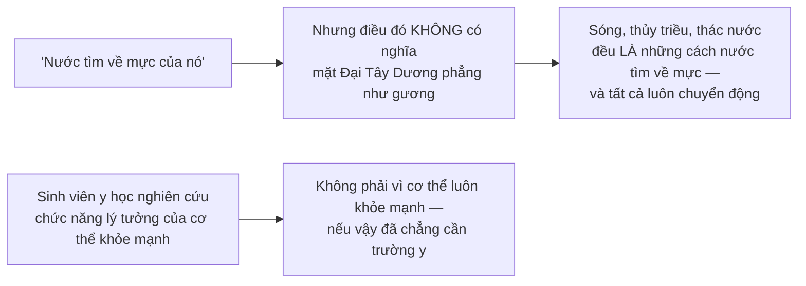
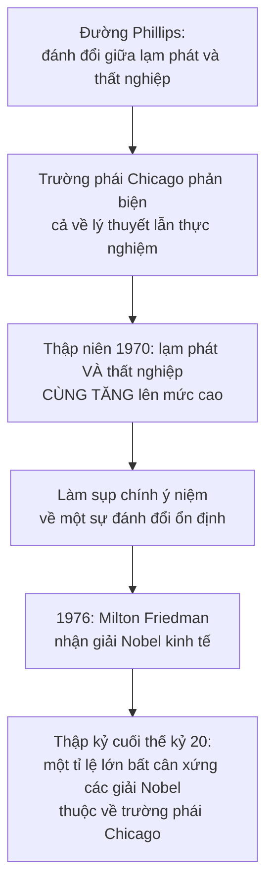

# Lịch sử kinh tế học

> Đọc chương này bạn sẽ nhận ra một điều hữu ích: **những lập luận bạn gặp
> hằng ngày trên mạng phần lớn là các trường phái cũ** — một số đã bị bác bỏ
> từ hai thế kỷ trước, một số vẫn còn sống.

## Ngành này bắt đầu từ bao giờ?

Không có ngày cụ thể. Người ta đã bàn về các vấn đề kinh tế hàng nghìn năm:
**Xenophon**, học trò của Socrates, đã phân tích chính sách kinh tế ở Athens
cổ đại hơn hai nghìn năm trước.

Kinh tế học hiện đại thường được tính từ năm **1776**, khi Adam Smith xuất bản
*Của cải của các dân tộc*. Nhưng đã có những cuốn sách đáng kể về kinh tế từ
ít nhất một thế kỷ trước đó, và cùng thời với Smith còn có trường phái
**Trọng nông** (Physiocrat) ở Pháp — một số thành viên của nhóm này Smith đã
gặp khi đi Pháp, nhiều năm trước khi ông viết tác phẩm của mình.

Vậy điều gì khiến cuốn sách năm 1776 thành cột mốc? Không phải vì nó đến trước,
mà vì nó **trở thành nền móng cho cả một trường phái** — những người tiếp nối
và phát triển ý tưởng của nó suốt hai thế hệ sau, trong đó có **David Ricardo**
(1772–1823) và **John Stuart Mill** (1806–1873).

Trước Smith, có những cây bút xuất sắc nhưng **không ai tạo ra được một dòng
chảy như vậy**.

## Thời trung cổ: "giá công bằng"

Thời trung cổ, các quan niệm tôn giáo về một mức **giá "công bằng"** và lệnh
cấm cho vay lấy lãi đã khiến **Thomas Aquinas** phải phân tích xem những giáo
lý đó kéo theo hệ quả kinh tế gì, và những ngoại lệ nào có thể chấp nhận được
về mặt đạo đức.

Kết luận của Aquinas đáng chú ý vì nó hiện đại hơn ta tưởng: bán một thứ **đắt
hơn giá mua vào** là hợp lệ khi người bán đã **cải thiện món hàng** theo cách
nào đó, hoặc như một khoản **bù cho rủi ro**, hoặc vì đã **chịu chi phí vận
chuyển**.

Nói cách khác — và đây là cách Sowell diễn giải lại: rất nhiều thứ **trông như
lợi dụng người khác** thực chất là khoản bù cho các chi phí và rủi ro phát sinh
trong quá trình đưa hàng tới tay người tiêu dùng.

Và ông chỉ ra rằng khái niệm "giá công bằng" **vẫn chưa chết**: nó còn lởn vởn
trong cách người ta nói về việc thứ gì đó bị bán **trên hoặc dưới "giá trị
thật"**, về việc ai đó được trả **hơn hoặc kém mức họ "thật sự" xứng đáng**, và
trong những khái niệm nặng cảm xúc nhưng không định nghĩa được bằng thực
nghiệm như **"thổi giá"**.

Bạn đã gặp lại đúng những khái niệm này ở
[chương 2](../1-gia-ca-va-thi-truong/02-vai-tro-cua-gia-ca.md) và
[chương 3](../1-gia-ca-va-thi-truong/03-kiem-soat-gia.md). Chúng đã hơn bảy
trăm năm tuổi.

## Trường phái trọng thương: mục tiêu là **quyền lực**, không phải mức sống

Đây là phần quan trọng nhất để hiểu vì sao ngôn ngữ kinh tế ngày nay vẫn méo.

Các nhà **trọng thương** (mercantilist) thịnh hành từ thế kỷ 16 tới thế kỷ 18.
Lập luận của họ: một nước nên **xuất nhiều hơn nhập**, để phần chênh được trả
bằng **vàng** chảy vào. Và họ **đồng nhất vàng với của cải**.

Điểm mà Sowell nhấn mạnh, và nó làm sáng tỏ mọi thứ: **mục tiêu của họ không
phải là mức sống của dân chúng**. Họ quan tâm tới sức mạnh của **chính phủ**
quốc gia, dựa trên lượng của cải mà người cầm quyền có thể sử dụng — để thắng
trong chiến tranh, hoặc để răn đe kẻ thù bằng sự giàu có phô ra.

Nên việc **ghìm lương bằng quyền lực nhà nước** được họ coi là một cách hạ chi
phí hàng xuất khẩu. Và với một số người trong nhóm, chủ nghĩa thực dân và cả
chế độ nô lệ đều chấp nhận được vì cùng lý do.

Chi tiết lạnh người nhất: một tác giả trọng thương năm **1767** có thể viết về
việc **cả một quốc gia được nuôi và chu cấp "miễn phí"** nhờ chế độ nô lệ. Nô
lệ rõ ràng là một phần **dân số** — nhưng họ **không được coi là một phần của
"quốc gia"**.

> Và đây là di sản còn sót lại: chính từ trường phái này mà ta có cách gọi xuất
> siêu là cán cân **"thuận lợi"** và nhập siêu là **"bất lợi"** — cách gọi mà
> [chương 22](../6-kinh-te-quoc-te/02-dich-chuyen-cua-cai-giua-cac-nuoc.md) đã
> cho thấy là vô nghĩa.

## Adam Smith: định nghĩa lại hai chữ

Cú đánh của Smith vào phái trọng thương nằm ở chỗ ông **định nghĩa lại hai
khái niệm nền tảng**.

### "Quốc gia" là ai?

Smith hiểu quốc gia là **toàn bộ những người sống trong đó**. Từ đó suy ra bạn
**không thể** làm một quốc gia giàu lên bằng cách ghìm lương để xuất khẩu.
Luận điểm của ông: không một xã hội nào có thể thịnh vượng và hạnh phúc khi
phần đông thành viên của nó nghèo khổ.

### "Của cải" là gì?

Chính nhan đề cuốn sách đã đặt ra câu hỏi này. Smith lập luận rằng của cải nằm
ở **hàng hóa và dịch vụ** quyết định mức sống của người dân — chứ **không phải
ở vàng**.

Bạn đã gặp câu này ở
[chương 1](../1-gia-ca-va-thi-truong/01-kinh-te-hoc-la-gi.md) và
[chương 17](../5-kinh-te-quoc-gia/02-tien-te-va-he-thong-ngan-hang.md). Nó ra
đời năm 1776, và vẫn chưa được hiểu hết.

### Chuyển giao hay tạo ra?

Sowell tóm gọn khác biệt bằng một cặp từ:

| | Phái trọng thương | Adam Smith |
| --- | --- | --- |
| Bận tâm với | **Chuyển giao** của cải — qua xuất siêu, thuộc địa, nô lệ | **Tạo ra** của cải |
| Tính chất | Tổng bằng không: người này được là người kia mất | **Không** tổng bằng không: mọi nước có thể cùng tiến lên |

Smith cũng bác bỏ chủ nghĩa thực dân và chế độ nô lệ **trên cả cơ sở kinh tế
lẫn đạo đức**: ông lập luận rằng những "hạm đội và quân đội lớn" cần cho việc
duy trì đế chế **không mang về được gì bù nổi chi phí nuôi chúng**, và ông kết
thúc cuốn sách bằng lời kêu gọi nước Anh **từ bỏ giấc mộng đế quốc**. Với chế
độ nô lệ, ông coi đó là thứ vừa vô đạo đức vừa **kém hiệu quả về kinh tế**, và
**gạt bỏ với thái độ khinh bỉ** cái ý cho rằng những người châu Phi bị bắt làm
nô lệ là thấp kém hơn người gốc châu Âu.

### Một hiểu lầm cần sửa

Đây là điểm Sowell nêu rất rõ, và nó đáng nhớ:

> Adam Smith ngày nay thường bị xem là một nhân vật **"bảo thủ"**. Trên thực
> tế ông **tấn công rất nhiều ý tưởng và lợi ích đang thống trị thời của
> chính ông.**

Ông liên tục đả kích các đạo luật phục vụ lợi ích đặc biệt của **"thương nhân
và nhà chế tạo"**, mô tả hoạt động chính trị của họ là nhằm **đánh lừa và áp
bức công chúng**.

> Trong bối cảnh thời đó, **laissez faire là một học thuyết chống lại việc nhà
> nước ban ân huệ cho doanh nghiệp** — chứ không phải ủng hộ doanh nghiệp.

(Chính cái tên "trọng thương" — *mercantilism* — cũng bắt nguồn từ chữ
"thương nhân", và đó là thứ Smith phản đối.)

Và có một điều cấp tiến hơn nữa trong ý tưởng của ông: khái niệm về một **hệ
thống tự cân bằng một cách tự phát** là một bước ngoặt triệt để — không chỉ
trong cách phân tích nhân quả xã hội, mà còn ở chỗ nó **thu hẹp vai trò của
giới tinh hoa** chính trị và trí thức như những người dẫn dắt hay kiểm soát
quần chúng. Suốt nhiều thế kỷ trước đó, từ Plato trở đi, các nhà tư tưởng lớn
đều bàn về việc **những nhà lãnh đạo sáng suốt nên áp đặt chính sách gì** cho
xã hội.

## Ricardo: kinh tế học tách khỏi bình luận xã hội

**David Ricardo** là nhà kinh tế học hàng đầu đầu thế kỷ 19, và là người phát
triển **lý thuyết lợi thế so sánh** mà bạn đã gặp ở
[chương 21](../6-kinh-te-quoc-te/01-thuong-mai-quoc-te.md).

Nhưng đóng góp của ông không chỉ là nội dung mà còn là **phong cách**. Cuốn
sách của Adam Smith đầy bình luận xã hội và quan sát triết học. Tác phẩm của
Ricardo năm **1817** là **cuốn kinh điển đầu tiên** dành riêng cho việc phân
tích các **nguyên lý bền vững**, tách khỏi bình luận xã hội, chính trị và triết
học, và nhấn mạnh nguyên lý hơn là các vấn đề chính sách trước mắt.

Sowell nói rõ điều này **không** có nghĩa Ricardo thờ ơ với các vấn đề xã hội.
Một phần phân tích của ông xuất phát từ chính những khó khăn kinh tế của nước
Anh sau các cuộc chiến Napoleon. Nhưng những nguyên lý ông rút ra không bị
giới hạn trong bối cảnh đó — cũng như định luật hấp dẫn của Newton không bị
giới hạn ở những quả táo rơi.

### Một điểm mù của trường phái cổ điển

Một hệ quả của việc Smith chống lại phái trọng thương: các nhà kinh tế học cổ
điển **hạ thấp vai trò của tiền**, gọi nó là một **"tấm màn che"** — che khuất
chứ không làm thay đổi về bản chất các hoạt động kinh tế thật bên dưới.

Sowell công bằng ở đây: các nhà kinh tế học cổ điển hàng đầu **có hiểu** rằng
cung tiền co lại có thể làm giảm sản xuất và tăng thất nghiệp. Nhưng điều đó
**không phải lúc nào cũng rõ với người đọc họ**, và bản thân sự chú ý của họ
hiếm khi hướng về phía ấy.

Đó chính là điểm mù mà thế kỷ 20 sẽ phải trả giá để lấp — xem
[chương 16](../5-kinh-te-quoc-gia/01-san-luong-quoc-gia.md).

## Alfred Marshall và một lời khuyên đáng nhớ

Marshall hòa giải phần lớn kinh tế học cổ điển với các khái niệm mới về **hữu
dụng biên**, và giáo trình của ông là sách chuẩn mực suốt tới nửa đầu thế kỷ
20, qua **tám lần tái bản** trong đời ông.

Nhưng câu chuyện đáng nhớ nhất là về **cách ông đến với ngành này**:

Marshall vốn học triết học, và **phê phán tình trạng bất bình đẳng kinh tế
trong xã hội** — cho tới khi có người bảo ông rằng ông **cần hiểu kinh tế học
trước khi đưa ra những phán xét như vậy**. Sau khi tìm hiểu và nhìn sự việc
dưới một ánh sáng rất khác, chính mối bận tâm với người nghèo đã khiến ông
**đổi nghề** và trở thành nhà kinh tế học.

Về sau ông nói rằng điều các nhà cải cách xã hội cần là **cái đầu lạnh** đi kèm
với **trái tim ấm**.

Đó có lẽ là lời khuyên gọn nhất cho người đang đọc cuốn sách này.

## Cân bằng: một khái niệm hay bị hiểu sai

Nhiều người không quen kinh tế học cho rằng các điều kiện **cân bằng**
(equilibrium) là phi thực tế, vì chúng trông khác hẳn thực tế quan sát được.

Hai phép loại suy của Sowell giải quyết chuyện này rất gọn:

> **Toàn bộ mục đích của việc nghiên cứu trạng thái cân bằng là để hiểu điều gì
> xảy ra khi mọi thứ KHÔNG ở trạng thái cân bằng.**

Từ đây có hai từ bạn sẽ gặp suốt đời:

| | Nghiên cứu cái gì |
| --- | --- |
| **Kinh tế học vi mô** | Cân bằng và mất cân bằng ở **từng thị trường** cụ thể |
| **Kinh tế học vĩ mô** | Thay đổi của **cả nền kinh tế**: lạm phát, thất nghiệp, tổng sản lượng |

Nhưng Sowell nhấn mạnh rằng sự phân chia tiện lợi đó **che mất** một sự thật:
mọi thành phần đều ảnh hưởng lẫn nhau. Và ông trích lại chính hai nhà kinh tế
học Liên Xô mà bạn đã gặp ở
[chương 2](../1-gia-ca-va-thi-truong/02-vai-tro-cua-gia-ca.md): trong thế giới
của giá cả, mọi thứ đều liên kết với nhau tới mức **thay đổi nhỏ nhất ở một
mắt xích cũng được truyền tiếp tới hàng triệu mắt xích khác**.

Ví dụ: khi ngân hàng trung ương nâng lãi suất để giảm nguy cơ lạm phát, điều
đó có thể làm giá nhà giảm, tiết kiệm tăng và doanh số ô tô đi xuống — cùng
vô số dội lại khác lan ra mọi hướng.

Ngành nghiên cứu những phụ thuộc chằng chịt này gọi là **cân bằng tổng quát**,
mà nhân vật cột mốc là nhà kinh tế học Pháp **Léon Walras** (1834–1910). Sowell
ghi nhận Walras có những người đi trước — như **François Quesnay** ở thế kỷ 18
với bảng biểu nối các hoạt động kinh tế với nhau, và cả **Karl Marx** trong tập
hai bộ *Tư bản* với các phương trình mô tả cách từng phần của nền kinh tế thị
trường tác động lên các phần khác.

### Và đây là hệ quả thực tiễn

Lý thuyết cân bằng tổng quát nghe hàn lâm, nhưng nó có một hàm ý mà ai cũng
hiểu được và ai cũng nên nhớ:

> Chính trị gia rất thường nêu ra một "vấn đề" kinh tế cụ thể mà họ sẽ "giải
> quyết", **mà không hề để ý** tới việc những dội lại của "giải pháp" ấy sẽ lan
> khắp nền kinh tế ra sao — với hậu quả có thể **lớn hơn nhiều** so với chính
> tác dụng của giải pháp đó.

Ví dụ: luật áp trần lãi suất có thể làm giảm số khoản vay được cấp, **thay đổi
thành phần những người vay được** — người thu nhập thấp bị loại ra trước tiên
— đồng thời ảnh hưởng tới giá trái phiếu doanh nghiệp và cả trữ lượng tài
nguyên đã biết.

> **Hầu như không giao dịch kinh tế nào diễn ra một cách biệt lập**, dù nó
> thường được nhìn một cách biệt lập bởi những người quen nghĩ theo kiểu tạo ra
> "giải pháp" cho từng "vấn đề".

## Keynes và cuộc cách mạng thế kỷ 20

Phát triển nổi bật nhất của kinh tế học thế kỷ 20 là việc nghiên cứu **biến
động của sản lượng quốc gia** từ thời bùng nổ tới thời suy thoái — và động lực
cho nó là Đại khủng hoảng thập niên 1930.

Cuốn sách của **John Maynard Keynes** năm **1936** trở thành cuốn sách kinh tế
**nổi tiếng nhất và ảnh hưởng nhất của thế kỷ 20**. Tới giữa thế kỷ, nó là
chính thống ở các khoa kinh tế hàng đầu thế giới — với ngoại lệ đáng chú ý là
**Đại học Chicago** và một vài nơi khác.

**Keynes đã thêm gì vào ngành này?** Sowell diễn đạt rất gọn: bên cạnh mối bận
tâm truyền thống về việc **phân bổ** nguồn lực khan hiếm, Keynes thêm vào mối
bận tâm về những giai đoạn mà một phần lớn nguồn lực của một quốc gia — cả lao
động lẫn vốn — **hoàn toàn không được phân bổ vào đâu cả**.

Điều đó đúng với thời điểm ông viết: doanh nghiệp sản xuất dưới xa công suất
bình thường, và **tới một phần tư** người lao động Mỹ thất nghiệp.

Lập luận chính sách kéo theo: thay vì **chờ** thị trường tự điều chỉnh và khôi
phục việc làm đầy đủ, phái Keynes cho rằng **chi tiêu của nhà nước** có thể đạt
cùng kết quả **nhanh hơn và ít tác dụng phụ đau đớn hơn**. Họ có nhận ra rằng
chi tiêu nhà nước kéo theo rủi ro lạm phát — nhưng đó là rủi ro mà họ thấy
**chấp nhận được và quản lý được**, xét tới phương án thay thế là mức thất
nghiệp như trong Đại khủng hoảng.

Trong lúc viết tác phẩm lớn của mình, Keynes viết thư cho George Bernard Shaw
nói rằng ông tin mình đang viết một cuốn sách lý thuyết kinh tế sẽ **cách mạng
hóa cách thế giới nghĩ về các vấn đề kinh tế** — không phải ngay, mà trong
khoảng mười năm tới. Sowell ghi nhận: **cả hai dự đoán đều thành sự thật.**

(Một chi tiết đáng chú ý: các chính sách **Kinh tế Mới** ở Mỹ thời đó dựa trên
những quyết định **tùy nghi từng việc**, chứ không dựa trên thứ gì có hệ thống
như kinh tế học Keynes.)

## Và cuộc phản công

Sau khi Keynes mất năm **1946**, nghiên cứu thực nghiệm xuất hiện gợi ý rằng
người làm chính sách có thể **chọn từ một thực đơn đánh đổi** giữa tỉ lệ thất
nghiệp và tỉ lệ lạm phát — thứ được gọi là **đường Phillips**, theo tên nhà
kinh tế học A.W. Phillips.

Sowell gọi đó là **đỉnh cao của kinh tế học Keynes**. Rồi:

Luận điểm chung của trường phái Chicago: **thị trường lý trí hơn và phản ứng
nhanh hơn** so với giả định của phái Keynes — còn **nhà nước thì kém hơn**, ít
nhất theo nghĩa thúc đẩy lợi ích quốc gia, khác với việc thúc đẩy sự nghiệp
của chính trị gia.

Sowell cũng ghi nhận một hệ quả đáng tiếc của giai đoạn này: kinh tế học đã
trở nên **chuyên môn hóa và toán học hóa** tới mức công trình của các học giả
hàng đầu **không còn là thứ mà hầu hết mọi người, thậm chí hầu hết các học giả
ngoài ngành, có thể theo dõi được**.

### Một câu bị trích sai suốt nhiều thập kỷ

Chi tiết hay nhất chương, và nó là một bài học về việc đọc trích dẫn.

Khi ảnh Keynes xuất hiện trên bìa một tạp chí lớn ngày **31/12/1965** — lần
đầu tiên một người **đã qua đời** được vinh danh như vậy — bài báo bên trong
trích lời Milton Friedman, nhà kinh tế học phi-Keynes hàng đầu, rằng **"giờ đây
tất cả chúng ta đều là người theo Keynes"**.

Điều Friedman **thật sự** nói là: *"Giờ đây tất cả chúng ta đều là người theo
Keynes, và không còn ai là người theo Keynes nữa"* — nghĩa là trong khi mọi
người đã hấp thụ một phần đáng kể những gì Keynes dạy, **không còn ai tin vào
toàn bộ điều đó**.

Nửa vế bị cắt đã đảo ngược ý nghĩa của cả câu.

Và Sowell chốt phần này một cách công bằng: **đóng góp của Keynes không biến
mất** — rất nhiều khái niệm và nhận thức của ông đã trở thành vốn liếng chung
của các nhà kinh tế học thuộc **mọi trường phái**.

## Những người khổng lồ không làm ra thứ hoàn hảo

Một nhận xét về cách khoa học thật sự tiến lên, đáng nhớ:

> Thật hấp dẫn khi nghĩ lịch sử kinh tế học là lịch sử của một chuỗi những nhà
> tư tưởng vĩ đại. Nhưng **những người tiên phong hiếm khi tạo ra được phân
> tích hoàn chỉnh**. Những chỗ hổng, chỗ mờ, lỗi sai và thiếu sót vốn thường
> gặp ở người mở đường trong nhiều lĩnh vực thì cũng thường gặp trong kinh tế
> học.

Việc làm rõ, vá lại và hệ thống hóa chặt chẽ hơn đòi hỏi công sức tận tụy của
**rất nhiều người khác** — những người không có thiên tài của các vĩ nhân,
nhưng **nhìn nhiều điều cụ thể rõ hơn** chính các vĩ nhân đó.

Ví dụ Sowell đưa ra: Ricardo chắc chắn là nhân vật cột mốc lớn hơn nhiều so
với **Samuel Bailey**, một người cùng thời ít tên tuổi — nhưng có một số điều
Bailey **diễn đạt rõ ràng hơn** chính Ricardo. Và trong thế kỷ 20, kinh tế học
Keynes dần được trình bày bằng những khái niệm, định nghĩa, đồ thị và phương
trình **không hề có trong các tác phẩm của chính Keynes**.

## Kinh tế học có phải là khoa học không?

Câu hỏi khép chương. Sowell trả lời thẳng thắn hơn ta tưởng.

Ông thừa nhận: **không nghi ngờ gì rằng các nhà kinh tế học, với tư cách cá
nhân, đều có sở thích và thiên kiến riêng** — cũng như mọi cá nhân khác, kể cả
các nhà toán học và vật lý học.

Vậy vì sao toán học và vật lý không bị coi là chỉ gồm ý kiến chủ quan? Vì ở đó
có những **quy trình được chấp nhận chung để kiểm định** các niềm tin. Và chính
**vì** từng nhà khoa học có thể có thiên kiến mà giới khoa học nói chung mới
tìm cách tạo ra những quy trình như vậy.

Đây là một tiêu chuẩn đáng nhớ — và, như
[chương mở đầu](../00-luan-diem.md) đã gợi ý, nó là tiêu chuẩn mà bạn nên áp
vào **chính cuốn sách này**: khẳng định nào có thể kiểm định được, và bằng dữ
liệu nào?

## Điều cần nhớ

- **Phái trọng thương** nhắm tới quyền lực quốc gia, không phải mức sống. Từ
  đó mà có ngôn ngữ méo về cán cân "thuận lợi".
- **Adam Smith định nghĩa lại hai chữ**: "quốc gia" là toàn bộ dân chúng, và
  "của cải" là hàng hóa dịch vụ chứ không phải vàng.
- *Laissez faire* nguyên thủy là học thuyết **chống lại ân huệ nhà nước dành
  cho doanh nghiệp**.
- **Cân bằng** không mô tả thế giới thật — nó là công cụ để hiểu chuyển động
  khi thế giới **mất** cân bằng.
- **Mọi thứ liên kết với nhau.** Một "giải pháp" cho một "vấn đề" luôn dội
  sang chỗ khác.
- **Keynes** đưa vào ngành này câu hỏi về những giai đoạn nguồn lực **không hề
  được phân bổ**; trường phái Chicago đưa lại câu hỏi về **giới hạn của nhà
  nước**. Cả hai đều còn nằm trong vốn liếng chung.
- **Cái đầu lạnh, trái tim ấm.**

## Tự kiểm tra

1. Vì sao cuốn sách năm 1776 của Adam Smith là cột mốc, dù không phải công
   trình kinh tế đầu tiên?
2. Mục tiêu của phái trọng thương là gì — và vì sao điều đó khiến họ chấp nhận
   ghìm lương?
3. Adam Smith đã định nghĩa lại hai khái niệm nào?
4. Vì sao việc Đại Tây Dương không phẳng như gương lại không bác bỏ lý thuyết
   cân bằng?
5. Milton Friedman thật sự đã nói gì về Keynes, và vế bị cắt đã thay đổi ý
   nghĩa ra sao?

---

Trước: [Những giá trị "phi kinh tế"](./02-gia-tri-phi-kinh-te.md) ·
Tiếp: [Lời kết](./04-loi-ket.md)
