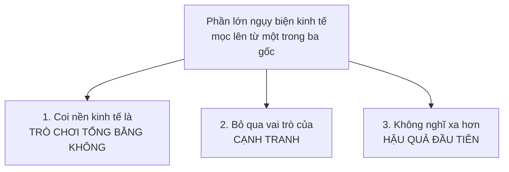
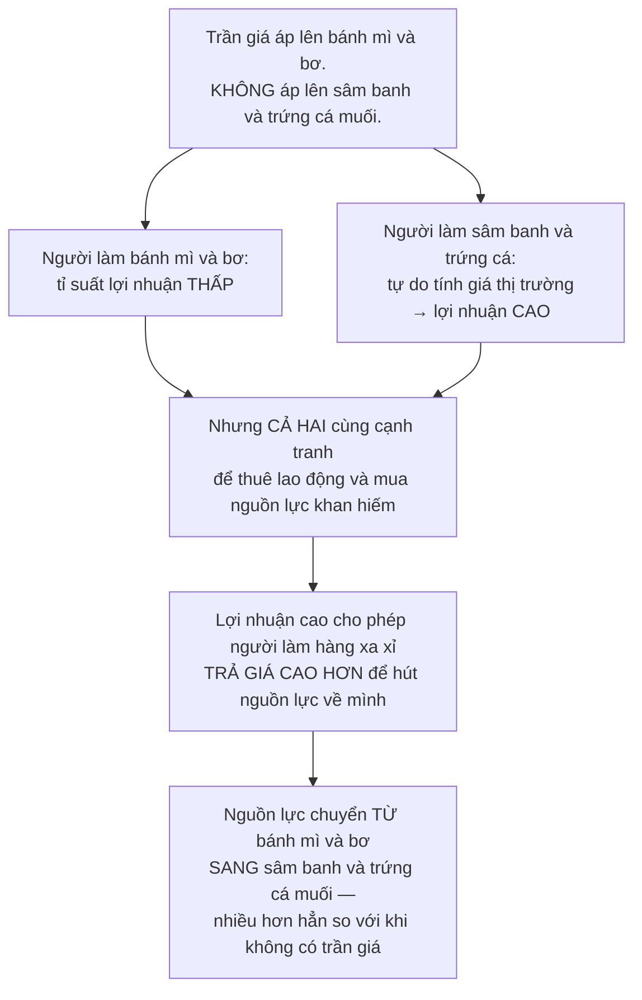

# Lời kết

> Thứ đáng mang ra khỏi cuốn sách không phải là các ví dụ, mà là **một thói
> quen tư duy**: dừng lại và hỏi *"rồi sau đó thì sao?"* trước khi gật đầu với
> một lời hứa nghe hay.

## Cái tổng lớn hơn các phần cộng lại

Ngoài những điều cụ thể về giá cả, đầu tư hay thương mại, thứ Sowell hy vọng
người đọc có được là **một sự hoài nghi tổng quát** với những từ ngữ lấp lánh
và những cụm từ mù mờ được sản xuất hàng loạt bởi truyền thông và chính trị.

Cụ thể, sau cuốn sách này bạn không nên còn:

- Tiếp nhận một cách thiếu phê phán các phát biểu và thống kê về **"người
  giàu"** và **"người nghèo"** — vì bạn đã biết rằng **nhóm thu nhập và con
  người là hai thứ khác nhau**.
- Thấy khó hiểu vì sao những nơi có luật kiểm soát tiền thuê nhà lại hay thiếu
  nhà ở.
- Thấy khó hiểu vì sao những nỗ lực kiểm soát giá lương thực lại thường dẫn
  tới đói kém.

Và Sowell nói thẳng về giới hạn của việc này: **không danh sách nào về các
ngụy biện kinh tế có thể đầy đủ**, vì trí tưởng tượng của con người gần như vô
hạn. Những ngụy biện mới đang được nghĩ ra trong khi những cái cũ còn chưa bác
xong. Điều nhiều nhất có thể hy vọng là **vạch ra vài cái phổ biến** và nuôi
dưỡng một lối tiếp cận phân tích đi xa hơn những lời kêu gọi cảm xúc.

## Dùng từ cho chính xác

Ông nhắc lại hai cặp khái niệm mà việc lẫn lộn chúng đã làm hỏng vô số cuộc
tranh luận:

| Đừng lẫn | Với |
| --- | --- |
| **Mức lương trên một đơn vị thời gian** | **Chi phí lao động trên một đơn vị sản phẩm** |
| **Thuế suất** trên mỗi đồng thu nhập | **Tổng số thu thuế** mà nhà nước nhận được |

Cặp thứ nhất là lý do lập luận "nước lương cao không thể cạnh tranh với nước
lương thấp" thoát khỏi sự soi xét — trong khi
[chương 10](../3-lao-dong-va-tien-luong/01-nang-suat-va-tien-luong.md) đã cho
thấy nhà máy trả lương **cao hơn** vẫn có thể có chi phí trên mỗi sản phẩm
**thấp hơn**.

Cặp thứ hai, như [chương 19](../5-kinh-te-quoc-gia/04-tai-chinh-cua-chinh-phu.md)
đã chỉ ra, khiến việc thảo luận hợp lý về chính sách thuế gần như bất khả.

## Ba gốc rễ của hầu hết ngụy biện kinh tế

Đây là phần cô đọng nhất của cả cuốn sách. Nếu bạn chỉ giữ một hình, hãy giữ
hình này:

### Gốc thứ nhất: tưởng rằng tổng bằng không

Nếu một giao dịch chỉ có thể làm lợi cho bên này bằng cái giá của bên kia, thì
việc nhà nước can thiệp để đổi điều khoản có lợi cho một bên — người thuê nhà,
người lao động — nghe rất hợp lý.

Nhưng nếu giao dịch làm lợi cho **cả hai**, thì đổi điều khoản theo hướng có
lợi cho một bên sẽ **làm giảm số giao dịch mà bên kia sẵn lòng tham gia**.

> Trong một thế giới của những giao dịch **cùng có lợi**, hoàn toàn dễ hiểu vì
> sao luật kiểm soát tiền thuê dẫn tới thiếu nhà, và vì sao luật lương tối
> thiểu làm tăng thất nghiệp.

Và Sowell chỉ ra điều tinh tế nhất: **rất ít người nói thẳng ra** rằng giao
dịch chỉ làm lợi cho một bên. Ngụy biện tồn tại được chính nhờ những **giả định
ngầm mà người ta không buồn nói rõ ra — kể cả với chính mình**.

Kèm theo là một câu đáng ghim:

> **Hiếm khi người ta nghĩ thấu đáo một cách ngu ngốc. Thường thì họ không
> buồn nghĩ thấu đáo chút nào.** Vì vậy ngay cả những cá nhân rất thông minh
> cũng có thể đi tới kết luận không đứng vững, bởi trí lực chẳng có nghĩa lý gì
> nếu không được đem ra dùng.

### Gốc thứ hai: quên mất cạnh tranh

Ví dụ ông đưa ra: nhiều người tin rằng công đoàn có thể tăng phần của người
lao động trong thu nhập của một ngành **đơn giản bằng cách giảm phần chảy về
nhà đầu tư**.

Điều đó bỏ qua **cuộc cạnh tranh thu hút vốn**: vốn bị hút về những ngành có
tỉ suất sinh lợi cao hơn và bị đẩy khỏi những ngành sinh lợi thấp hơn — qua đó
**làm thay đổi triển vọng việc làm ở cả hai nơi**.

Ông dẫn ngành ô tô Mỹ làm minh họa: khi có cạnh tranh giữa công ty có công
đoàn và công ty không có công đoàn trong cùng một ngành, **chẳng có gì đáng
ngạc nhiên** khi thấy General Motors cắt giảm mạnh số lao động trên bảng lương
trong khi Toyota **tăng tuyển dụng** ngay tại nước Mỹ.

Sowell cũng nhắc một lý do lịch sử khiến kế hoạch hóa tập trung từng hấp dẫn:
**trước khi** nó được đem ra thực hiện và người ta nếm hậu quả, phương án thay
thế trông như một mớ hỗn loạn các hoạt động không ai điều phối.

### Gốc thứ ba: dừng lại ở hậu quả đầu tiên

Ví dụ thép đã gặp ở
[chương 21](../6-kinh-te-quoc-te/01-thuong-mai-quoc-te.md): hạn chế nhập thép
**đúng là** cứu được việc làm trong ngành thép trong nước. Nhưng dội lại của nó
lên giá và doanh số của mọi sản phẩm khác làm từ thép đắt hơn đã **làm mất
nhiều việc làm hơn hẳn** số được cứu.

Và ông nói một câu rất Sowell: **chuyện này không phải khoa học tên lửa — nó
chỉ đòi hỏi phải dừng lại và suy nghĩ.**

## Ví dụ hay nhất: bánh mì và rượu sâm banh

Đây là minh họa sắc nhất cho việc **đánh giá chính sách bằng mục tiêu thay vì
bằng động lực**.

Trong thời chiến, khi quân đội hút đi nhiều nguồn lực, có một mong muốn hoàn
toàn dễ hiểu là bảo đảm những thứ thiết yếu như lương thực vẫn tới được với
dân thường, nhất là người thu nhập thấp. Nên nhà nước áp trần giá lên **bánh
mì và bơ** — nhưng **không** áp lên **rượu sâm banh và trứng cá muối**, vì
chẳng ai coi chúng là thiết yếu.

Nghe rất hợp lý. Giờ hãy theo dõi động lực:

Một chính sách nhằm bảo vệ nguồn cung thực phẩm thiết yếu lại **đẩy nguồn lực
ra khỏi** việc sản xuất thực phẩm thiết yếu.

Và Sowell chỉ ra rằng **kiểm soát tiền thuê nhà làm y hệt**: nó dịch chuyển
nguồn lực từ việc xây nhà ở bình dân cho người thu nhập trung bình sang xây
nhà hạng sang cho người khá giả — đúng như
[chương 3](../1-gia-ca-va-thi-truong/03-kiem-soat-gia.md) đã cho thấy.

## Bốn câu hỏi để đặt trước bất kỳ mục tiêu nào

Sowell mở rộng nguyên tắc này ra ngoài kinh tế học, và ông dùng một ví dụ nặng
để cho thấy vì sao nó quan trọng: trong Đại khủng hoảng, một đạo luật mang cái
tên đẹp đẽ về việc **giảm bớt nỗi thống khổ của nhân dân** chính là đạo luật
trao quyền lực độc tài cho Adolf Hitler — dẫn tới một cuộc chiến tranh tạo ra
nhiều thống khổ và thảm họa hơn bất cứ điều gì người Đức, và nhiều dân tộc
khác, từng trải qua.

> **Không gì dễ hơn việc tuyên bố một mục tiêu tuyệt vời.**

Vậy phải hỏi gì?

1. **Những việc cụ thể nào** sẽ được làm nhân danh mục tiêu đó?
2. Đạo luật hay chính sách ấy **thưởng cho cái gì** và **phạt cái gì**?
3. Nó áp đặt những **ràng buộc** nào?
4. Nhìn về quá khứ: những động lực và ràng buộc **tương tự** đã dẫn tới hậu quả
   gì ở **những nơi khác và thời khác**?

Câu thứ tư là lý do Sowell dẫn một sử gia người Anh nhận xét rằng **nghiên cứu
lịch sử là liều thuốc giải mạnh cho thói kiêu ngạo đương thời**: thật khiêm
nhường khi phát hiện ra rằng biết bao giả định trơn tru của chúng ta, những
thứ với ta có vẻ mới mẻ và hợp lý, **đã từng được thử nghiệm trước đây** —
không chỉ một lần mà nhiều lần, dưới vô số hình thức — và đã được chứng minh
là **hoàn toàn sai, với cái giá rất lớn bằng sinh mạng con người**.

Và ông nhắc lại hai hình ảnh từ chính cuốn sách để minh họa cái giá đó: người
dân đói ở Nga, **bất chấp việc nước này có một trong những vùng đất nông
nghiệp màu mỡ nhất châu Âu**; và người ngủ trên vỉa hè lạnh giá trong những
đêm đông ở New York, **bất chấp việc số căn hộ bị bỏ hoang bịt kín trong thành
phố còn nhiều hơn số cần để che chở cho tất cả họ**.

## Không phải chuyện ngu dốt

Một điểm Sowell nói rõ, và nó vừa độ lượng vừa sắc:

Những chính sách dẫn tới hậu quả phản tác dụng hoặc thảm khốc có thể khiến
người ta nghĩ rằng những người ra quyết định hẳn phải **ngu dốt tới mức khó
tin** — và ở các nước dân chủ, điều đó còn hàm ý sự ngu dốt tương tự ở những
người đã bỏ phiếu cho họ.

Nhưng **không nhất thiết là vậy**:

> Việc phân tích kinh tế cần thiết để hiểu những vấn đề này **không đặc biệt
> khó nắm bắt**. Nhưng trước hết người ta phải **dừng lại và suy nghĩ về chúng
> trong một khung kinh tế học**. Khi người ta không dừng lại và nghĩ thấu các
> vấn đề, thì việc họ là thiên tài hay kẻ ngốc **chẳng còn quan trọng nữa** —
> bởi chất lượng của phần suy nghĩ mà lẽ ra họ đã làm là một câu hỏi bỏ ngỏ.

## Chủ đề xuyên suốt thứ hai: tri thức

Bên cạnh động lực và ràng buộc, chủ đề lớn còn lại của cuốn sách là **tri
thức** — và hạn chế của nó.

Sowell quay lại Kodak một lần cuối, vì đó là ví dụ hoàn hảo:

> Thứ Kodak thiếu **không phải là hiểu biết về máy ảnh số — chính Kodak đã
> phát minh ra nó**. Thứ họ thiếu là khả năng **nhìn ra hệ quả** của công nghệ
> hoàn toàn mới ấy.

> **Dữ kiện thì quan trọng, nhưng hiểu được hàm ý của dữ kiện còn quan trọng
> hơn** — và đó chính là thứ mà hiểu biết về kinh tế học tìm cách mang lại.

Và ở phía bên kia, cùng vấn đề tri thức hiện ra ở quy mô khác. Trong các nền
kinh tế kế hoạch hóa tập trung, người lập kế hoạch bị nhấn chìm bởi nhiệm vụ
ấn định **hàng triệu mức giá** — và liên tục thay đổi chúng theo vô số biến
động không đoán trước được.

Nhận xét khép lại của Sowell về chuyện này rất gọn:

> Việc họ thất bại thường xuyên tới vậy **không có gì đáng chú ý**. Điều đáng
> chú ý là đã từng có người **trông đợi họ thành công** — xét tới khối lượng
> tri thức khổng lồ lẽ ra phải được tập hợp và làm chủ ở **một nơi, bởi một
> nhóm người, tại một thời điểm**, để một sự sắp đặt như vậy vận hành được.

Ông ghi nhận rằng Lenin chỉ là một trong nhiều nhà lý thuyết qua các thế kỷ
từng hình dung rằng việc quan chức nhà nước điều hành hoạt động kinh tế là
chuyện dễ dàng — và là người **đầu tiên trực tiếp đối mặt** với những thảm họa
kinh tế và xã hội mà niềm tin đó dẫn tới, điều mà **chính ông ta đã thừa nhận**.

## Vậy mang gì ra khỏi cuốn sách này?

Không phải các con số. Chúng sẽ cũ đi — nhiều con số trong sách đã thuộc về
một thế giới trước năm 2014.

Không phải các kết luận chính sách. Chúng là **quan điểm của một trường phái**,
và bạn đã được nhắc điều đó ở mỗi chương.

Thứ đáng mang theo là **ba câu hỏi**:

1. **Rồi sau đó thì sao?** — Hậu quả giai đoạn hai và ba là gì?
2. **Đánh đổi cái gì?** — Không có giải pháp, chỉ có đánh đổi. Nếu ai đó không
   nói cái giá, họ hoặc chưa phân tích xong, hoặc đang bán hàng.
3. **Đây là loại phát biểu nào?** — Định nghĩa, cơ chế, khẳng định thực nghiệm,
   hay quan điểm chính sách? Bốn loại đó đòi hỏi bốn mức độ tin khác nhau.

Câu thứ ba là câu quan trọng nhất, và nó áp vào **chính cuốn sách bạn vừa
đọc**. Sowell rất mạnh ở loại một và loại hai. Ở loại ba ông chọn bằng chứng
theo hướng có lợi cho lập luận của mình, như mọi tác giả có luận điểm đều làm.
Ở loại bốn ông là một người tranh luận chính trị.

Đọc được ra bốn tầng ấy — ở ông, và ở mọi người khác — là toàn bộ thứ bạn cần
mang đi.

## Điều cần nhớ

- **Ba gốc rễ của ngụy biện kinh tế**: tưởng tổng bằng không, quên cạnh tranh,
  dừng ở hậu quả đầu tiên.
- Ngụy biện sống được nhờ những **giả định ngầm không ai nói rõ ra**.
- **Đánh giá chính sách bằng động lực nó tạo ra, không bằng mục tiêu nó tuyên
  bố.** Trần giá bánh mì đẩy nguồn lực sang sâm banh.
- Trước mọi mục tiêu đẹp, hỏi: **thưởng cái gì, phạt cái gì, ràng buộc gì, và
  chuyện tương tự đã xảy ra ở đâu rồi?**
- Thất bại thường không đến từ ngu dốt mà từ việc **không dừng lại để nghĩ**.
- **Dữ kiện quan trọng; hàm ý của dữ kiện còn quan trọng hơn.** Kodak biết về
  máy ảnh số — họ chỉ không thấy nó nghĩa là gì.

## Tự kiểm tra cuối cùng

1. Nêu ba gốc rễ của phần lớn ngụy biện kinh tế.
2. Vì sao trần giá lên bánh mì lại đẩy nguồn lực sang sản xuất hàng xa xỉ?
3. Bốn câu hỏi cần đặt ra trước một mục tiêu chính sách nghe hay là gì?
4. Kodak thiếu thứ gì — và **không** thiếu thứ gì?
5. Ba câu hỏi bạn sẽ mang theo sau cuốn sách này là gì?

---

Trước: [Lịch sử kinh tế học](./03-lich-su-kinh-te-hoc.md) ·
Tiếp: [Tra cứu — Từ điển thuật ngữ](../8-tra-cuu/)
