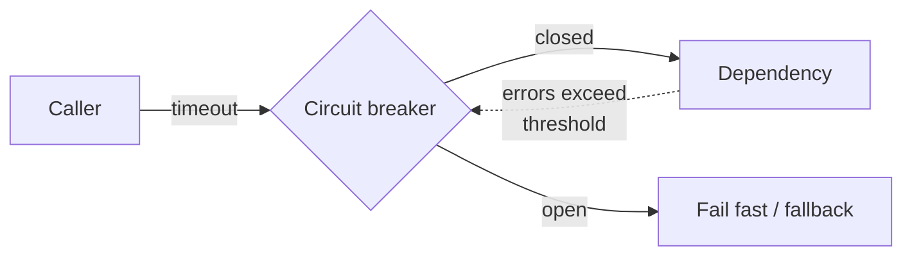

# Release It!

> Michael T. Nygard, 2007 — 2nd edition 2018. A catalogue of the ways
> production kills software, written by someone who was there when it happened.

<!--
  Provenance: this summary is a machine-written distillation, not the author's
  words and not reviewed by them. It is a map, and a map is wrong in the places
  that matter most. Check anything you are about to bet on against the book.
-->

| | |
| --- | --- |
| **Author** | Michael T. Nygard |
| **Editions** | 1st, 2007 · 2nd, 2018 (cloud, containers, microservices added) |
| **Shape** | ~350 pages: war stories, antipatterns, then patterns that counter them |
| **Read it for** | Designing for the 3am failure instead of the happy path |
| **Skip it if** | Nothing you build has users while you sleep |

## The argument in one paragraph

Software is not done when it passes QA; it is done when it survives production,
and production is a hostile environment of partial failures, traffic spikes,
bad deploys, and other people's outages. **Design for production**: assume
every remote call will hang, every resource pool will exhaust, every failure
will try to propagate, and build the mechanisms that stop it. The recurring
image is the **crack propagating through a system** — one slow dependency,
through a full thread pool, into a total outage.

## The stability antipatterns

| Antipattern | How it kills you |
| --- | --- |
| **Integration points** | Every call out is a chance to hang; most outages start here |
| **Chain reactions** | One node dies, its load moves, the next one dies |
| **Cascading failures** | A failure in one layer takes out the layer above |
| **Users** | Real traffic is unreasonable: sessions, bots, front-page spikes |
| **Blocked threads** | The most common cause of "it's up but not responding" |
| **Self-denial attacks** | Your own marketing email as a DDoS |
| **Scaling effects** | What works at 1:1 breaks at 1:many |
| **Unbalanced capacities** | Front end can generate more load than the back end can take |
| **Slow responses** | Worse than failures — they consume the caller's resources |
| **Unbounded result sets** | The query that returned 4 rows in test and 4 million in production |

## The stability patterns

| Pattern | What it does |
| --- | --- |
| **Timeouts** | Nothing waits forever; every remote call has a deadline |
| **Circuit breaker** | Stop calling a failing dependency; fail fast, retry on a schedule |
| **Bulkheads** | Partition resources so one failure cannot drown everything |
| **Steady state** | No human maintenance to keep running; purge logs and data automatically |
| **Fail fast** | Reject early when you know you cannot serve |
| **Let it crash** | Sometimes the cleanest recovery is a fresh process |
| **Handshaking / back pressure** | Let the overloaded side say "slow down" |
| **Test harness** | Deliberately evil test doubles — slow, hung, refusing connections |
| **Decoupling middleware** | Remove temporal coupling where the call does not need an answer now |
| **Shed load** | Reject excess deliberately rather than collapsing |

If you take only one thing: **a timeout on every remote call, and a circuit
breaker around every integration point.** Most of the outages in the book start
with a missing one of those.

## Beyond stability

The second half is about **capacity** (the difference between performance and
throughput, and how caches, sessions, and connection pools decide both) and
about **design for deployment and operation**:

- **Transparency** — a system that cannot be observed cannot be operated:
  logging with context, metrics, health checks, and the ability to change
  behaviour at runtime.
- **Zero-downtime deploys, versioned interfaces, expand–contract migrations** —
  the second edition's strongest addition, because the modern failure mode is a
  deploy, not a crash.
- **Chaos engineering, canaries, and deliberate fault injection** — practising
  failure instead of hoping.
- **Conway's law and the shape of the organisation**, which turns out to decide
  the shape of the outages.

## Ideas worth stealing

| Idea | What it means | Where it bites |
| --- | --- | --- |
| **Every integration point is an outage** | Treat remote calls as hostile | An unbounded HTTP client default |
| **Slow is worse than down** | A hung dependency consumes you | Thread pools full of waiting requests |
| **Circuit breaker** | Fail fast when a dependency is sick | Retry storms making it sicker |
| **Bulkheads** | Isolate pools per dependency | One slow vendor eating all workers |
| **Steady state** | No 3am cleanups | The disk that fills every six weeks |
| **Back pressure** | Say no rather than queue forever | An unbounded queue quietly growing |
| **Evil test doubles** | Test the hang, not just the error | Only the 500 path is tested |

## What has aged, and what hasn't

The first edition's Java/app-server detail is dated; the second edition covers
containers, orchestration, service discovery, and cloud failure modes and is
the one to read. Some of what the book invented now comes free — service meshes
and client libraries ship circuit breakers and retries — but the failure
reasoning does not, and misconfigured retries are themselves a modern outage
cause the book predicted.

The war stories are the most memorable part and they remain recognisable
because the physics has not changed: a shared resource, an unbounded wait, and
a caller that will not give up.

## How to read it

Read the antipatterns and patterns chapters first — they are short, paired, and
usable as a design review checklist. Then the capacity and operations chapters
before your next launch. Keep the pattern list next to whatever you are about
to integrate with.

## Where it touches this knowledge base

- [Resilience patterns](../system-design/1-knowledge/patterns/resilience-patterns.md)
- [Redundancy and failover](../system-design/1-knowledge/reliability/redundancy-failover.md) · [Capacity planning](../system-design/1-knowledge/reliability/capacity-planning.md)
- [Rate limiting](../system-design/1-knowledge/building-blocks/rate-limiting.md) — load shedding, productised
- [Incident response](../devops-infrastructure/2-case-studies/incident-response.md) · [Anatomy of an outage](../computer-networks/2-case-studies/anatomy-of-an-outage.md)
- [Failure models](../distributed-systems/1-knowledge/fundamentals/failure-models.md) · [Why distributed is hard](../distributed-systems/1-knowledge/fundamentals/why-distributed-is-hard.md)
- [Congestion control](../computer-networks/1-knowledge/transport-layer/congestion-control.md) — back pressure, at the network layer

## If you liked this

[Site Reliability Engineering](../book-site-reliability-engineering/README.md) for how to
run what you have hardened, and
[Building Microservices](../book-building-microservices/README.md) for the
architecture that makes all of these failure modes mandatory reading.
