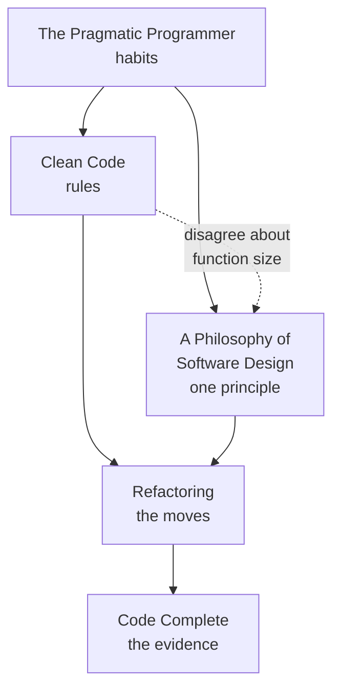

# Craft & Code

> The books about the small scale: naming, structure, complexity, and the daily
> act of changing code that already works.

These are **summaries, not substitutes**. Each one distills a real, published
book into something you can read in fifteen minutes and act on tomorrow — the
argument, the ideas worth stealing, what has aged, and where the book touches
the rest of this knowledge base. None of them reproduces the book's text, and
none of them is as good as the book. Where a summary convinces you, go buy it.

<!--
  Provenance: these summaries are machine-written distillations, not the
  authors' words and not reviewed by them. They are a map, and a map is wrong
  in the places that matter most. Check anything you are about to bet on
  against the book itself.
-->

## What is here

| Book | Author | Read it for |
| --- | --- | --- |
| [The Pragmatic Programmer](./the-pragmatic-programmer.md) | Hunt & Thomas, 1999 / 2019 | The habits of someone who has been burned before |
| [A Philosophy of Software Design](./a-philosophy-of-software-design.md) | Ousterhout, 2018 | One idea — complexity — pursued all the way down |
| [Clean Code](./clean-code.md) | Martin, 2008 | The vocabulary everyone argues in, and why some of it is wrong |
| [Refactoring](./refactoring.md) | Fowler, 1999 / 2018 | Changing a design without breaking it, in named steps |
| [Code Complete](./code-complete.md) | McConnell, 1993 / 2004 | Everything else, backed by evidence |

## How these fit together

Ousterhout and Martin disagree, in public and on purpose, about how small a
function should be. Reading them back to back is more useful than reading
either alone: the disagreement is where the real question lives — what is a
function *for*, a unit of reuse or a unit of understanding?

Start with Ousterhout if you have five hours. Start with *Refactoring* if you
have a codebase you are afraid to touch.

## Where this touches the knowledge base

- [Best Practices](../best-practices/README.md) — the same ground, organised by
  practice rather than by book
- [Readable code](../best-practices/1-knowledge/code-quality/readable-code.md)
- [Architecture & Patterns](../architecture-patterns/README.md) — where these
  books hand off to the design books
