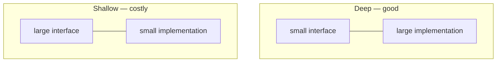

# A Philosophy of Software Design

> John Ousterhout, 2018 (2nd edition 2021). One claim — that complexity is the
> only real problem — followed further than anyone else bothers to follow it.

| | |
| --- | --- |
| **Author** | John Ousterhout (Stanford; creator of Tcl, RAMCloud, Raft's co-advisor) |
| **Editions** | 1st, 2018 · 2nd, 2021 (adds a chapter on the Clean Code disagreement) |
| **Shape** | ~190 pages. The shortest serious book on this list. |
| **Read it for** | A working definition of "complex" you can apply in a code review |
| **Skip it if** | You need examples in your language — they are Java and C++, and few |

## The argument in one paragraph

The purpose of software design is to **reduce complexity**, where complexity is
defined operationally: anything that makes a system hard to understand or
modify. It shows up as three symptoms — *change amplification* (a simple change
touches many places), *cognitive load* (you must know a lot to do anything),
and *unknown unknowns* (you cannot tell what you must know). It accumulates
incrementally, which is why it is never anybody's fault. The cure is to design
modules that are **deep**: a simple interface hiding a lot of functionality.

## The central image: deep versus shallow modules

A module is a chunk with an interface and an implementation. Its value is the
ratio between them.

A Unix file is the canonical deep module: five calls hide buffering,
scheduling, permissions, and a filesystem. A class that wraps one field in a
getter and a setter is the canonical shallow one — it costs the reader an
abstraction and gives nothing back. Ousterhout's provocation is that a lot of
what is taught as good decomposition manufactures shallow modules, and that
breaking things up can make a system **harder** to understand.

## The spine of the book

- **Complexity is incremental.** No single change is the problem. That means the
  discipline has to be per-change, not per-project.
- **Working code isn't enough.** Tactical programming — get the feature done —
  loses to strategic programming, where roughly 10–20% of your time goes into
  the design of what you're touching. This is an investment argument, and it is
  stated as one.
- **Information hiding, and its opposite.** *Information leakage* is when a
  design decision shows up in several modules. Temporal decomposition — classes
  organised by the order operations happen in — is the usual cause.
- **Different layer, different abstraction.** A pass-through method, which does
  nothing but call the next one down, is a sign the layers are not earning their
  place.
- **Pull complexity downward.** Given a choice, the module author should suffer
  so that every caller doesn't. Configuration parameters are often complexity
  pushed up to the user, who knows less than you do.
- **Define errors out of existence.** The best exception handling is an API
  where the error cannot arise: `unset` on a missing key succeeds; a
  substring range clamps instead of throwing. Ousterhout's own example is Tcl's
  `unset` and Windows's file-deletion semantics.
- **Comments describe what the code cannot.** Write them *first*, as a design
  tool. If the comment is hard to write, the interface is wrong. The test for a
  good comment: does it state something not obvious from the code?
- **Names.** A name that needs a qualifier every time it's used is the wrong
  name. Consistency beats cleverness.

## The disagreement with Clean Code

The second edition adds a chapter on it, and there was a recorded discussion
between Ousterhout and Robert Martin. The fault line is function length. *Clean
Code* says functions should be very small, extracted aggressively. Ousterhout
says that aggressive extraction produces shallow modules, scatters one idea
across many names, and forces the reader to jump — that **length is not the
metric, depth is**. He also objects to comment minimalism: "the code is the
documentation" cannot express intent, invariants, or what the design rejected.

You do not have to pick. But you should notice the question, because most style
arguments in most teams are this argument with the names filed off.

## Ideas worth stealing

| Idea | What it means | Where it bites |
| --- | --- | --- |
| **Deep module** | Simple interface, substantial implementation | Six classes for what one `Buffer` should do |
| **Change amplification** | One decision, many edit sites | Adding a field to a form in five layers |
| **Cognitive load** | How much you must hold to make a change | The service you can't touch without asking someone |
| **Unknown unknowns** | You can't tell what you'd need to know | The caller that had to be updated and wasn't |
| **Information leakage** | One decision visible in several modules | Both sides parsing the same file format |
| **Pull complexity down** | The implementer eats it, not the callers | A flag added because the author couldn't choose |
| **Define errors away** | Make the bad case not a case | `delete` on a missing key as an error |
| **Comments first** | Write the interface comment before the code | Documentation written after shipping, describing the accident |
| **Tactical tornado** | The fast producer who leaves wreckage | Rewarded at review time, expensive for years |

## What has aged, and what hasn't

Nothing, really — it is recent and the examples are timeless enough. The honest
limits are these: it comes out of a class where students design and redesign the
same project twice, which is not your situation; it is light on concurrency,
distribution, and anything operational; and the evidence is experience rather
than data. It is one thoughtful person's opinion, clearly labelled as such.

## How to read it

Read it straight through in an evening — it is short and builds. Then read
chapter 2 (the nature of complexity) and the two module chapters again with
your own codebase open. The red-flag summary at the back is the part to keep
next to you in a code review.

## Where it touches this knowledge base

- [Coupling and cohesion](../architecture-patterns/1-knowledge/fundamentals/coupling-and-cohesion.md) — the same phenomenon in classical vocabulary
- [Core design principles](../architecture-patterns/1-knowledge/fundamentals/core-design-principles.md)
- [SOLID principles](../architecture-patterns/1-knowledge/fundamentals/solid-principles.md) — compare the interface-segregation argument with "deep modules"
- [Readable code](../best-practices/1-knowledge/code-quality/readable-code.md)
- [Error handling](../languages-frameworks/1-knowledge/language-design/error-handling.md) — "define errors out of existence", from the language's side

## If you liked this

[Clean Code](./clean-code.md), read as the opposing brief.
[The Pragmatic Programmer](./the-pragmatic-programmer.md) for the same instincts
spread over a career rather than a principle.
