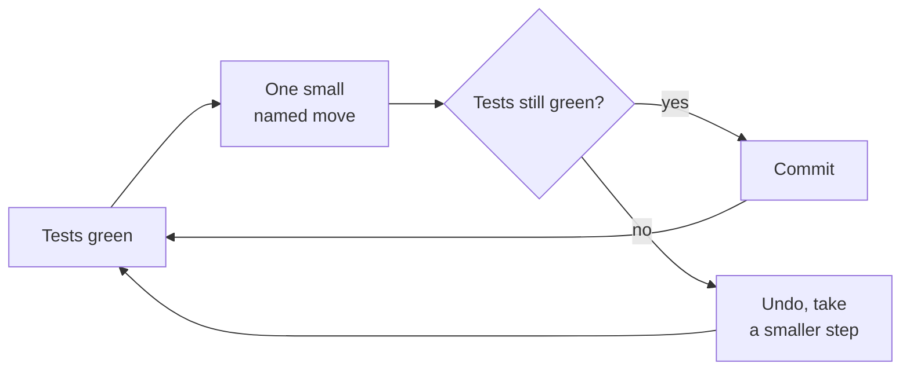

# Refactoring

> Martin Fowler, 1999 — 2nd edition 2018, in JavaScript. The book that turned
> "clean it up" from an instinct into a procedure with names and steps.

| | |
| --- | --- |
| **Author** | Martin Fowler (with Kent Beck, and a chapter by others) |
| **Editions** | 1st, 1999 (Java) · 2nd, 2018 (JavaScript, substantially rewritten) |
| **Shape** | ~400 pages: a worked example, then a catalogue of named transformations |
| **Read it for** | A vocabulary of safe moves, and the discipline that makes them safe |
| **Skip it if** | You have no tests. Fix that first — the book says so on page one. |

## The argument in one paragraph

Refactoring is **changing the structure of code without changing its observable
behaviour**, in small steps, each verified by tests. It is not a project, not a
phase, and not a rewrite: it is something you do in the minutes before adding a
feature, to make the feature easy to add. The payoff is economic, not
aesthetic — you refactor because the next change is coming and you want it to
be cheap.

> "Make the change easy, then make the easy change." — Kent Beck

## The workflow

The whole method is in that loop. Each transformation in the catalogue is
written as *motivation → mechanics → example*, and the mechanics are
deliberately pedantic: change one thing, compile, test, commit. The pedantry is
the point — it is what lets you refactor code you do not fully understand, and
what lets you stop at any moment with everything working.

## Code smells: the trigger list

The second chapter everyone actually uses is the catalogue of **smells** —
surface signs worth investigating. Mysterious Name, Duplicated Code, Long
Function, Long Parameter List, Global Data, Mutable Data, Divergent Change
(one module changed for many reasons), Shotgun Surgery (one change hitting many
modules), Feature Envy, Data Clumps, Primitive Obsession, Repeated Switches,
Loops, Lazy Element, Speculative Generality, Temporary Field, Message Chains,
Middle Man, Insider Trading, Large Class, Refused Bequest, Comments as
deodorant.

Divergent Change and Shotgun Surgery are the pair worth memorising: they are the
two failure modes of module boundaries, and naming them ends a lot of
inconclusive design arguments.

## The moves worth knowing by name

| Move | What it does |
| --- | --- |
| **Extract Function / Inline Function** | The two directions of the same decision; inlining is as legitimate as extracting |
| **Extract Variable** | Name a subexpression so the condition explains itself |
| **Change Function Declaration** | Rename or re-sign safely, via a temporary parallel function when it's public |
| **Encapsulate Variable / Record** | Route access through functions so you can change the representation |
| **Replace Temp with Query** | Turn a local into a function so other code can use it |
| **Replace Conditional with Polymorphism** | The classic switch-to-types transformation |
| **Introduce Parameter Object** | Data clumps become a type with a name |
| **Split Phase** | Separate parsing from calculating; the single most useful large-scale move |
| **Move Function / Field** | Put behaviour where the data it uses lives |
| **Replace Loop with Pipeline** | The 2nd edition's most modern addition |
| **Separate Query from Modifier** | Restore command/query separation |
| **Parallel Change (expand–migrate–contract)** | Change a published interface without a flag day |

## What the second edition changed

JavaScript instead of Java, which sounds cosmetic and is not: the examples now
use functions as first-class values, so top-level functions and closures appear
alongside classes and the book stops implying that everything is an object.
Several catalogue entries were rewritten, `Split Phase` and the pipeline
refactorings were added, and the treatment of when *not* to refactor is
franker. A web edition keeps the catalogue current, which is a reasonable
argument for the book as a reference you revisit.

## What has aged, and what hasn't

The catalogue format is timeless and the mechanics are still the safest way to
move code you are not sure about. Two things have shifted underneath it: modern
IDEs automate perhaps a third of the moves, so the long mechanics sections can
read as history — until you are in a language whose tooling does not, and then
they are exactly what you need. And the book predates the idea that you might
refactor across services, where "small step, run tests, commit" is a much
harder promise; the analogous discipline there is expand–migrate–contract,
which the book does describe, under the name Parallel Change.

## How to read it

Read chapters 1–3 properly: the worked example, the principles, and the smells.
Then stop reading and use it as a reference — look up a move when you are about
to make it, and follow the mechanics literally the first few times. The habit
you want is noticing the smell, not remembering the catalogue.

## Where it touches this knowledge base

- [Readable code](../best-practices/1-knowledge/code-quality/readable-code.md)
- [Testing fundamentals](../best-practices/1-knowledge/testing/testing-fundamentals.md) — the safety net that makes any of this legal
- [Test doubles and TDD](../best-practices/1-knowledge/testing/test-doubles-and-tdd.md)
- [Refactoring to hexagonal](../architecture-patterns/2-case-studies/refactoring-to-hexagonal.md) — the same discipline, one level up
- [Coupling and cohesion](../architecture-patterns/1-knowledge/fundamentals/coupling-and-cohesion.md) — what Divergent Change and Shotgun Surgery are symptoms of

## If you liked this

[Clean Code](./clean-code.md) for the target state, and [Patterns of Enterprise
Application Architecture](../books-design/patterns-of-enterprise-application-architecture.md)
for where Fowler points the refactored design. When the tests do not exist yet,
the companion nobody should work without is Michael Feathers' *Working
Effectively with Legacy Code* — not summarised here yet.
