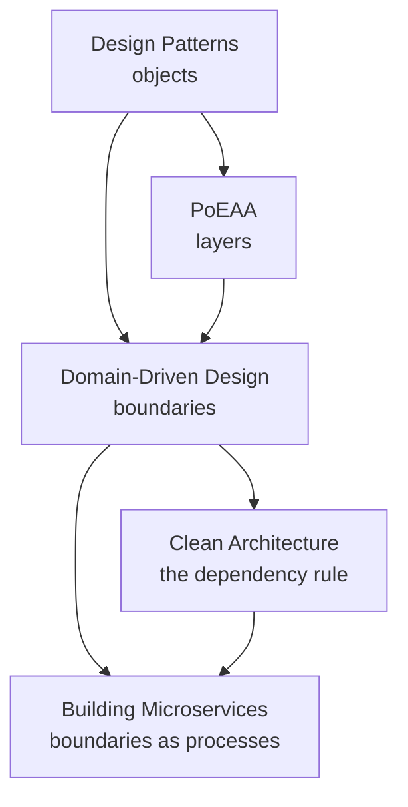

# Design & Architecture

> The books about the large scale: what the pieces are, where the boundaries
> go, and which decisions you will not get to make twice.

These are **summaries, not substitutes** — the argument, the ideas worth
stealing, what has aged, and where the book meets the rest of this knowledge
base. Where a summary convinces you, go buy the book.

<!--
  Provenance: machine-written distillations, not the authors' words and not
  reviewed by them. Check anything you are about to bet on against the book.
-->

## What is here

| Book | Author | Read it for |
| --- | --- | --- |
| [Design Patterns](./design-patterns.md) | Gamma, Helm, Johnson & Vlissides, 1994 | The names everyone still uses, and the principles under them |
| [Domain-Driven Design](./domain-driven-design.md) | Evans, 2003 | Boundaries drawn by the business, not the database |
| [Patterns of Enterprise Application Architecture](./patterns-of-enterprise-application-architecture.md) | Fowler, 2002 | The catalogue your ORM and web framework were built from |
| [Clean Architecture](./clean-architecture.md) | Martin, 2017 | One dependency rule, applied everywhere |
| [Building Microservices](./building-microservices.md) | Newman, 2015 / 2021 | The costs, stated honestly, before the benefits |

## How they fit together

Evans draws the boundary, Martin says which way the dependencies cross it,
Newman charges you for making it a network hop. Read in that order they are one
continuous argument.

## Where this touches the knowledge base

- [Architecture & Patterns](../architecture-patterns/README.md)
- [System Design](../system-design/README.md)
- [Distributed Systems](../distributed-systems/README.md) — the physics Newman's costs come from
