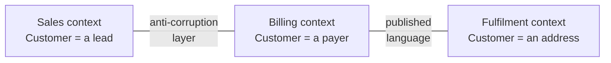

# Domain-Driven Design

> Eric Evans, 2003. The book that said the hard part is not the technology but
> agreeing what the words mean — and then built a design method on that.

| | |
| --- | --- |
| **Author** | Eric Evans |
| **Published** | 2003 (the "blue book") |
| **Shape** | ~560 dense pages, in four parts |
| **Read it for** | Bounded contexts and ubiquitous language — the two ideas that changed the industry |
| **Skip it if** | Your domain is genuinely simple. DDD on a CRUD app is a tax with no return. |

## The argument in one paragraph

For software that lives in a complicated business, the model of that business
*is* the design. So build the model together with domain experts, express it in
a **ubiquitous language** that appears identically in conversation and in code,
and refine it continuously as understanding improves. Where one model cannot
stretch to cover everything — and it never can — draw an explicit **bounded
context** around each model and define how the contexts talk. Most large-system
failures are not technical; they are two teams using the same word for
different things.

## Part I — Putting the domain model to work

Ubiquitous language: if the analysts say "policy", the class is `Policy`. If
the code has to call it `PolicyDTO2`, the model is leaking and the language is
failing. Model-driven design means one model serves both the conversation and
the implementation — not an analysis model handed over to be re-expressed.

## Part II — The building blocks

The tactical patterns, which are the part everyone learns first and the part
that matters least:

| Block | What it is |
| --- | --- |
| **Entity** | Identity that persists through change — a customer, an order |
| **Value object** | Defined entirely by its attributes; immutable; `Money`, `DateRange` |
| **Aggregate** | A cluster with one root; the only object outsiders may hold; the consistency boundary |
| **Repository** | Collection-like access to aggregates, hiding persistence |
| **Factory** | Complex construction that would otherwise leak into the domain |
| **Domain service** | Behaviour that belongs to no single entity |
| **Domain event** | Something the business cares about, recorded as a fact |

The **aggregate** is the one with lasting consequences: it defines what is
transactionally consistent and what is only eventually consistent, which is the
same decision you will later make about service boundaries, database
transactions, and locking.

## Part III — Supple design and refactoring toward deeper insight

The part that is actually about design: intention-revealing interfaces,
side-effect-free functions, assertions, closure of operations, standalone
classes, and the recurring demand to **refactor toward deeper insight** — that
a modelling breakthrough usually follows a period where the model feels
awkward, and the awkwardness is data. *Model exploration whirlpool*: talk,
model, code, discover the word was wrong, rename everything.

## Part IV — Strategic design: the part to read first

- **Bounded context** — the scope within which a model is valid and its terms
  mean one thing.
- **Context map** — an honest drawing of which contexts exist and how they
  relate: shared kernel, customer/supplier, conformist, anticorruption layer,
  separate ways, open host service, published language.
- **Anticorruption layer** — a translating boundary that keeps someone else's
  model out of yours. The most reusable single idea in the book; it is how you
  integrate with a legacy system without infecting the new one.
- **Core domain** — the part that differentiates the business. Put your best
  people there and buy or generate the rest. Most teams do the opposite.

Microservices inherited its boundaries almost verbatim from this part: a
service per bounded context is the only sizing heuristic in that field with any
theory behind it.

## Ideas worth stealing

| Idea | What it means | Where it bites |
| --- | --- | --- |
| **Ubiquitous language** | One vocabulary, in speech and in code | Three words for the same thing across two teams |
| **Bounded context** | A model is valid only inside a boundary | The 60-field `User` class every team edits |
| **Aggregate** | Consistency boundary with one entry point | Transactions that span half the schema |
| **Anticorruption layer** | Translate at the edge, don't absorb | The vendor's XML shape in your domain objects |
| **Core domain** | Spend where you differentiate | Your best engineers on internal admin screens |
| **Refactor toward insight** | Awkward models are information | Renaming that never happens because it's "just naming" |

## What has aged, and what hasn't

The book is long, abstract, and written in a heavy pattern style; its Java is
dated; and its tactical patterns get applied ritually to domains that never
needed them — entities and repositories everywhere, complexity added for no
insight gained. "DDD" in a job description usually means the tactical patterns
alone, which is the least valuable half.

The strategic half has aged in the other direction: bounded contexts, context
maps, and anticorruption layers became the vocabulary for service design, for
platform teams, and for any integration between systems owned by different
people. Vaughn Vernon's *Implementing Domain-Driven Design* is the usual
practical companion; Evans himself has said he would put Part IV first.

## How to read it

Read **Part IV first**, then Part I, then Part III. Read Part II when you are
about to implement something and want the tactical vocabulary. If 560 pages is
too much, the free *Domain-Driven Design Reference* by Evans is the pattern
summaries alone.

## Where it touches this knowledge base

- [Domain-driven design](../architecture-patterns/1-knowledge/architectural-styles/domain-driven-design.md)
- [DDD e-commerce domain](../architecture-patterns/2-case-studies/ddd-ecommerce-domain.md)
- [Monolith vs microservices](../system-design/1-knowledge/patterns/monolith-vs-microservices.md) — where bounded contexts became deployment units
- [Saga](../system-design/1-knowledge/patterns/saga.md) and [CQRS & event sourcing](../system-design/1-knowledge/patterns/cqrs-event-sourcing.md) — what you need once aggregates stop sharing a transaction
- [Coupling and cohesion](../architecture-patterns/1-knowledge/fundamentals/coupling-and-cohesion.md)

## If you liked this

[Building Microservices](./building-microservices.md) is Part IV with an
operations bill attached. [Clean Architecture](./clean-architecture.md) argues
about which way dependencies cross the boundaries Evans draws.
