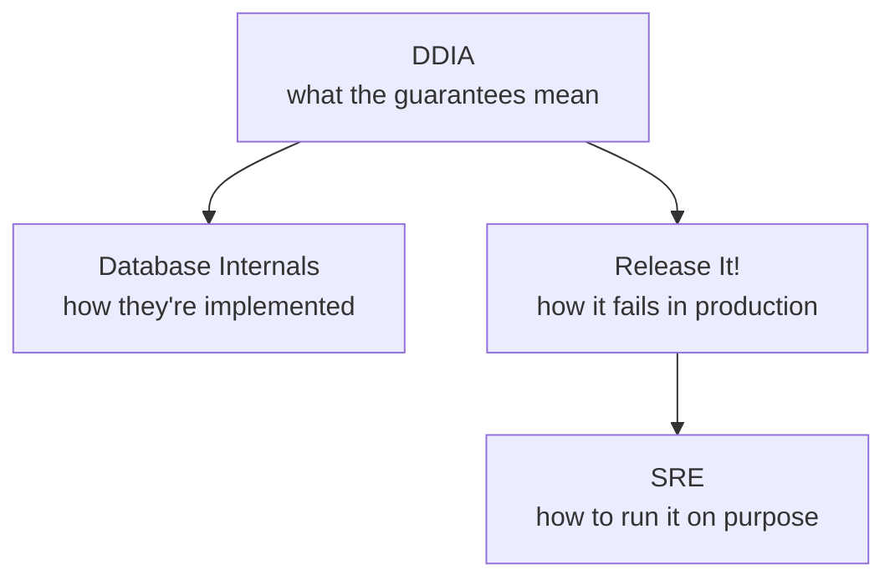

# Systems & Data

> The books about what happens when one machine is not enough, and when the
> thing you are designing is mostly the failure modes.

Summaries, not substitutes: the argument, the ideas worth stealing, what has
aged, and where each book meets the rest of this knowledge base.

<!--
  Provenance: machine-written distillations, not the authors' words and not
  reviewed by them. Check anything you are about to bet on against the book.
-->

## What is here

| Book | Author | Read it for |
| --- | --- | --- |
| [Designing Data-Intensive Applications](./designing-data-intensive-applications.md) | Kleppmann, 2017 | The one book to read if you read one |
| [Database Internals](./database-internals.md) | Petrov, 2019 | What is actually happening under the query |
| [Site Reliability Engineering](./site-reliability-engineering.md) | Google, 2016 | Error budgets, and reliability as a number |
| [Release It!](./release-it.md) | Nygard, 2007 / 2018 | The failure patterns that take systems down at 3am |

## How they fit together

Kleppmann tells you what a system can promise, Petrov tells you what it costs
to keep the promise, Nygard tells you how the promise breaks, and Google tells
you how to decide how often breaking it is acceptable.

## Where this touches the knowledge base

- [Distributed Systems](../distributed-systems/README.md) · [System Design](../system-design/README.md) · [DevOps & Infrastructure](../devops-infrastructure/README.md)
