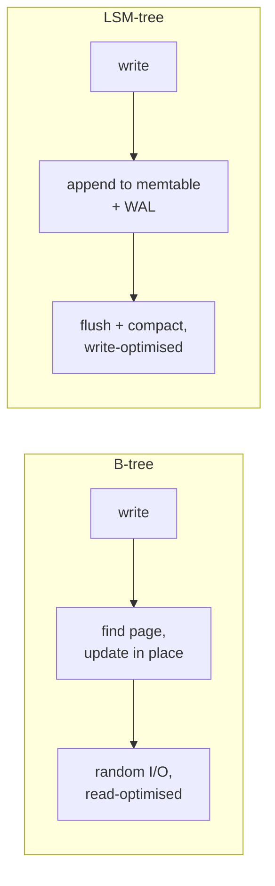

# Database Internals

> Alex Petrov, 2019. Two halves — how one node stores data, and how many nodes
> agree about it — written for the engineer who wants to know what is under the
> query planner.

| | |
| --- | --- |
| **Author** | Alex Petrov |
| **Published** | 2019 |
| **Shape** | ~370 pages: Part I storage engines, Part II distributed systems |
| **Read it for** | B-trees and LSM-trees explained properly, with the variants |
| **Skip it if** | You want to choose a database, not understand one |

## The argument in one paragraph

A database is two problems stacked. The bottom one is **storage**: how to lay
bytes on a block device so that reads, writes, and crashes all behave, given
that the disk only likes sequential access and the page cache is lying to you.
The top one is **distribution**: how several such nodes agree on what happened,
given that the network will lose, delay, and reorder. Petrov walks both, with
the real variants — not "a B-tree", but B+ trees, copy-on-write trees, `Bw`-trees,
and the concurrency tricks each needs.

## Part I — Storage engines

- **The taxonomy.** Row-oriented vs column-oriented; in-place update (B-tree
  family) vs append-only (LSM family); memory-resident vs disk-resident. Every
  storage engine is a position in that space.
- **B-trees, properly.** Why the branching factor matters, page layout, slotted
  pages, splits and merges, rebalancing, and the operational consequence:
  fragmentation, and why pages are half-full on average.
- **Transaction processing and recovery.** Buffer pool management, page eviction,
  **write-ahead logging**, steal/no-steal and force/no-force policies, ARIES
  recovery in outline, and the isolation/concurrency-control machinery — 2PL,
  optimistic concurrency, MVCC.
- **LSM-trees.** Memtable plus immutable sorted runs, compaction strategies
  (size-tiered, levelled), tombstones and deletes, **read/write/space
  amplification** as the three-way trade-off you are always choosing between,
  Bloom filters to avoid pointless reads, and the merge-iterator machinery.

The mental model to keep: **you cannot minimise read, write, and space
amplification at the same time** — pick two and tune the third.

## Part II — Distributed systems

A compressed but careful tour: failure detectors, leader election, replication
and consistency models, anti-entropy and gossip, quorums and read repair,
distributed transactions (2PC, 3PC, Calvin, Percolator), and consensus — Paxos,
Multi-Paxos, Raft, and their practical relatives.

It covers the same ground as the second half of
[DDIA](./designing-data-intensive-applications.md), from the implementer's side
rather than the user's: less "what does this guarantee mean for my
application", more "here is the protocol and here is where it stalls".

## Ideas worth stealing

| Idea | What it means | Where it bites |
| --- | --- | --- |
| **The amplification triangle** | Read, write, and space costs trade off | Tuning compaction without naming the goal |
| **WAL is the durability story** | The log is the truth; pages catch up | `fsync` settings changed "for performance" |
| **Buffer pool behaviour** | Your working set versus RAM decides everything | A p99 cliff when the index stops fitting |
| **Bloom filters** | Cheap "definitely not here" | Every SSTable read on a miss |
| **Tombstones** | Deletes are writes, and they linger | Disk usage that grows after a purge |
| **Page layout matters** | Slotted pages, fill factor, fragmentation | Rebuilds that reclaim surprising amounts |

## What has aged, and what hasn't

Little, in five years — the mechanisms are decades old and stable. The book is
best read as a companion to source code; it is deliberately vendor-neutral, so
it describes families rather than products, and you will still need your
engine's documentation for specifics. The distributed half is necessarily
thinner than a dedicated text, and Part I is the reason to own the book.

## How to read it

Part I in order, slowly, with a pen. Then read your storage engine's
documentation again — RocksDB's tuning guide or Postgres's page layout — and
notice how much of it you can now predict. Part II is a good refresher if you
have read DDIA, and a dense first pass if you have not.

## Where it touches this knowledge base

- [Indexing](../system-design/1-knowledge/data-storage/indexing.md) · [SQL vs NoSQL](../system-design/1-knowledge/data-storage/sql-vs-nosql.md) · [Cassandra](../system-design/1-knowledge/data-storage/cassandra.md)
- [File systems](../operating-systems/1-knowledge/storage-fs/file-systems.md) · [I/O systems](../operating-systems/1-knowledge/storage-fs/io-systems.md) · [Disk scheduling](../operating-systems/1-knowledge/storage-fs/disk-scheduling.md)
- [Memory hierarchy and caching](../operating-systems/1-knowledge/memory/memory-hierarchy-and-caching.md) — why sequential access wins
- [Quorums and replication](../distributed-systems/1-knowledge/replication/quorums-and-replication.md) · [Consensus and Raft](../distributed-systems/1-knowledge/consensus/consensus-and-raft.md)
- [LRU cache](../algorithms-data-structures/2-case-studies/lru-cache.md) — the buffer pool's eviction problem in miniature

## If you liked this

[DDIA](./designing-data-intensive-applications.md) for the application-facing
view of the same guarantees.
