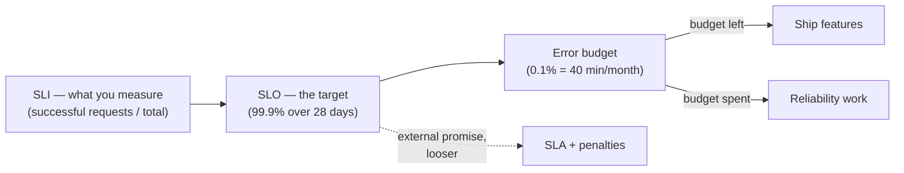

# Site Reliability Engineering

> Beyer, Jones, Petoff & Murphy (eds.), Google, 2016. The book that turned
> "keep it up" into an engineering discipline with a budget.

| | |
| --- | --- |
| **Editors** | Betsy Beyer, Chris Jones, Jennifer Petoff, Niall Richard Murphy |
| **Published** | 2016 (free online); *The Site Reliability Workbook*, 2018, is the practical companion |
| **Shape** | ~500 pages, 34 chapters by many authors — uneven by design |
| **Read it for** | SLIs, SLOs, and error budgets. Everything else is commentary. |
| **Skip it if** | You expect it to map onto a ten-person company unmodified. It won't. |

## The argument in one paragraph

**100% reliability is the wrong target** — it costs unboundedly more than 99.9%
and your users cannot tell, because their phone and their ISP are less reliable
than that. So choose a number, measure it, and spend the difference. An
**error budget** — the gap between your target and 100% — converts reliability
from an argument between developers and operations into a shared quantity:
while the budget holds, ship; when it is exhausted, reliability work takes
priority. Operations is treated as a software problem, and toil is capped
(Google's rule of thumb: at most 50% of an SRE's time).

## The parts that matter most

**SLIs, SLOs, SLAs.** An SLI is a measurement (availability, latency, quality,
freshness), an SLO is your internal target, an SLA is the external promise with
consequences attached — and your SLO should always be stricter than your SLA.
Choose few indicators, measure them where the user is, and be willing to make
the target *worse* if you are over-delivering.

**Eliminating toil.** Toil is manual, repetitive, automatable, tactical work
that scales linearly with the service. It is not "the boring bits" — it is
defined precisely so it can be measured and capped.

**Monitoring and the four golden signals** — latency, traffic, errors,
saturation. Page on symptoms, not causes; every page must be actionable; alerts
that nobody acts on should be deleted.

**Incident response and postmortems.** Clear roles (incident command,
operations, communications), and **blameless postmortems** as a standing
practice: the goal is the system that allowed the action, not the person who
took it. The chapter on managing incidents is the one to hand to anyone
starting on-call.

**Release engineering.** Hermetic builds, gradual rollouts, canarying, and the
insight that most outages are caused by a change — so the safest deploy is a
small one you can undo.

**Simplicity.** A short chapter arguing that software bloat is a reliability
problem, and that deleting code is legitimate SRE work.

**Practices around cascading failure, load shedding, overload, distributed
consensus, and data integrity** — the deepest operational chapters, and the
place the book connects back to distributed systems theory.

## Ideas worth stealing

| Idea | What it means | Where it bites |
| --- | --- | --- |
| **Error budget** | Unreliability is a resource you spend | "No deploys, it might break" versus "ship everything" |
| **Page on symptoms** | Alert on what users feel | 200 CPU alerts, no user-facing signal |
| **Toil cap** | Manual work is measured and limited | The team that only does tickets |
| **Blameless postmortems** | Fix the system, not the person | Incidents that stop being reported |
| **Golden signals** | Four numbers before a hundred dashboards | Metrics sprawl with no SLO |
| **Gradual rollout** | Canary, then widen | Global deploys at 5pm |
| **Defence in depth for data** | Backups you have actually restored | The untested backup |

## What has aged, and what hasn't

The framing problem is scale: this is Google, with its own infrastructure,
Borg, and a staffing model most companies cannot copy. Chapters assume tooling
you do not have. Read the *Workbook* (2018) alongside it — it exists precisely
because readers asked "but how do I start with five engineers and a cloud
account?" — and treat organisational chapters as one example, not a template.

What has not aged: SLO-driven thinking is now the industry's default vocabulary
for reliability, and error budgets remain the only widely adopted mechanism
that makes the speed-versus-stability argument quantitative instead of
political.

## How to read it

Read chapters 3 (embracing risk), 4 (SLOs), 5 (toil), 6 (monitoring), and the
incident-management and postmortem chapters. Then jump to cascading failures
and overload if you run anything at scale. It is free online; the *Workbook* is
where you go for worked SLO examples.

## Where it touches this knowledge base

- [SRE and reliability](../devops-infrastructure/1-knowledge/observability/sre-reliability.md) · [Observability](../devops-infrastructure/1-knowledge/observability/observability.md)
- [SLA, SLO, SLI](../system-design/1-knowledge/fundamentals/sla-slo-sli.md) · [Availability and reliability](../system-design/1-knowledge/fundamentals/availability-reliability.md)
- [Incident response](../devops-infrastructure/2-case-studies/incident-response.md) · [Anatomy of an outage](../computer-networks/2-case-studies/anatomy-of-an-outage.md)
- [Continuous delivery and deployment](../devops-infrastructure/1-knowledge/ci-cd/continuous-delivery-deployment.md)
- [Capacity planning](../system-design/1-knowledge/reliability/capacity-planning.md) · [Disaster recovery](../system-design/1-knowledge/reliability/disaster-recovery.md)

## If you liked this

[Release It!](./release-it.md) is the same subject from the architect's side —
the failure modes you design against.
[Accelerate](../books-teams/accelerate.md) has the evidence that this way of
working is also the faster one.
