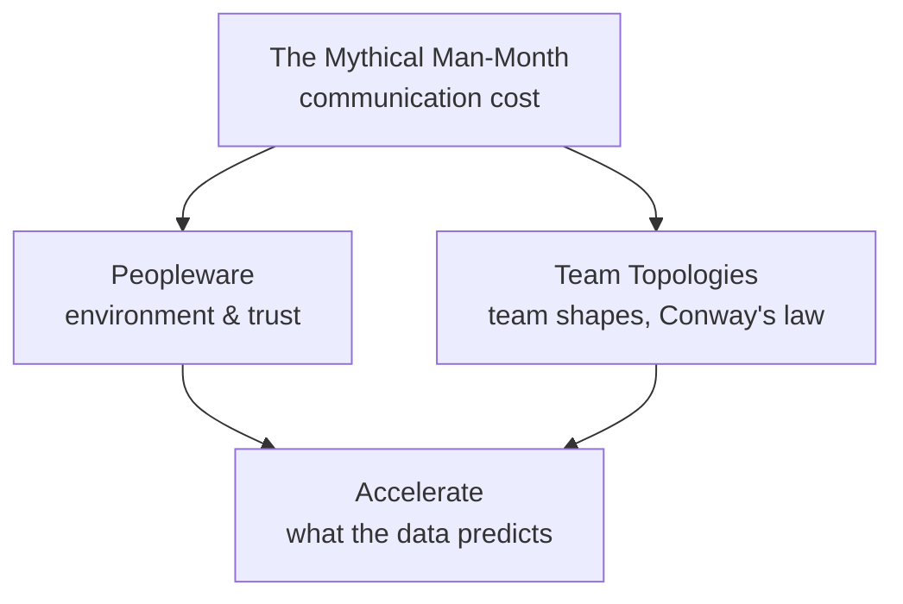

# Teams & Delivery

> The books about the part of software that is made of people — why adding
> them to a late project makes it later, and what the data says actually
> predicts delivery.

Summaries, not substitutes: the argument, the ideas worth stealing, what has
aged, and where each book meets the rest of this knowledge base.

<!--
  Provenance: machine-written distillations, not the authors' words and not
  reviewed by them. Check anything you are about to bet on against the book.
-->

## What is here

| Book | Author | Read it for |
| --- | --- | --- |
| [The Mythical Man-Month](./the-mythical-man-month.md) | Brooks, 1975 / 1995 | Why software schedules fail, written before most of us were born |
| [Peopleware](./peopleware.md) | DeMarco & Lister, 1987 / 2013 | The claim that the problems are sociological, not technical |
| [Accelerate](./accelerate.md) | Forsgren, Humble & Kim, 2018 | Evidence — four metrics, and what predicts them |
| [Team Topologies](./team-topologies.md) | Skelton & Pais, 2019 | Team shapes as an architectural decision |

## How they fit together

Brooks explains why coordination does not scale, Conway explains why the
architecture ends up shaped like the org chart, Skelton and Pais make that a
design tool, and Forsgren supplies the numbers.

## Where this touches the knowledge base

- [Best Practices](../best-practices/README.md) · [DevOps & Infrastructure](../devops-infrastructure/README.md)
