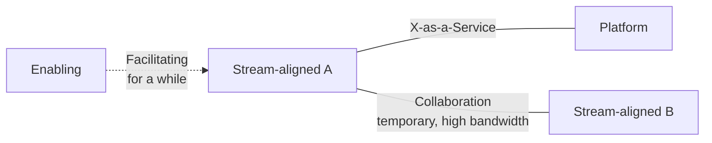

# Team Topologies

> Matthew Skelton & Manuel Pais, 2019. Conway's law, turned from a warning into
> a design tool: choose the teams you want the architecture to have.

| | |
| --- | --- |
| **Authors** | Matthew Skelton, Manuel Pais |
| **Published** | 2019 |
| **Shape** | ~200 pages; a short book with one strong idea and a vocabulary |
| **Read it for** | Four team types, three interaction modes, and cognitive load as a constraint |
| **Skip it if** | You cannot influence team structure at all — though it explains a lot of pain |

## The argument in one paragraph

**Conway's law** — organisations design systems that copy their communication
structures — means the org chart is an architectural decision whether or not
anyone treats it as one. So make it one: use the **inverse Conway manoeuvre**
to shape teams around the architecture you want. Treat the **team**, not the
individual, as the fundamental unit; keep it long-lived and small enough for
trust (Dunbar-style limits); and size its responsibility by the **cognitive
load** it can actually carry. Then restrict yourself to four team types and
three ways they interact, so that "who talks to whom" is deliberate rather than
emergent.

## The four team types

| Type | Purpose | Notes |
| --- | --- | --- |
| **Stream-aligned** | Aligned to one flow of work — a product, a service, a customer journey | The default; every other type exists to support these |
| **Enabling** | Helps stream-aligned teams acquire a missing capability | Temporary by design; teaches, does not do the work |
| **Complicated-subsystem** | Owns a part that needs deep specialist knowledge | Rare and justified by genuine specialism, e.g. a pricing engine, a codec |
| **Platform** | Provides internal services that reduce cognitive load for stream teams | Treat it as a product with users who could opt out |

## The three interaction modes

- **Collaboration** — two teams work closely to discover something. High
  bandwidth, high cost, deliberately temporary; leaves behind a clearer
  boundary.
- **X-as-a-Service** — one team consumes what another provides, with a clear
  contract and minimal conversation. Efficient, and the target state for
  platform relationships.
- **Facilitating** — one team helps another improve, for a defined period.

The rule that gives the book its teeth: **collaboration is expensive and should
have an end date.** Permanent collaboration between two teams is a sign the
boundary is wrong.

## Cognitive load as the sizing rule

Borrowing from Sweller: intrinsic (the skill itself), extraneous (the
environment, tooling, process) and germane (the domain problem). A team's
responsibilities should fit within its capacity; the way to add capability is
to **reduce extraneous load** — that is the entire justification for an
internal platform. "How many services should a team own?" becomes "how much can
they hold in their heads?", which is a far better question than a number.

Related: **fracture planes** — where to split a monolith along business domain,
regulatory boundary, change cadence, risk, or performance isolation; and
**thinnest viable platform** — the smallest platform that removes real load,
not an empire.

## Ideas worth stealing

| Idea | What it means | Where it bites |
| --- | --- | --- |
| **Inverse Conway manoeuvre** | Shape teams to get the architecture | Boundaries that erode under delivery pressure |
| **Team as the unit** | Long-lived teams, work flows to them | Project-based reassignment every quarter |
| **Cognitive load limits scope** | Ownership is bounded by what fits | A team owning 14 services and on-call for all |
| **Four types only** | Anything else needs justifying | Twelve team categories in one org chart |
| **Collaboration has an end date** | Or the boundary is wrong | Two teams permanently in each other's standups |
| **Platform as a product** | Users must want it, not be assigned it | A platform team nobody consults |
| **Thinnest viable platform** | Remove load, don't build an empire | A platform with its own roadmap and no users |
| **Fracture planes** | Split along change and domain, not layers | A "frontend team" and a "backend team" |

## What has aged, and what hasn't

It is recent, so little has dated — but the book is thin on evidence (it is
pattern language plus experience, not research), and the four types are easy to
adopt as labels while changing nothing: renaming an ops team "platform" is the
most common outcome. It also assumes an organisation large enough for the
distinction to matter; under about thirty engineers, the vocabulary is more
useful than the structure.

The lasting contributions are cognitive load as an explicit design constraint —
the first widely adopted answer to "how much should a team own?" — and giving
teams permission to say that a permanent collaboration is a design smell.

## How to read it

It is short; read it straight through. Then draw your own organisation in its
vocabulary — which teams are stream-aligned, which interactions are
collaboration that should have ended — and the useful conversations start
immediately.

## Where it touches this knowledge base

- [Monolith vs microservices](../system-design/1-knowledge/patterns/monolith-vs-microservices.md) — Conway's law deciding service boundaries
- [What is DevOps](../devops-infrastructure/1-knowledge/fundamentals/what-is-devops.md) — the platform argument, in its original setting
- [What is software architecture](../architecture-patterns/1-knowledge/fundamentals/what-is-software-architecture.md)
- [Coupling and cohesion](../architecture-patterns/1-knowledge/fundamentals/coupling-and-cohesion.md) — the same property, applied to people

## If you liked this

[Building Microservices](../books-design/building-microservices.md) is the
architectural half of the same argument, and
[Accelerate](./accelerate.md) supplies the evidence that team autonomy is what
the delivery metrics are actually measuring.
