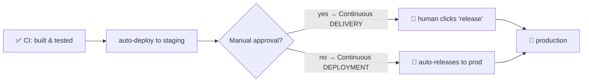

# Continuous Delivery & Deployment (CD) + rollout strategies

> CD picks up where [CI](./continuous-integration.md) ends: once a change is built and tested,
> CD **automatically gets it to production** — safely. *Continuous **Delivery*** keeps every
> change deployable at the push of a button; *Continuous **Deployment*** removes even that
> button. The art is releasing **without risking an outage**, which is where rollout
> strategies (blue-green, canary, rolling) come in.

## Top-down: where you already meet this
An app you use ships updates constantly and you never notice downtime — no "maintenance
window," no broken Saturday. Behind that is CD: changes flow from a merged pull request to
real users automatically, released *gradually* so a bad change is caught before it hits
everyone. You've felt the good version (seamless updates) and the bad version (an app that's
"down for maintenance"). This doc is how teams achieve the former.

## Problem
[CI](./continuous-integration.md) proved the change is *correct in a test environment* — but
deploying to production is still where things break: real traffic, real data, real
[config](../fundamentals/environments-and-release-flow.md), real scale. A naive "stop the old
version, start the new one" risks downtime and, if the new version is broken, an outage for
*everyone at once*. We need deployment to be **automated** (no error-prone manual steps),
**low-risk** (limit the blast radius of a bad release), and **reversible** (undo fast).

## Core concepts

**Delivery vs Deployment — one button apart:**



| | Continuous **Delivery** | Continuous **Deployment** |
| --- | --- | --- |
| To production | one click away, anytime | fully automatic |
| Human gate | yes (a person approves) | no |
| Good when | regulated/cautious contexts | high trust in tests + monitoring |

Both require rock-solid [CI](./continuous-integration.md) and
[observability](../observability/observability.md) first.

**The risk is the cutover — so don't flip everyone at once.** Rollout strategies all answer one
question: *how do we move traffic from the old version to the new without a big-bang risk?*

**Rolling update** — replace instances a few at a time:
```
[v1][v1][v1][v1]  →  [v2][v1][v1][v1]  →  [v2][v2][v1][v1]  →  [v2][v2][v2][v2]
```
The default in [Kubernetes](../containers/kubernetes.md). No extra hardware, but old and new run
together briefly (must be compatible), and rollback means rolling *back* gradually.

**Blue-green** — run two full environments, switch traffic instantly:
```
Blue (v1) ← 100% traffic        Blue (v1) ← 0%
Green (v2) ← 0%   ──switch──▶    Green (v2) ← 100%   (rollback = switch back, instant)
```
Instant cutover and instant rollback, but you pay for *double* the infrastructure during the
release.

**Canary** — expose the new version to a *small slice* of real users first, watch
[metrics](../observability/observability.md), then widen:
```
v2 to 1% → 📊 errors/latency OK? → 10% → 📊 OK? → 50% → 100%
                    │ any regression at any step → auto-rollback to v1
```
The safest for risky changes: a bad release hurts ~1% of users for a minute, not everyone. The
gold standard at scale, but needs good metrics and automation to judge "is the canary healthy?"

| Strategy | Blast radius | Rollback | Cost | Best for |
| --- | --- | --- | --- | --- |
| **Rolling** | medium | gradual | low | the everyday default |
| **Blue-green** | all-or-nothing | instant | 2× infra | fast, clean cutover |
| **Canary** | tiny (1–5%) | instant for most | medium | risky changes, large user base |

**Decouple deploy from release: feature flags.** A powerful trick — **deploy** the code to
production but keep it **off** behind a [feature flag](../fundamentals/environments-and-release-flow.md),
then *release* by flipping the flag (to 1%, 10%, internal users…) with no redeploy. This
separates "the code is running" from "users can see it," making rollback as fast as toggling a
switch.

**Automated rollback.** Because deploys are frequent and gradual, the response to a bad one is
*revert*, not heroics: if [SLOs](../observability/sre-reliability.md) (error rate, latency)
breach during a rollout, the pipeline automatically rolls back. Fast recovery beats trying to
prevent every failure.

## Essential terminology

| Term | Meaning |
| --- | --- |
| **Continuous Delivery** | Every change is always deployable; release is a one-click decision. |
| **Continuous Deployment** | Every passing change auto-releases to production, no human gate. |
| **Rollout / cutover** | The act of shifting traffic from the old version to the new. |
| **Rolling update** | Replacing instances incrementally. |
| **Blue-green** | Two full environments; switch traffic between them instantly. |
| **Canary** | Releasing to a small % of users first, then widening if healthy. |
| **Blast radius** | How many users/systems a bad change can hurt. |
| **Rollback** | Reverting to the previous known-good version. |
| **Feature flag** | A runtime switch decoupling deploy from release. |
| **Progressive delivery** | Umbrella term for canary/flag-based gradual rollouts. |

## Example
A canary rollout expressed as pipeline logic (pseudo-config):
```yaml
deploy:
  strategy: canary
  steps:
    - setWeight: 5          # send 5% of traffic to v2
    - analyze:              # watch real metrics for 5 min
        metrics: [error_rate < 1%, p95_latency < 300ms]
        onFailure: rollback # breach → revert to v1 automatically
    - setWeight: 25
    - analyze: { ... }
    - setWeight: 100        # all good → full rollout
```
The new version proves itself on **real traffic, a sliver at a time**, and the pipeline — not a
panicking human at 2am — decides to proceed or revert based on
[metrics](../observability/observability.md). That's modern CD. (Tools like Argo Rollouts and
Flagger do exactly this on [Kubernetes](../containers/kubernetes.md).)

## Common tools
| Tool | What it is | Use it for |
| --- | --- | --- |
| **Argo CD / Flux** | GitOps CD for Kubernetes | declaratively syncing the cluster to Git |
| **Argo Rollouts / Flagger** | Progressive delivery controllers | automated canary/blue-green + analysis |
| **Spinnaker** | Multi-cloud CD platform | complex pipelines & rollout strategies |
| **GitHub Actions / GitLab CD** | Pipeline engines | wiring build → deploy steps |
| **LaunchDarkly / Unleash** | Feature-flag platforms | decoupling deploy from release |

## Trade-offs
- ✅ **Releases become boring & frequent** — small, automated, low-risk, easy to revert.
- ✅ **Gradual rollouts shrink the blast radius** of any bad change to a fraction of users.
- ✅ **Fast recovery** (auto-rollback, flag flips) over trying to be perfect.
- ⚠️ **Requires real maturity:** trustworthy [CI](./continuous-integration.md), good
  [observability](../observability/observability.md), and [SLOs](../observability/sre-reliability.md)
  to judge canary health — without them, automated CD just ships bugs faster.
- ⚠️ **Compatibility burden:** rolling/canary run old+new together, so changes (esp. database
  migrations) must be **backward compatible** — a real discipline.
- ⚠️ **Cost vs speed:** blue-green doubles infra; canary needs analysis tooling. You pick per
  change's risk.

## Real-world examples
- **Netflix & Google** run automated canaries that compare new-vs-old metrics and roll back
  without humans.
- **Facebook's feature flags ("gatekeeper")** let them deploy code dark and release to employees,
  then 1%, then everyone — deploy decoupled from release at massive scale.
- **GitOps with Argo CD** is the common cloud-native pattern: merge to Git → the cluster
  reconciles to match → progressive rollout.
- **"Database migrations must be backward-compatible"** is the hard-won rule that makes
  zero-downtime rolling deploys possible.

## References
- *Continuous Delivery* (Humble & Farley) — the definitive book
- [Martin Fowler — BlueGreenDeployment](https://martinfowler.com/bliki/BlueGreenDeployment.html) · [CanaryRelease](https://martinfowler.com/bliki/CanaryRelease.html)
- [Argo Rollouts](https://argoproj.github.io/rollouts/) · [Progressive delivery (LaunchDarkly)](https://launchdarkly.com/blog/what-is-progressive-delivery/)
- [Google SRE Book — Release Engineering](https://sre.google/sre-book/release-engineering/)
