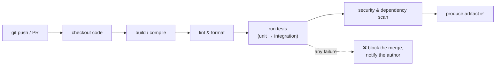

# Continuous Integration (CI)

> CI is the practice of **automatically building and testing every change the moment it's
> pushed**, many times a day, so integration problems surface in minutes instead of
> festering for weeks. It's the first automated gate on the path to production.

## Top-down: where you already meet this
You open a pull request and a few minutes later see green checkmarks ✅ (or red ✗) — "tests
passed," "build succeeded," "linter happy." That automated verdict on your change is CI. It's
the foundation the rest of [DevOps](../fundamentals/what-is-devops.md) stands on: you can't
*continuously deliver* what you can't *continuously verify*. This doc is the "build & test"
stage of the pipeline; [CD](./continuous-delivery-deployment.md) is what happens after it goes
green.

## Problem
On teams without CI, developers work in isolation for days or weeks, then try to merge — and
discover their changes conflict, break each other, or fail on a machine that isn't theirs.
This **"integration hell"** scales horribly: the longer code diverges, the more painful the
merge. And manual testing is slow, inconsistent, and skipped under deadline pressure. We need
to integrate *small changes frequently* and verify them *automatically and identically* every
time.

## Core concepts

**Integrate early, integrate often.** The "continuous" in CI means developers merge to a shared
mainline ([trunk](../fundamentals/environments-and-release-flow.md)) frequently — at least
daily — in small increments. Small, frequent merges have tiny conflicts; rare, huge merges have
catastrophic ones. CI makes frequent integration *safe* by verifying each one automatically.

**The pipeline: every push triggers an automated run.** A CI server watches the repo; on each
push or pull request it runs a **pipeline** of stages, failing fast if any stage fails:



**The pyramid of automated tests.** CI runs tests in order of speed and cost — fast, cheap ones
first so failures surface in seconds:

| Layer | What it checks | Speed | How many |
| --- | --- | --- | --- |
| **Unit tests** | one function/class in isolation | milliseconds | thousands |
| **Integration tests** | components working together (DB, API) | seconds | hundreds |
| **End-to-end (E2E)** | the whole system like a user | minutes | a few |

This **test pyramid** (many fast unit tests, few slow E2E) keeps the feedback loop short.

**Fast feedback is the whole point.** A CI run that takes 45 minutes is barely better than
manual testing — developers context-switch and stop trusting it. Elite teams keep CI under ~10
minutes via parallelization, caching, and the test pyramid. The metric that matters: **how fast
do you learn your change is broken?**

**Fail fast, keep main green.** If any stage fails, the pipeline stops, the merge is blocked,
and the author is notified immediately. The cardinal rule: **never merge red; keep `main` always
releasable.** A broken mainline blocks the whole team, so fixing CI is everyone's top priority.

**Build once, reuse the artifact.** A successful CI run produces a versioned **artifact** (a
[container image](../containers/containers.md), a package) — built *once* and then promoted
unchanged through [environments](../fundamentals/environments-and-release-flow.md) by
[CD](./continuous-delivery-deployment.md). You test the exact bytes you'll ship.

## Essential terminology

| Term | Meaning |
| --- | --- |
| **Continuous Integration** | Automatically building & testing every change on a shared mainline. |
| **Pipeline** | The automated sequence of stages a change runs through. |
| **Stage / job / step** | The units a pipeline is built from (build, test, scan…). |
| **Runner / agent** | The machine that executes pipeline jobs. |
| **Trigger** | The event that starts a run (push, pull request, schedule). |
| **Test pyramid** | Many fast unit tests, fewer integration, few slow E2E. |
| **Fail fast** | Stop and report at the first failure, early and cheaply. |
| **Green / red build** | Passing / failing pipeline; "keep main green." |
| **Artifact** | The build output, produced once and promoted onward. |
| **Flaky test** | A test that passes/fails nondeterministically — erodes trust in CI. |

## Example
A minimal GitHub Actions CI pipeline — runs on every push and PR:
```yaml
# .github/workflows/ci.yml
name: CI
on: [push, pull_request]          # trigger: every push and PR
jobs:
  test:
    runs-on: ubuntu-latest        # the runner
    steps:
      - uses: actions/checkout@v4 # 1. get the code
      - uses: actions/setup-node@v4
        with: { node-version: 20 }
      - run: npm ci               # 2. install deps (cached)
      - run: npm run lint         # 3. lint
      - run: npm test             # 4. run tests  ← fails here = red build, merge blocked
      - run: npm run build        # 5. build the artifact
```
Push a commit and this runs automatically; the PR shows ✅ or ❌ within minutes. Break a test
on purpose and watch the merge button lock. That automated gate, on every change, is CI. (Build
it yourself in the [GitHub Actions lab](../../3-practice/lab-github-actions.md).)

## Common tools
| Tool | What it is | Use it for |
| --- | --- | --- |
| **GitHub Actions** | CI/CD built into GitHub | pipelines triggered by repo events |
| **GitLab CI** | GitLab's integrated CI/CD | `.gitlab-ci.yml` pipelines |
| **Jenkins** | Self-hosted automation server | highly customizable, plugin-rich pipelines |
| **CircleCI / Travis / Buildkite** | Hosted CI services | fast, parallel cloud pipelines |
| **pre-commit** | Local git hooks | catching lint/format issues *before* pushing (shift left) |

## Trade-offs
- ✅ **Catches bugs in minutes, not weeks;** eliminates integration hell; `main` stays releasable.
- ✅ **Consistent & automatic:** the same checks run every time, regardless of deadline pressure.
- ✅ Enables everything downstream — you can't safely do [CD](./continuous-delivery-deployment.md)
  without trustworthy CI.
- ⚠️ **Tests are an investment:** CI is only as good as the tests; weak tests give false
  confidence.
- ⚠️ **Flaky tests are poison:** intermittent failures train people to ignore red builds — they
  must be fixed or quarantined ruthlessly.
- ⚠️ **Slow pipelines kill the benefit:** if CI takes 45 min, feedback isn't "fast" — needs
  ongoing investment in speed (caching, parallelism).

## Real-world examples
- **Open-source projects on GitHub** show CI in the open: every PR runs the maintainers' test
  suite before a human even looks.
- **Google's monorepo** runs an enormous CI system on every change across billions of lines —
  trunk-based development at extreme scale.
- **"Shift left" security** (Dependabot, Snyk, CodeQL) folds vulnerability and dependency
  scanning into CI, catching issues at the pull request.

## References
- Martin Fowler — [Continuous Integration](https://martinfowler.com/articles/continuousIntegration.html) (the foundational essay)
- *Continuous Delivery* (Humble & Farley)
- [GitHub Actions docs](https://docs.github.com/actions)
- [The Practical Test Pyramid (Fowler/Vocke)](https://martinfowler.com/articles/practical-test-pyramid.html)
