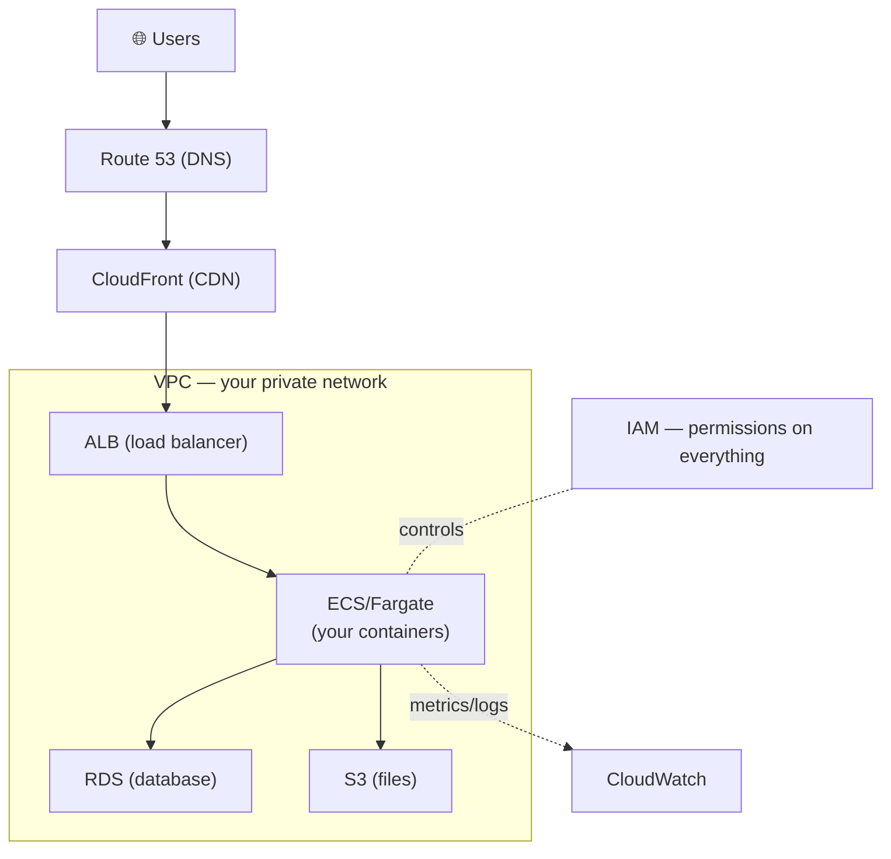

# AWS — the services behind the concepts

> [Cloud computing](./cloud-computing.md) explained the *concepts* (IaaS, storage, serverless,
> regions). AWS is the dominant *implementation* of those concepts, and learning its service
> names turns the abstract into something you can actually build. This doc is a **map**: every
> concept in this area → the AWS service that provides it.

## Top-down: where you already meet this
You've learned compute, storage, [containers](../containers/containers.md),
[IaC](../fundamentals/infrastructure-as-code.md), [CI/CD](../ci-cd/continuous-integration.md), and
[observability](../observability/observability.md) as ideas. In the real world you don't deploy
"a compute resource" — you launch an **EC2 instance**, push to **ECR**, run on **Fargate**, store
in **S3**, and watch it in **CloudWatch**. AWS is where the concepts get names and an API. Because
AWS is the market leader, these names are near-universal vocabulary — knowing them is table stakes.
This doc anchors the whole cloud section to concrete services.

## Problem
"The cloud" is hundreds of services with cryptic names. A beginner drowns: *Is EC2 or ECS or EKS
or Lambda the right compute? S3 or EBS or EFS for storage?* Without a mental map tying each service
back to a *concept you already understand*, AWS is just an intimidating wall of acronyms. The fix
is to organize the catalog by the **job** each service does.

## Core concepts

**The service map — concept → AWS service.** This table *is* the doc; everything else elaborates:

| Concept (in this area) | Primary AWS service(s) | One-liner |
| --- | --- | --- |
| **[Compute — VMs (IaaS)](./cloud-computing.md)** | **EC2** | rent virtual machines by the second |
| **[Compute — containers](../containers/containers.md)** | **ECS** / **Fargate** / **EKS** | run containers (ECS = AWS's own, EKS = managed [Kubernetes](../containers/kubernetes.md), Fargate = serverless containers) |
| **[Compute — serverless](./cloud-computing.md)** | **Lambda** | run a function per event, scale to zero |
| **Image registry** | **ECR** | store [container images](../containers/containers.md) (AWS's Docker registry) |
| **Object storage** | **S3** | durable, cheap blob storage (files, backups, static sites) |
| **Block / file storage** | **EBS** / **EFS** | disks for EC2 / shared network file system |
| **[Networking — private network](../../../computer-networks/1-knowledge/network-layer/ip-addressing.md)** | **VPC** | your isolated virtual network (subnets, routing) |
| **[Load balancing](../containers/service-networking-load-balancing.md)** | **ELB** (ALB/NLB) | L7/L4 [load balancers](../containers/service-networking-load-balancing.md) |
| **[DNS](../../../computer-networks/1-knowledge/application-layer/dns.md)** | **Route 53** | managed DNS + health-checked routing |
| **[CDN](../../../computer-networks/2-case-studies/cdn.md)** | **CloudFront** | global content delivery / edge cache |
| **Relational DB** | **RDS** / **Aurora** | managed Postgres/MySQL |
| **NoSQL DB** | **DynamoDB** | managed key-value/document store |
| **Identity & access** | **IAM** | who can do what — see [AWS IAM](./aws-iam.md) |
| **[IaC](../fundamentals/infrastructure-as-code.md)** | **CloudFormation** / **CDK** | AWS-native infra-as-code (Terraform also works) |
| **[CI/CD](../ci-cd/continuous-integration.md)** | **CodePipeline / CodeBuild / CodeDeploy** | AWS's native pipeline (GitHub Actions also common) |
| **[Observability](../observability/observability.md)** | **CloudWatch** + **X-Ray** | metrics/logs/alarms + distributed tracing |
| **Messaging / queues** | **SQS** / **SNS** | queue / pub-sub for [decoupling](../ci-cd/continuous-delivery-deployment.md) |
| **Secrets** | **Secrets Manager** / **SSM Parameter Store** | store [secrets/config](../fundamentals/environments-and-release-flow.md) |

**A typical AWS architecture** — how the pieces fit for a standard containerized web app:



**Regions, AZs & the global backbone.** AWS is organized into [regions](./cloud-computing.md)
(`us-east-1`, `eu-west-1`) each with multiple [Availability Zones](./cloud-computing.md). You
deploy across **multiple AZs** for resilience and pick a region close to users for
[latency](../../../computer-networks/1-knowledge/fundamentals/latency-bandwidth-throughput.md).
Some services are **global** (IAM, Route 53, CloudFront); most are **regional** (EC2, S3 buckets,
RDS).

**Everything is an API behind IAM.** Two AWS truths to internalize early:
1. **Every action is an API call** — the console, CLI, and SDKs all hit the same REST API. This is
   why [IaC](../fundamentals/infrastructure-as-code.md) (Terraform/CloudFormation) can manage
   *everything*.
2. **Every call is permission-checked by [IAM](./aws-iam.md)** — nothing happens unless an IAM
   policy explicitly allows it. IAM is the spine of AWS security.

**The shared responsibility model.** AWS secures the cloud *infrastructure* (data centers,
hardware, the hypervisor); **you** secure what you put *in* it (your data, IAM policies, patching
your EC2 OS, not making your S3 bucket public). Most cloud breaches are the customer's side —
misconfigured [IAM](./aws-iam.md) or storage, not AWS being hacked.

**ARNs name everything.** Every resource has an **ARN** (Amazon Resource Name),
`arn:aws:s3:::my-bucket`, used in IAM policies and references — you'll see them everywhere.

## Essential terminology

| Term | Meaning |
| --- | --- |
| **EC2** | Elastic Compute Cloud — rentable virtual machines (IaaS). |
| **S3** | Simple Storage Service — object/blob storage. |
| **ECS / EKS / Fargate** | Container services: AWS-native / managed K8s / serverless containers. |
| **ECR** | Elastic Container Registry — AWS's image registry. |
| **Lambda** | Serverless functions (run per event, scale to zero). |
| **VPC** | Virtual Private Cloud — your isolated network. |
| **ELB / ALB / NLB** | Elastic Load Balancer (Application = L7, Network = L4). |
| **Route 53** | Managed DNS. |
| **CloudFront** | AWS's CDN. |
| **RDS / DynamoDB** | Managed relational / NoSQL databases. |
| **IAM** | Identity & Access Management — permissions. |
| **CloudFormation / CDK** | AWS-native infrastructure-as-code. |
| **CloudWatch** | Metrics, logs, alarms, dashboards. |
| **Region / AZ** | Geographic area / isolated data center within it. |
| **ARN** | Amazon Resource Name — the unique ID of any resource. |
| **Free Tier** | AWS's 12-month + always-free allowances for learning. |

## Example
The same three-tier web app, named in AWS services — the architecture diagram above, as a parts
list:
```
DNS            →  Route 53        (myapp.com → the load balancer)
CDN/edge       →  CloudFront      (cache static assets near users)
Load balancer  →  ALB             (spread traffic across containers, terminate TLS)
Compute        →  ECS on Fargate  (run N copies of your container image from ECR)
Database       →  RDS (Postgres)  (managed, multi-AZ for resilience)
File storage   →  S3              (user uploads, static files)
Secrets        →  Secrets Manager (DB password injected at runtime)
Observability  →  CloudWatch      (metrics, logs, alarms) + X-Ray (traces)
Permissions    →  IAM             (the container's role may read S3 + that one secret — nothing else)
Provisioned by →  Terraform/CDK   (all of the above as version-controlled code)
```
Notice every concept from Part 1 has a concrete AWS home — and IAM ties them together by deciding
what may talk to what. Build a slice of this in the
[ECS/Fargate lab](../../3-practice/aws/lab-deploy-to-ecs-fargate.md).

## Common tools
| Tool | What it is | Use it for |
| --- | --- | --- |
| **AWS Console** | Web UI | exploring & clicking (good for learning, not for repeatability) |
| **AWS CLI v2** | Command-line interface | scripting & inspecting any service |
| **AWS SDKs** | Language libraries (boto3, etc.) | calling AWS from app code |
| **Terraform / CDK / CloudFormation** | [IaC](../fundamentals/infrastructure-as-code.md) | provisioning AWS reproducibly |
| **LocalStack** | Local AWS emulator | practicing many AWS APIs offline, free |
| **AWS Free Tier** | Cost-safe allowances | learning without a bill — see [setup & cost safety](../../../system-design/3-practice/aws/setup-and-costs.md) |

## Trade-offs
- ✅ **One integrated platform** for every concept — compute, storage, networking, CI/CD,
  observability — wired together and managed.
- ✅ **Market leader = ubiquitous skills & docs;** the service names are industry vocabulary.
- ✅ **Free Tier + pay-per-use** make it cheap to learn and start.
- ⚠️ **[Vendor lock-in](./cloud-computing.md):** deep use of proprietary services (DynamoDB,
  Lambda, IAM) is hard to migrate off; portable layers ([Kubernetes](../containers/kubernetes.md),
  containers, Terraform) hedge it.
- ⚠️ **Cost & complexity:** hundreds of services and pricing dimensions; easy to overspend or
  misconfigure — **always set a budget alarm and tear down**
  ([cost-safety guide](../../../system-design/3-practice/aws/setup-and-costs.md)).
- ⚠️ **Security is *your* half:** misconfigured [IAM](./aws-iam.md) or public S3 buckets cause most
  breaches — the shared-responsibility model is real.

## Real-world examples
- **Netflix, Airbnb, and much of the internet run on AWS** — EC2/S3 are foundational infrastructure
  for huge swaths of the web.
- **S3 is effectively the internet's hard drive** — backups, data lakes, static sites, and the
  origin behind countless [CDNs](../../../computer-networks/2-case-studies/cdn.md).
- **Lambda + API Gateway + DynamoDB** is the canonical "serverless" stack — no servers to manage.
- **EKS** lets teams run standard [Kubernetes](../containers/kubernetes.md) without operating the
  control plane — portability with AWS muscle.

## References
- [AWS — Getting Started](https://aws.amazon.com/getting-started/) · [AWS service overview](https://aws.amazon.com/products/)
- [AWS Shared Responsibility Model](https://aws.amazon.com/compliance/shared-responsibility-model/)
- Cost-safe setup & teardown: [AWS setup & cost safety](../../../system-design/3-practice/aws/setup-and-costs.md)
- Concepts behind the services: [cloud computing](./cloud-computing.md) · [IAM](./aws-iam.md)
