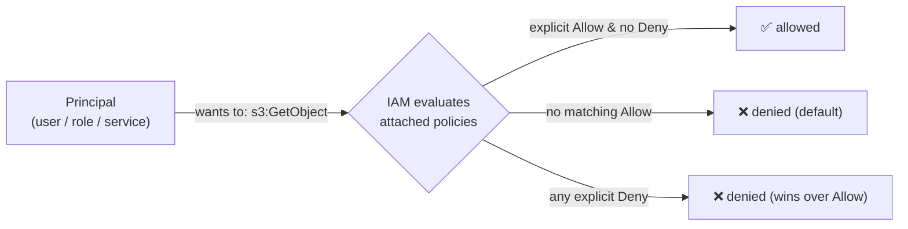

# AWS IAM — identity & access management

> IAM is the gatekeeper of AWS: **every single API call** — launch a server, read a file, delete a
> database — is checked against IAM policies, and denied unless explicitly allowed. Master IAM and
> AWS makes sense; misunderstand it and you'll be both locked out *and* insecure. It's the most
> important AWS service to understand first.

## Top-down: where you already meet this
The first wall every AWS beginner hits: `AccessDenied`. You try to read an S3 bucket and AWS refuses
— because *nothing* is permitted by default. That gatekeeper is IAM. And on the flip side, the most
common cause of cloud breaches isn't AWS being hacked — it's someone's [over-permissive IAM
policy](../../../computer-networks/1-knowledge/security/network-attacks-and-defenses.md) or a public
S3 bucket. IAM is where the [shared-responsibility model](./aws-core-services.md) lands on *you*.
Because [every AWS action is permission-checked](./aws-core-services.md), IAM underpins everything
else in the cloud section.

## Problem
A cloud account can create unlimited expensive, sensitive resources. You need fine-grained control
over *who* (which user, which service, which application) can do *what* (which actions) to *which*
resources — for humans, for automated [pipelines](../ci-cd/continuous-integration.md), and for one
service talking to another. And you need it to default to **deny**, so a mistake leaves you *locked
out*, not *wide open*. IAM is that authorization system.

## Core concepts

**The mental model: principals, actions, resources, policies.** An IAM request asks: *can this
**principal** perform this **action** on this **resource**?* The answer comes from **policies** —
JSON documents listing allowed/denied (action, resource) pairs.



**The evaluation rule (memorize this):** **default deny** → an explicit `Allow` grants access → but
any explicit `Deny` *always* overrides an Allow. So you're denied unless something allows you, and a
Deny can never be overridden. This "deny by default, explicit deny wins" logic is the heart of IAM.

**The identity types:**

| Identity | What it is | Use for |
| --- | --- | --- |
| **Root user** | the account owner (the signup email) | *almost nothing* — lock it away, enable MFA, never use daily |
| **IAM user** | a person/long-lived identity with credentials | humans, legacy CI (increasingly replaced by SSO/roles) |
| **IAM role** | a set of permissions *assumed temporarily*, no long-lived keys | services, cross-account, federated access — **the preferred pattern** |
| **IAM group** | a bucket of users sharing policies | managing humans by team/function |

**Roles are the key idea — temporary, keyless permissions.** Instead of giving an application a
permanent access key (which can leak), you attach a **role** to it. AWS hands the application
*temporary* credentials that auto-rotate. An EC2 instance, a Lambda, or an
[ECS task](./aws-core-services.md) **assumes a role** and gets exactly the permissions that role
grants — no secrets stored anywhere. This is how one service securely talks to another.

**Policies — the JSON that grants access.** A policy is a list of statements, each with an
**Effect** (Allow/Deny), **Action**(s), and **Resource**(s):
```json
{
  "Version": "2012-10-17",
  "Statement": [{
    "Effect": "Allow",
    "Action": ["s3:GetObject", "s3:PutObject"],
    "Resource": "arn:aws:s3:::my-app-uploads/*"
  }]
}
```
This says: *this principal may read & write objects in the `my-app-uploads` bucket — and, by
default-deny, nothing else anywhere.*

**Least privilege — the golden rule.** Grant the *minimum* permissions needed, nothing more. A
container that reads one S3 bucket should have a role allowing exactly `s3:GetObject` on exactly that
bucket — not `s3:*` on `*`. Least privilege limits the [blast
radius](../ci-cd/continuous-delivery-deployment.md) when (not if) credentials leak or code is
compromised — the same principle as
[network default-deny](../../../computer-networks/1-knowledge/security/network-attacks-and-defenses.md).

**Managed vs inline policies.** AWS provides **managed policies** (reusable, e.g.
`AmazonS3ReadOnlyAccess`) you attach to many identities; **inline policies** are embedded in one
identity. Prefer managed/custom-managed for reusability and auditing.

## Essential terminology

| Term | Meaning |
| --- | --- |
| **IAM** | Identity & Access Management — AWS's authorization system. |
| **Principal** | The entity making a request (user, role, or service). |
| **Root user** | The all-powerful account owner — to be locked away, not used. |
| **IAM user** | A long-lived identity with credentials (often a human). |
| **IAM role** | A permission set *assumed temporarily* — no stored keys. |
| **Assume role** | Temporarily taking on a role's permissions (via STS). |
| **Policy** | A JSON document granting/denying actions on resources. |
| **Statement** | One Effect/Action/Resource rule in a policy. |
| **Least privilege** | Granting only the minimum permissions needed. |
| **Default deny** | Nothing is allowed unless a policy explicitly allows it. |
| **Explicit deny** | A `Deny` that overrides any `Allow`. |
| **MFA** | Multi-factor auth — essential on the root user. |
| **Access key** | Long-lived credentials (prefer roles over these). |
| **ARN** | The resource identifier policies reference. |

## Example
Why a *role* beats an *access key* for an app reading S3:
```
❌ Access key approach:
   bake AWS_ACCESS_KEY + SECRET into the app's config → if the repo/env leaks, the key is
   valid forever, usable from anywhere → a breach.

✅ Role approach:
   1. create role "app-reads-uploads" with the least-privilege S3 policy above
   2. attach it to the ECS task / EC2 instance / Lambda
   3. AWS auto-injects TEMPORARY credentials that rotate every few hours
   → nothing to leak; even if exfiltrated, the creds expire fast and only allow that one bucket
```
The app code calls S3 with **no credentials in sight** — AWS resolves the role's temporary creds
automatically. This keyless, least-privilege, auto-rotating pattern is the single most important
IAM habit. (You'll attach a task role in the
[ECS/Fargate lab](../../3-practice/aws/lab-deploy-to-ecs-fargate.md).)

## Common tools
| Tool | What it is | Use it for |
| --- | --- | --- |
| **IAM console** | The web UI | creating users/roles/policies, reading the policy simulator |
| **`aws sts get-caller-identity`** | "who am I?" | confirming which principal your CLI is using |
| **IAM Policy Simulator** | What-if tester | checking whether a policy allows an action before deploying |
| **IAM Access Analyzer** | Permission analyzer | finding over-broad or public access |
| **`aws iam` CLI** | IAM management | scripting roles/policies (or do it in [IaC](../fundamentals/infrastructure-as-code.md)) |
| **AWS IAM Identity Center (SSO)** | Federated human access | replacing long-lived IAM users for people |

## Trade-offs
- ✅ **Fine-grained, default-deny control** over every action — the foundation of cloud security.
- ✅ **Roles eliminate stored secrets:** temporary, auto-rotating, scoped credentials for services.
- ✅ **Auditable:** policies are JSON you can review, version, and analyze.
- ⚠️ **Complexity & footguns:** IAM is notoriously intricate (resource policies, conditions,
  permission boundaries, cross-account) — easy to make it too permissive *or* lock yourself out.
- ⚠️ **`*` is a trap:** broad `Action: "*"` / `Resource: "*"` policies are the usual root cause of
  breaches; least privilege takes discipline and iteration.
- ⚠️ **Root user is a liability:** un-MFA'd, used root accounts are catastrophic if compromised —
  secure it on day one.

## Real-world examples
- **Most AWS data breaches trace to IAM/S3 misconfiguration** — over-broad roles or public buckets,
  not AWS itself being hacked (the [shared-responsibility](./aws-core-services.md) reality).
- **IAM roles for service-to-service auth** are everywhere: a Lambda assumes a role to write to
  DynamoDB; an ECS task assumes a role to read a secret — no keys anywhere.
- **`AccessDenied` debugging** with the Policy Simulator and `get-caller-identity` is a daily AWS
  skill.
- **Permission boundaries & SCPs** (in AWS Organizations) cap what even admins can grant — guardrails
  at scale.

## References
- [AWS IAM — User Guide](https://docs.aws.amazon.com/IAM/latest/UserGuide/introduction.html)
- [IAM best practices](https://docs.aws.amazon.com/IAM/latest/UserGuide/best-practices.html) (least privilege, roles over keys, MFA)
- [Policy evaluation logic](https://docs.aws.amazon.com/IAM/latest/UserGuide/reference_policies_evaluation-logic.html)
- The broader picture: [AWS core services](./aws-core-services.md) · [network security](../../../computer-networks/1-knowledge/security/network-attacks-and-defenses.md)
