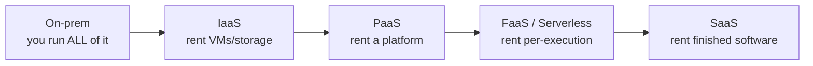

# Cloud computing — IaaS, PaaS, SaaS

> Cloud computing is renting someone else's data center on demand: instead of buying servers,
> you provision compute, storage, and networking over an API and pay for what you use. It's
> the substrate modern infrastructure runs on — and the reason a two-person startup can deploy
> globally in an afternoon.

## Top-down: where you already meet this
The [containers](../containers/containers.md) you built and the [Kubernetes](../containers/kubernetes.md) cluster that
runs them have to live on *actual machines somewhere*. Almost always, that "somewhere" is the
cloud — AWS, Google Cloud, or Azure — rented by the minute. When you "deploy to prod," prod is a
fleet of cloud VMs or managed services you provisioned with [IaC](../fundamentals/infrastructure-as-code.md).
This doc is *where the infrastructure physically lives* and the menu of how much of it you let
someone else run.

## Problem
Running your own hardware ("on-premises") is painful: you forecast capacity months ahead, buy
expensive servers that sit idle most of the time, can't handle a sudden traffic spike, and pay
staff to rack, cool, power, and maintain machines in a building you own. Most teams don't want to
be in the data-center business — they want compute *when they need it, as much as they need, and
not a server more*. The cloud turns capital expenditure and guesswork into an elastic, pay-as-you-go
API.

## Core concepts

**The cloud's defining traits** (NIST's classic five): **on-demand self-service** (provision via
API, no human), **elasticity** (scale up and down with load), **pay-per-use** (rent by the
second/GB), **broad network access**, and **resource pooling** (shared infrastructure, isolated
per tenant). The headline shift: **CapEx → OpEx** (buying assets → renting a service) and
**capacity planning → elasticity**.

**The service models — how much do you manage vs rent?** This is the key mental model: a spectrum
from "rent bare machines" to "rent finished software," trading control for convenience.



| Model | You manage | Provider manages | Example |
| --- | --- | --- | --- |
| **IaaS** (Infrastructure) | OS, runtime, app, data | hardware, virtualization, network | AWS EC2, GCP Compute Engine |
| **PaaS** (Platform) | just your app + data | OS, runtime, scaling, patching | Heroku, App Engine, Cloud Run |
| **FaaS / Serverless** | just a function | everything else, incl. *when to run* | AWS Lambda, Cloud Functions |
| **SaaS** (Software) | nothing (just use it) | the entire stack | Gmail, Slack, Salesforce |

The "**pizza as a service**" analogy: on-prem = make it at home; IaaS = take-and-bake; PaaS =
delivery; SaaS = eat at the restaurant. More you move right, less you manage — and less you
control.

**Serverless** deserves a note: you deploy a *function*, and the platform runs it only when
triggered, **scales to zero** when idle, and bills per invocation. Great for spiky/event-driven
work; trade-offs are **cold starts** (latency on the first call) and less control.

**Regions & availability zones — geography for latency and resilience.** Clouds are organized
into **regions** (geographic areas, e.g. `us-east-1`) each containing multiple **availability
zones** (isolated data centers with independent power/network). You deploy *close to users* to
cut [latency](../../../computer-networks/1-knowledge/fundamentals/latency-bandwidth-throughput.md),
and *across multiple AZs* so one data-center failure doesn't take you down. This is the
infrastructure under [CDNs](../../../computer-networks/2-case-studies/cdn.md) and global apps.

**The big building blocks** every cloud offers: **compute** (VMs, containers, functions),
**storage** (object stores like S3, block disks, databases), **networking** (virtual private
clouds/VPCs, [load balancers](../containers/service-networking-load-balancing.md), DNS), and a long tail of
managed services (queues, caches, ML). You assemble these with [IaC](../fundamentals/infrastructure-as-code.md).

**Managed services — the real value.** Beyond raw VMs, clouds run *hard things* for you: a managed
database (RDS), a managed [Kubernetes](../containers/kubernetes.md) control plane (EKS/GKE), a managed queue.
You trade some control and money for not operating that complexity yourself — usually a great deal.

## Essential terminology

| Term | Meaning |
| --- | --- |
| **Cloud computing** | On-demand, pay-per-use compute/storage/network over an API. |
| **IaaS / PaaS / SaaS** | Renting infrastructure / a platform / finished software. |
| **FaaS / Serverless** | Run code per-event; scales to zero; pay per invocation. |
| **Elasticity** | Automatically scaling resources up and down with demand. |
| **CapEx vs OpEx** | Buying assets up front vs paying for a service over time. |
| **Region** | A geographic cloud location (`us-east-1`). |
| **Availability Zone (AZ)** | An isolated data center within a region (for resilience). |
| **VPC** | Virtual Private Cloud — your isolated network in the cloud. |
| **Managed service** | Cloud-operated infrastructure (DB, K8s, queue) you just consume. |
| **Multi-cloud / hybrid** | Using several clouds / mixing cloud with on-prem. |
| **Vendor lock-in** | Dependence on one provider's proprietary services. |

## Example
The same workload at three levels of "managed," showing the control-vs-convenience trade:
```
IaaS  →  provision a VM, then YOU install the OS patches, runtime, your app, a load balancer,
         set up autoscaling, monitor the host...           (max control, max work)

PaaS  →  `git push heroku main`  → platform builds, runs, scales, patches it for you
         you manage: your code + a config var or two       (less control, little ops)

FaaS  →  deploy one function; it runs only on each HTTP request, scales 0→1000→0 automatically,
         you pay per request, $0 when idle                  (no servers to think about)
```
A startup might start on **PaaS/serverless** (ship fast, no ops), then move hot paths to **IaaS +
[Kubernetes](../containers/kubernetes.md)** as scale and cost-control needs grow. The choice is *how much
operational responsibility you want to keep*.

## Common tools
| Tool / service | What it is | Use it for |
| --- | --- | --- |
| **AWS / GCP / Azure** | The big public clouds | the full menu of compute/storage/network |
| **EC2 / Compute Engine** | IaaS VMs | rent raw virtual machines |
| **Cloud Run / App Engine / Heroku** | PaaS | deploy an app without managing servers |
| **Lambda / Cloud Functions** | FaaS | event-driven, scale-to-zero functions |
| **S3 / Cloud Storage** | Object storage | cheap, durable blob storage |
| **Terraform** | [IaC](../fundamentals/infrastructure-as-code.md) | provisioning all of the above as code |

## Trade-offs
- ✅ **Elastic & fast:** scale with demand in minutes; go from idea to global deploy without
  buying hardware.
- ✅ **Pay-per-use & no undifferentiated heavy lifting:** rent managed services instead of
  operating databases, clusters, and data centers.
- ✅ **Global reach & resilience:** regions/AZs give low latency and fault isolation out of the box.
- ⚠️ **Cost surprises:** pay-per-use cuts both ways — idle waste, egress fees, and runaway
  autoscaling cause shock bills; cost management (FinOps) becomes a discipline.
- ⚠️ **Vendor lock-in:** deep use of proprietary managed services makes leaving hard; multi-cloud
  hedges it but adds complexity.
- ⚠️ **Less control & shared responsibility:** you outsource the substrate but inherit a
  **shared-responsibility** security model — the provider secures the cloud, *you* secure what
  you put in it.

## Real-world examples
- **Netflix runs almost entirely on AWS** — elastically scaling to evening peak and back, across
  regions for resilience.
- **Startups go cloud-first** because a few engineers can deploy globally with no data center —
  the cloud's democratizing effect.
- **Serverless** powers spiky/event work: image processing on upload, webhooks, cron jobs —
  paying nothing when idle.
- **Multi-AZ deployment** is the standard production pattern: lose a data center, stay up — the
  resilience [SRE](../observability/sre-reliability.md) depends on.

## References
- [NIST Definition of Cloud Computing (SP 800-145)](https://csrc.nist.gov/pubs/sp/800/145/final)
- [AWS](https://aws.amazon.com/what-is-cloud-computing/) / [Google Cloud](https://cloud.google.com/learn/what-is-cloud-computing) — "what is cloud" intros
- [The Twelve-Factor App](https://12factor.net/) — building for cloud platforms
- Provisioned with [Infrastructure as Code](../fundamentals/infrastructure-as-code.md)
