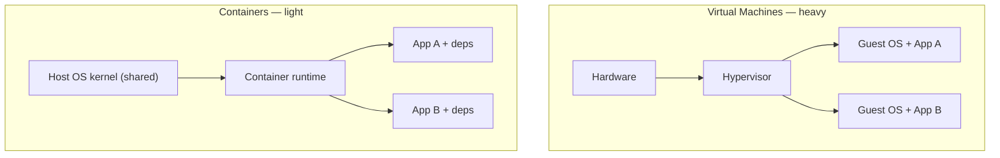

# Containers & images (Docker)

> A container packages an application *with* its entire runtime — code, libraries, system
> tools — into one isolated, portable unit that runs identically on any machine. It's the
> definitive answer to "but it works on my machine," and the building block everything else
> in modern infrastructure sits on.

## Top-down: where you already meet this
You've hit it: an app runs fine on your laptop but crashes on a teammate's or on the server —
different Python version, a missing library, a mismatched OS. Containers make that class of bug
extinct by shipping the app *and its world* together. Every [environment](../fundamentals/environments-and-release-flow.md)
in the last few docs — dev, staging, prod — runs the *same container image*, which is why
"passed in staging" finally means something. This doc is the packaging step of the pipeline;
[Kubernetes](./kubernetes.md) is how you run thousands of them.

## Problem
Software has dependencies — a specific language runtime, libraries, OS packages, environment
config. Getting all of that *consistent* across a developer's laptop, the CI runner, staging,
and a fleet of production servers is brutally hard; tiny differences cause "works here, breaks
there." The old fix — a full **virtual machine** per app — works but is heavy (a whole guest
OS, gigabytes, slow to boot). We want VM-like *isolation* and *portability* with near-native
speed and density.

## Core concepts

**Container vs virtual machine — the key distinction.** A VM virtualizes *hardware* and runs a
full guest **OS**. A container virtualizes the *operating system* and shares the host **kernel** —
so it ships only the app and its dependencies, not a whole OS.



| | Virtual Machine | Container |
| --- | --- | --- |
| Isolates by | virtual hardware + guest OS | OS-level (shared kernel) |
| Size | GBs (whole OS) | MBs (just app + deps) |
| Startup | seconds–minutes | milliseconds |
| Density | tens per host | hundreds per host |
| Isolation | stronger (full OS boundary) | lighter (kernel-enforced) |

**What actually makes a container.** There's no "container" object in the kernel — it's an
illusion built from Linux primitives: **namespaces** (give the process its own private view of
PIDs, network, mounts, users) and **cgroups** (limit its CPU/memory). The container *thinks*
it's alone on the machine. (The mechanism is covered in depth in the OS area's
[containers doc](../../../operating-systems/1-knowledge/virtualization/containers.md) — DevOps
*uses* this; the OS area *builds* it.)

**Image vs container — the crucial pair:**
- An **image** is the immutable, read-only *template* — a snapshot of a filesystem + metadata
  ("run `python app.py`"). It's the [artifact](../ci-cd/continuous-integration.md) you build and
  ship.
- A **container** is a *running instance* of an image — like a process is a running instance of a
  program. One image → many identical containers.

**Images are built in layers.** Each instruction in a **Dockerfile** creates a cached,
read-only **layer** stacked on the one below. Layers are shared and cached, so rebuilds are fast
and storage is efficient (ten images based on the same Ubuntu layer store it once).

```dockerfile
FROM python:3.12-slim          # base layer
WORKDIR /app
COPY requirements.txt .        # layer: deps manifest
RUN pip install -r requirements.txt   # layer: installed deps (cached unless reqs change)
COPY . .                       # layer: your code
CMD ["python", "app.py"]       # metadata: what to run
```

**The registry — where images live.** You **push** built images to a **registry** (Docker Hub,
GHCR, ECR) and **pull** them anywhere to run. The registry is the distribution hub connecting
[CI](../ci-cd/continuous-integration.md) (which builds & pushes) to
[CD](../ci-cd/continuous-delivery-deployment.md)/[Kubernetes](./kubernetes.md) (which pulls & runs).

**Immutability = reproducibility.** An image, once built, never changes — tagged by content/version.
You don't patch a running container; you build a new image and replace it (the
[immutable infrastructure](../fundamentals/infrastructure-as-code.md) idea, perfected). This is
why the *exact bytes* you tested are the bytes that run in prod.

## Essential terminology

| Term | Meaning |
| --- | --- |
| **Container** | A running, isolated process bundled with its dependencies. |
| **Image** | The immutable template a container is started from. |
| **Dockerfile** | The recipe that builds an image, instruction by instruction. |
| **Layer** | A cached, read-only filesystem diff; images are stacks of layers. |
| **Registry** | A store for images you push/pull (Docker Hub, GHCR, ECR). |
| **Tag** | A version label on an image (`myapp:1.4.2`, `myapp:latest`). |
| **Container runtime** | The software that runs containers (containerd, Docker, CRI-O). |
| **Namespace / cgroup** | Kernel features providing isolation / resource limits. |
| **Base image** | The starting image you build on (`python:3.12`, `alpine`). |
| **OCI** | Open Container Initiative — the open standard for images & runtimes. |

## Example
Build, run, and inspect a container — the whole loop:
```console
$ docker build -t myapp:1.0 .          # build image from the Dockerfile
 => exporting layers ... => naming to docker.io/library/myapp:1.0

$ docker run -p 8080:80 myapp:1.0      # run a container, map host:8080 → container:80
 * Serving on http://0.0.0.0:80

$ docker ps                            # the running container
CONTAINER ID   IMAGE       STATUS         PORTS
3f2a1b...      myapp:1.0   Up 4 seconds   0.0.0.0:8080->80/tcp

$ docker push ghcr.io/me/myapp:1.0     # publish to a registry → now runnable anywhere
```
That same `myapp:1.0` now runs *byte-for-byte identically* on your laptop, the CI runner, and
production — the portability that makes everything downstream possible. (Build one yourself in
the [Dockerfile lab](../../3-practice/lab-dockerfile.md).)

## Common tools
| Tool | What it is | Use it for |
| --- | --- | --- |
| **Docker** | The popular container toolchain | building, running, sharing images locally |
| **containerd / CRI-O** | Lightweight runtimes | what Kubernetes actually runs containers with |
| **Podman** | Daemonless, rootless Docker alternative | safer local container runs |
| **Docker Compose** | Multi-container local orchestration | running an app + DB + cache together for dev |
| **BuildKit / Buildpacks** | Image builders | faster, reproducible builds without hand-written Dockerfiles |
| **Trivy / Grype** | Image scanners | finding vulnerabilities in image layers |

## Trade-offs
- ✅ **Portability & consistency:** build once, run identically everywhere — kills "works on my
  machine."
- ✅ **Lightweight & dense:** fast startup, many per host → efficient resource use and scaling.
- ✅ **Immutable & reproducible:** the artifact you test is the artifact you run.
- ⚠️ **Weaker isolation than VMs:** a shared kernel means a kernel exploit can cross the boundary —
  multi-tenant/untrusted workloads may still want VM-level isolation (or microVMs like Firecracker).
- ⚠️ **Statefulness is awkward:** containers are ephemeral by design; persistent data needs
  external **volumes**/storage, not the container's own filesystem.
- ⚠️ **New operational surface:** image bloat, vulnerable base images, and registry/secret
  management become things you must manage.

## Real-world examples
- **Practically all cloud-native software ships as containers** — the OCI image is the universal
  unit of deployment.
- **CI builds a container image as its [artifact](../ci-cd/continuous-integration.md)**, pushes
  it to a registry, and [Kubernetes](./kubernetes.md) pulls and runs it — the standard pipeline.
- **`docker compose up`** spins a developer's whole stack (app + Postgres + Redis) in seconds,
  matching prod's shape locally.
- **Firecracker microVMs** (AWS Lambda, Fargate) blend container speed with VM-grade isolation
  for multi-tenant workloads.

## References
- [Docker — Get Started](https://docs.docker.com/get-started/)
- OS deep-dive on the mechanism: [containers — namespaces & cgroups](../../../operating-systems/1-knowledge/virtualization/containers.md)
- [Open Container Initiative (OCI)](https://opencontainers.org/)
- [Julia Evans — How containers work (zine)](https://wizardzines.com/zines/containers/)
