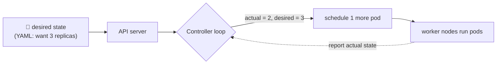

# Kubernetes — orchestrating containers

> One [container](./containers.md) is easy to run. Running *hundreds* across a fleet of
> machines — scheduling them, restarting crashed ones, scaling under load, rolling out new
> versions, networking them together — needs an **orchestrator**. Kubernetes (K8s) is the
> de-facto one: you declare the *desired state*, and it continuously makes reality match.

## Top-down: where you already meet this
[Containers](./containers.md) solved "package the app." But production needs more: what restarts
a container when it crashes at 3am? What spreads 50 copies across 10 servers? What shifts traffic
during a [canary rollout](../ci-cd/continuous-delivery-deployment.md), or adds replicas when
traffic spikes? Doing that by hand across a fleet is impossible. Kubernetes automates all of it.
If containers are the *unit*, Kubernetes is the *operating system for your cluster* that runs them.

## Problem
A real service is many containers on many machines, and a hundred things constantly go wrong:
hosts die, containers crash, traffic spikes, you deploy new versions. Manually placing
containers, tracking which host has capacity, restarting failures, wiring up networking, and
load-balancing across replicas — at scale, continuously — is far beyond human bookkeeping. We
need a system that *owns* the cluster and keeps it in the state we asked for, automatically.

## Core concepts

**Declarative + the reconciliation loop.** This is the heart of K8s and echoes
[IaC](../fundamentals/infrastructure-as-code.md): you submit a **desired state** ("I want 3
replicas of `myapp:1.4`"), and Kubernetes' **controllers** continuously compare desired vs actual
and *act* to close the gap. A container dies → actual drops to 2 → K8s starts a new one → back to
3. You never say "start a container"; you declare "there should be 3," and it's self-healing.



**The architecture: control plane + worker nodes.**
- **Control plane** — the brain: the **API server** (everything talks to it), **etcd** (the
  cluster's database of desired+actual state), the **scheduler** (decides which node runs a new
  pod), and **controllers** (the reconciliation loops).
- **Worker nodes** — the muscle: each runs a **kubelet** (agent that starts/monitors containers)
  and a container [runtime](./containers.md).

**The core objects (the nouns you'll write):**

| Object | What it is |
| --- | --- |
| **Pod** | The smallest unit — one (or a few tightly-coupled) containers sharing a network/IP. *You rarely create these directly.* |
| **Deployment** | Declares "N replicas of this pod template"; manages [rolling updates](../ci-cd/continuous-delivery-deployment.md) & rollback. The thing you usually write. |
| **ReplicaSet** | Keeps N identical pods running (managed *by* a Deployment). |
| **Service** | A stable name + virtual IP load-balancing across a set of pods (since pods come & go). See [service networking](./service-networking-load-balancing.md). |
| **Ingress** | Routes external HTTP(S) traffic to Services by host/path. |
| **ConfigMap / Secret** | Inject [config](../fundamentals/environments-and-release-flow.md) / sensitive data into pods. |
| **Namespace** | A logical partition of the cluster (team/env separation). |

**Pods are cattle, not pets.** Pods are *ephemeral* — they get a new IP each time, can be killed
and rescheduled anytime. That's why you never address a pod directly; a **Service** gives a
stable endpoint and load-balances across whatever pods currently exist. Designing for
disposability (the [immutable](../fundamentals/infrastructure-as-code.md) mindset) is mandatory.

**What you get for free** once your app is a Deployment: **self-healing** (restarts failures,
reschedules off dead nodes), **horizontal scaling** (`replicas: 10`, or autoscale on CPU),
**rolling updates & rollback** built in, **service discovery** and **load balancing**, and
**config/secret injection**. This is why K8s won — it bundles the whole operational toolbox
behind one declarative API.

## Essential terminology

| Term | Meaning |
| --- | --- |
| **Kubernetes (K8s)** | A container orchestrator that runs the declared desired state. |
| **Cluster** | The set of machines (nodes) K8s manages as one. |
| **Control plane** | The brain: API server, etcd, scheduler, controllers. |
| **Node** | A worker machine running pods (via the kubelet). |
| **Pod** | Smallest deployable unit; one+ containers sharing an IP. |
| **Deployment** | Declares replicas + manages rollouts of a pod template. |
| **Service** | Stable virtual IP load-balancing across pods. |
| **Ingress** | HTTP(S) router from outside the cluster to Services. |
| **Reconciliation loop** | Controllers continuously driving actual → desired. |
| **kubectl** | The CLI for talking to the cluster. |
| **Manifest** | The YAML declaring an object's desired state. |
| **etcd** | The key-value store holding cluster state. |

## Example
A Deployment manifest + watching K8s reconcile and self-heal:
```yaml
apiVersion: apps/v1
kind: Deployment
metadata: { name: myapp }
spec:
  replicas: 3                      # desired state: 3 pods
  selector: { matchLabels: { app: myapp } }
  template:
    metadata: { labels: { app: myapp } }
    spec:
      containers:
        - name: myapp
          image: ghcr.io/me/myapp:1.4   # the image from your registry
          ports: [{ containerPort: 80 }]
```
```console
$ kubectl apply -f deployment.yaml      # submit desired state
$ kubectl get pods
NAME            READY   STATUS    AGE
myapp-7d9..-a   1/1     Running   10s
myapp-7d9..-b   1/1     Running   10s
myapp-7d9..-c   1/1     Running   10s     ← 3 running, as declared

$ kubectl delete pod myapp-7d9..-a       # simulate a crash
$ kubectl get pods                        # K8s already started a replacement
myapp-7d9..-b   1/1   Running   40s
myapp-7d9..-c   1/1   Running   40s
myapp-7d9..-d   1/1   Running   3s        ← self-healed back to 3, automatically
```
You never told it to recreate the pod — you declared "3," so it *maintains* 3. Update `image:` to
`1.5` and `kubectl apply` triggers a [rolling update](../ci-cd/continuous-delivery-deployment.md).
That's orchestration. (Run a real cluster in the [kind lab](../../3-practice/lab-kubernetes-kind.md).)

## Common tools
| Tool | What it is | Use it for |
| --- | --- | --- |
| **kubectl** | The cluster CLI | apply manifests, inspect, debug |
| **kind / minikube / k3s** | Local/lightweight clusters | learning & dev on your laptop |
| **Helm** | K8s package manager | templating & installing app bundles ("charts") |
| **Managed K8s** (EKS/GKE/AKS) | Cloud-run control planes | production clusters without running etcd yourself |
| **Argo CD / Flux** | GitOps controllers | syncing the cluster to a Git repo |
| **k9s / Lens** | Cluster UIs | navigating/observing a cluster faster |

## Trade-offs
- ✅ **Self-healing, scaling, rollouts, and service discovery in one declarative platform** —
  the operational toolbox, standardized and portable across clouds.
- ✅ **Portable:** the same manifests run on any conformant cluster (no cloud lock-in at the
  workload layer).
- ⚠️ **Complexity is real:** K8s has a famously steep learning curve and many moving parts;
  it's *overkill* for a small app (a single VM or a PaaS may be far simpler).
- ⚠️ **Operational burden:** running your own cluster (upgrades, etcd, networking, security) is
  a big job — most teams use **managed** K8s for good reason.
- ⚠️ **Easy to misconfigure:** YAML sprawl, resource limits, and security defaults are common
  footguns; needs guardrails (policies, Helm, GitOps).

## Real-world examples
- **Kubernetes runs much of the cloud-native world** — it grew out of Google's internal *Borg*
  and is now the CNCF's flagship, supported by every major cloud.
- **Managed offerings (GKE, EKS, AKS)** are how most companies actually use K8s — they run the
  control plane for you.
- **Autoscaling** (HPA on CPU/custom metrics, cluster autoscaler adding nodes) handles traffic
  spikes automatically — Black Friday without a human.
- **GitOps (Argo CD)** makes the cluster's state a reflection of a Git repo — merge a manifest
  change, the cluster reconciles to match.

## References
- [Kubernetes — Concepts](https://kubernetes.io/docs/concepts/)
- [The Kubernetes Book (Nigel Poulton)](https://nigelpoulton.com/) — friendly intro
- [Borg, Omega, and Kubernetes (Google paper)](https://queue.acm.org/detail.cfm?id=2898444)
- Built on container primitives — see [containers](./containers.md) & the [OS deep-dive](../../../operating-systems/1-knowledge/virtualization/containers.md)
