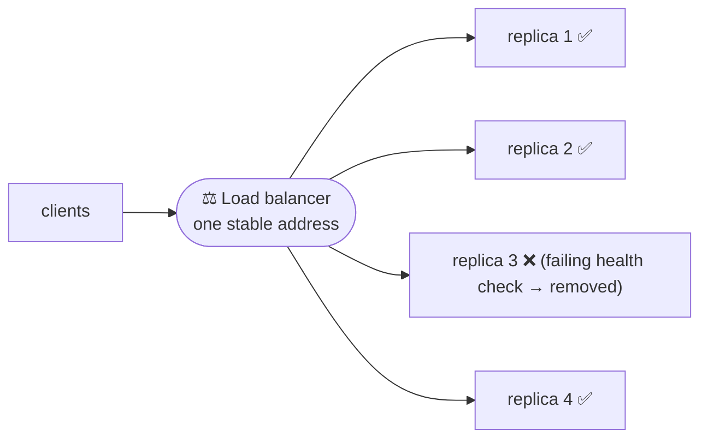

# Service networking & load balancing

> When you run [many replicas](./kubernetes.md) of a service, something must spread incoming
> requests across them, give them a stable address even as they come and go, and route the
> right traffic to the right service. That's **load balancing** and **service networking** —
> the connective tissue of any distributed deployment.

## Top-down: where you already meet this
You scaled your app to 10 [pods](./kubernetes.md) for capacity — but users only have *one* URL.
What turns one address into traffic spread evenly across 10 ever-changing backends? And when a
pod dies and respawns with a new IP, how does everyone keep finding it? Those are load balancing
and service discovery. This is where DevOps *uses* the networking fundamentals — for the
underlying TCP/IP, DNS, and TLS mechanics, this doc links to
[Computer Networks](../../../computer-networks/); here we focus on the *operational* layer that
sits on top.

## Problem
Replicas are **dynamic and anonymous**: [Kubernetes](./kubernetes.md) creates and destroys pods
constantly, each with a fresh IP. Clients can't hardcode pod IPs, can't track which replicas
exist, and shouldn't all hammer one instance. We need (a) a **stable endpoint** that hides the
churn, (b) a way to **distribute load** across healthy replicas, and (c) **routing** so external
requests reach the correct service. And we need failed instances pulled out automatically.

## Core concepts

**Load balancing — one front, many backs.** A **load balancer** (LB) accepts requests at a single
address and forwards each to one of several backend instances, spreading the load and routing
*around* failures (it stops sending to instances that fail **health checks**).



**L4 vs L7 load balancing** — the layer it makes decisions at (mapping to the
[network layers](../../../computer-networks/1-knowledge/fundamentals/protocol-layers.md)):

| | **L4 (transport)** | **L7 (application)** |
| --- | --- | --- |
| Sees | IP + [port](../../../computer-networks/1-knowledge/transport-layer/ports-and-udp.md) | full [HTTP](../../../computer-networks/1-knowledge/application-layer/http.md) (URL, headers, cookies) |
| Can route by | connection (fast, dumb) | path/host/header (smart) |
| Example | "spread TCP connections" | "/api → service A, /img → service B" |
| Cost | very fast | slightly more work, much more flexible |

**Balancing algorithms** — how the LB picks a backend: **round-robin** (next in turn),
**least-connections** (the least-busy backend), **IP hash** (same client → same backend, for
stickiness). Most default to round-robin or least-connections.

**Health checks keep it honest.** The LB periodically probes each backend (`GET /healthz`); a
backend that fails is **removed from rotation** until it recovers. This is what makes
[rolling/canary deploys](../ci-cd/continuous-delivery-deployment.md) and crash-recovery seamless —
unhealthy instances simply stop receiving traffic.

**Service discovery — finding the moving targets.** Since instances are dynamic, clients resolve
a *name* to current healthy endpoints rather than fixed IPs. In [Kubernetes](./kubernetes.md) a
**Service** does this: it gives a stable virtual IP + internal [DNS](../../../computer-networks/1-knowledge/application-layer/dns.md)
name (`myapp.default.svc`) and load-balances across the pods matching its label selector — the
pod set updates automatically as pods come and go.

**The K8s networking stack, top to bottom:**

| Layer | Job |
| --- | --- |
| **Ingress** | external [HTTP(S)](../../../computer-networks/1-knowledge/application-layer/http.md) entry: route by host/path, terminate [TLS](../../../computer-networks/1-knowledge/security/tls-https.md) |
| **Service** | stable internal endpoint + L4 load-balancing across pods |
| **Pod network (CNI)** | every pod gets an IP; pods can reach each other across nodes |

**Service mesh — networking as infrastructure.** At scale, teams add a **service mesh** (Istio,
Linkerd): a **sidecar** proxy next to every pod transparently handles load balancing, retries,
timeouts, **mTLS** encryption between services, and fine-grained traffic splitting (great for
[canaries](../ci-cd/continuous-delivery-deployment.md)) — without touching app code. Powerful, but
another layer of complexity to justify.

## Essential terminology

| Term | Meaning |
| --- | --- |
| **Load balancer** | Distributes requests across multiple backend instances. |
| **L4 / L7** | Balancing at the transport (IP/port) vs application (HTTP) layer. |
| **Health check** | A probe that decides if a backend should receive traffic. |
| **Round-robin / least-connections** | Common algorithms for picking a backend. |
| **Service discovery** | Finding the current healthy endpoints behind a name. |
| **Service (K8s)** | Stable virtual IP + DNS name load-balancing across pods. |
| **Ingress** | Routes external HTTP(S) into the cluster, often terminating TLS. |
| **Reverse proxy** | A server fronting backends (LB, TLS, caching) — nginx, Envoy. |
| **Sticky session** | Routing a client to the same backend each time. |
| **Service mesh** | Sidecar proxies handling inter-service networking (LB, retries, mTLS). |
| **CNI** | Container Network Interface — gives pods their IPs/connectivity. |

## Example
A K8s Service + Ingress turning ephemeral pods into a stable, routed endpoint:
```yaml
apiVersion: v1
kind: Service
metadata: { name: myapp }
spec:
  selector: { app: myapp }     # picks ALL pods labelled app=myapp (the live set)
  ports: [{ port: 80, targetPort: 80 }]
---
apiVersion: networking.k8s.io/v1
kind: Ingress
metadata: { name: myapp-ingress }
spec:
  rules:
    - host: myapp.example.com
      http:
        paths:
          - path: /            # external traffic for this host/path…
            pathType: Prefix
            backend: { service: { name: myapp, port: { number: 80 } } }  # …→ the Service → pods
```
```console
$ kubectl get endpoints myapp
NAME    ENDPOINTS                                   ← the Service auto-tracks live pod IPs
myapp   10.1.0.4:80,10.1.0.5:80,10.1.0.6:80

$ kubectl scale deployment myapp --replicas=6
$ kubectl get endpoints myapp                       ← endpoint list grows automatically
myapp   10.1.0.4:80,10.1.0.5:80, ... ,10.1.0.9:80
```
The `myapp` name and IP never change, but the Service **continuously updates** which pods sit
behind it and balances across them — service discovery + load balancing, declared in YAML.

## Common tools
| Tool | What it is | Use it for |
| --- | --- | --- |
| **nginx / HAProxy / Envoy** | Reverse proxies / LBs | L7 routing, TLS termination, health checks |
| **Cloud LBs** (ALB/NLB, GCLB) | Managed load balancers | the public entry point to your service |
| **K8s Service / Ingress** | Built-in discovery + routing | stable endpoints & external routing |
| **CoreDNS** | Cluster DNS | resolving Service names inside K8s |
| **Istio / Linkerd** | Service meshes | inter-service LB, retries, mTLS, traffic splitting |

## Trade-offs
- ✅ **Decouples clients from instances:** scale, replace, and deploy backends freely behind a
  stable address.
- ✅ **Resilience & zero-downtime:** health checks + discovery route around failures and make
  [rolling/canary](../ci-cd/continuous-delivery-deployment.md) deploys seamless.
- ✅ **L7 routing** enables powerful patterns (path-based services, canary by header, A/B).
- ⚠️ **The LB/ingress is a critical path & potential bottleneck/SPOF** — it must itself be
  redundant.
- ⚠️ **Sticky sessions vs even load:** stickiness helps stateful apps but unbalances traffic and
  fights elasticity — prefer stateless services.
- ⚠️ **Service mesh adds latency & complexity:** sidecars touch every request; only adopt when
  the scale justifies it.

## Real-world examples
- **Every scaled web service** sits behind a load balancer — it's the front door of the
  internet-facing world.
- **Kubernetes Ingress + cloud LB** is the standard public entry: cloud LB → Ingress controller
  → Service → pods.
- **Istio/Linkerd meshes** give big microservice fleets uniform mTLS, retries, and
  [canary traffic splitting](../ci-cd/continuous-delivery-deployment.md) without app changes.
- **The underlying mechanics** — DNS resolution, TCP, TLS termination — are exactly the
  [Computer Networks](../../../computer-networks/) topics, here applied operationally.

## References
- [Kubernetes — Services, Load Balancing, Networking](https://kubernetes.io/docs/concepts/services-networking/)
- Networking fundamentals: [load balancing layers (L4/L7)](../../../computer-networks/1-knowledge/fundamentals/protocol-layers.md), [DNS](../../../computer-networks/1-knowledge/application-layer/dns.md), [TLS](../../../computer-networks/1-knowledge/security/tls-https.md)
- [Cloudflare — What is load balancing?](https://www.cloudflare.com/learning/performance/what-is-load-balancing/)
- [Istio](https://istio.io/latest/docs/concepts/) · [Linkerd](https://linkerd.io/)
