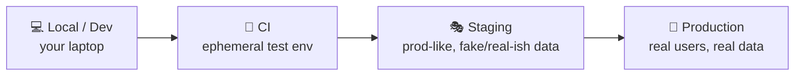

# Environments & the path to production

> Code doesn't jump straight from your laptop to real users. It moves through a series of
> **environments** — dev → staging → production — each a more production-like place to
> catch problems before they reach customers. This doc maps that path and the branching &
> release patterns that drive it.

## Top-down: where you already meet this
You've seen "this works on staging but not prod," or a "preview link" on a pull request, or
a `.env` file with different database URLs. Those are all **environments** — separate copies
of your system where a change is progressively validated. Understanding the path from your
machine to production is the frame for everything else in this area: [CI](../ci-cd/continuous-integration.md)
tests a change *in* an environment, [CD](../ci-cd/continuous-delivery-deployment.md) promotes
it *between* them.

## Problem
Testing a change directly on real users is reckless; never testing it in a realistic place
is naive ("works on my machine"). We need intermediate, production-*like* environments to
build confidence as a change advances — plus clear rules for **what code goes where, when,
and how** to promote it. Get this wrong and you either ship bugs to users or move at a crawl.

## Core concepts

**The environment ladder.** A change climbs increasingly production-like rungs:



| Environment | Who/what uses it | Purpose |
| --- | --- | --- |
| **Local / Dev** | the developer | write & run code fast, on your machine |
| **CI** | the pipeline | run automated tests on every change, then discard |
| **Staging / Pre-prod** | QA, automated E2E tests | a production *mirror* to catch integration/config issues |
| **Production** | real users | the real thing |

The golden rule: **environments should be as identical as possible** (same OS, same
versions, same config shape) so "passed in staging" actually predicts "works in prod." This
is the core reason [containers](../containers/containers.md) and
[IaC](./infrastructure-as-code.md) exist — they make environments reproducible instead of
hand-built snowflakes that drift apart.

**Config, not code, changes between environments.** The *same build artifact* should run
everywhere; only **configuration** (database URLs, API keys, feature flags) differs per
environment. This "build once, deploy many" rule (from the [12-Factor App](https://12factor.net/))
prevents the classic bug where the thing you tested isn't the thing you shipped. Secrets are
injected at deploy time, never baked into the image.

**Branching & release strategies — how code reaches the ladder.** Two dominant models:

| Model | How it works | Fits |
| --- | --- | --- |
| **Trunk-based development** | everyone commits to `main` in tiny increments behind [feature flags](../ci-cd/continuous-delivery-deployment.md); release from trunk | high-velocity [CI/CD](../ci-cd/continuous-integration.md), the DevOps default |
| **GitFlow** | long-lived `develop`/`release`/`feature` branches, merged at release time | slower, scheduled releases |

Modern DevOps leans **trunk-based** because long-lived branches mean painful "merge hell" and
delay the [fast feedback](./what-is-devops.md) small batches give you.

**Promotion — moving a change up the ladder.** Once a build passes one rung, it's
**promoted** (deployed) to the next. Each promotion is more cautious: automated to staging,
then a controlled [rollout](../ci-cd/continuous-delivery-deployment.md) (canary/blue-green) to
production. The artifact never changes — only *where it runs* and *how much traffic it sees*.

## Essential terminology

| Term | Meaning |
| --- | --- |
| **Environment** | An isolated copy of the system (dev/staging/prod) where code runs. |
| **Production ("prod")** | The live environment serving real users. |
| **Staging / pre-prod** | A production-like environment for final validation. |
| **Artifact** | The built, deployable output (a container image, a JAR) — built once, promoted. |
| **Promotion** | Deploying a passing artifact to the next environment up. |
| **Configuration** | Per-environment settings (URLs, keys, flags) kept *out* of the build. |
| **Secret** | Sensitive config (passwords, tokens) injected securely at runtime. |
| **Trunk-based development** | Everyone integrates to `main` frequently in small commits. |
| **Feature flag** | A runtime switch to enable/disable code without redeploying. |
| **Environment parity** | Keeping environments as identical as possible so tests predict prod. |
| **Drift** | When an environment diverges from its definition / from others. |

## Example
The same artifact promoted up the ladder, with only config changing:

```
Build once:   myapp:git-sha-a1b2c3   (one immutable image)
                     │
   Dev      →  run myapp:a1b2c3  with  DB=localhost,        FLAGS=all-on
   Staging  →  run myapp:a1b2c3  with  DB=staging-db,       FLAGS=prod-like
   Prod     →  run myapp:a1b2c3  with  DB=prod-db (secret), FLAGS=off-by-default
                     ▲
        identical bytes everywhere — only the injected config differs
```
Because the **bytes are identical**, "it passed in staging" is a real signal. If you rebuilt
per environment, you'd be testing a different artifact than you ship — the oldest deployment
trap there is.

## Common tools
| Tool | What it is | Use it for |
| --- | --- | --- |
| Git branches / PRs | Source control flow | trunk-based or GitFlow promotion |
| `.env` / Helm values / ConfigMaps | Per-env config | injecting environment-specific settings |
| Vault / Secrets Manager / Sealed Secrets | Secret stores | supplying secrets at deploy time |
| Preview environments (Vercel, PR envs) | Ephemeral per-PR stacks | reviewing a change in isolation before merge |
| LaunchDarkly / Unleash | Feature-flag platforms | decoupling deploy from release |

## Trade-offs
- ✅ The environment ladder catches integration, config, and scale problems before users do.
- ✅ "Build once, promote" guarantees you ship exactly what you tested.
- ⚠️ **Environment parity is hard:** staging is never *quite* prod (data volume, real traffic,
  third-party quirks) — some bugs only appear in production, which is why
  [observability](../observability/observability.md) and safe [rollouts](../ci-cd/continuous-delivery-deployment.md)
  matter.
- ⚠️ **More environments = more cost & maintenance;** they also **drift** without IaC discipline.
- ⚠️ **Staging can become a bottleneck** (one shared staging, everyone queuing) — ephemeral
  per-PR environments relieve this but cost more.

## Real-world examples
- **Preview deployments** (Vercel/Netlify spin up a URL per pull request) let reviewers see a
  change live before it merges.
- **Trunk-based development + feature flags** is how Google, Facebook, and most high-velocity
  teams ship many times a day from one branch.
- **"Test in production" (carefully)** — with canaries, flags, and observability — acknowledges
  that staging can't fully mimic prod, so you validate on a slice of real traffic.

## References
- [The Twelve-Factor App](https://12factor.net/) — config, build/release/run, parity
- *Accelerate* / *DevOps Handbook* — trunk-based development & deployment
- [Trunk-Based Development](https://trunkbaseddevelopment.com/)
- [Martin Fowler — Feature Toggles](https://martinfowler.com/articles/feature-toggles.html)
