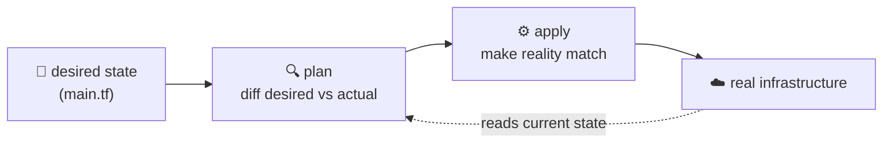

# Infrastructure as Code (IaC)

> Instead of clicking through a cloud console to create servers, networks, and databases,
> you **describe** them in version-controlled files and let a tool make reality match the
> description. Infrastructure becomes software: reviewable, repeatable, and disposable.

## Top-down: where you already meet this
Your app needs a server, a database, a load balancer, some firewall rules. Someone could
click through the AWS console for an hour to create them — and then nobody remembers exactly
what they did, and the staging environment mysteriously differs from production. IaC replaces
that clicking with a *file* you commit to Git. The [environment parity](./environments-and-release-flow.md)
the last doc demanded is only achievable when environments are *generated from code*, not
hand-built. That's what this doc is about.

## Problem
Manually-managed infrastructure rots:
- **It's not reproducible** — "how was this set up?" lives only in someone's memory.
- **It drifts** — someone hot-fixes prod by hand, and now it silently differs from staging.
- **It's not reviewable or auditable** — no diff, no history, no "who changed the firewall?"
- **It doesn't scale** — clicking to create 1 server is fine; 200 across 3 regions is not.

We want infrastructure to have the same superpowers code already has: version control, code
review, testing, and one-command reproduction.

## Core concepts

**Declarative, not imperative.** The big idea: you describe the **desired end state** ("I want
3 servers, this network, that database"), and the tool figures out the steps to get there —
creating what's missing, changing what differs, leaving what's already correct. You don't write
"create server, then attach disk, then…"; you write *what should exist*.



**Idempotency — run it as many times as you like.** Applying the same config repeatedly
produces the *same* result. If reality already matches, the tool does nothing. This is what
makes IaC safe and reproducible: there's no "but did someone already run it?" — the desired
state *is* the answer.

**State — the tool's memory of reality.** Tools like Terraform keep a **state file** mapping
your code to the real resources it created, so it knows what to update or destroy on the next
run. Managing state (locking it, storing it remotely, never editing it by hand) is the main
operational subtlety of IaC.

**The workflow: plan → apply.** The killer feature is the **plan/preview**: before changing
anything, the tool shows you a diff — "+ create 2 servers, ~ modify 1 firewall rule, - destroy
1 database." You review it like a code change, *then* apply. No more surprise deletions.

**Two flavors of "infrastructure as code":**

| Type | What it manages | Tools | Style |
| --- | --- | --- | --- |
| **Provisioning** | the infra itself (servers, networks, DBs) | **Terraform**, OpenTofu, Pulumi, CloudFormation | mostly **declarative** |
| **Configuration management** | software *on* existing servers (packages, files) | **Ansible**, Chef, Puppet | declarative-ish / procedural |

(In container-land, [Kubernetes manifests](../containers/kubernetes.md) are IaC too — declarative
desired-state for *workloads*.)

**Immutable infrastructure.** The modern pattern: never SSH in to patch a running server.
Instead, **build a new image, deploy it, destroy the old one.** Servers become disposable
"cattle, not pets." This eliminates drift entirely — there's nothing to drift *to*, because
nothing is modified in place. [Containers](../containers/containers.md) are the ultimate
expression of this.

## Essential terminology

| Term | Meaning |
| --- | --- |
| **IaC** | Managing infrastructure through version-controlled, machine-readable files. |
| **Declarative** | Describe the desired end state; the tool computes the steps. |
| **Imperative** | Spell out the steps yourself (the older, more error-prone way). |
| **Idempotent** | Running it repeatedly yields the same result (no duplicate resources). |
| **State** | The tool's record of which real resources correspond to your code. |
| **Plan / preview** | A dry-run diff of what `apply` *would* change — review before acting. |
| **Drift** | Reality diverging from the code (usually from manual changes). |
| **Provisioning** | Creating infra (servers, networks) — Terraform's job. |
| **Configuration management** | Setting up software on servers — Ansible's job. |
| **Immutable infrastructure** | Replace servers instead of modifying them in place. |
| **Module** | A reusable, parameterized chunk of infrastructure code. |

## Example
A tiny Terraform config — *declare* a server, then preview and apply:
```hcl
# main.tf — desired state: one web server with a tag
resource "aws_instance" "web" {
  ami           = "ami-0abcd1234"
  instance_type = "t3.micro"
  tags = { Name = "web-server" }
}
```
```console
$ terraform plan      # PREVIEW — changes nothing, shows the diff
  + aws_instance.web will be created
      + instance_type = "t3.micro"
      + tags          = { "Name" = "web-server" }
  Plan: 1 to add, 0 to change, 0 to destroy.      ← review this like a PR

$ terraform apply     # make reality match the file
  aws_instance.web: Creation complete

$ terraform apply     # run it AGAIN → idempotent: nothing to do
  No changes. Your infrastructure matches the configuration.
```
That second `apply` doing **nothing** is the whole point: the file is the source of truth, and
the live infrastructure is guaranteed to match it. Commit `main.tf` to Git and your entire
environment is now reproducible, reviewable, and diffable. (See the
[Terraform lab](../../3-practice/lab-terraform.md).)

## Common tools
| Tool | What it is | Use it for |
| --- | --- | --- |
| **Terraform** / OpenTofu | Declarative provisioner | creating cloud infra across providers |
| **Pulumi** | IaC in real languages (TS/Python/Go) | provisioning with loops, types, tests |
| **Ansible** | Agentless config management | installing/configuring software on servers |
| **AWS CloudFormation** | AWS-native IaC | declaring AWS resources (AWS-only) |
| **Packer** | Image builder | baking immutable machine images |
| `terraform plan` | Diff previewer | reviewing changes before they happen |

## Trade-offs
- ✅ **Reproducible & reviewable:** stand up an identical environment with one command; review
  infra changes in a pull request.
- ✅ **Kills drift & "snowflake" servers;** disaster recovery becomes "re-apply the code."
- ✅ **Scales:** the same config makes 1 or 1,000 servers.
- ⚠️ **State management is fiddly:** a corrupted or hand-edited state file causes real pain;
  remote, locked state is a must.
- ⚠️ **Learning curve & blast radius:** a careless `apply` can destroy real resources — which is
  exactly why the **plan** step and code review are non-negotiable.
- ⚠️ **Drift still happens** if people make manual "just this once" changes — IaC only works if
  it's the *only* way infra changes.

## Real-world examples
- **Terraform** is the de-facto standard for multi-cloud provisioning; whole companies' infra
  lives in `.tf` files in Git.
- **Netflix bakes immutable AMIs** with Packer and replaces instances rather than patching them.
- **GitOps** (Argo CD, Flux) takes IaC further: a Git repo *is* the desired state, and an agent
  continuously reconciles the cluster to match it — IaC + [Kubernetes](../containers/kubernetes.md),
  automated.
- **"Pets vs cattle"** is the industry shorthand for the shift from hand-tended servers to
  disposable, code-defined ones.

## References
- [Terraform docs](https://developer.hashicorp.com/terraform) · [What is IaC? (HashiCorp)](https://www.hashicorp.com/resources/what-is-infrastructure-as-code)
- *Infrastructure as Code* (Kief Morris)
- [The Twelve-Factor App](https://12factor.net/) — config & disposability
- [GitOps (Weaveworks)](https://www.weave.works/technologies/gitops/)
