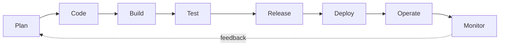

# What is DevOps? Culture, automation & feedback loops

> DevOps is the practice of tearing down the wall between **development** (writing code)
> and **operations** (running it), so that small changes flow to production continuously,
> safely, and automatically. It's part culture, part automation — not a job title or a
> single tool.

## Top-down: where you already meet this
You push a commit. Minutes later it's tested, packaged, and running for real users — and
if it breaks, it's automatically rolled back and someone gets paged. No one filed a
ticket asking the "ops team" to deploy it next Thursday. That smooth, automated path from
*your keyboard* to *production* is what DevOps builds. This area is the story of that
path; this doc is why it exists and what holds it together.

## Problem
Classically, **Dev** and **Ops** were separate teams with opposing incentives: developers
are rewarded for *shipping change*, operations for *keeping things stable* — and change is
the enemy of stability. The result was the "wall of confusion": devs threw code over it,
ops caught it and struggled to run it, deployments were rare, manual, terrifying,
all-night events ("it works on my machine" → "well, it's broken on the server"). Releases
were big, infrequent, and risky precisely *because* they were big and infrequent. DevOps
exists to break that loop.

## Core concepts

**It's culture first, tools second.** DevOps is fundamentally about **shared ownership**:
the team that builds it also runs it ("you build it, you run it"). The automation exists to
serve that culture, not the other way around. A pile of CI/CD tools with the old siloed
mindset is not DevOps.

**The core idea: small batches, fast feedback.** Instead of one giant release a quarter,
ship tiny changes constantly. Small changes are *safer* (less to go wrong, easy to
pinpoint and revert) and *faster to learn from*. This requires a fast, automated **feedback
loop** at every stage:



The faster that loop spins, the faster you deliver value *and* catch problems — the central
DevOps metric is **cycle time** (commit → production).

**The pillars (often summarized as "CALMS"):**

| Pillar | Meaning |
| --- | --- |
| **Culture** | Shared ownership, blameless learning, dev+ops collaboration |
| **Automation** | [CI/CD](../ci-cd/continuous-integration.md), [IaC](./infrastructure-as-code.md) — remove manual, error-prone steps |
| **Lean** | Small batches, limit work-in-progress, eliminate waste |
| **Measurement** | [Observe](../observability/observability.md) everything; decide with data |
| **Sharing** | Knowledge, tools, and responsibility across the team |

**The automation backbone — what the rest of this area covers:**
- **[CI](../ci-cd/continuous-integration.md)** — every commit is automatically built and tested.
- **[CD](../ci-cd/continuous-delivery-deployment.md)** — every passing change can be (or is) deployed automatically.
- **[Containers](../containers/containers.md) & [Kubernetes](../containers/kubernetes.md)** — package once, run identically everywhere (killing "works on my machine").
- **[Infrastructure as Code](./infrastructure-as-code.md)** — provision servers from version-controlled files, not clicks.
- **[Observability](../observability/observability.md) & [SRE](../observability/sre-reliability.md)** — close the loop: know it works and keep it reliable.

**Measuring DevOps: the DORA metrics.** Years of research (the *Accelerate* book / DORA)
found four metrics that distinguish elite teams — and crucially, that speed and stability
go *together*, not against each other:

| Metric | What it measures | Elite teams |
| --- | --- | --- |
| **Deployment frequency** | how often you ship | on-demand, many/day |
| **Lead time for changes** | commit → production | < 1 hour |
| **Change failure rate** | % of deploys causing problems | < 15% |
| **Time to restore** | how fast you recover | < 1 hour |

The surprise finding: teams that deploy *more often* are *more* stable — because small,
automated, frequent changes are easier to reason about and recover from.

## Essential terminology

| Term | Meaning |
| --- | --- |
| **DevOps** | Culture + practices uniting development and operations for continuous, safe delivery. |
| **Ops** | Operations — running, scaling, and keeping software healthy in production. |
| **CI/CD** | Continuous Integration / Continuous Delivery — the automated build→test→deploy pipeline. |
| **Pipeline** | The automated sequence a change flows through (build, test, deploy). |
| **Cycle time / lead time** | How long from code committed to running in production. |
| **Feedback loop** | Getting fast signal (tests, monitoring) so problems surface early. |
| **Shift left** | Catch problems *earlier* (test/security during dev, not after). |
| **Toil** | Manual, repetitive operational work that should be automated away. |
| **SRE** | Site Reliability Engineering — a concrete, metrics-driven implementation of DevOps ideas. |
| **DORA metrics** | The four research-backed delivery-performance measures above. |

## Example
The same change, before and after DevOps:

```
❌ Pre-DevOps (big-batch, manual):
   3 months of changes → "release weekend" → ops manually deploys at 2am →
   something breaks → which of 400 changes caused it? → all-night debugging → rollback is scary

✅ DevOps (small-batch, automated):
   commit → CI runs tests (5 min) → auto-deploy to staging → canary to 5% of prod →
   metrics look good → roll out to 100% → (if metrics dip → automatic rollback in seconds)
   ...repeated 20× a day, each change tiny and traceable
```
The difference isn't *working harder* — it's making the path automatic so each change is
small enough to be safe. Every later doc in this area is one stage of that bottom path.

## Common tools
| Tool | What it is | Use it for |
| --- | --- | --- |
| Git + GitHub/GitLab | Version control + platform | the source of truth every change flows from |
| GitHub Actions / GitLab CI / Jenkins | CI/CD engines | running the automated pipeline |
| Docker | Containers | packaging the app identically everywhere |
| Kubernetes | Orchestrator | running & scaling containers in production |
| Terraform / Ansible | IaC | provisioning infrastructure from code |
| Prometheus / Grafana / Datadog | Observability | the monitoring half of the feedback loop |

## Trade-offs
- ✅ **Faster *and* safer:** small automated batches reduce both lead time and failure rate.
- ✅ **Less toil, less burnout:** automating deploys frees humans for real engineering.
- ✅ **Faster recovery:** small changes + good monitoring = quick diagnosis and rollback.
- ⚠️ **Up-front investment:** building pipelines, IaC, and observability takes real effort
  before it pays off.
- ⚠️ **Culture is the hard part:** tools are easy to buy; shared ownership and blameless
  learning are hard to adopt — DevOps fails when it's treated as "just a tooling project."
- ⚠️ **Not a job title:** "a DevOps engineer" who is just the old ops silo renamed misses
  the point; DevOps is a team property.

## Real-world examples
- **Amazon** deploys to production thousands of times a day via automated pipelines and small,
  independently-deployable services.
- **Netflix** pioneered "you build it, you run it" and chaos engineering — deliberately breaking
  production to prove resilience.
- **Google's SRE** is a widely-copied, formal implementation of DevOps with
  [error budgets and SLOs](../observability/sre-reliability.md).
- **The DORA / *Accelerate* research** turned "ship faster *and* safer" from folklore into
  measured fact.

## References
- *The Phoenix Project* & *The DevOps Handbook* (Kim, Humble, Debois, Willis) — the canon
- *Accelerate* (Forsgren, Humble, Kim) — the DORA research
- [Atlassian — What is DevOps?](https://www.atlassian.com/devops)
- [Google — DORA / DevOps research](https://dora.dev/)
