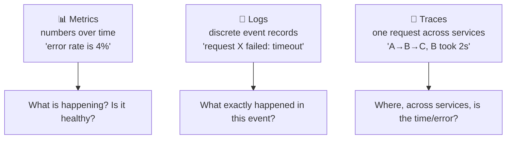

# Observability — logs, metrics & traces

> Once your code is running in production, how do you *know* it's healthy — and when it isn't,
> how do you find out *why*? Observability is the practice of instrumenting systems so you can
> answer questions about their behavior from the outside, using three kinds of telemetry:
> **logs, metrics, and traces.**

## Top-down: where you already meet this
You [deployed](../ci-cd/continuous-delivery-deployment.md) a change with a canary — but "are the
metrics healthy?" assumed you *have* metrics. When a user says "the app is slow," you need to find
which of your [50 services](../containers/kubernetes.md) is the culprit. Observability is the
feedback half of the [DevOps loop](../fundamentals/what-is-devops.md): without it you're flying
blind, deploys are scary, and every incident is an archaeology dig. This doc is how you *see*
what your running system is doing.

## Problem
A distributed system in production is a black box: dozens of services, thousands of containers,
constantly changing, serving real traffic you can't reproduce. When something breaks — a latency
spike, an error surge, a slow page — you can't attach a debugger to production. You need the
system to **emit signals about itself** continuously, so you can ask: *Is it healthy? What
changed? Where's the bottleneck? Why did this specific request fail?* — and get answers in minutes.

## Core concepts

**Monitoring vs observability.** **Monitoring** watches *known* problems ("alert me if CPU > 90%
or error rate spikes") — the dashboards you set up in advance. **Observability** is the broader
property of being able to ask *new, unanticipated* questions about your system without shipping new
code — to debug the *unknown unknowns*. Monitoring tells you *something* is wrong; observability
helps you discover *what and why*.

**The three pillars of telemetry:**



| Pillar | What it is | Best for | Watch out |
| --- | --- | --- | --- |
| **Metrics** | numeric measurements over time (counters, gauges, histograms) | dashboards, alerts, trends — cheap & aggregatable | no per-event detail |
| **Logs** | timestamped records of discrete events | the *detail* of what happened in one event | expensive at volume; noisy |
| **Traces** | the path of *one request* across all services, with timing per hop | finding *where* latency/errors live in a distributed call | needs context propagation |

You use them together: a **metric** alerts you that error rate jumped → a **trace** shows *which
service* in the request path is failing → its **logs** show the exact error. Metrics find it,
traces localize it, logs explain it.

**The golden signals.** For any service, four metrics catch most problems (from Google SRE) —
start here before drowning in dashboards:

| Signal | Question |
| --- | --- |
| **Latency** | how long do requests take? (watch the p95/p99 tail, not just average) |
| **Traffic** | how much demand? (requests/sec) |
| **Errors** | what fraction are failing? |
| **Saturation** | how full are resources? (CPU, memory, queue depth) |

These feed directly into [SLOs](./sre-reliability.md).

**Distributed tracing & context propagation.** In a [microservice](../containers/kubernetes.md)
call, one user request fans out across many services. A **trace** stitches them together by passing
a **trace ID** through every hop (in headers), so you can see the whole request as a waterfall and
spot which span is slow or broken — impossible to do from any single service's logs.

**Instrumentation & OpenTelemetry.** Telemetry doesn't appear by magic — you **instrument** your
code to emit it. **OpenTelemetry (OTel)** is the vendor-neutral standard for generating and
exporting logs, metrics, and traces, so you can switch backends (Prometheus, Datadog, Jaeger…)
without re-instrumenting.

**Cardinality — the cost gotcha.** Metrics are cheap *until* you attach high-cardinality labels
(e.g. `user_id`) — each unique label combination is a new time series, and costs explode. Knowing
what to put in metrics (low-cardinality) vs logs/traces (high-cardinality detail) is a core skill.

## Essential terminology

| Term | Meaning |
| --- | --- |
| **Observability** | Being able to understand a system's internal state from its outputs. |
| **Monitoring** | Watching predefined metrics/conditions for known problems. |
| **Telemetry** | The data a system emits about itself (logs, metrics, traces). |
| **Metric** | A numeric measurement over time (counter, gauge, histogram). |
| **Log** | A timestamped record of a discrete event. |
| **Trace / span** | One request's path across services / one segment of it. |
| **Golden signals** | Latency, traffic, errors, saturation. |
| **p95 / p99** | The 95th/99th-percentile (tail) latency — what slow users feel. |
| **Cardinality** | The number of unique label combinations (cost driver for metrics). |
| **OpenTelemetry (OTel)** | Vendor-neutral standard for emitting telemetry. |
| **Alert** | An automated notification when a condition (e.g. SLO breach) is met. |
| **Dashboard** | A visual panel of metrics for a service/system. |

## Example
The three pillars investigating one incident, in sequence:
```
1. METRIC alert fires:   checkout error_rate = 8%  (golden signal: Errors)   ← "something's wrong"
        │
2. TRACE of a failed request:
        checkout (12ms) → payment-svc (40ms) → inventory-svc (TIMEOUT 5000ms ❌)  ← "it's inventory-svc"
        │
3. LOG from inventory-svc at that timestamp:
        ERROR  db connection pool exhausted (100/100 in use)  trace_id=abc123      ← "here's WHY"
```
Metric → *what & that* it's broken; trace → *where* in the request path; log → *why*. That chain,
in minutes instead of hours, is what observability buys you. (Instrument an app in the
[Prometheus lab](../../3-practice/lab-prometheus-metrics.md).)

## Common tools
| Tool | What it is | Use it for |
| --- | --- | --- |
| **Prometheus** | Metrics database + scraper | collecting & querying time-series metrics |
| **Grafana** | Visualization | dashboards over metrics/logs/traces |
| **Loki / ELK (Elasticsearch)** | Log aggregation | centralized, searchable logs |
| **Jaeger / Tempo** | Distributed tracing backends | viewing request traces across services |
| **OpenTelemetry** | Instrumentation standard | emitting telemetry once, exporting anywhere |
| **Datadog / Honeycomb / Grafana Cloud** | Hosted observability platforms | all three pillars, managed |

## Trade-offs
- ✅ **Fast diagnosis:** find *what, where, and why* in minutes — deploys get less scary, MTTR
  drops.
- ✅ **Enables safe [CD](../ci-cd/continuous-delivery-deployment.md):** canaries and auto-rollback
  need real metrics to judge health.
- ✅ **Data-driven decisions:** capacity, performance, and reliability work backed by evidence.
- ⚠️ **Cost & volume:** logs and high-cardinality data get expensive fast — sampling, retention
  limits, and label discipline are necessary.
- ⚠️ **Instrumentation is work:** you only see what you emit; under-instrumented systems have blind
  spots, over-instrumented ones drown you in noise.
- ⚠️ **Alert fatigue:** too many noisy alerts train people to ignore them — alert on *symptoms users
  feel* ([SLOs](./sre-reliability.md)), not every metric.

## Real-world examples
- **The golden signals on a dashboard** are the first thing most teams build for a new service.
- **Distributed tracing** is how Uber/Google debug a slow request crossing dozens of services —
  the trace pinpoints the guilty hop.
- **OpenTelemetry** has become the industry standard, freeing teams from per-vendor instrumentation.
- **"Alert on SLOs, not causes"** (page when users are hurting, not when one CPU is busy) is the
  modern, fatigue-reducing alerting philosophy — see [SRE](./sre-reliability.md).

## References
- [Google SRE Book — Monitoring & the Four Golden Signals](https://sre.google/sre-book/monitoring-distributed-systems/)
- [OpenTelemetry docs](https://opentelemetry.io/docs/)
- *Observability Engineering* (Majors, Fong-Jones, Miranda)
- [Prometheus docs](https://prometheus.io/docs/introduction/overview/)
