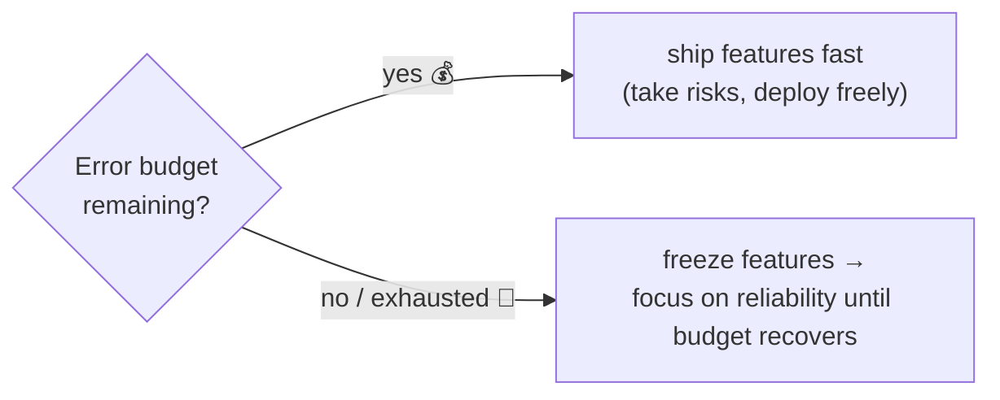

# SRE — SLOs, error budgets & incident response

> Site Reliability Engineering is Google's influential answer to "how reliable should a system
> be, and who decides?" Its core moves: define reliability with **SLOs**, turn the gap below
> 100% into an **error budget** you're allowed to spend, and run incidents and **postmortems**
> in a **blameless** way. It's DevOps made measurable.

## Top-down: where you already meet this
[Observability](./observability.md) gave you metrics; [CD](../ci-cd/continuous-delivery-deployment.md)
gave you the ability to ship fast. But two questions remain: *how reliable is reliable enough?* and
*when something breaks at 3am, what happens?* Chasing 100% uptime is impossibly expensive and
actually slows you down; shipping recklessly burns users. SRE resolves this tension with numbers.
This doc closes the loop — keeping the system the rest of the area built actually *reliable*.

## Problem
"Make it reliable" is unmeasurable and endless — the last 0.1% of uptime can cost more than the
first 99.9%. Meanwhile, two forces fight: **developers want to ship features fast**;
**reliability wants to slow change down** (change causes most outages). Without an agreed target,
this becomes a political tug-of-war, and incidents devolve into blame and heroics. SRE replaces
opinions and finger-pointing with **explicit reliability targets** and a **shared, data-driven
budget** that both sides accept.

## Core concepts

**SLI, SLO, SLA — the reliability vocabulary.** Build up in three steps:

| Term | What it is | Example |
| --- | --- | --- |
| **SLI** (Indicator) | a *measured* number about reliability | "% of requests served < 300ms and 200 OK" |
| **SLO** (Objective) | your internal *target* for an SLI | "99.9% of requests succeed, monthly" |
| **SLA** (Agreement) | a *contract* with consequences if missed | "99.9% or we refund you" |

SLIs come straight from the [golden signals](./observability.md). The **SLO** is the one you live
by day to day; the SLA is the (looser) legal promise.

**The error budget — the key insight.** If your SLO is 99.9% success, then **0.1% is allowed to
fail** — that 0.1% is your **error budget**: a *quantified permission to be unreliable*.

```
SLO = 99.9% available  →  error budget = 0.1% = ~43 minutes of "down" per month
```

This reframes everything: reliability isn't "as high as possible," it's "meet the SLO, and spend
the rest of the budget on **shipping fast**." Crucially it ends the dev-vs-ops war with a *policy*:



Plenty of budget left → ship aggressively. Budget blown (too many outages) → **feature freeze**,
fix reliability. Both teams agreed to this in advance, so it's math, not politics. **100% is the
wrong target** — it leaves no budget to innovate and users can't tell the difference anyway.

**Toil and automation.** SRE caps **toil** (manual, repetitive ops work) — Google's rule of thumb
is ≤50% of an SRE's time — and spends the rest *automating it away*. Toil that scales with traffic
is a bug to be engineered out, not endured. This is the [DevOps "automate everything"](../fundamentals/what-is-devops.md)
value, with a budget attached.

**Incident response — calm, role-based, practiced.** When something breaks, SRE runs a structured
process instead of chaos: detect (an [SLO-based alert](./observability.md) pages on-call) → assess
severity → assign roles (**Incident Commander** coordinates, others investigate/communicate) →
mitigate *first* (stop the bleeding — often [roll back](../ci-cd/continuous-delivery-deployment.md) —
before root-causing) → resolve → learn. **Mitigate before you diagnose**: restore users, then
figure out why.

**Blameless postmortems — learn, don't punish.** After a significant incident, write a
**postmortem**: timeline, impact, root cause, and *action items* — focused on **systems and
processes, not people**. The premise: humans operating complex systems will err; a good system
prevents one mistake from becoming an outage. Blame makes people hide problems; **blamelessness
surfaces them**, so the system gets safer. This cultural choice is as important as any metric.

## Essential terminology

| Term | Meaning |
| --- | --- |
| **SRE** | Site Reliability Engineering — running systems reliably using engineering & metrics. |
| **SLI** | Service Level *Indicator* — a measured reliability number. |
| **SLO** | Service Level *Objective* — your internal reliability target. |
| **SLA** | Service Level *Agreement* — a contractual promise with penalties. |
| **Error budget** | The allowed amount of unreliability (1 − SLO); spend it on velocity. |
| **Nines** | Shorthand for availability ("three nines" = 99.9% ≈ 43 min/month down). |
| **Toil** | Manual, repetitive, automatable operational work. |
| **On-call** | Rotation of who responds to production alerts. |
| **Incident Commander** | The person coordinating an active incident. |
| **MTTR** | Mean Time To Recovery — how fast you restore service. |
| **Postmortem** | A blameless write-up of an incident and its fixes. |
| **Blameless** | Focusing on system/process causes, not individual fault. |

## Example
An error budget turning a reliability debate into a decision:
```
SLO:            99.9% of checkout requests succeed per 30 days
Error budget:   0.1% × ~43,200 min/month  ≈  43 minutes of failure allowed

This month so far:
  • a bad deploy caused 25 min of errors
  • a dependency outage caused 10 min
  → 35 min spent, 8 min of budget left

Policy (agreed in advance):
  budget remaining  → keep shipping features, deploy freely
  budget exhausted  → FEATURE FREEZE: only reliability work until next month resets
```
No meeting, no politics: the **budget decides**. If the team keeps blowing it, the data says "slow
down and invest in reliability"; if there's budget to spare, it says "ship boldly." That's SRE's
quiet genius — aligning velocity and reliability with one number.

## Common tools
| Tool | What it is | Use it for |
| --- | --- | --- |
| **Prometheus + Grafana** | Metrics & dashboards | computing SLIs & visualizing budget burn |
| **SLO tools** (Sloth, Nobl9, OpenSLO) | SLO management | defining SLOs & error-budget alerts |
| **PagerDuty / Opsgenie** | On-call & alerting | routing pages to the on-call engineer |
| **Statuspage** | Public status | communicating incidents to users |
| **Incident tools** (incident.io, FireHydrant) | Incident management | coordinating roles, timelines, postmortems |
| **Runbooks** | Documented procedures | fast, consistent incident response |

## Trade-offs
- ✅ **Ends the dev-vs-ops war:** the error budget gives both sides one agreed, data-driven rule.
- ✅ **Right-sizes reliability:** explicitly *not* chasing 100% frees time and money for features.
- ✅ **Blameless culture surfaces problems** instead of hiding them → systems get safer over time.
- ⚠️ **SLOs must reflect real user pain:** a target on the wrong SLI (or an unrealistic one) is
  worse than none — it creates false confidence or constant false alarms.
- ⚠️ **On-call has human cost:** poorly run rotations cause burnout; sustainable on-call (sane
  alerting, follow-the-sun, comp) is essential.
- ⚠️ **Culture is the hard part (again):** blamelessness and honoring a feature freeze require real
  organizational buy-in, not just a dashboard.

## Real-world examples
- **Google's SRE practice** (and its free books) originated SLOs, error budgets, and blameless
  postmortems — now industry standard.
- **"Three/four nines"** is common product vocabulary; **error-budget burn alerts** page teams
  *before* the SLO is fully blown.
- **Public postmortems** (Cloudflare, GitLab, AWS) model blameless analysis — detailed timelines
  and action items, no scapegoats.
- **Feature freezes triggered by budget exhaustion** are a real, enforced policy at SRE-mature
  orgs — reliability work earns priority by data.

## References
- [Google SRE Book](https://sre.google/sre-book/table-of-contents/) & [The SRE Workbook](https://sre.google/workbook/table-of-contents/) — free, foundational
- [Implementing SLOs (SRE Workbook ch.)](https://sre.google/workbook/implementing-slos/)
- *Seeking SRE* (David Blank-Edelman, ed.)
- [Atlassian — Incident management & blameless postmortems](https://www.atlassian.com/incident-management)
