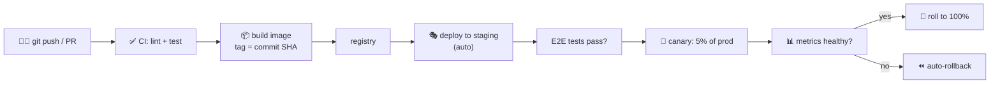

# From `git push` to production — a full CI/CD pipeline

> This case study traces a **single one-line code change** all the way from a developer's
> `git push` to running for 100% of users — through [CI](../1-knowledge/ci-cd/continuous-integration.md),
> image build, [environments](../1-knowledge/fundamentals/environments-and-release-flow.md), and a
> [canary rollout](../1-knowledge/ci-cd/continuous-delivery-deployment.md). It's the capstone that
> turns the Part 1 knowledge docs into one continuous, automated story.

## The scenario
A developer fixes a bug — one line — and opens a pull request. Twenty minutes later it's live for
everyone, and nobody manually deployed anything, ran a test by hand, or stayed up late. We follow
that change through every automated stage. This is the everyday reality of a mature
[DevOps](../1-knowledge/fundamentals/what-is-devops.md) team, and answering "how does code get to
prod here?" well is a core engineering skill.

## Requirements
Get the change to production **fast** (minutes, not weeks), **safely** (no broken code or outage),
and **automatically** (no manual steps to forget), with a **quick undo** if it misbehaves.

## How it works — end to end

### Stage 1 — Push & CI ([Continuous Integration](../1-knowledge/ci-cd/continuous-integration.md))
The push triggers the [pipeline](../1-knowledge/ci-cd/continuous-integration.md). On a fresh
runner: checkout → lint → run the [test pyramid](../1-knowledge/ci-cd/continuous-integration.md)
(unit, then integration). Any failure → **red build, merge blocked, author notified** in minutes.
Green → proceed. *Nothing reaches main without passing this gate.*

### Stage 2 — Build the artifact ([containers](../1-knowledge/containers/containers.md))
CI builds a [container image](../1-knowledge/containers/containers.md), tagged with the **commit
SHA** (`myapp:a1b2c3`), and pushes it to a [registry](../1-knowledge/containers/containers.md).
This immutable image is **built once** and will be promoted unchanged — so the exact bytes tested
are the bytes shipped.

### Stage 3 — Staging ([environments](../1-knowledge/fundamentals/environments-and-release-flow.md))
The pipeline auto-deploys `myapp:a1b2c3` to **staging**, a production-like
[environment](../1-knowledge/fundamentals/environments-and-release-flow.md), injecting staging
[config](../1-knowledge/fundamentals/environments-and-release-flow.md). End-to-end tests run against
it. Same image, different config — "passed in staging" is a real signal because it's the *same
artifact*.

### Stage 4 — Canary ([progressive delivery](../1-knowledge/ci-cd/continuous-delivery-deployment.md))
Now production — but **not for everyone at once**. A [canary](../1-knowledge/ci-cd/continuous-delivery-deployment.md)
sends **5%** of real traffic to the new version. For a few minutes the pipeline watches the
[golden signals](../1-knowledge/observability/observability.md) (error rate, p95 latency) of canary
vs baseline.

### Stage 5 — Decide: widen or roll back
- **Metrics healthy** → widen 5% → 25% → 100%, then retire the old version. Done — live for all.
- **Metrics regress** → the pipeline **automatically [rolls back](../1-knowledge/ci-cd/continuous-delivery-deployment.md)**
  to the previous image. ~5% of users saw errors for a couple of minutes; nobody got paged at 2am.

The whole thing — push to 100% — took ~20 minutes with **zero manual steps**.

## Deep dives

**Why "build once, promote" matters.** The image is created in Stage 2 and never rebuilt; staging
and prod run the identical artifact with different [injected config](../1-knowledge/fundamentals/environments-and-release-flow.md).
Rebuilding per environment would mean testing something other than what you ship — the classic trap
this design eliminates.

**Why the canary is the safety net.** The risk in any deploy is the cutover. The canary shrinks the
[blast radius](../1-knowledge/ci-cd/continuous-delivery-deployment.md) from "everyone" to "5% for 2
minutes," and — crucially — lets **metrics, not humans**, make the go/no-go call. This only works
because the team has real [observability](../1-knowledge/observability/observability.md) and
[SLOs](../1-knowledge/observability/sre-reliability.md) to define "healthy."

**GitOps variant.** Many teams make the deploy itself declarative: CI updates an image tag in a Git
repo, and a controller ([Argo CD](../1-knowledge/ci-cd/continuous-delivery-deployment.md)) reconciles
the [Kubernetes](../1-knowledge/containers/kubernetes.md) cluster to match — the same
[reconciliation loop](../1-knowledge/containers/kubernetes.md) as everything else in K8s.

## Trade-offs & failure modes
- ✅ **Fast + safe + automatic:** minutes to prod, tiny blast radius, instant rollback, no toil.
- ✅ **Traceable:** every change is small and tagged by commit, so "what shipped?" and "revert it"
  are trivial.
- ⚠️ **Needs real maturity:** trustworthy tests, [observability](../1-knowledge/observability/observability.md),
  and [SLOs](../1-knowledge/observability/sre-reliability.md) — without them, this just ships bugs
  faster.
- ⚠️ **Backward compatibility is mandatory:** canary runs old+new together, so DB migrations and API
  changes must be compatible across versions.
- ⚠️ **Flaky tests / noisy metrics** can block good deploys or wave through bad ones — the gates are
  only as good as the signals.

## See it yourself
- Build the [CI half in the GitHub Actions lab](../3-practice/lab-github-actions.md).
- Do the [rolling update / rollback in the kind lab](../3-practice/lab-kubernetes-kind.md).
- Generate the [metrics a canary judges, in the Prometheus lab](../3-practice/lab-prometheus-metrics.md).

## References
- [CI](../1-knowledge/ci-cd/continuous-integration.md) · [CD & rollouts](../1-knowledge/ci-cd/continuous-delivery-deployment.md) · [Environments](../1-knowledge/fundamentals/environments-and-release-flow.md)
- *Continuous Delivery* (Humble & Farley)
- [Google SRE — Release Engineering](https://sre.google/sre-book/release-engineering/)
