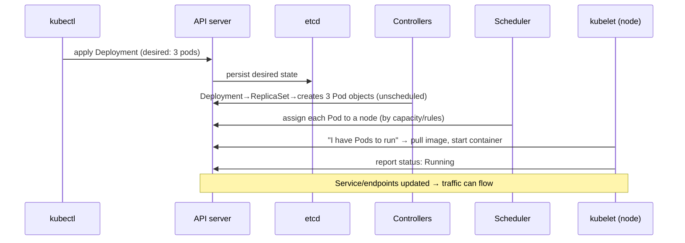

# Deploying to Kubernetes — what actually happens

> You run `kubectl apply` and seconds later your app is running, replicated, and reachable. This
> case study opens that black box: the chain of [control-plane](../1-knowledge/containers/kubernetes.md)
> components that turn a line of YAML into running [containers](../1-knowledge/containers/containers.md)
> with traffic flowing to them — the [reconciliation loop](../1-knowledge/containers/kubernetes.md)
> in motion.

## The scenario
You have a [Deployment](../1-knowledge/containers/kubernetes.md) manifest asking for 3 replicas of
`myapp:1.5`. You `kubectl apply` it. What *exactly* happens inside the cluster between pressing
Enter and the app serving requests? Understanding this demystifies Kubernetes and makes debugging
("why is my pod stuck in `Pending`?") tractable.

## Requirements
Take a *declared desired state* and make it real: schedule containers onto healthy nodes, pull
images, start them, wire up networking and load balancing, and keep it all matching the declaration
forever after — automatically.

## How it works — end to end

### Step 1 — `apply` → the API server → etcd
`kubectl` sends your manifest to the **API server** (the only thing anything talks to). It
validates it and writes the **desired state** to **etcd**, the cluster's database. At this point
nothing is running yet — you've only recorded *intent*.

### Step 2 — Controllers expand the intent
The **Deployment controller** notices a new Deployment and creates a
[ReplicaSet](../1-knowledge/containers/kubernetes.md); the ReplicaSet controller sees "want 3, have
0" and creates **3 Pod objects** — but they're *unscheduled* (no node yet). This is the
[reconciliation loop](../1-knowledge/containers/kubernetes.md): each controller drives actual toward
desired.

### Step 3 — The scheduler places the pods
The **scheduler** watches for unscheduled pods and picks a **node** for each, based on available
CPU/memory, affinity rules, and constraints. It writes the chosen node back via the API server.
(If no node has room, the pod stays **`Pending`** — the #1 thing to check when a pod won't start.)

### Step 4 — The kubelet runs the containers
Each node's **kubelet** sees pods assigned to it, [pulls the image](../1-knowledge/containers/containers.md)
from the registry, and tells the [container runtime](../1-knowledge/containers/containers.md) to
start it. It then continuously reports health back to the API server. Now actual = desired = 3
running pods.

### Step 5 — Networking makes them reachable
As pods go healthy, the [Service](../1-knowledge/containers/service-networking-load-balancing.md)'s
**endpoints** are updated to include their IPs, and an [Ingress](../1-knowledge/containers/service-networking-load-balancing.md)
routes external traffic in. Traffic now [load-balances](../1-knowledge/containers/service-networking-load-balancing.md)
across the three pods — which is why you never address a pod directly.

### Forever after — the loop never stops
The controllers keep watching. A pod crashes → actual drops to 2 → a new pod is created and
scheduled → back to 3. A node dies → its pods are rescheduled elsewhere. You declared "3"; the
cluster *maintains* "3" with no further input. That perpetual reconciliation is the essence of
Kubernetes.

## Deep dives

**Everything is the API server + etcd.** Note that no component talks to another directly — they
all read/write through the API server, and etcd holds the truth. This decoupling is why K8s is
extensible (add your own controller) and resilient (restart any component; it re-reads state).

**Debugging maps to these steps.** The pipeline above *is* your debugging checklist:
`kubectl get pods` shows the phase, and `kubectl describe pod` shows *which step* stalled —
`Pending` = scheduler found no node; `ImagePullBackOff` = kubelet can't pull the
[image](../1-knowledge/containers/containers.md); `CrashLoopBackOff` = it starts then dies. Knowing
the flow turns "it's broken" into "step 3 is stuck."

**A rolling update is the same machinery.** Change `image:` to `1.6` and the Deployment controller
creates a *new* ReplicaSet, scaling it up while scaling the old one down a pod at a time — a
[rolling update](../1-knowledge/ci-cd/continuous-delivery-deployment.md) is just reconciliation
toward a new desired state, with `maxSurge`/`maxUnavailable` controlling the pace.

## Trade-offs & failure modes
- ✅ **Declarative & self-healing:** you state intent once; the cluster realizes and *maintains* it
  through failures.
- ✅ **Debuggable & extensible:** the uniform API-server/etcd/controller model makes behavior
  predictable and pluggable.
- ⚠️ **Many moving parts:** more components to understand and operate than a simple VM deploy —
  [overkill for small apps](../1-knowledge/containers/kubernetes.md).
- ⚠️ **Common stalls:** `Pending` (no capacity), `ImagePullBackOff` (bad image/registry auth),
  `CrashLoopBackOff` (app fails on start) — all readable via `describe`.
- ⚠️ **Networking & config errors** (wrong Service selector, missing ConfigMap/Secret) leave pods
  running but unreachable or misconfigured.

## See it yourself
- Do the whole flow — apply, self-heal, rolling update — in the
  [kind lab](../3-practice/lab-kubernetes-kind.md).
- `kubectl describe pod <name>` and read the **Events** at the bottom — that's steps 3–4, narrated
  by the cluster.

## References
- [Kubernetes (knowledge)](../1-knowledge/containers/kubernetes.md) · [Service networking](../1-knowledge/containers/service-networking-load-balancing.md)
- [Kubernetes — Components](https://kubernetes.io/docs/concepts/overview/components/)
- [What happens when you create a Pod (annotated)](https://github.com/jamiehannaford/what-happens-when-k8s)
