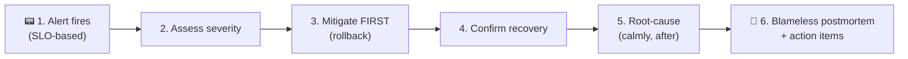

# An on-call incident, start to finish (SRE)

> It's 2:47am. A page fires: checkout errors are spiking. This case study walks a production
> incident from alert to resolved to **blameless postmortem** — showing how
> [SRE](../1-knowledge/observability/sre-reliability.md) practices,
> [observability](../1-knowledge/observability/observability.md), and fast
> [rollback](../1-knowledge/ci-cd/continuous-delivery-deployment.md) turn a potential disaster into
> a 15-minute blip and a lasting improvement.

## The scenario
A routine deploy went out at 2:30am (automated pipeline, low-traffic window). Seventeen minutes
later, error rates climb. The on-call engineer's phone buzzes. We follow exactly what happens next —
not heroics, but a *practiced process*. This is the human-and-systems side of DevOps: even with
great automation, things break, and how you respond defines reliability.

## Requirements
**Restore service fast** (minimize user impact / [MTTR](../1-knowledge/observability/sre-reliability.md)),
**stay calm and coordinated** (no flailing), and **learn** so it can't recur — all without blaming
the person who pushed the change.

## How it works — end to end



### Step 1 — The alert ([observability](../1-knowledge/observability/observability.md) → page)
The page isn't "CPU is high" — it's an [SLO-based alert](../1-knowledge/observability/sre-reliability.md):
*"checkout success rate < 99.9%, [error budget](../1-knowledge/observability/sre-reliability.md)
burning fast."* It alerts on a **symptom users feel**, not a random metric, so it's worth waking
someone for. [PagerDuty](../1-knowledge/observability/sre-reliability.md) routes it to the on-call
engineer.

### Step 2 — Assess (the golden signals)
The engineer opens the dashboard and reads the [golden signals](../1-knowledge/observability/observability.md):
errors up to 8%, p95 latency normal, traffic normal. A quick [trace](../1-knowledge/observability/observability.md)
shows failures concentrated in `checkout`. Severity: **SEV-2** (significant user impact, not total
outage). For a bigger incident they'd page an **Incident Commander** to coordinate; here one
engineer can handle it.

### Step 3 — Mitigate *first* (don't diagnose yet)
The cardinal rule: **stop the bleeding before understanding it.** The dashboard's "what changed?"
annotation shows the 2:30am deploy lines up exactly with the error spike. The engineer
[**rolls back**](../1-knowledge/ci-cd/continuous-delivery-deployment.md):
```console
$ kubectl rollout undo deployment/checkout
deployment "checkout" rolled back
```
No root-causing yet — just revert to the last known-good version. (Had it been behind a
[feature flag](../1-knowledge/fundamentals/environments-and-release-flow.md), flipping the flag off
would be even faster.)

### Step 4 — Confirm recovery
Eyes on the [error-rate graph](../1-knowledge/observability/observability.md): within ~2 minutes it
falls back under 0.1%. Checkout is healthy. Total user impact: ~15 minutes of elevated errors.
The engineer posts a status update and **stands down the urgency** — the fire is out.

### Step 5 — Root-cause (calmly, now that users are safe)
*Now* the investigation happens without time pressure. The bad deploy's
[diff](../1-knowledge/ci-cd/continuous-integration.md) + the service [logs](../1-knowledge/observability/observability.md)
reveal it: the new code opened a database connection per request without closing it, exhausting the
[connection pool](../1-knowledge/observability/observability.md) under load — which is why it passed
[CI](../1-knowledge/ci-cd/continuous-integration.md) and staging (low traffic) but failed in prod.

### Step 6 — Blameless postmortem ([learn](../1-knowledge/observability/sre-reliability.md))
Within a few days: a [blameless postmortem](../1-knowledge/observability/sre-reliability.md) —
timeline, impact, root cause, and **action items focused on the system, not the person**:
1. Add a connection-pool-saturation [metric + alert](../1-knowledge/observability/observability.md)
   (we were blind to it).
2. Add a load test to [CI](../1-knowledge/ci-cd/continuous-integration.md) that would have caught it.
3. Tighten the [canary](../1-knowledge/ci-cd/continuous-delivery-deployment.md) analysis window so a
   future bad deploy auto-rolls-back before paging anyone.

The deploy author is in the room *helping write fixes*, not being blamed.

## Deep dives

**Why "mitigate before diagnose" is the whole game.** Reducing
[MTTR](../1-knowledge/observability/sre-reliability.md) matters more than preventing every failure.
Rolling back first restores users in minutes; root-causing a live incident under pressure wastes
the time users are hurting. Small, frequent, [reversible deploys](../1-knowledge/ci-cd/continuous-delivery-deployment.md)
are what make "just roll back" a viable first move.

**Why blameless matters operationally.** The connection-pool bug wasn't one person's failure — it
was a *system* that let an under-tested change reach prod. [Blame](../1-knowledge/observability/sre-reliability.md)
would make the next engineer hide a mistake or freeze; blamelessness makes them surface it, so the
**action items fix the system**. The output of a good incident is a *safer system*, not a culprit.

**The error budget closes the loop.** This incident spent a chunk of the month's
[error budget](../1-knowledge/observability/sre-reliability.md). If deploys keep causing incidents
and the budget is exhausted, the agreed policy kicks in: **freeze features, invest in reliability**
(exactly the action items above) — data, not politics, redirecting the team.

## Trade-offs & failure modes
- ✅ **Fast recovery over perfection:** practiced rollback + good alerting = minutes of impact, not
  hours.
- ✅ **Blameless learning compounds:** each incident makes the system measurably safer.
- ⚠️ **Only as good as the signals:** the rollback was fast *because* an SLO alert fired and a
  "what changed" annotation existed — under-instrumented systems have long, painful incidents.
- ⚠️ **On-call has real human cost:** sustainable rotations, sane alerting, and follow-the-sun
  coverage are needed to avoid [burnout](../1-knowledge/observability/sre-reliability.md).
- ⚠️ **Postmortem action items must actually get done** — otherwise the same incident recurs;
  tracking them to completion is part of the discipline.

## See it yourself
- Build the [metrics + alert that page you, in the Prometheus lab](../3-practice/lab-prometheus-metrics.md).
- Practice the [`kubectl rollout undo` recovery in the kind lab](../3-practice/lab-kubernetes-kind.md).
- Read real public [blameless postmortems](../1-knowledge/observability/sre-reliability.md) (Cloudflare, GitLab, AWS).

## References
- [SRE — SLOs, error budgets & incident response](../1-knowledge/observability/sre-reliability.md) · [Observability](../1-knowledge/observability/observability.md)
- [Google SRE Book — Managing Incidents](https://sre.google/sre-book/managing-incidents/) & [Postmortem Culture](https://sre.google/sre-book/postmortem-culture/)
- [Atlassian — Incident management](https://www.atlassian.com/incident-management)
