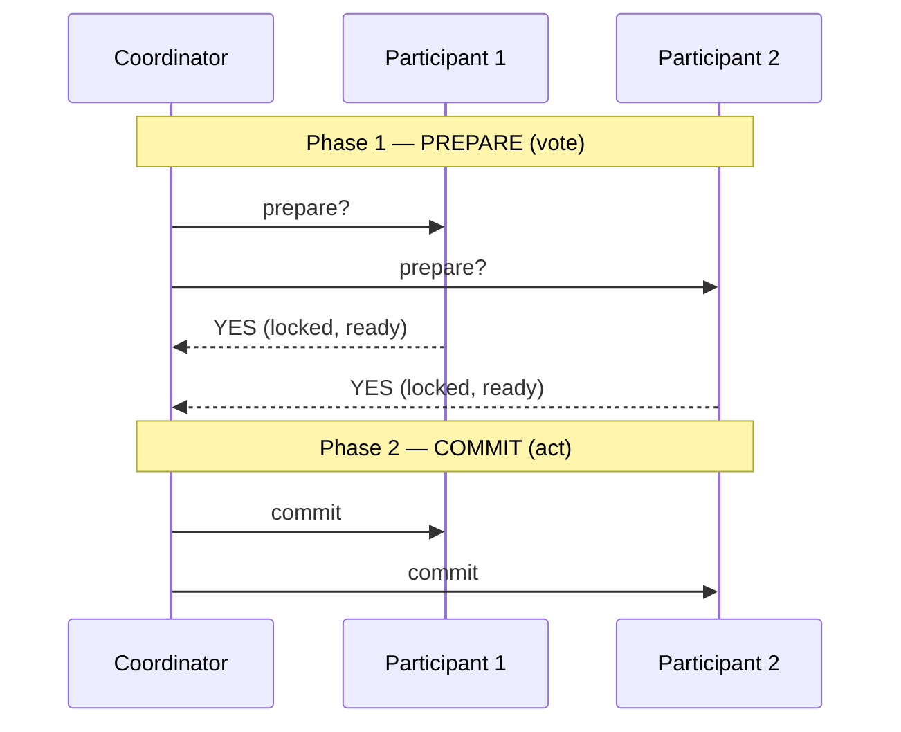

# Atomic commit & two-phase commit (2PC)

> Purpose: when a single transaction spans *multiple* nodes (debit one database, credit
> another), you need them to **all commit or all abort** — never some-and-not-others.
> Atomic commit is that all-or-nothing agreement across nodes; **two-phase commit (2PC)** is
> the classic protocol — and a cautionary tale about its weakness.

## Top-down: where you already meet this
Transfer money between two banks, or write to two microservice databases in one logical
operation. If one side commits and the other crashes, you've created money or lost it. You need
the multi-node write to be **atomic** — indivisible. That's a different problem from
[consensus](./consensus-and-raft.md) (agreeing on *a* value): here every participant has a veto,
because any one of them being unable to commit must abort the *whole* thing.

## Problem
A transaction touches several nodes; each can independently succeed or fail (disk full,
constraint violation, crash). Partial completion is corruption. So all participants must reach
the **same** outcome — commit or abort — atomically, despite crashes and message loss. The twist
vs consensus: this needs **unanimity** (one "no" → everyone aborts), not a majority.

## Core concepts

**Two-phase commit (2PC) — vote, then act.** A **coordinator** drives two rounds:


- **Phase 1 (prepare/vote):** coordinator asks everyone "can you commit?" Each does the work,
  locks the rows, and replies **YES** (a *promise* it can commit) or **NO**.
- **Phase 2 (commit/abort):** if **all** voted YES → coordinator says **commit**; if **any** said
  NO (or didn't answer) → **abort**. Participants obey and release locks.

The guarantee: because every participant *promised* in phase 1 before anyone committed in phase
2, the outcome is unanimous.

**The fatal flaw: 2PC blocks.** If the coordinator crashes *after* a participant voted YES but
*before* sending the decision, that participant is **stuck** — it promised to commit so it can't
unilaterally abort, but it doesn't know the decision, so it can't commit either. It holds its
locks and **waits**, potentially forever. 2PC is a **blocking** protocol with the coordinator as
a single point of failure. (3PC adds a phase to reduce blocking but assumes synchrony and is
rarely used.)

**2PC vs consensus — the key distinction.** They look similar but aren't:

| | **2PC (atomic commit)** | **[Consensus](./consensus-and-raft.md) (Raft/Paxos)** |
| --- | --- | --- |
| Agree on | commit *or* abort, **unanimously** | one value, by **majority** |
| One "no"/missing vote | forces **abort** (everyone has a veto) | tolerated (majority still decides) |
| Coordinator/leader dies mid-way | **blocks** | a new leader is elected, makes progress |
| Fault tolerance | poor (blocks) | survives a minority of failures |

This is *why* modern systems often replace cross-service 2PC with the
[**saga pattern**](../../../system-design/1-knowledge/patterns/saga.md) (a sequence of local
transactions + compensating undo actions) — trading atomicity for availability — or run 2PC
*on top of* consensus-replicated participants so no single node blocks.

## Essential terminology

| Term | Meaning |
| --- | --- |
| **Atomic commit** | All participants commit, or all abort — never partial. |
| **2PC** | Two-phase commit: a prepare/vote round, then a commit/abort round. |
| **Coordinator** | The node driving the protocol (and its single point of failure). |
| **Prepare / vote phase** | Participants lock and promise YES/NO. |
| **Commit / abort phase** | Coordinator broadcasts the unanimous outcome. |
| **Blocking** | Participants stuck holding locks if the coordinator dies mid-protocol. |
| **Saga** | The availability-favoring alternative: local txns + compensations. |

## Example
The blocking failure, concretely:
```
Coordinator → P1, P2: "prepare?"
P1, P2: lock rows, reply "YES, ready to commit"
Coordinator: ✍️ records "COMMIT" ... then CRASHES before telling anyone.

P1 and P2 are now stuck:
  • they voted YES, so they may NOT abort (the decision might have been commit)
  • they never heard the decision, so they may NOT commit either
  → they hold their locks and WAIT for the coordinator to recover. Other transactions block too.
```
This single scenario is why 2PC has a bad reputation at scale and why distributed systems prefer
[sagas](../../../system-design/1-knowledge/patterns/saga.md) or consensus-backed commit. Atomicity
across nodes is genuinely expensive.

## Trade-offs
- ✅ **Gives true atomicity** across nodes — exactly-once "all or nothing," with strong
  consistency, when it completes.
- ⚠️ **Blocks on coordinator failure** → held locks, stalled participants; the coordinator is a
  SPOF.
- ⚠️ **Slow & lock-heavy:** two round-trips holding locks throughout → poor throughput and
  availability; doesn't scale to many participants or geo-distance.
- Hence the common verdict: **avoid distributed transactions when you can** — design for local
  transactions + [sagas](../../../system-design/1-knowledge/patterns/saga.md), and reserve atomic
  commit for the few places that truly need it.

## Real-world examples
- **Classic relational setups (XA transactions)** use 2PC across databases/message brokers — and
  inherit its blocking pain.
- **Microservices favor [sagas](../../../system-design/1-knowledge/patterns/saga.md)** (order →
  payment → shipping, each with a compensating undo) precisely to dodge 2PC's blocking.
- **Spanner/CockroachDB** *do* offer cross-shard transactions — by layering 2PC over
  [Raft/Paxos-replicated](./consensus-and-raft.md) shards, so no single participant can block.

## References
- *Designing Data-Intensive Applications* (Kleppmann) — Ch. 9 (atomic commit & 2PC)
- Gray & Lamport — *Consensus on Transaction Commit* (2PC vs Paxos commit)
- The applied alternative: [Saga pattern (System Design)](../../../system-design/1-knowledge/patterns/saga.md)
- Contrast with [consensus & Raft](./consensus-and-raft.md)
