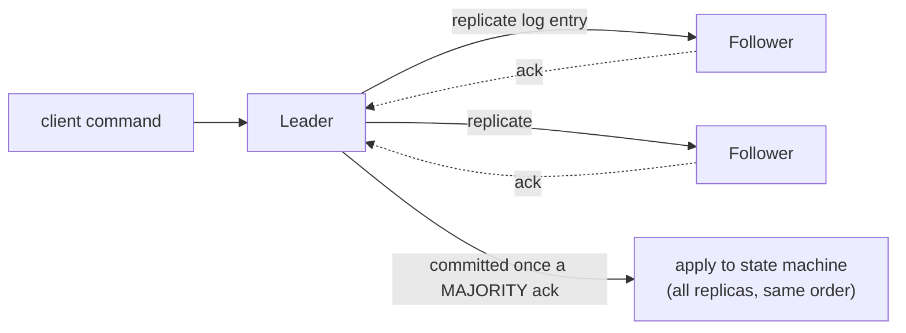

# Consensus & Raft (state-machine replication)

> Purpose: get a group of nodes to **agree on one value** (or one ordered sequence of
> commands) despite crashes and an unreliable network — so that replicas stay identical and
> the system behaves like a single, reliable machine. Consensus is the beating heart of
> fault-tolerant systems; **Raft** is the algorithm most people actually use.

## Top-down: where you already meet this
Kubernetes "just knows" the current cluster state; a database failover picks exactly one new
leader (never two). Behind both is consensus: many nodes agreeing on one answer so that, even
if some die, the survivors share a single source of truth. Whenever you've relied on a system
having *one* consistent view despite running on many machines, consensus made it possible.

## Problem
You replicate data across nodes for [fault tolerance](../fundamentals/failure-models.md) — but
now the replicas can disagree (different writes, two nodes both claiming leadership =
"split-brain"). You need them to agree on **one** value/order, with two guarantees: **safety**
(they never agree on *different* things) and **liveness** (they *do* eventually agree, when the
network behaves). And [FLP](../fundamentals/failure-models.md) says you can't have guaranteed
fast agreement under arbitrary delays — so the goal is "always safe, live when the network
cooperates."

## Core concepts

**Consensus, precisely.** Nodes each propose a value; the protocol must pick one such that all
correct nodes **agree** on the same value, it was actually **proposed**, and they eventually
**decide**. Real systems run consensus repeatedly to agree on a *log* — a growing ordered list
of commands.

**State-machine replication (the why).** If every replica starts identical and applies the
**same commands in the same order**, they stay identical forever. So the real job of consensus
is to **agree on the order of a log of commands**; feed that log to each replica's state machine
and you get a fault-tolerant copy of any service. This single idea — *agree on the log* — is how
consensus turns into a working replicated database/config store.



**Raft — consensus designed to be understandable.** Paxos solved consensus first but is
famously hard to grasp; **Raft** rebuilt it for clarity and is now everywhere. Its three ideas:

1. **Leader-based.** One elected **leader** at a time handles all writes and pushes them to
   followers. Clients talk only to the leader → simple, ordered.
2. **Terms + majority elections.** Time is divided into numbered **terms**. If the leader
   seems dead (election timeout), a follower bumps the term and asks for votes; a candidate
   wins with a **majority**. Because each node votes once per term and a majority is required,
   **at most one leader per term** — split-brain is impossible.
3. **Replicated log + commit by majority.** The leader appends a command and replicates it; once
   a **majority** has stored it, it's **committed** and applied. Majorities are the trick: any
   two majorities overlap, so a committed entry survives into every future leader.

**Why majority (quorum) is the magic.** Needing >½ the nodes to agree means any two decisions
share at least one node — so information can't be "lost" between leaders. The price: you need
**2f+1 nodes to tolerate f failures** (3 nodes survive 1 failure, 5 survive 2). A minority
partition can't elect a leader, so it correctly **stops** rather than diverging — this is the
[CP choice](../../../system-design/1-knowledge/fundamentals/cap-theorem.md) in action.

## Essential terminology

| Term | Meaning |
| --- | --- |
| **Consensus** | Getting nodes to agree on one value/order despite failures. |
| **Safety / liveness** | Never agree wrongly / eventually do agree. |
| **State-machine replication** | Same start + same ordered commands ⇒ identical replicas. |
| **Leader / follower** | The node accepting writes / the nodes replicating them. |
| **Term** | A numbered election period; ≤ one leader each. |
| **Quorum (majority)** | > half the nodes; any two overlap, preventing lost decisions. |
| **Commit** | An entry is durable once a majority has stored it. |
| **Split-brain** | Two nodes both acting as leader — what consensus prevents. |
| **2f+1** | Nodes needed to tolerate f crash failures. |

## Example
Why split-brain can't happen, in a 5-node cluster hit by a partition:
```
Partition splits nodes into {A, B}  and  {C, D, E}.

{A, B}    = 2 nodes → cannot reach a majority (need 3) → NO leader → refuses writes (stays safe)
{C, D, E} = 3 nodes → majority → elects a leader → keeps serving

→ exactly ONE side makes progress. When the partition heals, A and B catch up from the leader's log.
```
The minority side sacrifices [availability to preserve consistency](../../../system-design/1-knowledge/fundamentals/cap-theorem.md)
— it would rather stop than risk two leaders accepting conflicting writes. Build the election
yourself in the [Raft lab](../../3-practice/lab-raft-election.md).

## Trade-offs
- ✅ Turns unreliable nodes into **one consistent, fault-tolerant machine** — the basis of config
  stores, lock services, and strongly-consistent databases.
- ✅ **Safe by design:** never two leaders, never a lost committed entry.
- ⚠️ **Majority required:** a write waits for >½ the nodes → latency, and a cluster that loses
  quorum **stops** (correctly). Not for "always-available" needs — that's the
  [quorum/eventual-consistency](../replication/quorums-and-replication.md) world.
- ⚠️ **Coordination cost:** every write is a round-trip to a majority, so consensus is used for
  *important, lower-volume* state (metadata, leadership), not high-throughput bulk data.

## Real-world examples
- **etcd (Raft) stores all of Kubernetes' state** — see the [Raft/etcd case study](../../2-case-studies/raft-etcd.md).
- **ZooKeeper (Zab) and Consul (Raft)** provide leader election & config to countless systems.
- **Google Chubby** (Paxos) is the lock service much of Google coordinates through.
- **Spanner & CockroachDB** run Raft/Paxos *per shard* for strongly-consistent, distributed SQL —
  see [Spanner](../../2-case-studies/spanner.md).

## References
- Ongaro & Ousterhout — *In Search of an Understandable Consensus Algorithm (Raft)* + [raft.github.io](https://raft.github.io/) (great visualization)
- Lamport — *Paxos Made Simple*
- *Designing Data-Intensive Applications* (Kleppmann) — Ch. 9
- Contrast with [atomic commit / 2PC](./atomic-commit-2pc.md) and [quorum replication](../replication/quorums-and-replication.md)
