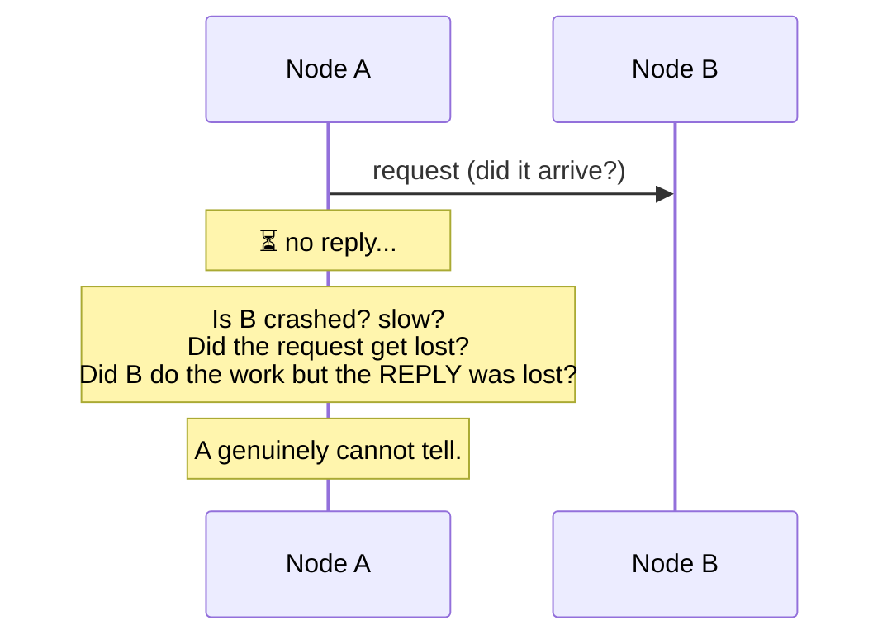

# Why distributed systems are hard

> A distributed system is a set of computers that communicate only by **passing messages**
> over an unreliable network, with **no shared memory and no shared clock**. That single
> setup breaks almost every assumption you have from single-machine programming — and
> *why* it breaks them is the foundation of this entire area.

## Top-down: where you already meet this
[System Design](../../../system-design/) taught you to *build* with replicas, queues, and
shards — and to accept ideas like "[eventual consistency](../../../system-design/1-knowledge/fundamentals/consistency-models.md)"
and the "[CAP theorem](../../../system-design/1-knowledge/fundamentals/cap-theorem.md)." But
*why* must you give something up? Why can't replicas just stay in sync? Why is "is that node
down?" unanswerable? Those aren't engineering inconveniences — they're **fundamental
impossibilities** rooted in the nature of distribution. This doc establishes the ground
truths the rest of the area builds on.

## Problem
On one machine, you take three things for granted: operations either happen or they don't
(no "maybe"), memory is shared and instantly consistent, and there's one clock. Spread the
computation across machines connected by a network and **all three vanish**:
- messages can be lost, delayed, duplicated, or reordered — and you can't tell "slow" from "dead";
- there is no shared state — each node knows only what it has been *told*, which may be stale;
- there is no global "now" — each node's clock drifts independently.

Every hard problem in distributed systems descends from these. The discipline is the study of
*what's still possible* despite them.

## Core concepts

**Partial failure — the defining difficulty.** On one machine, a crash takes down everything:
failure is *total* and observable. In a distributed system, **some components fail while
others keep running** — and the survivors often **can't tell what happened**. Did the node
crash? Is it just slow? Did *your message* get lost, or did its *reply*? This ambiguity —
**you cannot distinguish a failed node from a slow one** — is the single most important idea
in the field. (It's why [failure detection](./failure-models.md) is fundamentally imperfect.)



**The network is not reliable.** Messages traverse [a real network](../../../computer-networks/)
that drops, delays, reorders, and duplicates packets, and partitions (splits) entirely. The
**asynchronous model** captures the worst case: *messages eventually arrive but with no bound
on how long they take.* You can never conclude "no reply yet ⇒ it failed," because the reply
might arrive in one more millisecond — or never. Timeouts are a *guess*, not a fact.

**No global clock.** Each machine has its own quartz clock, and they **drift** (and jump, via
NTP corrections). So you cannot reliably order events on different machines by timestamp —
"event X at 10:00:00.000 on node A" may have *really* happened after "event Y at 10:00:00.001
on node B." Without a shared now, "what happened first?" needs a different foundation entirely
— [logical clocks](../time-order/logical-clocks.md).

**The 8 fallacies of distributed computing.** The classic list of false assumptions that sink
naive distributed systems (Deutsch & Gosling, Sun, 1990s):

| # | The fallacy ("we can assume…") | The reality |
| --- | --- | --- |
| 1 | The network is reliable | it drops & partitions |
| 2 | Latency is zero | round-trips cost real time |
| 3 | Bandwidth is infinite | it's finite and shared |
| 4 | The network is secure | assume hostile |
| 5 | Topology doesn't change | nodes & routes come and go |
| 6 | There is one administrator | many, with different rules |
| 7 | Transport cost is zero | serialization & bandwidth cost |
| 8 | The network is homogeneous | mixed hardware, protocols, versions |

Almost every distributed-systems outage is one of these assumptions, made implicitly, then
violated.

**Why we accept this pain: there's no choice.** We build distributed systems not for fun but
because we *must* — for **scale** (more than one machine's worth of work),
**fault tolerance** (survive any single machine dying), and **geography** (be close to users
worldwide). The reward is systems that outgrow and outlive any single computer; the price is
everything above. The whole field is the study of paying that price as cheaply as possible.

## Essential terminology

| Term | Meaning |
| --- | --- |
| **Distributed system** | Independent computers coordinating only by message passing. |
| **Partial failure** | Some components fail while others continue — the core difficulty. |
| **Message passing** | The only way nodes share information (no shared memory). |
| **Asynchronous model** | Messages arrive eventually, with no upper bound on delay. |
| **Synchronous model** | A (often unrealistic) model with known bounds on delay & clock drift. |
| **Network partition** | A break splitting nodes into groups that can't reach each other. |
| **Clock drift / skew** | Independent clocks diverging / differing at an instant. |
| **Fallacies of distributed computing** | The 8 classic false assumptions about networks. |
| **Fault tolerance** | Continuing to work despite component failures. |

## Example
The "did it happen?" problem made concrete — a client charges a credit card on a remote
service:
```
Client → Service:  "charge $50"
Service: charges the card ✅, sends "OK"
        ... the OK reply is lost in the network ...
Client:  ⏳ timeout. Did the charge happen or not?

If the client RETRIES:   risk charging $50 twice.
If the client GIVES UP:  risk never charging at all.
The client CANNOT know which.
```
There is no way, from the client's side, to be *sure*. This is why distributed systems lean on
**idempotency** (make "charge" safe to retry), **unique request IDs**, and
[consensus](../consensus/consensus-and-raft.md) — all machinery to cope with the fact that *you
can't tell whether the other side acted.* The single-machine intuition "the function either
returned or it didn't" simply does not exist here.

## Trade-offs
- ✅ Distribution buys **scale, fault tolerance, and low latency to global users** — things one
  machine can never provide.
- ⚠️ It costs you **certainty**: no global state, no global clock, no way to distinguish slow
  from dead — so every guarantee becomes a careful, probabilistic, or weakened version of the
  single-machine one.
- ⚠️ Complexity explodes: partial failures create combinatorially many states; testing must
  include message loss, reordering, and partitions (see [Jepsen](https://jepsen.io/)).
- The art is choosing *which* guarantee to weaken — the subject of [CAP](../../../system-design/1-knowledge/fundamentals/cap-theorem.md)
  and the rest of this area.

## Real-world examples
- **Every microservice call, replica sync, and cross-region write** lives with partial failure —
  which is why retries, timeouts, and idempotency keys are everywhere.
- **The 2021 [BGP/DNS outages](../../../computer-networks/2-case-studies/anatomy-of-an-outage.md)**
  are fallacy #5/#1 made real — topology and reachability are not stable.
- **"It's slow" vs "it's down"** is the eternal on-call ambiguity — the slow-vs-dead problem,
  every day.
- **Jepsen** famously breaks "consistent" databases by injecting partitions — proving these
  aren't theoretical worries.

## References
- Deutsch & Gosling — [The 8 Fallacies of Distributed Computing](https://nighthacks.com/jag/res/Fallacies.html)
- *Designing Data-Intensive Applications* (Kleppmann) — Ch. 8, "The Trouble with Distributed Systems"
- Lamport: *"A distributed system is one in which the failure of a computer you didn't know existed can render your own computer unusable."*
- Builds toward: [failure models](./failure-models.md) · [logical clocks](../time-order/logical-clocks.md)
