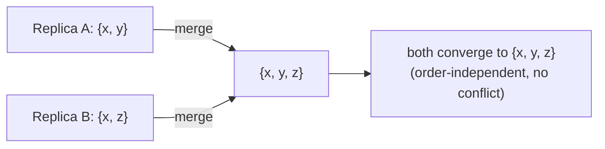

# Eventual consistency & CRDTs

> Purpose: when you let replicas accept writes independently (for [availability](./quorums-and-replication.md)),
> they temporarily disagree and concurrent writes **conflict**. Eventual consistency promises
> they'll *converge* once communication resumes; **CRDTs** are data types engineered so they
> *always* converge **automatically**, with no conflicts to resolve by hand.

## Top-down: where you already meet this
Edit a Google Doc or a Notion page offline; your phone and laptop both make changes; later they
merge and nothing is lost. Two people "like" a post on different servers and the count ends up
right. That "it all reconciles correctly no matter the order" is eventual consistency done well —
and CRDTs are the math that makes the merge automatic instead of a painful conflict dialog.

## Problem
[Quorum/leaderless systems](./quorums-and-replication.md) and offline-capable apps accept writes
on different replicas at the "same" time. Now you have **divergent copies** and
[concurrent, conflicting writes](../time-order/logical-clocks.md). You need two things: a promise
that replicas **converge** to the same state eventually, and a **conflict-resolution** rule that
doesn't silently lose data. CRDTs make that rule part of the data structure itself.

## Core concepts

**Eventual consistency — the promise.** *If writes stop, all replicas eventually reach the same
value.* It's a **weak** guarantee: it says nothing about *when*, and along the way reads can be
stale or see different replicas disagree. The payoff is [availability](../../../system-design/1-knowledge/fundamentals/cap-theorem.md) —
the system never has to block to coordinate. The hard part it leaves open: *how* do conflicting
writes merge?

**The naive answer and its trap — Last-Write-Wins (LWW).** Pick the write with the highest
timestamp; discard the rest. Simple, and what Cassandra does — but it **silently loses** the
discarded concurrent write, and relies on [clocks you can't trust](../fundamentals/why-distributed-is-hard.md).
Fine for "set my status"; catastrophic for "add to cart."

**CRDTs — make conflicts mathematically impossible.** A **Conflict-free Replicated Data Type** is
designed so that merging replicas is **automatic and always correct**, regardless of order or
duplication. The trick: define `merge` to be **commutative, associative, and idempotent** (a
"join" toward a least-upper-bound). Then it doesn't matter what order updates arrive, how many
times, or which replica merges first — everyone lands on the same state. Convergence is *built
into the type.*



**Two everyday CRDT examples make it click:**
- **G-Counter** (grow-only counter, e.g. likes): each replica keeps its *own* tally; the value is
  the **sum**; merge takes the **element-wise max** of each replica's tally. Increment locally,
  merge anytime — the total is always right, no double-counting.
- **LWW / OR-Set** (a set you can add to and remove from): tag elements so concurrent add/remove
  resolve deterministically; merge = **union** of the tagged state. Two people editing converge to
  the same set.

The point: **state-based CRDTs converge by construction** — no coordination, no central
conflict-resolver, no lost updates. That's why they power collaborative and offline-first apps.

**Where CRDTs fit (and don't).** They give you *strong eventual consistency* (replicas that have
seen the same updates are identical) **without consensus** — hugely cheaper and always available.
The cost: they only work for operations expressible as a mergeable join (counters, sets,
registers, text), and can carry metadata overhead. For "must be one global order **now**"
(bank balance, inventory of 1), you still need [consensus](../consensus/consensus-and-raft.md).

## Essential terminology

| Term | Meaning |
| --- | --- |
| **Eventual consistency** | Replicas converge to the same value *if* writes stop. |
| **Strong eventual consistency** | Replicas that received the same updates are identical (CRDT guarantee). |
| **Convergence** | All replicas reaching the same state. |
| **Conflict resolution** | The rule for merging concurrent writes. |
| **Last-Write-Wins (LWW)** | Keep highest timestamp — simple but silently drops writes. |
| **CRDT** | A type whose `merge` is commutative/associative/idempotent → auto-converges. |
| **G-Counter / OR-Set** | Grow-only counter / add-remove set CRDTs. |
| **Commutative/idempotent merge** | Order- and duplicate-independent combine — the heart of a CRDT. |

## Example
Why a CRDT counter beats last-write-wins for "likes" across 2 servers:
```
Start: 10 likes on both replicas.
Server A: +1  (A's tally: 1)        Server B: +1  (B's tally: 1)   ← concurrent, no coordination

❌ LWW register: each writes "11"; merge keeps one "11" → final = 11   (one like LOST)

✅ G-Counter: value = sum of per-replica tallies; merge = max per replica
   A = {A:1, B:0}, B = {A:0, B:1}  → merge {A:1, B:1} → value = 10 + 1 + 1 = 12  ✅ correct
```
The CRDT counts both likes with **zero coordination** and **any merge order** — exactly what you
want for a fast, always-available, geo-distributed counter. Implement both in the
[CRDT lab](../../3-practice/lab-crdt.md).

## Trade-offs
- ✅ **Always available + automatic, lossless merge** — no coordination, no conflict prompts,
  perfect for offline/collaborative/geo-replicated apps.
- ✅ **Strong eventual consistency** without the cost or unavailability of
  [consensus](../consensus/consensus-and-raft.md).
- ⚠️ **Limited to mergeable operations:** counters, sets, registers, sequences — not arbitrary
  "check-then-act" logic.
- ⚠️ **Metadata overhead** (tombstones, per-replica state) and weak real-time guarantees (you may
  read stale values before convergence).
- ⚠️ **Not for invariants that need one global truth now** (no overdrafts, sell the last ticket
  once) — use [consensus](../consensus/consensus-and-raft.md) there.

## Real-world examples
- **Collaborative editors** (Figma, Apple Notes, many via Yjs/Automerge) use CRDTs so concurrent
  edits merge without conflicts.
- **Riak** ships CRDT data types (counters, sets, maps) for safe eventual consistency.
- **Redis CRDTs (Active-Active)** replicate counters/sets across regions, always writable.
- **Shopping carts in Dynamo** historically used add/remove-set merging so a concurrent add
  isn't lost — the [vector-clock](../time-order/logical-clocks.md) conflict, resolved by merge.

## References
- Shapiro et al. — *Conflict-free Replicated Data Types* (2011)
- *Designing Data-Intensive Applications* (Kleppmann) — Ch. 5 (LWW, version vectors, convergence)
- [crdt.tech](https://crdt.tech/) — papers & implementations
- Builds on [logical clocks](../time-order/logical-clocks.md) & [quorums](./quorums-and-replication.md); applied as [eventual consistency (System Design)](../../../system-design/1-knowledge/fundamentals/consistency-models.md)
