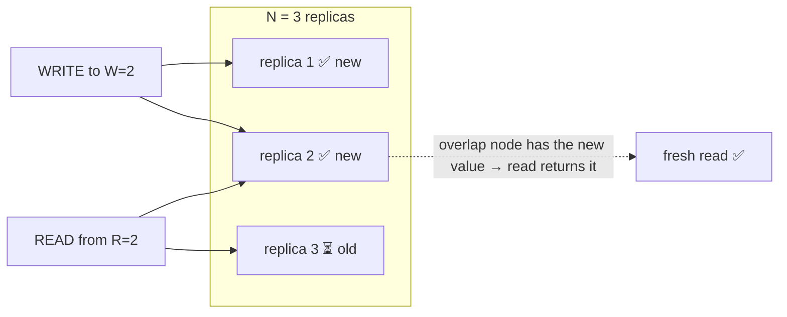

# Quorums & replication protocols

> Purpose: [consensus](../consensus/consensus-and-raft.md) keeps replicas perfectly in sync but
> needs a leader and is relatively slow. **Quorum replication** is the leaderless alternative:
> write to *several* replicas, read from *several*, and use overlap to stay consistent — trading
> some consistency for **availability** and **low latency**. This is the theory behind
> "[AP](../../../system-design/1-knowledge/fundamentals/cap-theorem.md)" stores like Dynamo and
> Cassandra.

## Top-down: where you already meet this
[System Design](../../../system-design/1-knowledge/data-storage/replication.md) showed
leader-follower replication. But what if you want *no* leader — every replica accepts reads and
writes, so the system stays up even during partitions? Then "how do I avoid reading stale data?"
becomes a counting problem. Quorums are the elegant answer, and the reason a Cassandra cluster
can lose nodes and keep serving.

## Problem
Replicate data across **N** nodes for availability. If you write to just one and read from
another, you get **stale reads**. If you wait for *all* N on every operation, one slow/dead node
blocks you (back to poor availability). We want a tunable middle: enough overlap between writes
and reads to guarantee freshness, without ever needing *all* nodes.

## Core concepts

**The quorum rule: R + W > N.** Keep N copies. Require every **write** to reach **W** replicas
and every **read** to consult **R** replicas. If **R + W > N**, the read set and write set are
guaranteed to **overlap in at least one node** — so any read sees at least one replica that has
the latest write. That overlap *is* the consistency guarantee, and it's just arithmetic.


With N=3, W=2, R=2: 2+2 > 3, so a read of any 2 always includes one of the 2 that got the write.

**Tuning the knobs.** You pick R and W to slide along the consistency/availability/latency
spectrum:

| Choice | Effect |
| --- | --- |
| **W=N, R=1** | fast reads, slow writes; writes block if any node is down |
| **W=1, R=N** | fast writes, slow reads; great write availability |
| **W=R=⌈(N+1)/2⌉** (majority) | balanced "strong-ish" consistency (Cassandra's `QUORUM`) |
| **R+W ≤ N** | *no overlap* → fast & highly available, but **stale reads possible** (pure eventual consistency) |

So **R+W>N gives strong consistency; R+W≤N gives [eventual consistency](./eventual-consistency-crdts.md)** —
the dial is yours per-operation.

**Keeping replicas converging.** Quorums let a write skip some replicas, so laggards must catch
up. Two background mechanisms do it: **read repair** (on a read, if replicas disagree, push the
newest value to the stale ones) and **anti-entropy / gossip** (replicas periodically compare and
reconcile, often via Merkle trees to find diffs cheaply). These are why a temporarily-behind
replica eventually matches.

**Quorum vs consensus — pick by need.** Quorums give *availability* (any partition with ≥W or ≥R
live nodes keeps working) but **not** a single total order — concurrent writes to different nodes
can [conflict](./eventual-consistency-crdts.md), which the system must detect and resolve.
[Consensus](../consensus/consensus-and-raft.md) gives one total order but **stops** without a
majority. AP systems choose quorums; CP systems choose consensus.

## Essential terminology

| Term | Meaning |
| --- | --- |
| **N / W / R** | Replicas per item / replicas a write must reach / replicas a read consults. |
| **Quorum** | A subset large enough to guarantee overlap (here, via R+W>N). |
| **Quorum overlap** | The shared node(s) that ensure a read sees the latest write. |
| **Sloppy quorum / hinted handoff** | Accept writes on substitute nodes during failures, hand off later (favors availability). |
| **Read repair** | Fixing stale replicas during a read. |
| **Anti-entropy / gossip** | Background replica reconciliation (e.g. Merkle-tree sync). |
| **Tunable consistency** | Choosing R/W per operation to trade consistency vs availability. |

## Example
Same cluster, two configs, opposite guarantees:
```
N = 3.
Config A (R=2, W=2):  R+W = 4 > 3  → overlap guaranteed → reads are FRESH (strong).
                      Cost: a write needs 2 nodes up; a read needs 2 nodes up.

Config B (R=1, W=1):  R+W = 2 ≤ 3  → NO overlap → a read may hit only stale replicas → STALE read.
                      Benefit: blazing fast, survives 2 of 3 nodes down for both reads and writes.
```
Cassandra exposes exactly this as a per-query setting (`ONE`, `QUORUM`, `ALL`) — the developer
dials consistency vs availability **per request**. Play with the knobs in the
[quorum lab](../../3-practice/lab-quorums.md).

## Trade-offs
- ✅ **No leader, high availability:** stays writable/readable through partitions and node loss —
  the [AP](../../../system-design/1-knowledge/fundamentals/cap-theorem.md) sweet spot.
- ✅ **Tunable per operation:** trade consistency for latency exactly where each call needs it.
- ⚠️ **Strong consistency (R+W>N) isn't free:** higher latency, and operations fail if too few
  replicas are reachable.
- ⚠️ **Concurrent writes can conflict** (no total order) — you need
  [conflict detection/resolution](./eventual-consistency-crdts.md) (vector clocks, CRDTs, LWW);
  naive last-write-wins can silently drop data.

## Real-world examples
- **Amazon Dynamo / Cassandra / Riak** are built on tunable N/R/W quorums — see the
  [Dynamo case study](../../2-case-studies/dynamo.md).
- **Cassandra's `QUORUM` vs `ONE`** is this dial in production, chosen per query.
- **DynamoDB** offers "eventually consistent" (cheap, fast) vs "strongly consistent" reads — R/W
  tuning as a pricing/latency choice.
- **Read repair & Merkle-tree anti-entropy** keep these clusters converging in the background.

## References
- DeCandia et al. — *Dynamo: Amazon's Highly Available Key-value Store* (2007)
- *Designing Data-Intensive Applications* (Kleppmann) — Ch. 5 (quorums, read repair, anti-entropy)
- Builds on [why distributed is hard](../fundamentals/why-distributed-is-hard.md); leads to [eventual consistency & CRDTs](./eventual-consistency-crdts.md)
- Applied view: [replication (System Design)](../../../system-design/1-knowledge/data-storage/replication.md)
